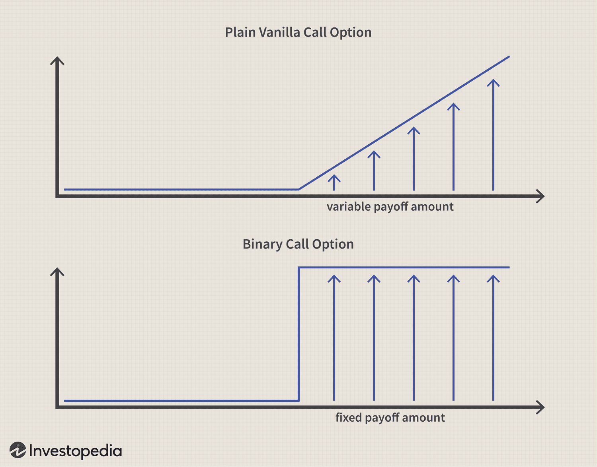

Understanding the nuances of financial markets can often appear daunting, especially when dealing with complex instruments like binary options and algorithmic trading. The fast-paced and data-driven nature of today’s markets necessitates a clear grasp of various strategies to effectively manage risk and optimize returns. This article aims to simplify key concepts such as hedging in the stock market, binary options, and algorithmic trading strategies, presenting them as effective methods for achieving these goals.

In an environment where financial decisions increasingly rely on sophisticated data analysis, the amalgamation of different strategies provides traders with a comprehensive approach to making informed investment choices. Hedging involves taking offsetting positions to mitigate potential losses due to adverse price movements, employing instruments such as options, futures, or other derivatives. Understanding this can help market participants protect their portfolios against volatility.



Binary options, distinguished by their fixed payout and all-or-nothing nature, offer a unique hedging method that simplifies the decision-making process through clear risk and reward parameters. Their structure makes them particularly attractive in volatile markets, allowing traders to strategically manage potential losses.

Algorithmic trading enhances decision-making by utilizing computer algorithms to execute trades based on predefined criteria. This not only speeds up the execution of trades but also ensures precision and consistency, crucial in capturing fleeting market opportunities. The integration of artificial intelligence and machine learning into algorithmic trading further boosts predictive accuracy while minimizing human error, enabling investors to automate and optimize their strategies.

Our objective is to equip you with the knowledge needed to confidently navigate these emerging investment landscapes. We will explore the core principles behind each method, provide practical examples, and discuss the potential benefits and drawbacks. By understanding and leveraging these strategies, traders can empower themselves to make informed decisions, minimize risks, and optimize investment returns in a world where technology continues to transform financial markets.

## Table of Contents

## Understanding Hedging in the Stock Market

Hedging is an essential risk management technique in the stock market aimed at minimizing potential losses while maintaining the opportunity for gains. At its core, hedging involves taking opposing positions in related securities to offset adverse price movements that could impact an investment portfolio.

One of the most common instruments for hedging is the use of options. An investor holding a stock position may purchase a put option, which grants the right to sell the stock at a predetermined price. This provides a safety net against a decline in the stock's value. For example, consider an investor who owns shares of Company X and is concerned about potential market [volatility](/wiki/volatility-trading-strategies). By purchasing put options for these shares, the investor can limit the downside risk, knowing they can sell at the strike price if the stock depreciates significantly.

Futures contracts offer another popular hedging mechanism. These contracts involve an agreement to buy or sell an asset at a set price on a future date. This approach is particularly useful for investors looking to lock in prices for assets susceptible to price fluctuations. For instance, if an investor anticipates a rise in the stock index, they might enter a futures contract to maintain the current price level, thus protecting against future market downturns.

The use of derivatives, such as options and futures, in hedging strategies is driven by their ability to provide leverage and flexibility. Investors can engage in strategies like the 'protective put' or 'covered call' to balance their portfolios effectively. A protective put involves buying put options on a stock that is already owned, serving as insurance against price drops. Conversely, a covered call involves selling call options on a stock held in the portfolio, allowing the investor to earn premium income while agreeing to sell the stock at the strike price if it appreciates beyond that point.

The primary goal of hedging in the stock market is to limit potential losses while preserving investment gains. Investors achieve this by carefully selecting hedging instruments that align with their risk tolerance and market outlook. By understanding and implementing effective hedging practices, traders can bolster their portfolios against unexpected market volatility, ensuring more stable returns.

## Exploring Binary Options as a Hedging Tool

Binary options present an innovative approach to hedging, characterized by a fixed payout structure and an all-or-nothing outcome. Unlike traditional options, where the payoff is contingent on the degree to which the asset price exceeds the strike price, binary options offer set payouts contingent solely on the asset price meeting specific conditions at expiration. This distinct characteristic makes binary options appealing to traders due to their inherent simplicity and predictable risk-to-reward profile.

In practice, binary options allow investors to effectively manage risk, particularly in volatile market conditions. By strategically integrating binary options into their investment portfolios, traders can hedge against unfavorable price movements in underlying stocks. For instance, if an investor holds a long position in a stock, purchasing a binary put option can serve as a protective hedge, providing compensation if the stock price falls below a predetermined level. This strategy ensures that potential losses on the stock position are counterbalanced by the gains from the binary option.

Additionally, the predefined payoff associated with binary options can offer a clear advantage in terms of risk management, as it enables precise calculation of maximum potential loss or gain before initiating a trade. This feature stands in contrast to traditional options and other derivatives, which may require continuous monitoring of price fluctuations and complex calculations to estimate potential payoffs.

Understanding how to effectively leverage binary options within an overarching hedging strategy can greatly enhance the risk-return profile of an investment portfolio. By providing a straightforward mechanism to manage risk, especially during periods of heightened market uncertainty, binary options complement traditional hedging techniques and can be integrated into a diversified risk management approach.

In summary, binary options serve as a practical tool for investors seeking to minimize risk while maintaining potential for returns in a clear and quantifiable manner. The strategic use of these instruments in conjunction with other hedging strategies can provide a robust framework for optimizing portfolio performance in uncertain market environments.

## Algorithmic Trading: Enhancing Decision-Making

Algorithmic trading utilizes computer algorithms to execute trades based on predefined criteria, a method especially advantageous in markets where speed and precision are paramount. These algorithms allow for rapid and accurate trading decisions, capitalizing on fleeting opportunities that might be missed with manual trading. In recent years, the integration of [artificial intelligence](/wiki/ai-artificial-intelligence) (AI) and [machine learning](/wiki/machine-learning) (ML) technologies into [algorithmic trading](/wiki/algorithmic-trading) has further improved its effectiveness by enhancing predictive accuracy and reducing human error.

At its core, algorithmic trading involves the deployment of automated systems to [carry](/wiki/carry-trading) out market transactions. These systems rely on complex mathematical models to interpret large datasets and identify optimal trading opportunities. For instance, algorithms can be programmed to detect patterns and trends within financial data, aiding investors in making informed decisions without the delays associated with human analysis. The speed of execution provided by algorithmic systems is crucial in realizing the benefits of such data-driven insights.

Moreover, algorithmic trading facilitates the automation of hedging strategies, optimizing portfolio management by dynamically adjusting positions to manage risk effectively. By creating a robust framework that factors in predefined risk parameters, these algorithms can help ensure consistent portfolio performance, even in volatile markets. For example, consider a simple moving average crossover strategy, a commonly used algorithmic trading strategy. The strategy might be implemented in Python as follows:

```python
import numpy as np
import pandas as pd

def moving_average_crossover(data, short_window=40, long_window=100):
    signals = pd.DataFrame(index=data.index)
    signals['price'] = data['Close']
    signals['short_mavg'] = data['Close'].rolling(window=short_window, min_periods=1).mean()
    signals['long_mavg'] = data['Close'].rolling(window=long_window, min_periods=1).mean()

    signals['signal'] = 0.0
    signals['signal'][short_window:] = np.where(signals['short_mavg'][short_window:] > signals['long_mavg'][short_window:], 1.0, 0.0)   
    signals['positions'] = signals['signal'].diff()

    return signals

# Example usage with a DataFrame 'stock_data'
signals = moving_average_crossover(stock_data)
```

The evolution of algorithmic strategies is marked by a sophisticated use of AI and ML, which can ingest and process vast amounts of real-time data to refine trading signals and adapt to new market conditions. Machine learning models can predict asset price movements by learning from historical patterns and current market conditions, enhancing the trader's ability to forecast market trends accurately.

For instance, a machine learning model can utilize supervised learning techniques to train on historical price data and derive insights into potential future movements. Such a model might be built using popular libraries like TensorFlow or Scikit-learn in Python.

The role of algorithmic trading in today's financial markets extends beyond mere trade execution; it offers a crucial edge in maintaining competitive advantage. By leveraging these technologies, investors can stay ahead in the fast-paced trading environment, making data-driven decisions with greater confidence and efficiency. Algorithmic trading not only optimizes returns but also helps mitigate risks, providing a comprehensive approach to investment management in the modern financial landscape.

## Integrating Hedging, Binary Options, and Algorithmic Trading

Integrating hedging strategies, binary options, and algorithmic trading offers traders a robust framework for managing their investment portfolios amidst volatile market conditions. This synergy leverages the distinct advantages of each component, providing comprehensive risk management and enhancing decision-making efficiency.

The dynamic nature of hedging involves taking offsetting positions to balance potential losses, a method particularly beneficial during market fluctuations. By integrating binary options in this strategy, traders can gain the advantage of a predefined risk and reward structure, enabling them to make precise and calculated moves. Binary options can serve as an effective short-term hedging tool, allowing traders to cover their stock positions against unfavourable movements without substantial capital requirements.

Algorithmic trading, characterized by its high-speed execution and reliance on complex algorithms and data analytics, further amplifies this integration. By automating trades, algorithms can execute hedging strategies more efficiently, removing emotional biases and human error from the equation. These systems can instantly adapt to changing market conditions, thus optimizing portfolio management and ensuring timely execution of trades. For instance, Python can be used to develop algorithms that monitor market signals and execute hedging trades within milliseconds:

```python
import numpy as np

def identify_signal(market_data):
    # Placeholder function to identify a trading signal
    signal = np.mean(market_data[-5:]) - np.mean(market_data[-20:])
    return signal

def execute_trade(signal):
    if signal > 0:
        # Execute buy hedge
        print("Executing hedge: BUY")
    elif signal < 0:
        # Execute sell hedge
        print("Executing hedge: SELL")

# Example market data
market_data = np.random.randn(100)
signal = identify_signal(market_data)
execute_trade(signal)
```

Moreover, employing these strategies collectively allows for a customized risk-return profile tailored to the investor's expectations and market outlook. Binary options can be used to capitalize on short-term price movements, while algorithmic trading can implement long-term strategies that require consistent monitoring and rapid execution. This combination ensures that investors can not only hedge against risks but also strategically position themselves to exploit market opportunities as they arise.

The integration of hedging, binary options, and algorithmic trading forms a cohesive strategy that empowers investors to manage risks effectively and enhance their potential returns. Through technological advancements and strategic amalgamation, traders are better equipped to navigate the complexities of modern financial markets, maintaining an edge amidst unpredictable economic landscapes.

## Case Studies and Practical Examples

Through real-world case studies, the combination of hedging, binary options, and algorithmic trading manifests in diverse ways across different market scenarios. This section discusses practical examples demonstrating the efficacy and possible limitations of these strategies.

One notable instance involves using binary options to hedge long stock positions during periods of market uncertainty. For example, investors holding significant positions in a volatile stock could purchase binary options that pay off if the stock's price declines below a certain threshold. This setup allows them to lock in potential gains while mitigating downside risk. By setting the binary option strike price at a strategic level, investors can effectively control potential losses if adverse market movements occur. Such strategies are particularly relevant during earnings announcements or geopolitical events, where sudden price swings are common.

Algorithmic trading systems further enhance these strategies by adapting to instantaneous market changes. For instance, a trading algorithm can be programmed to monitor market conditions and execute trades based on real-time data. Consider a Python script using libraries such as NumPy and pandas to develop a simple moving average crossover strategy:

```python
import numpy as np
import pandas as pd

# Load historical stock data
data = pd.read_csv('stock_data.csv')
data['SMA_50'] = data['Close'].rolling(window=50).mean()
data['SMA_200'] = data['Close'].rolling(window=200).mean()

# Generate trading signals
data['Signal'] = np.where(data['SMA_50'] > data['SMA_200'], 1, 0)
data['Position'] = data['Signal'].diff()

# Simulate trading
initial_cash = 10000
data['Portfolio Value'] = initial_cash

for i in range(1, len(data)):
    if data['Position'][i] == 1:  # Buy signal
        shares = data['Portfolio Value'][i-1] // data['Close'][i]
        data['Portfolio Value'][i] = shares * data['Close'][i]
    elif data['Position'][i] == -1:  # Sell signal
        data['Portfolio Value'][i] = shares * data['Close'][i]
    else:
        data['Portfolio Value'][i] = data['Portfolio Value'][i-1]

# Evaluate performance
final_value = data['Portfolio Value'].iloc[-1]
print(f'Final Portfolio Value: ${final_value}')
```

In this scenario, the algorithm automates decisions and executions, reducing emotional biases and allowing for consistent adjustments to hedging positions based on market trends.

These practical examples illustrate how the integration of hedging strategies, binary options, and algorithmic trading can yield significant advantages. By observing past market events through this lens, traders gain valuable insights into effectively employing these methods across diverse trading environments. Nonetheless, it's important to recognize that limitations exist. Market unpredictability and algorithm failures can lead to unexpected outcomes, underscoring the need for continuous strategy evaluation and adaptation.

## Conclusion

Navigating the financial market landscape requires a nuanced approach that strategically combines both traditional and innovative trading methodologies. Hedging, binary options, and algorithmic trading each offer distinct advantages. When these methods are integrated, they significantly bolster an investment portfolio's ability to withstand and thrive amid market fluctuations. 

Hedging serves as a critical risk management tool, mitigating potential losses by taking offsetting positions. Binary options complement this by providing a clear risk-reward scenario through their fixed payout structure, allowing traders to make calculated decisions even under volatility. Meanwhile, algorithmic trading introduces precision and speed, automating trades to exploit market inefficiencies while minimizing human error.

To truly capitalize on these strategies, understanding their individual and collective capacities empowers traders to make informed investment choices. Risk minimization and return optimization become feasible as traders learn to leverage the strengths of each strategy, adaptability becoming a key aspect of their approach. Given the rapid pace at which technology reshapes financial markets, staying informed and adaptable is indispensable for consistent success.

These insights serve as an essential foundation for developing robust and flexible trading strategies, addressing the complex and ever-evolving challenges of modern financial markets. As traders equip themselves with this knowledge, they position themselves not only to navigate but to excel in diverse trading environments.

## References & Further Reading

[1]: Bergstra, J., Bardenet, R., Bengio, Y., & Kégl, B. (2011). ["Algorithms for Hyper-Parameter Optimization."](https://proceedings.neurips.cc/paper/2011/file/86e8f7ab32cfd12577bc2619bc635690-Paper.pdf) Advances in Neural Information Processing Systems 24.

[2]: ["Advances in Financial Machine Learning"](https://www.amazon.com/Advances-Financial-Machine-Learning-Marcos/dp/1119482089) by Marcos Lopez de Prado

[3]: ["Evidence-Based Technical Analysis: Applying the Scientific Method and Statistical Inference to Trading Signals"](https://www.amazon.com/Evidence-Based-Technical-Analysis-Scientific-Statistical/dp/0470008741) by David Aronson

[4]: ["Machine Learning for Algorithmic Trading"](https://github.com/stefan-jansen/machine-learning-for-trading) by Stefan Jansen

[5]: ["Quantitative Trading: How to Build Your Own Algorithmic Trading Business"](https://www.amazon.com/Quantitative-Trading-Build-Algorithmic-Business/dp/1119800064) by Ernest P. Chan