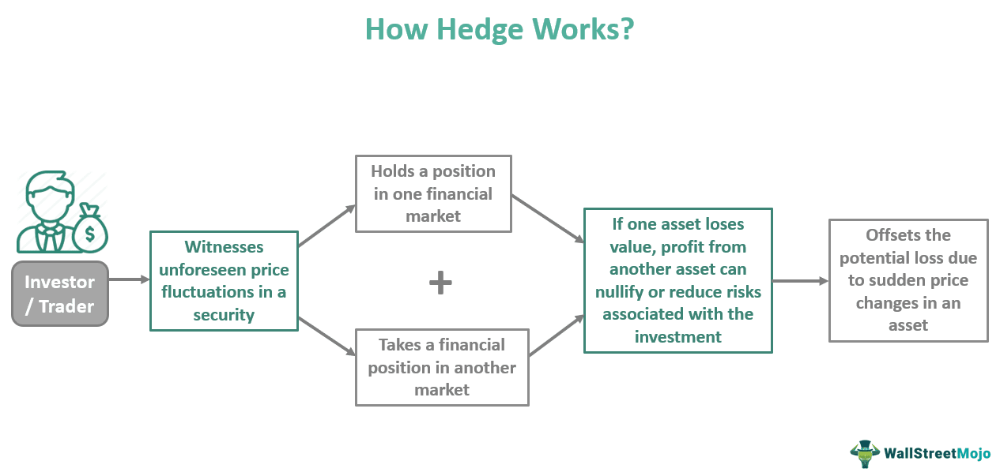

## Table of Contents

## What is market risk and why is it important to manage it?

Market risk is the chance that the value of your investments might go down because of things happening in the overall market. This can include changes in interest rates, stock market crashes, or big economic events. It's different from specific risks that might affect just one company or industry. For example, if you own stocks, market risk means that even if the companies you've invested in are doing well, their stock prices could still drop if the whole market goes down.

It's important to manage market risk because it can help protect your money and keep your investment goals on track. If you don't manage it, you could lose a lot of money quickly, which might force you to change your plans or even stop investing. By using strategies like diversification—spreading your investments across different types of assets—you can lower the impact of market ups and downs. This way, you're not putting all your eggs in one basket, and you have a better chance of weathering financial storms.

## What is a hedging strategy and how does it work?

A hedging strategy is like an insurance policy for your investments. It's a way to protect yourself from losing too much money if the market goes down. Imagine you own a stock, and you're worried its price might drop. To hedge, you could buy another investment that will go up in value if the stock goes down. This way, any losses from the stock might be balanced out by gains from the other investment.

Hedging works by using financial instruments like options, futures, or even other stocks to offset potential losses. For example, if you own shares in a company, you could buy a put option on those shares. A put option gives you the right to sell the shares at a set price, even if the market price drops below that. If the stock price does fall, you can use the put option to sell at the higher price, reducing your loss. While hedging can't eliminate all risk, it helps manage it, making your investment journey a bit smoother.

## What are the most common types of hedging instruments?

The most common types of hedging instruments are options, futures, and swaps. Options give you the right, but not the obligation, to buy or sell an asset at a set price before a certain date. There are two types of options: call options, which let you buy an asset, and put options, which let you sell an asset. Futures are contracts where you agree to buy or sell an asset at a set price on a specific future date. They're often used by farmers and commodity producers to lock in prices for their goods. Swaps are agreements to exchange cash flows or other financial instruments. For example, an [interest rate](/wiki/interest-rate-trading-strategies) swap might involve exchanging a fixed interest rate for a floating one.

These instruments work by creating a balance against potential losses in your main investments. If you own a stock and you're worried about its price dropping, you could buy a put option on that stock. If the stock price falls, the put option will increase in value, helping to offset your losses. Similarly, if you're a farmer expecting to sell your crops in the future, you could use a futures contract to lock in today's price, protecting yourself from price drops before you harvest. Swaps can be used to manage risks related to interest rates or currency fluctuations, allowing businesses to stabilize their financial planning.

## How can beginners start implementing simple hedging strategies?

Beginners can start implementing simple hedging strategies by using options. Imagine you own shares in a company, and you're worried the stock price might go down. You can buy a put option, which gives you the right to sell your shares at a set price, even if the market price drops. This way, if the stock price falls, you can still sell at the higher price you set with the put option, reducing your losses. It's like buying insurance for your stock. Just remember, options can be a bit tricky, so it's good to learn the basics before you start.

Another simple way to hedge is by using exchange-traded funds (ETFs). If you're worried about the stock market going down, you can buy an inverse [ETF](/wiki/etf-trading-strategies). An inverse ETF goes up in value when the market goes down. So, if your stocks lose value, the inverse ETF might gain value, helping to balance out your losses. It's a straightforward way to protect your investments without getting too complicated. Start small, learn as you go, and you'll get the hang of hedging in no time.

## What are the differences between hedging and speculation?

Hedging and speculation are two different ways people use financial markets, but they have different goals. Hedging is like buying insurance for your investments. When you hedge, you're trying to protect yourself from losing money if the market goes down. For example, if you own a stock and you're worried its price might drop, you can buy a put option. This put option lets you sell the stock at a set price, even if the market price falls. So, hedging is all about reducing risk and keeping your investments safe.

On the other hand, speculation is more like gambling. When you speculate, you're trying to make money by guessing what will happen in the market. You might buy a stock because you think its price will go up, or you might buy a futures contract because you think the price of a commodity will change. Speculators are looking for big wins, but they're also taking on a lot of risk. Unlike hedging, where the goal is to protect what you already have, speculation is about trying to gain more, often with no safety net.

## How do hedging strategies help in managing currency risk?

Hedging strategies help manage currency risk by protecting businesses and investors from losing money when exchange rates change. Imagine a company in the U.S. that needs to pay a supplier in Europe in euros. If the value of the dollar goes down compared to the euro, the company will have to pay more dollars to get the same amount of euros. To avoid this, the company can use a hedging strategy like a forward contract. This contract lets them lock in today's exchange rate for a future date, so they know exactly how many dollars they'll need, no matter what happens to the exchange rate.

Another way to hedge currency risk is by using currency options. These options give the buyer the right, but not the obligation, to exchange money at a set rate before a certain date. If the exchange rate moves against them, they can use the option to trade at the better rate they locked in. If the rate moves in their favor, they can let the option expire and trade at the current, better rate. By using these strategies, businesses and investors can plan their finances better and avoid big losses from currency fluctuations.

## What role do options play in advanced hedging strategies?

Options are really important in advanced hedging strategies because they give you a lot of flexibility. They let you protect your investments without having to actually buy or sell the asset right away. For example, if you own a stock and you're worried its price might go down, you can buy a put option. This put option gives you the right to sell your stock at a set price, even if the market price drops. It's like having an insurance policy for your stock. You can also use options to hedge against big market moves. If you think the whole market might go down, you can buy put options on an index like the S&P 500. This way, if the market falls, your put options will go up in value, helping to balance out your losses.

In more complex strategies, options can be used in combinations to create what's called a "straddle" or a "strangle." A straddle involves buying both a call option and a put option with the same strike price and expiration date. This strategy is useful if you think a stock will move a lot but you're not sure which way. If the stock price goes up, the call option will make money; if it goes down, the put option will. A strangle is similar but uses options with different strike prices, which can be cheaper but needs a bigger move in the stock price to be profitable. By using these advanced options strategies, investors can protect their portfolios from different kinds of risks and take advantage of big market moves, all while keeping their options open.

## Can you explain how futures contracts are used for hedging?

Futures contracts are used for hedging to protect against price changes in the future. Imagine you're a farmer growing wheat. You want to make sure you get a good price for your wheat when you harvest it, even if the market price goes down. So, you can sell a futures contract today that agrees to sell your wheat at a set price on a specific future date. This way, no matter what happens to the wheat price between now and then, you know exactly how much money you'll get. It's like locking in today's price for tomorrow's sale.

For investors, futures can work the same way. Let's say you own a stock and you're worried its price might drop. You can sell a futures contract on that stock, agreeing to sell it at today's price on a future date. If the stock price does fall, you can buy the stock back at the lower market price and then fulfill your futures contract by selling it at the higher price you locked in. This helps you avoid losing money if the stock goes down. Futures contracts give you a way to plan ahead and manage risk, making your financial life a bit more predictable.

## What are the tax implications of using hedging strategies?

Using hedging strategies can affect your taxes, but it depends on what kind of hedging you're doing and how long you hold your investments. If you use options or futures to hedge, any profits or losses from those contracts might be treated differently than gains or losses from the stocks or commodities you're hedging. For example, if you buy a put option to protect your stock and then sell it at a profit, that profit could be taxed as a short-term capital gain if you held the option for less than a year. Short-term gains are usually taxed at your regular income tax rate, which can be higher than the rate for long-term gains.

On the other hand, if you use futures contracts for hedging, the tax treatment can get a bit more complicated. Gains and losses from futures are usually treated as 60% long-term and 40% short-term capital gains, no matter how long you held the contract. This is called the 60/40 rule. So, if you make money from a futures contract, 60% of that gain will be taxed at the lower long-term capital gains rate, and 40% will be taxed at your regular income tax rate. It's important to keep good records of all your hedging transactions and maybe talk to a tax advisor to make sure you're handling everything correctly.

## How can portfolio diversification be considered a form of hedging?

Portfolio diversification can be thought of as a simple way to hedge because it helps spread out your risk. Instead of putting all your money into one stock or one type of investment, you spread it across different stocks, bonds, and maybe even different countries. This way, if one investment goes down, the others might go up or stay the same, balancing out your losses. It's like not putting all your eggs in one basket. If one egg breaks, you still have others to rely on.

By diversifying, you're protecting your money from big swings in the market. If you only invest in tech stocks and the tech industry has a bad year, you could lose a lot. But if you also have some money in healthcare, energy, and maybe some bonds, those other investments might do well even if tech stocks fall. This kind of hedging through diversification doesn't need fancy financial tools like options or futures. It's a straightforward way to make your investments safer and more stable over time.

## What are the latest trends in algorithmic hedging?

Algorithmic hedging has become more popular as technology gets better. People now use computers to make hedging decisions faster and more accurately. These algorithms can look at a lot of data at once, like stock prices, news, and even social media, to figure out the best way to protect investments. This means they can react to market changes almost instantly, which is something humans can't do as quickly. More and more, big investors and companies are using these algorithms to manage their risks better.

Another trend in algorithmic hedging is using [machine learning](/wiki/machine-learning). This is a type of [artificial intelligence](/wiki/ai-artificial-intelligence) where computers learn from past data to make better predictions. For example, an algorithm might learn from past market crashes to predict when the next one might happen and how to hedge against it. This makes hedging strategies smarter over time. As more data becomes available and computers get even better, algorithmic hedging will keep getting more advanced and widely used.

## How do institutional investors use complex hedging strategies to manage large portfolios?

Institutional investors, like big pension funds or insurance companies, use complex hedging strategies to protect their large portfolios from big losses. They often use a mix of options, futures, and swaps to hedge against different kinds of risks. For example, if they own a lot of stocks, they might buy put options to protect against a drop in stock prices. They could also use futures contracts to lock in prices for commodities they need, like oil or wheat. By using these tools together, they can cover many different risks at the same time, making their investments safer.

These investors also use advanced strategies like delta hedging, where they adjust their options positions to keep their portfolio's risk level steady. They might use algorithms to make these adjustments quickly and accurately. Another strategy they use is called portfolio insurance, where they buy options to protect the whole portfolio from big market drops. This way, even if the market goes down a lot, their losses are limited. By using these complex strategies, institutional investors can manage the risks of their large portfolios and keep their investments stable over time.

## References & Further Reading

[1]: Kolb, R. W. (2003). "Futures, Options, and Swaps." Wiley.

[2]: Hull, J. C. (2017). "Options, Futures, and Other Derivatives." Pearson.

[3]: "Algorithmic and High-Frequency Trading" by Álvaro Cartea, Sebastian Jaimungal, and José Penalva. Cambridge University Press, 2015.

[4]: "Algorithmic Trading: Winning Strategies and Their Rationale" by Ernie Chan. Wiley, 2013.

[5]: Johnson, B., "Algorithmic Trading & DMA: An Introduction to Direct Access Trading Strategies." 4Myeloma Press, 2010.

[6]: Narang, R.K. (2009). "Inside the Black Box: The Simple Truth About Quantitative Trading." Wiley.

[7]: Securities and Exchange Commission, "Concept Release on Equity Market Structure" available at: https://www.sec.gov/rules/concept/2010/34-61358.pdf

[8]: Lopez de Prado, M. (2018). "Advances in Financial Machine Learning." Wiley.

[9]: Aronson, D. (2007). "Evidence-Based Technical Analysis: Applying the Scientific Method and Statistical Inference to Trading Signals." Wiley.

[10]: CFTC and SEC, "Findings Regarding the Market Events of May 6, 2010," available at: https://www.sec.gov/news/studies/2010/marketevents-report.pdf