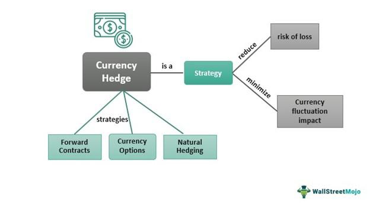

The forex market stands as a pivotal component of the global financial system, characterized by its immense liquidity and constant activity across international time zones. As one of the most volatile financial landscapes, forex offers ample opportunities for profit but is also fraught with significant risks. Hedging in the forex market emerges as a critical strategy to counteract these risks by taking measures to offset potential losses. This protective approach ensures that traders can navigate unpredictable market conditions with a degree of security.

Algorithmic trading, frequently abbreviated as algo trading, has significantly transformed the forex market by introducing advanced computational techniques that enhance trading speed and precision. These algorithms execute trades based on predefined criteria, thereby minimizing the sway of human emotion and inconsistency. The fusion of hedging strategies with algorithmic trading presents a modern, efficient method to optimize trading outcomes in the forex market. This synthesis of techniques not only bolsters risk management but also streamlines trade execution, enabling traders to capitalize more effectively on market opportunities.



## Table of Contents

## What Is Forex Hedging?

Forex hedging is a strategy employed by traders to protect against potential losses in the foreign exchange market. This involves opening additional positions that offset existing ones, thereby providing a safety net against unfavorable market movements. Hedging is particularly valuable during periods of heightened volatility, which can be triggered by economic news or geopolitical events that affect currency prices.

At its core, forex hedging is a short-term measure designed to manage risk rather than eliminate it entirely. Traders employ various strategies to achieve this protective stance. One common approach is to take opposite positions in the same currency pair. For instance, if a trader holds a long position in a currency pair and anticipates short-term adverse movements, they might simultaneously open a short position in the same pair. This setup can neutralize potential losses from the initial trade.

Another prevalent hedging strategy involves the use of forex options. Options provide the right, but not the obligation, to exchange currency at a predetermined rate on or before a specified date. By purchasing a put option, a trader holding a long position can safeguard against downside risk. Conversely, acquiring a call option can protect a short position against upward price movements. Options thus offer flexibility in managing exposure and can be tailored to suit individual risk preferences.

Forex hedging, while mitigating risk, also involves costs that traders must consider. These include transaction fees and the premium paid for options. Moreover, regulatory constraints in certain jurisdictions may limit the use of specific hedging techniques, like holding simultaneous long and short positions in the same currency pair. Despite these considerations, forex hedging remains a vital tool for traders aiming to navigate the unpredictable nature of currency markets effectively.

## Strategy One: Perfect Hedge

A perfect hedge in [forex](/wiki/forex-system) trading involves simultaneously holding both short and long positions in the same currency pair, effectively neutralizing the risk associated with price fluctuations. This strategy is employed to eliminate exposure to potential losses that may arise due to market [volatility](/wiki/volatility-trading-strategies). By offsetting one position with the other, traders can maintain their primary trade positions without being adversely affected by unforeseen price movements in the short term.

In essence, a perfect hedge allows a trader to secure their investments against sudden and unfavorable price changes. When executed correctly, this approach ensures that any losses in one position are balanced out by gains in the other, resulting in a net neutral outcome. This method is particularly useful when traders wish to lock in existing profits or prevent losses due to an impending market shift driven by economic news or short-term events.

It is important to note that the perfect hedge strategy is not permissible in all trading jurisdictions. Some financial regulators prohibit the holding of opposing positions in the same asset to prevent market manipulation and ensure market integrity. As such, traders must ensure they are operating within the legal frameworks of their specific trading environments when considering this strategy.

Despite these regulatory constraints, the perfect hedge remains a valuable tool for traders dealing with significant market volatility. By enabling them to manage and mitigate risk effectively, it offers a means to protect capital while allowing for strategic decision-making in navigating unpredictable market conditions. Understanding the intricacies of a perfect hedge and the contexts in which it can be applied is crucial for traders aiming to optimize their forex trading performance.

## Strategy Two: Imperfect Hedge

Imperfect hedging in the forex market is a strategy that involves using derivatives, such as options, to mitigate risk associated with currency fluctuations, albeit without eradicating it completely. Unlike a perfect hedge that aims to totally neutralize risk, an imperfect hedge reduces exposure to potential losses while allowing traders to retain some potential for gains.

In practical terms, a trader holding a long position in a forex currency pair can use options to establish an imperfect hedge. For example, by purchasing put options, the trader secures the right to sell the currency pair at a predetermined price, providing a safeguard against adverse price movements. This strategy ensures that while the trader remains vulnerable to some market fluctuations, the potential downside is capped.

The use of forex options, such as puts and calls, provides flexibility. A put option gives the trader the right, but not the obligation, to sell a currency pair at a specific strike price before or at expiration. This can be mathematically represented as:

$$
\text{Max}(0, K - S_T)
$$

where $K$ is the strike price and $S_T$ is the spot price at expiration. If $S_T$ falls below $K$, the put option mitigates the loss by allowing the sale of the currency at $K$.

Imperfect hedges are particularly valuable in volatile markets where complete risk elimination might be costly or impractical. This approach allows for a balanced strategy that emphasizes risk management while remaining engaged in the market's potential upside.

## Algorithmic Trading in Forex

Algorithmic trading, commonly known as algo trading, represents a pivotal advancement in the forex market, integrating computational algorithms to perform trading actions decisively and without emotional biases. The execution of trades through [algorithmic trading](/wiki/algorithmic-trading) is guided by pre-determined criteria such as timing, price, quantity, or any mathematical model. This automation fundamentally enhances both efficiency and consistency in trade execution.

One of the primary advantages of algorithmic trading in forex is its ability to operate at extraordinary speeds, which outpace human capacity. This speed is crucial given the rapid fluctuations and the volatile nature of the forex market. Algorithmic systems can execute orders in milliseconds, enabling traders to act swiftly on favorable movements in the forex prices, potentially capitalizing on market inefficiencies and avoiding adverse conditions.

The consistency brought forth by algorithmic trading stems from its reliance on precise instructions. Unlike human traders, who may be influenced by emotions such as fear or greed, algorithmic systems adhere strictly to their coding, executing trades exactly when, where, and how they have been programmed to, devoid of emotional interference. This steadfast adherence helps in maintaining a disciplined trading strategy, minimizing the risks associated with impulsive decisions.

Moreover, algorithmic trading facilitates multi-tasking, allowing for the simultaneous execution of multiple trading strategies across different currency pairs and markets. This ability is crucial for diversification and optimizing trade execution, aiding in achieving better overall performance by balancing gains and losses across various trades.

Beyond the speed and emotional neutrality, algorithmic trading allows for [backtesting](/wiki/backtesting), a significant feature that enables traders to test the viability of their trading strategies against historical data before applying them in live markets. This method helps in refining strategies and reducing potential risks associated with untested systems. Traders can optimize their strategies and gain insights into how their algorithm would have performed, facilitating informed decision-making.

As the forex market continues to grow in complexity, the role of algorithmic trading is poised to expand, leveraging advancements in technology such as [artificial intelligence](/wiki/ai-artificial-intelligence) and [machine learning](/wiki/machine-learning). These technologies promise to enhance predictive analytics, improve pattern recognition, and develop more complex strategies, pushing the capabilities of algorithmic systems even further in the forex market.

## Combining Hedging and Algorithmic Trading

Combining hedging strategies with algorithmic trading generates a robust approach to forex trading by leveraging automated processes to manage risk effectively. Algorithmic trading (algo trading) systems can execute predefined hedging strategies, ensuring that trades align with set risk management objectives without the influence of human emotions, which can often lead to inconsistencies.

The essence of this integration lies in the ability of algo trading to swiftly execute complex hedging strategies that protect against market volatility. With the capacity to analyze market data at high speeds, algo trading systems can detect potential risks and implement hedging strategies instantly. For instance, an algorithm can monitor market indicators and automatically execute a perfect hedge by initiating both a long and a short position when volatility is expected. This is achieved without manual intervention, thus enhancing precision and reducing latency.

The synergy between algorithmic trading and hedging is also evident in the use of complex mathematical models and programming languages like Python, which offer the flexibility to design sophisticated algorithms. Python's library, such as NumPy and pandas, can be used for data analysis to assess risk levels and determine optimal hedging points. Sample Python code for a simple hedge automation could look like:

```python
import numpy as np

def calculate_hedge_position(exchange_rate, risk_exposure):
    hedge_ratio = 0.8  # Example hedge ratio
    hedge_position = - hedge_ratio * risk_exposure / exchange_rate
    return hedge_position

exchange_rate = 1.2  # Example exchange rate
risk_exposure = 100000  # Example exposure in currency

hedge_position = calculate_hedge_position(exchange_rate, risk_exposure)
print(f"Hedge position: {hedge_position}")
```

In this code snippet, the `calculate_hedge_position` function calculates the necessary hedge position to counterbalance currency risk using a predefined hedge ratio. This automation ensures continuous protection against currency risk, aligning trades with risk management objectives.

By combining hedging strategies with algorithmic trading, forex traders can enhance their financial security and trading outcomes effectively. This multifaceted approach not only provides a buffer against market fluctuations but also optimizes trading performance through precision and speed.

## Risks and Considerations

Despite the advantages offered by hedging and algorithmic trading in the forex market, these strategies come with inherent risks that traders must carefully consider. 

Developing a reliable algorithm is a complex task that necessitates thorough backtesting and forward-testing. The aim of backtesting is to assess how well an algorithm would have performed using historical data. This process helps identify how the algorithm reacts to various market conditions. Forward-testing, also known as paper trading, evaluates the algorithm's performance in real-time market conditions without involving real funds. Together, these methods help in preventing overfitting—where an algorithm is tuned too specifically to historical data, causing it to underperform in live scenarios.

Understanding and mitigating risks such as slippage, transaction costs, and market volatility is crucial. Slippage occurs when a trade is executed at a different price than expected, often during periods of high volatility or low [liquidity](/wiki/liquidity-risk-premium). This can either diminish or inflate the theoretical profits or losses that the algorithm projected. Transaction costs, including spreads, commissions, and swaps, can erode gains if not carefully accounted for in the trading strategy.

Moreover, market volatility introduces unpredictability that may affect both hedging and algorithmic trading strategies. Volatile markets can lead to unexpected spikes in price, leading to greater risk exposure than anticipated. Hence, continuously monitoring and adjusting algorithms to new market conditions are essential for maintaining trading efficacy.

To implement these strategies effectively, traders are encouraged to adopt a meticulous approach to risk management—balancing potential rewards against known risks. By doing so, they can ensure these sophisticated trading mechanisms work harmoniously within the broader context of the forex market.

## The Future of Hedging and Algorithmic Trading in Forex

The integration of artificial intelligence (AI) and machine learning into algorithmic trading is markedly transforming forex trading practices. These technologies allow for sophisticated analysis of vast datasets, enabling the creation of more refined and adaptive trading algorithms. AI-driven models can identify complex patterns and correlations within the market data that are not immediately apparent to human traders. This enhanced analytical power facilitates the development of more accurate predictive models, improving the precision and effectiveness of hedging strategies.

As these advanced methodologies become more prevalent, future-oriented hedging strategies will likely incorporate data-driven algorithms that adjust dynamically to market conditions. For instance, machine learning algorithms can be trained to recognize market signals that precede currency fluctuations, providing traders with actionable insights to preemptively hedge against potential risks.

To illustrate, here is a simple example using Python for developing a basic machine learning model that might predict currency movements based on historical data:

```python
import pandas as pd
from sklearn.model_selection import train_test_split
from sklearn.ensemble import RandomForestClassifier
from sklearn.metrics import classification_report

# Load your forex dataset
data = pd.read_csv('forex_data.csv')

# Feature selection
features = data[['feature1', 'feature2', 'feature3']]
target = data['currency_movement']

# Split the data
X_train, X_test, y_train, y_test = train_test_split(features, target, test_size=0.3, random_state=42)

# Initialize and train the model
model = RandomForestClassifier(n_estimators=100, random_state=42)
model.fit(X_train, y_train)

# Predict and evaluate the model
predictions = model.predict(X_test)
print(classification_report(y_test, predictions))
```

This example demonstrates how traders can harness machine learning to enhance their hedging decisions. As technology continues to evolve, traders must proactively refine their technical skills and adapt their strategic approaches. They should remain abreast of developments in AI and machine learning, integrating these advancements to maintain a competitive edge in the forex market.

The continual expansion of computational power and data availability highlights that the future of forex trading will increasingly depend on the ability to effectively employ complex data analytics and algorithmic strategies. Thus, the traders of tomorrow will not only need to understand traditional market dynamics but also possess a robust grasp of emerging technologies and data science methodologies to succeed.

## Conclusion

Hedging and algorithmic trading are crucial in managing the inherent volatility and complexities of the forex market. By leveraging these strategies, traders can effectively navigate the challenges associated with currency fluctuations, aiming for an optimal balance between risk and reward. Hedging strategies protect against adverse market movements, while algorithmic trading enhances efficiency and precision in executing trades based on predefined rules.

Through systematic risk management, traders using these approaches can mitigate potential losses and exploit market opportunities more effectively. Algorithmic trading can execute hedging strategies with speed and accuracy, minimizing human error and allowing for real-time adaptation to market changes. This synchrony ensures that traders maintain a competitive edge by quickly implementing protective measures or capitalizing on favorable conditions.

As the forex market continues to evolve with technological advancements like AI and machine learning, traders are presented with unprecedented opportunities to refine their strategies. Those who adapt to these advancements stand to benefit from enhanced trading performance and profitability. In this ever-changing landscape, the fusion of hedging and algorithmic trading positions traders to thrive amidst market volatility, promoting strategic resilience and sustained success.

## References & Further Reading

[1]: De Prado, M. L. (2018). ["Advances in Financial Machine Learning."](https://www.amazon.com/Advances-Financial-Machine-Learning-Marcos/dp/1119482089) Wiley.

[2]: Aronson, D. R. (2007). ["Evidence-Based Technical Analysis: Applying the Scientific Method and Statistical Inference to Trading Signals."](https://onlinelibrary.wiley.com/doi/book/10.1002/9781118268315) Wiley.

[3]: Jansen, S. (2018). ["Machine Learning for Algorithmic Trading."](https://github.com/stefan-jansen/machine-learning-for-trading) Packt Publishing.

[4]: Chan, E. P. (2008). ["Quantitative Trading: How to Build Your Own Algorithmic Trading Business."](https://github.com/ftvision/quant_trading_echan_book) Wiley.

[5]: Hull, J. C. (2017). ["Options, Futures, and Other Derivatives."](https://www.semanticscholar.org/paper/Options%2C-Futures%2C-and-Other-Derivatives-Hull/89bdee500c8623864fc9eb7a471546aa713acc44) Pearson.