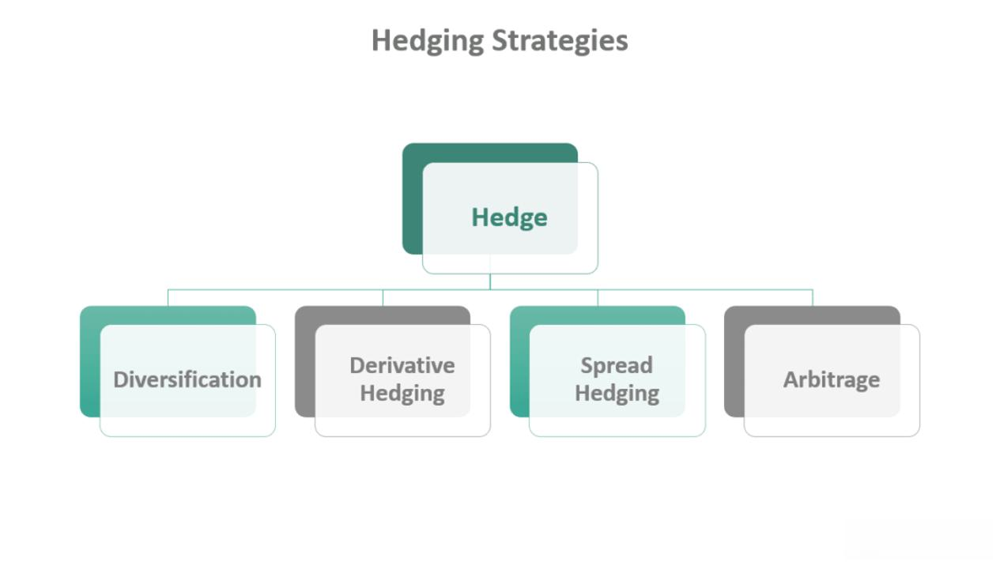

Hedging in trading refers to the practice of implementing strategies to reduce or eliminate potential losses in financial markets. This concept is vital because it helps protect investments from adverse movements in price. By establishing a counterbalance using different financial instruments such as options, futures, or other derivatives, traders can manage risk effectively. The essence of hedging lies in reducing unwanted exposure to market volatility while still participating in potential upsides.

Algorithmic intraday trading involves the use of automated systems to execute trades at high speed and efficiency. In this context, hedging becomes even more crucial. Algorithmic systems can quickly react to rapid market movements, and having a robust hedging strategy ensures that potential losses are minimized without human intervention. As intraday trading operates within a short time frame, often lasting only from market open to market close, quick and accurate hedging decisions are paramount to sustaining profitability.



There are various hedging strategies available to traders. These strategies aim to offset potential losses in one position by taking another position. Some widely recognized strategies include market neutral positions, long-short equity strategies, pairs trading, and arbitrage strategies. Each of these strategies functions on distinct principles and financial instruments tailored to different risk appetites and market situations. Market neutral positions strive to offset gains and losses to achieve a stable portfolio outcome, while long-short strategies involve holding different asset classes to benefit from relative movements. Pairs trading capitalizes on the historical correlation between two related securities, and arbitrage strategies exploit price discrepancies in different markets or forms.

These strategies are not only a defensive mechanism but also a proactive approach to maintaining a balanced portfolio, particularly crucial in high-frequency trading environments where seconds matter. Understanding and implementing effective hedging strategies in algorithmic intraday trading can be the difference between sustaining losses and preserving gains in volatile market conditions.

## Table of Contents

## Understanding Intraday Algo Trading

Intraday algorithmic trading, often seen as a cornerstone of modern financial markets, involves executing trades within the same trading day, eliminating overnight risks. Typically, traders close all positions before the market closes. This approach transforms financial markets by enhancing liquidity and fostering efficient price discovery.

Intraday trading holds significant importance because it allows traders to capitalize on short-term price movements, often driven by news, economic data releases, or market sentiment shifts. The reduction of overnight risk makes intraday trading attractive to both institutional and retail traders looking to avoid the uncertainties of market events that may occur outside of regular trading hours.

**Role of Algorithmic Strategies in Intraday Trading**

Algorithmic trading involves using computer algorithms to automate the trading process, which brings several advantages to intraday trading. These algorithms can analyze vast amounts of market data quickly and execute trades at speeds that are impossible for human traders. This technological edge allows traders to exploit market inefficiencies and gain a competitive advantage.

Algorithms can execute a variety of strategies, including statistical [arbitrage](/wiki/arbitrage), [market making](/wiki/market-making), and [trend following](/wiki/trend-following). These strategies are predefined, and their execution is free from emotional influences, which often skew human decision-making. Additionally, [algorithmic trading](/wiki/algorithmic-trading) minimizes the chances of errors in order placement, thus ensuring the consistency of execution.

**The Need for Speed and Precision in Algo Trading**

Speed and precision are essential elements in successful algorithmic intraday trading. The speed at which an algorithm can execute a trade is critical, as it can mean the difference between a profitable and an unprofitable trade. This need for speed is driven by the fact that market conditions can change in fractions of a second. Therefore, even the slightest delay in execution can result in missed opportunities or increased trading costs due to slippage.

Precision is equally crucial, as the algorithms need to strictly adhere to the rules of the strategy without deviation. Accurate execution ensures that the trades are conducted at the intended prices and quantities, minimizing unintended market impact and maximizing profit potential.

Incorporating advanced technologies such as [machine learning](/wiki/machine-learning) and [artificial intelligence](/wiki/ai-artificial-intelligence) further enhances both speed and precision in algorithmic trading. These technologies allow traders to develop adaptive strategies that can learn from market conditions and adjust their parameters dynamically, providing an added layer of sophistication to intraday trading operations.

In conclusion, the integration of algorithmic strategies in intraday trading has revolutionized the way financial markets operate, emphasizing the need for speed and precision to achieve consistent success.

## What is Hedging?

Hedging is a risk management strategy employed in financial markets to protect assets or portfolios from adverse price movements. At its core, hedging involves taking an offsetting position in a related security to counterbalance potential losses. The primary purpose of hedging is not to generate profit but to minimize exposure to risks and ensure stability in unpredictable market conditions.

One of the fundamental principles of hedging is its capacity to mitigate risks, particularly in intraday trading. Intraday trading, characterized by rapid buying and selling of securities within a single trading day, is highly susceptible to [volatility](/wiki/volatility-trading-strategies) and sudden market fluctuations. Traders aim to capitalize on small price movements, but this approach exposes them to significant risks if the market does not move as anticipated.

For instance, an intraday trader who holds a long position on a technology stock may hedge by shorting another security correlated with the same industry. By taking a short position, the trader can offset potential losses if the technology sector experiences an unexpected downturn during the trading day. This creates a balance that allows the trader to safeguard their position against sudden losses while still pursuing profit opportunities.

Hedging in intraday trading can also extend beyond equities. Traders might use instruments like options, futures, or currency swaps to hedge against various risks, such as [interest rate](/wiki/interest-rate-trading-strategies) changes, commodity price oscillations, or [forex](/wiki/forex-system) rate shifts. Options, in particular, provide flexibility; for example, a trader can use put options as a form of insurance to protect against a decline in the underlying asset's price.

It is crucial to differentiate between hedging and other risk management strategies. While both aim to reduce exposure, hedging involves taking an active position that directly offsets risk, whereas other methods might involve diversification, stop-loss orders, or capital allocation adjustments. Diversification spreads risk across various assets, but does not directly counterbalance losses as a hedge would. Similarly, stop-loss orders automatically sell a position if it hits a certain price threshold, capping potential losses but not protecting against them prior to that point.

In conclusion, hedging in financial markets is an essential strategy for managing risk, particularly valuable in the fast-paced environment of intraday trading. It provides a structured approach to safeguarding investments against unpredictable market movements, distinguishing itself from other risk management strategies by its direct action to offset risk.

## Popular Intraday Hedging Strategies

Intraday trading involves the buying and selling of financial instruments within a single trading day. Effective risk management is crucial in such a fast-paced environment, and hedging strategies play a significant role. Here are some popular intraday hedging strategies:

### Market Neutral Positions

Market neutral strategies aim to eliminate overall market risk by taking offsetting positions in related securities. The goal is to generate a return that is independent of market movements by neutralizing exposure to systematic risk. Traders typically achieve this by going long on a security while simultaneously taking a short position in another, ideally within the same sector or having a high correlation.

#### Example:
A trader might go long on a tech stock such as Apple Inc. (AAPL) and short Microsoft Corporation (MSFT) to capitalize on relative performance, irrespective of the overall market trend.

### Long-Short Equity Strategy

The long-short equity strategy involves taking long positions in stocks expected to increase in value and short positions in stocks expected to decrease. This strategy benefits from both the rise in value of the long positions and the decrease in value of the short positions. The aim is to enhance returns and minimize risk by balancing the long and short positions.

#### Example:
If a trader believes that Company A's prospects look favorable while Company B is overvalued, they might go long on Company A while shorting Company B. The net position attempts to profit from the difference between the two stocks' movements.

### Pairs Trading

Pairs trading involves simultaneously entering into long and short positions in two stocks or financial instruments that have historically shown strong correlation. The expectation is that the spread between the two securities will revert to the mean. This mean-reverting strategy hinges on the assumption that deviations in correlated securities will correct over time.

#### Example:
Consider two companies, Company X and Company Y, with historically correlated stock prices. If Company X's stock price rises while Company Y's falls, a trader might short X and go long Y to profit when the prices converge again.

### Arbitrage Strategies

Arbitrage strategies exploit price discrepancies of the same asset in different markets or forms. In intraday trading, arbitrage opportunities can arise from inefficiencies due to delays in information dissemination or other temporal factors. The trader's goal is to capitalize on these mispricings before the market corrects itself.

#### Common Types:

- **Statistical Arbitrage**: A strategy that involves complex algorithms to identify and exploit such price discrepancies across various securities or markets.

- **Convergence Arbitrage**: The idea is to take offsetting positions in two correlated assets with the expectation that the spread or difference in price will converge over time.

```python
# Simplified Python example for statistical arbitrage

import numpy as np
import pandas as pd

# Simulate market prices for two correlated stocks
np.random.seed(42)
stock_A = np.cumsum(np.random.normal(loc=0.0, scale=1.0, size=100))
stock_B = stock_A + np.random.normal(loc=0.0, scale=0.5, size=100)

data = pd.DataFrame({'Stock_A': stock_A, 'Stock_B': stock_B})

# Calculate price spread
data['Spread'] = data['Stock_A'] - data['Stock_B']

# Determine entry and exit signals based on z-score
data['Z-score'] = (data['Spread'] - data['Spread'].mean()) / data['Spread'].std()

# Arbitrage signal: buy when z-score is low, sell when high
buy_signal = data[data['Z-score'] < -1]
sell_signal = data[data['Z-score'] > 1]

print("Buy signals:\n", buy_signal[['Spread', 'Z-score']])
print("Sell signals:\n", sell_signal[['Spread', 'Z-score']])
```

Each of these strategies offers different mechanisms to counteract risk and potentially profit from market inefficiencies during intraday trading. Their effectiveness can vary based on market conditions, execution efficiency, and the trader's ability to accurately predict price movements.

## Algorithmic Implementation of Hedging Strategies

Algorithmic trading, with its need for speed and precision, greatly benefits from advanced technological solutions that facilitate the implementation of hedging strategies. In intraday trading, where the rapid fluctuations of the market can significantly impact positions, algorithms play a crucial role in executing hedging strategies efficiently and effectively.

### Technology's Role in Hedging

Technology enables traders to automate complex hedging strategies, ensuring real-time execution that aligns with market movements. With algorithmic solutions, traders can continuously monitor their portfolios and adjust hedges automatically to mitigate risks associated with rapid market changes. The automation of these strategies not only increases efficiency but also reduces human error, enabling faster response times and more precise execution.

### Tools and Platforms for Hedging Algorithms

Several tools and platforms support the algorithmic implementation of hedging strategies. Notable among these are:

1. **Algorithmic Trading Platforms**: Platforms such as MetaTrader, NinjaTrader, and QuantConnect provide an environment for developing, testing, and executing trading algorithms. These platforms offer comprehensive APIs and built-in functions that support complex hedging strategies.

2. **Data Providers**: Real-time market data is essential for effective algorithmic trading. Providers like Bloomberg and Reuters deliver reliable data feeds that can be integrated into trading algorithms to enhance decision-making processes.

3. **Risk Management Software**: Tools like RiskMetrics and MATLAB provide risk analytics and modeling capabilities. They help in assessing portfolio risks and optimizing hedging strategies to achieve desired risk profiles.

4. **Backtesting Frameworks**: Software such as Zipline and PyAlgoTrade allows traders to simulate trading strategies against historical data. This facilitates the refinement and validation of hedging strategies before applying them in live markets.

### Steps to Automate Hedging Strategies

Automating hedging strategies involves a structured process, typically encompassing the following steps:

1. **Define the Hedging Strategy**: Clearly outline the strategy based on the financial instruments involved (e.g., options, futures) and the specific risks to be mitigated. For instance, a trader might employ a delta-neutral strategy to hedge against price movements in the underlying asset.

2. **Develop the Algorithm**: Translate the hedging strategy into a programmable algorithm. This involves writing code that defines entry and exit conditions, position sizing, and adjustments as market conditions evolve. Python is commonly used for this purpose due to its extensive libraries and ease of use.

    ```python
    def hedge_portfolio(portfolio, delta_target):
        for asset in portfolio:
            # Calculate the delta of the option
            option_delta = calculate_delta(asset)
            # Adjust the position to achieve delta neutrality
            adjust_position(asset, delta_target - option_delta)
    ```

3. **Integrate Data Feeds**: Connect the algorithm to reliable data sources to ensure that it operates with up-to-date market information. Real-time data integration is crucial for the timely adjustment of hedges in response to market movements.

4. **Backtest the Strategy**: Use historical data to test the algorithm under various market scenarios. This step is critical to understanding how the strategy might perform under different conditions and to make necessary refinements.

5. **Deploy and Monitor**: Once validated, deploy the algorithm into a live trading environment. Continuous monitoring is essential to ensure that the algorithm functions as expected and to make real-time adjustments based on market conditions.

6. **Evaluate Performance**: Regularly assess the performance of the hedging strategy using key metrics such as risk-adjusted returns and drawdown levels. This evaluation helps to determine the effectiveness of the hedging strategy in mitigating risks.

The successful algorithmic implementation of hedging strategies requires investors to leverage state-of-the-art technology and maintain a disciplined approach to development, testing, and management. By doing so, traders can achieve greater precision in managing risks, ultimately leading to more stable and predictable trading outcomes in the highly dynamic environment of intraday trading.

## Example: Hedging with Options

Options are robust financial instruments that provide traders with the ability to hedge against potential market volatility, making them particularly useful for intraday hedging in algorithmic trading. Positioned as derivative contracts, options provide the right but not the obligation to buy (call option) or sell (put option) an underlying asset at a predetermined price on or before a specified date. This unique characteristic allows traders to utilize options as effective tools for risk management in intraday trading scenarios.

### Using Options for Intraday Hedging

In intraday trading, the primary goal is to protect against adverse price movements while maximizing profits within a short time frame. Options serve as valuable instruments for mitigating risk by offering downside protection and enabling strategically enhanced returns.

#### Implementing Put Options

Put options are particularly popular for hedging purposes. They grant the holder the right to sell an asset at a specified price within a given timeframe. This can be advantageous in a declining market, allowing traders to limit potential losses on a long position.

**Case Study: Put Options as a Hedging Tool**

Imagine a trader holding a long position in a volatile stock with the expectation of a short-term price increase. To hedge against potential negative market movements, the trader can purchase put options. Suppose the stock is currently priced at $100, and the trader buys put options with a strike price of $95 for protection.

- **Scenario 1: Stock Price Declines**
  If the stock price drops to $90, the trader's long position suffers a loss. However, the increase in the value of the put options offsets this loss, providing effective risk mitigation.

- **Scenario 2: Stock Price Rises**
  If the stock price increases as anticipated, the put options will expire worthless, but the gain from the long stock position is realized. The cost of the put options represents an insurance premium against the undesirable outcome.

#### Benefits and Drawbacks of Using Options in Intraday Trading

**Benefits:**
- **Risk Management:** Options offer a mechanism to cap losses in adverse market conditions while allowing participation in favorable trends.
- **Flexibility:** Traders can tailor their strategies by selecting different strike prices and expiration dates to align with their market outlook and risk tolerance.
- **Leverage:** Options require a smaller initial investment compared to buying the underlying asset outright, thus utilizing funds more efficiently.

**Drawbacks:**
- **Cost:** Premiums paid for options contracts can reduce overall profitability if the options are not exercised.
- **Complexity:** Understanding options pricing, Greeks (such as Delta, Gamma, and Theta), and the impact of volatility can be challenging for novice traders.
- **Limited Lifespan:** Options have expiration dates, requiring precise timing in execution to optimize their protective capabilities.

Careful consideration of market conditions, volatility, and option pricing strategies is crucial when integrating options as a hedging mechanism in intraday algorithmic trading. By incorporating these instruments thoughtfully, traders can effectively manage risks and enhance their intraday trading strategies.

## Evaluating and Backtesting Hedging Strategies

Backtesting is a critical component of algorithmic intraday trading, serving to validate the effectiveness and reliability of trading strategies before they are deployed in live markets. This process involves testing a strategy using historical data to ensure it performs as expected under similar market conditions. By simulating trades based on historical data, traders can assess potential profitability and mitigate risks associated with future trades.

Evaluating the effectiveness of hedging strategies involves both quantitative and qualitative analyses. The quantitative approach focuses on statistical metrics such as the Sharpe Ratio, which measures the risk-adjusted return of a strategy, and the maximum drawdown, which indicates the largest peak-to-trough decline in portfolio value. Another essential metric is the Sortino Ratio, which differentiates harmful volatility from overall volatility by only considering downside risk. These metrics provide insights into the risk-return profile of the hedging strategy, assisting traders in understanding how well the strategy manages risk and achieves returns.

Qualitative evaluation involves understanding the market conditions under which the hedging strategy operates optimally and recognizing potential situations that could affect its performance. This perspective helps in designing more robust strategies that can withstand various market scenarios.

Several tools are available for [backtesting](/wiki/backtesting) hedging strategies, offering different capabilities depending on the trader's needs. Python, with libraries such as Backtrader, PyAlgoTrade, and QuantConnect, provides a comprehensive platform for backtesting strategies. These tools facilitate the historical simulation of trades, computation of performance metrics, and visualization of results. For sophisticated strategies involving large datasets, platforms like QuantConnect offer cloud-based environments that can handle extensive computational loads and provide a collaborative interface.

A basic Python implementation of a backtesting framework could look like this:

```python
import backtrader as bt

# Create a subclass of Strategy to define the indicators and logic
class MyStrategy(bt.Strategy):
    def __init__(self):
        self.sma = bt.indicators.SimpleMovingAverage(period=15)

    def next(self):
        if self.sma > self.data.close:
            self.sell(size=100)
        elif self.sma < self.data.close:
            self.buy(size=100)

# Create a cerebro entity
cerebro = bt.Cerebro()

# Add a data feed
data = bt.feeds.YahooFinanceData(dataname='AAPL', fromdate=datetime(2020, 1, 1),
                                 todate=datetime(2021, 12, 31))
cerebro.adddata(data)

# Add the strategy
cerebro.addstrategy(MyStrategy)

# Run over everything
cerebro.run()

# Plot the result
cerebro.plot()
```

This code sets up a simple moving average crossover strategy using the Backtrader library. The strategy buys when the closing price is above the simple moving average and sells when it is below. Such backtesting frameworks are crucial for optimizing hedging strategies by iterating over various parameters and conditions.

Backtesting also includes stress testing, where strategies are tested against extreme market conditions to evaluate their resilience and robustness. This is particularly important for hedging, as market anomalies can significantly impact hedging performance.

In summary, the backtesting process is indispensable for refining hedging strategies in algorithmic intraday trading. By leveraging statistical metrics, advanced tools, and programming frameworks, traders can systematically evaluate and improve their strategies, enhancing both efficiency and profitability in real-world trading environments.

## Challenges and Considerations

In intraday trading, especially when employing algorithmic strategies, there are several challenges and considerations that traders must keep in mind to effectively manage risks and enhance performance.

**Common Pitfalls to Avoid in Hedging and Intraday Trading**

1. **Over-reliance on Automation**: While algorithmic trading systems are designed to process information quickly and execute trades at high speeds, over-relying on them without human oversight can lead to significant errors. Algorithms can sometimes misinterpret market signals, leading to misguided trades.

2. **Inadequate Risk Assessment**: Traders may fail to adequately assess the risks associated with each trade. This can result from a lack of comprehensive backtesting or the use of inadequate risk metrics, leading to potential financial losses.

3. **Ignoring Correlations**: When constructing hedging strategies, it’s essential to consider the correlations between different assets. A common mistake is to assume zero or constant correlation, which can render a hedging strategy ineffective if market conditions change, affecting the correlation.

**Market Conditions and Their Impact on Hedging Strategies**

Market conditions can significantly influence the effectiveness of hedging strategies. Volatility, [liquidity](/wiki/liquidity-risk-premium), and market trends are crucial factors to consider:

- **Volatility**: High volatility can lead to unpredictable price swings, making it challenging to maintain a stable hedged position. While some strategies thrive on volatility, others may be adversely affected. Thus, adjusting strategies according to volatility conditions is crucial.

- **Liquidity**: In periods of low liquidity, executing trades at desired prices can become difficult, potentially leading to slippage and increased costs. This can impact the effectiveness of intraday hedging strategies.

- **Market Trends**: Understanding the broader market trend is essential. An unexpected market downturn or upturn can quickly invalidate a hedging strategy designed for stable or opposite conditions. Hedging strategies should be adaptive, allowing for quick adjustments based on real-time market data.

**Regulatory and Ethical Considerations in Algorithmic Hedging**

1. **Compliance**: Algorithmic trading, including hedging strategies, is subject to various regulatory requirements. Traders must ensure their algorithms comply with local financial regulations, such as those set by the Securities and Exchange Commission (SEC) in the United States or the European Securities and Markets Authority (ESMA) in Europe. Non-compliance can result in penalties and trading bans.

2. **Transparency and Fairness**: Ethical considerations in algorithmic trading involve ensuring that these systems do not manipulate markets or create unfair trading advantages. Trades should be transparent, with algorithms designed to operate fairly without exploiting loopholes or engaging in practices like quote stuffing that may distort the market.

3. **Data Privacy**: With the increasing use of data-driven algorithms, maintaining data privacy is essential. Traders must adhere to data protection laws, ensuring that any personal or sensitive information used is secured and processed lawfully.

Overall, while hedging and algorithmic trading provide significant advantages in managing risk, traders must remain vigilant to the challenges and continuously update their strategies in response to changing market conditions, regulatory standards, and ethical expectations.

## Conclusion

Hedging strategies play a significant role in managing risks associated with intraday algorithmic trading. By utilizing these strategies, traders can mitigate potential losses resulting from volatile market conditions and unpredictable price movements. Various approaches, such as market neutral positions, long-short equity strategies, pairs trading, and arbitrage, offer traders a diverse toolkit for protecting their portfolios. Each method caters to different market scenarios, allowing for flexibility in risk management.

Adopting best practices in intraday algorithmic hedging is crucial for success. It involves a disciplined approach to implementing and monitoring hedging strategies, ensuring they align with the trader's overall objectives and risk tolerance. Successful hedging requires not only a sound understanding of financial instruments and market dynamics but also proficiency in algorithmic development and deployment.

Continuous learning and adaptation are essential in the evolving landscape of financial markets and technology. Traders should remain abreast of advancements in trading algorithms, platforms, and regulatory changes, which may influence the effectiveness of hedging strategies. Embracing innovation while maintaining a cautious approach enables traders to refine their strategies and improve their risk management capabilities over time. Encouraging a mindset of lifelong learning will empower traders to navigate the complexities of intraday algorithmic trading more effectively.

## FAQs

### FAQs

**How does hedging work in algorithmic intraday trading?**

Hedging in algorithmic intraday trading involves creating strategies that mitigate potential losses by taking opposing positions in the market. These strategies utilize algorithms to execute trades automatically and with precision, ensuring that the trader's position is protected against unfavorable market movements. For instance, an algorithm might detect a potential downside in the market and automatically purchase put options to offset potential losses from the trader's primary long position. By leveraging high-speed computations and real-time data analysis, algorithms can continuously assess risks and adjust hedge positions dynamically during the trading day.

**What are some common risks in intraday trading despite hedging?**

Despite hedging, intraday trading remains fraught with risks, such as:

1. **Market Volatility:** Sudden and extreme volatility can lead to price gaps or slippage, which may render hedging strategies ineffective or more costly.

2. **Execution Risk:** Even with automated systems, there can be lags or errors in trade execution due to technological glitches or latency issues.

3. **Liquidity Risk:** A lack of market liquidity can prevent traders from entering or exiting positions at desired prices, impacting the effectiveness of hedges.

4. **Systemic Risks:** Broader economic or financial crises can result in systemic risks where entire segments of the market are affected, sometimes nullifying hedging positions.

5. **Regulatory Changes:** Sudden regulatory adjustments can impact market conditions and the viability of specific hedging approaches.

**How can retail traders benefit from implementing hedging strategies?**

Retail traders, often operating with smaller capital and fewer resources compared to institutional traders, can benefit from hedging strategies in several ways:

1. **Risk Management:** Hedging can limit potential losses and provide a level of security, enabling retail traders to participate in markets with a controlled risk.

2. **Portfolio Diversification:** Implementing strategies such as long-short equity or pairs trading allows retail traders to diversify their positions and hedge against market movements.

3. **Enhanced Returns:** By managing downside risk, traders can focus on enhancing returns from their primary investment strategy without being overly concerned about unexpected adverse movements.

4. **Learning and Adaptation:** Developing and testing hedging algorithms enhance a trader's understanding of market dynamics, leading to more educated decision-making and strategic adaptability.

5. **Access to Leverage:** Hedging can sometimes allow traders to take leveraged positions with less fear of catastrophic losses, making it possible to amplify gains while controlling risks.

## References & Further Reading

[1]: Bergstra, J., Bardenet, R., Bengio, Y., & Kégl, B. (2011). ["Algorithms for Hyper-Parameter Optimization."](https://dl.acm.org/doi/10.5555/2986459.2986743) Advances in Neural Information Processing Systems 24.

[2]: ["Advances in Financial Machine Learning"](https://www.amazon.com/Advances-Financial-Machine-Learning-Marcos/dp/1119482089) by Marcos Lopez de Prado

[3]: ["Evidence-Based Technical Analysis: Applying the Scientific Method and Statistical Inference to Trading Signals"](https://www.amazon.com/Evidence-Based-Technical-Analysis-Scientific-Statistical/dp/0470008741) by David Aronson

[4]: ["Machine Learning for Algorithmic Trading"](https://github.com/PacktPublishing/Machine-Learning-for-Algorithmic-Trading-Second-Edition) by Stefan Jansen

[5]: ["Quantitative Trading: How to Build Your Own Algorithmic Trading Business"](https://books.google.com/books/about/Quantitative_Trading.html?id=j70yEAAAQBAJ) by Ernest P. Chan

[6]: Hull, J. C. (2014). ["Options, Futures, and Other Derivatives"](https://www.pearson.com/en-us/subject-catalog/p/options-futures-and-other-derivatives/P200000005938/9780136939917). Pearson.

[7]: Hasbrouck, J. (2007). ["Empirical Market Microstructure: The Institutions, Economics, and Econometrics of Securities Trading"](https://academic.oup.com/book/52241) by Oxford University Press.

[8]: Black, F., & Scholes, M. (1973). "The Pricing of Options and Corporate Liabilities." Journal of Political Economy, 81(3), 637-654.

[9]: Gatev, E., Goetzmann, W. N., & Rouwenhorst, K. G. (2006). ["Pairs Trading: Performance of a Relative-Value Arbitrage Rule."](https://www.nber.org/papers/w7032) The Review of Financial Studies, 19(3), 797-827.

[10]: Chincarini, L. B., & Kim, D. (2006). ["Quantitative Equity Portfolio Management: An Active Approach to Portfolio Construction and Management"](https://www.mhebooklibrary.com/doi/book/10.1036/9781264268931). McGraw-Hill.
