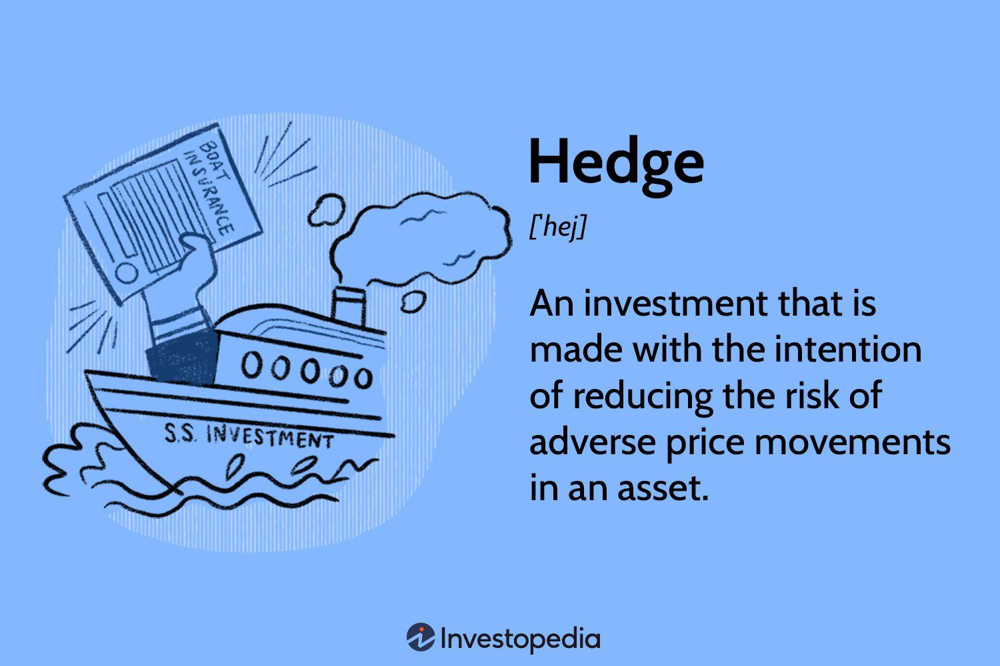

## Table of Contents

## What is hedging in trading?

Hedging in trading is like buying insurance for your investments. It's a strategy that traders use to reduce the risk of losing money. When you hedge, you make another investment that is expected to move in the opposite direction of your main investment. This way, if your main investment loses value, the other investment might gain value, helping to balance out your losses.

For example, imagine you own stocks in a company, but you're worried that the stock price might go down. To hedge, you could buy a put option on that stock. A put option gives you the right to sell the stock at a certain price, even if the market price drops lower. If the stock price does fall, the put option will increase in value, offsetting the loss from your stocks. Hedging doesn't guarantee you won't lose money, but it can help protect your investments from big swings in the market.

## Why do traders use hedging strategies?

Traders use hedging strategies mainly to protect their money from big losses. When someone invests in something like stocks, they might worry that the price could go down and they could lose a lot of money. By using a hedge, they can set up another investment that will go up in value if their main investment goes down. This way, even if they lose money on their stocks, they might make money on their hedge, which can help balance things out.

Another reason traders use hedging is to manage risk better. Not all investments are safe, and sometimes the market can be unpredictable. Hedging helps traders feel more secure because it gives them a way to limit how much they could lose. It's like having a safety net. While hedging doesn't stop all losses, it can make traders feel more confident about their investments, knowing they have some protection in place.

## What are the basic types of hedging strategies?

One basic type of hedging strategy is using options. Options are like contracts that give you the right to buy or sell an asset at a certain price before a certain date. If you own stocks and you're worried they might lose value, you can buy a put option. This lets you sell your stocks at a set price, even if the market price drops. On the other hand, if you think you might want to buy more stocks later, you can buy a call option. This gives you the right to buy the stocks at a set price, even if the market price goes up.

Another common hedging strategy is using futures contracts. Futures are agreements to buy or sell an asset at a set price on a future date. For example, if you're a farmer and you want to make sure you get a good price for your crops, you can sell futures contracts. This way, no matter what the market price is when you actually sell your crops, you know you'll get the price you agreed on in the futures contract. This can protect you from price drops.

A third type of hedging strategy involves using other assets that move in the opposite direction to your main investment. For example, if you have a lot of money in stocks, you might also invest in gold or other commodities. When the stock market goes down, the price of gold often goes up. So, if your stocks lose value, your gold might gain value, helping to balance out your losses. This way, you're not putting all your eggs in one basket, and you're spreading out your risk.

## How does a simple hedge using options work?

A simple hedge using options works like this: Imagine you own some stocks and you're worried their price might go down. To protect yourself, you can buy a put option on those stocks. A put option is like a contract that gives you the right to sell your stocks at a certain price, called the strike price, before the option expires. If the stock price does drop below the strike price, you can use the put option to sell your stocks at the higher strike price instead of the lower market price. This way, you limit how much money you could lose if the stock price goes down.

For example, say you own 100 shares of XYZ Company, and each share is currently worth $50. You're worried the price might fall, so you buy a put option with a strike price of $45 that expires in three months. If the stock price drops to $40 before the option expires, you can use your put option to sell your 100 shares at $45 each instead of $40. This means you'll only lose $5 per share ($50 - $45) instead of $10 per share ($50 - $40). The put option helps you save money by limiting your potential loss.

## What is the difference between a long hedge and a short hedge?

A long hedge is when you want to protect yourself from the price of something going up in the future. Imagine you're a company that needs to buy a lot of a certain material in a few months. If you're worried the price of that material will go up, you can use a long hedge. You do this by buying futures contracts for that material. This means you agree to buy the material at today's price, even if the price goes up later. So, if the price does rise, you're protected because you locked in a lower price earlier.

A short hedge is the opposite. It's used when you want to protect yourself from the price of something going down in the future. Let's say you're a farmer who will harvest and sell your crops in a few months. If you're worried the price of your crops might go down, you can use a short hedge. You do this by selling futures contracts for your crops. This means you agree to sell your crops at today's price, even if the price goes down later. So, if the price does drop, you're protected because you locked in a higher price earlier.

## Can you explain how futures contracts are used in hedging?

Futures contracts are like agreements to buy or sell something at a set price on a future date. They are used in hedging to protect against price changes. For example, if you're a farmer and you want to make sure you get a good price for your crops, you can sell futures contracts. This means you agree to sell your crops at today's price, even if the market price goes down later. By doing this, you protect yourself from losing money if the price of your crops drops before you can sell them.

On the other hand, if you're a company that needs to buy materials in the future, you might worry that the price will go up. To protect yourself, you can buy futures contracts. This means you agree to buy the materials at today's price, even if the market price goes up later. By doing this, you make sure you won't have to pay more for the materials if the price rises before you need to buy them. Futures contracts help both buyers and sellers manage the risk of price changes, making their planning more predictable.

## What are the risks associated with hedging?

Hedging is a way to protect your money, but it can also bring some risks. One big risk is that it can cost you money. When you hedge, you might need to pay for things like options or futures contracts. If the market moves in the way you hoped, these costs can be worth it. But if the market stays the same or moves differently than you expected, you could lose money on the hedge without getting any benefit from it.

Another risk is that hedging can make your investment less profitable. When you hedge, you're trying to protect yourself from losing money, but you might also miss out on making more money. If the market goes up and your main investment does well, the hedge might limit how much you can gain. So, while hedging can help you avoid big losses, it can also stop you from making big wins.

Lastly, hedging can be complicated and hard to get right. It takes a lot of knowledge and experience to use hedging strategies well. If you don't understand how to hedge properly, you might end up making mistakes that cost you money. It's important to know what you're doing and to keep an eye on the market to make sure your hedge is working the way you want it to.

## How can hedging be used to manage currency risk?

Hedging can be used to manage currency risk when you're dealing with money from different countries. Imagine you're a business that sells things in the United States but gets paid in Euros from Europe. If the value of the Euro goes down compared to the US Dollar, you might get less money when you change your Euros to Dollars. To protect against this, you can use a currency hedge. One way to do this is by using forward contracts. A forward contract lets you agree to exchange Euros for Dollars at today's rate, even if you'll actually do the exchange in the future. This way, no matter what happens to the exchange rate, you know how much money you'll get.

Another way to hedge currency risk is by using options. For example, you could buy a currency option that gives you the right to sell Euros at a set rate in the future. If the Euro's value drops, you can use this option to sell your Euros at the better rate you locked in earlier. This helps you avoid losing money because of changes in currency values. Hedging doesn't make the risk go away completely, but it can help you plan better and feel more secure about your money.

## What advanced hedging strategies can be used in volatile markets?

In volatile markets, one advanced hedging strategy is called delta hedging. This involves using options to keep the overall value of your portfolio steady, even when the market is jumping around a lot. You do this by adjusting your options based on how much the price of your main investment changes. If the price of your stock goes up or down a lot, you buy or sell more options to balance it out. Delta hedging can be tricky because you need to keep watching the market and making changes, but it can help protect your money when things are really unpredictable.

Another strategy is using pairs trading. This means you find two things that usually move together, like two stocks in the same industry. You buy one and sell the other at the same time. If the market gets crazy and one stock goes up while the other goes down, your pairs trade can help balance out your losses. This strategy works well in volatile markets because it doesn't depend on the market going up or down overall, just on the two things moving differently from each other. It's a bit more complex, but it can be a good way to protect your investments when the market is hard to predict.

## How do portfolio managers use hedging to optimize returns?

Portfolio managers use hedging to protect their investments from big losses while still trying to make money. Imagine you're a manager looking after a bunch of stocks. You might worry that the stock market could crash and your stocks could lose a lot of value. To hedge, you could buy put options on your stocks. If the market does go down, these options will go up in value, helping to balance out the losses from your stocks. This way, you can keep your portfolio safe without having to sell all your stocks and miss out on future gains.

Another way portfolio managers use hedging is to balance risk and reward. They might use futures contracts to lock in prices for certain assets they plan to buy or sell later. For example, if a manager knows they'll need to buy more stocks in the future, they can use futures to buy at today's price, even if the market goes up. This can help them plan better and make sure they don't lose money if prices change. By using these strategies, portfolio managers can try to make the most of their investments while keeping their risks under control.

## What are the tax implications of hedging strategies?

Hedging can affect your taxes in different ways. When you use options or futures to hedge, you might have to pay taxes on any money you make from them. For example, if you buy a put option and it goes up in value, you'll need to report that gain on your taxes. The tax rate you pay can depend on how long you held the option or futures contract. If you held it for less than a year, it's usually taxed as regular income. If you held it for more than a year, it might be taxed at a lower rate as a long-term capital gain.

Sometimes, hedging can also help you lower your taxes. If you have losses from your hedge, you might be able to use those losses to reduce the taxes you owe on other gains. This is called tax loss harvesting. For example, if you lose money on a futures contract, you can use that loss to offset any money you made from selling stocks. But, tax rules can be complicated, and they can change depending on where you live and what kind of investments you have. It's a good idea to talk to a tax professional to make sure you're doing everything right and taking advantage of all the tax benefits you can.

## How can algorithmic trading enhance hedging strategies?

Algorithmic trading can make hedging strategies better by using computers to watch the market all the time and make quick decisions. When you hedge, you want to protect your money from big changes in the market. With algorithms, you can set up rules that tell the computer when to buy or sell options or futures to keep your investments safe. The computer can do this much faster than a person, so it can catch small changes in the market and adjust your hedge right away. This means you can protect your money better and maybe even save some money on the costs of hedging.

Another way [algorithmic trading](/wiki/algorithmic-trading) helps with hedging is by taking away some of the guesswork. When you use algorithms, you can test different hedging strategies on past market data to see which ones work best. This is called [backtesting](/wiki/backtesting). Once you find a good strategy, the algorithm can use it to make decisions automatically. This can help you make smarter choices about when and how to hedge, without having to watch the market all the time yourself. By using algorithms, you can make your hedging more precise and effective, which can lead to better results for your investments.

## References & Further Reading

[1]: Bergstra, J., Bardenet, R., Bengio, Y., & Kégl, B. (2011). ["Algorithms for Hyper-Parameter Optimization."](https://dl.acm.org/doi/10.5555/2986459.2986743) Advances in Neural Information Processing Systems 24.

[2]: ["Advances in Financial Machine Learning"](https://www.amazon.com/Advances-Financial-Machine-Learning-Marcos/dp/1119482089) by Marcos Lopez de Prado

[3]: ["Evidence-Based Technical Analysis: Applying the Scientific Method and Statistical Inference to Trading Signals"](https://www.amazon.com/Evidence-Based-Technical-Analysis-Scientific-Statistical/dp/0470008741) by David Aronson

[4]: ["Machine Learning for Algorithmic Trading"](https://github.com/PacktPublishing/Machine-Learning-for-Algorithmic-Trading-Second-Edition) by Stefan Jansen

[5]: ["Quantitative Trading: How to Build Your Own Algorithmic Trading Business"](https://books.google.com/books/about/Quantitative_Trading.html?id=j70yEAAAQBAJ) by Ernest P. Chan

[6]: Hull, J. C. (2014). ["Options, Futures, and Other Derivatives"](https://www.pearson.com/en-us/subject-catalog/p/options-futures-and-other-derivatives/P200000005938/9780136939917). Pearson.

[7]: Hasbrouck, J. (2007). ["Empirical Market Microstructure: The Institutions, Economics, and Econometrics of Securities Trading"](https://academic.oup.com/book/52241) by Oxford University Press.

[8]: Black, F., & Scholes, M. (1973). "The Pricing of Options and Corporate Liabilities." Journal of Political Economy, 81(3), 637-654.

[9]: Gatev, E., Goetzmann, W. N., & Rouwenhorst, K. G. (2006). ["Pairs Trading: Performance of a Relative-Value Arbitrage Rule."](https://www.nber.org/papers/w7032) The Review of Financial Studies, 19(3), 797-827.

[10]: Chincarini, L. B., & Kim, D. (2006). ["Quantitative Equity Portfolio Management: An Active Approach to Portfolio Construction and Management"](https://www.mhebooklibrary.com/doi/book/10.1036/9781264268931). McGraw-Hill.
