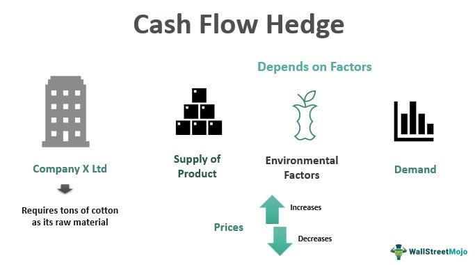

In the world of finance, managing risks is paramount to the success of investment strategies. Although financial markets offer opportunities for substantial returns, they are inherently unpredictable and laden with uncertainties that can lead to potential losses. To address these challenges, hedging has emerged as a fundamental technique employed to mitigate financial risks. Hedging involves taking an offsetting position in related securities or derivatives, effectively reducing the exposure to adverse price movements. This strategy is akin to an insurance metaphor—hedging acts as a safeguard against unfavorable market outcomes, thus providing a cushion to investors.

Another critical component of modern finance is algorithmic trading, which relies on computer algorithms to execute trades automatically based on pre-defined criteria. This approach leverages the speed and efficiency of computer systems to capitalize on fleeting market opportunities. Nonetheless, the automation introduced by algorithmic trading requires meticulous risk management to control and mitigate the amplified risks stemming from rapid trading and volatility. Here, risk management is not merely a supportive role but a decisive element in shaping the outcomes of algorithmic trading endeavors.



This article explores the interconnections between hedging, risk management, and algorithmic trading within the financial landscape. By examining these interwoven topics, we aim to shed light on how these components collectively contribute to optimizing investment strategies in today's dynamic and often tumultuous markets. Whether through hedging to guard against potential losses or through algorithmic trading to enhance performance, integrating robust risk management practices remains vital for traders and investors aiming for success and stability.

## Table of Contents

## Understanding Hedging in Finance

Hedging in finance refers to strategic actions taken to minimize potential losses in one position by taking an opposite position in a different financial instrument. This technique is fundamental in managing risk exposure and is primarily manifested through the use of derivatives such as options, futures, or forwards.

Options are contracts granting the buyer the right, but not the obligation, to buy or sell an asset at a predetermined price before a specified date. They are versatile tools in hedging strategies, allowing investors to limit downside risk while retaining the potential for upside gains. Futures are standardized contracts obligating the parties to buy or sell an asset at a predetermined future date and price. They are commonly used by investors seeking to hedge against price fluctuations in commodities, currencies, or financial indices. Forwards, similar to futures, are customized contracts between two parties to buy or sell an asset at a specified price on a future date. Unlike futures, forwards are not traded on exchanges, allowing for more tailored agreements.

A common mathematical expression in hedging is the delta, which measures the rate of change of an option’s price concerning a change in the underlying asset’s price. Delta hedging involves maintaining a delta-neutral portfolio that seeks to offset this rate and thereby reduce the risk from price movements. 

For investors, hedging represents a form of financial insurance, shielding them from adverse market movements. By creating offsetting positions, investors can stabilize returns and improve the predictability of investment outcomes. This technique is essential in volatile markets, where sudden price movements can significantly impact investment portfolios. Efficient hedging requires a sophisticated understanding of market mechanisms and the dynamics of employed financial instruments.

## Risk Management Fundamentals

Risk management is a critical component in the financial industry, fundamental for preserving capital and ensuring sustained trading success. It operates as a framework that guides traders and investors in identifying, analyzing, and managing potential risks that could adversely affect investment outcomes. A robust risk management strategy consists of several key elements, including setting clear investment goals, defining risk tolerance, and diversifying portfolios.

Firstly, setting clear investment goals provides a roadmap for decision-making, aligning strategies with the desired financial outcomes. This clarity helps in determining the acceptable levels of risk and returns for the portfolio. Investment goals should be specific, measurable, achievable, relevant, and time-bound (SMART), offering a clear direction for the investment strategy.

Defining risk tolerance is another crucial element of risk management. Risk tolerance refers to the level of risk an investor is willing to accept in pursuit of their financial goals. It varies according to individual circumstances, such as financial situation, investment horizon, and psychological comfort with market [volatility](/wiki/volatility-trading-strategies). By understanding their risk tolerance, investors can tailor their portfolios to maintain an appropriate balance between risk and return.

Diversification, the third key element, involves spreading investments across different asset classes, sectors, or geographical regions to minimize exposure to any single risk [factor](/wiki/factor-investing). Diversification aims to reduce the impact of poor performance in any one investment on the overall portfolio, thus enhancing risk-adjusted returns. The principle is based on the notion that different assets will often react differently to the same market event, so a diversified portfolio can help smooth out potential volatility.

Effective risk management requires continuous monitoring and evaluation of strategies. This ongoing process involves assessing market conditions, analyzing the performance of investments, and making necessary adjustments to align with the original investment goals and risk tolerance. Utilizing a combination of qualitative and quantitative tools, investors can better understand the potential impact of unforeseen events on their portfolios and develop strategies to mitigate potential losses.

Quantitative tools such as Value at Risk (VaR), stress testing, and scenario analysis are commonly used in risk management to estimate the potential loss in value of a portfolio under adverse conditions. These tools provide insights into portfolio risk, allowing for the development of strategies to limit downside risk while pursuing financial goals.

In conclusion, risk management serves as the cornerstone of prudent investment practices, offering a structured approach to handling uncertainties within financial markets. By setting clear goals, understanding risk tolerance, diversifying portfolios, and continually monitoring investments, traders and investors can effectively manage risks and improve their chances of achieving long-term success.

## Algorithmic Trading: An Overview

Algorithmic trading is a method of executing trades utilizing an automated system that operates based on pre-defined strategies. These systems, often referred to as algorithms or algos, are designed to execute orders without human intervention, integrating all parameters needed for the decision-making process, such as timing, price, and quantity.

The principal advantage of [algorithmic trading](/wiki/algorithmic-trading) lies in its speed and efficiency. By automating the trading process, algorithms can evaluate vast amounts of data and execute orders significantly faster than human traders. This speed offers opportunities to capitalize on short-lived market conditions, making high-frequency trading ([HFT](/wiki/high-frequency-trading-strategies)) a common application of algorithmic systems. Despite the potential for enhanced trading results, the rapidity of algorithmic trading can also amplify exposure to market risks. When improperly managed, errors in algorithms can lead to significant financial losses. Algorithms might make decisions based on erroneous data or fail to adapt to unexpected market conditions, which could lead to unfavorable outcomes.

Integrating robust risk management protocols is therefore essential in algorithmic trading to handle market volatility effectively. These protocols might include real-time monitoring of market conditions, adaptive algorithms that can modify their strategies in response to changing market dynamics, and the implementation of stop-loss orders that automatically [exit](/wiki/exit-strategy) a position once a specified level is reached. Furthermore, algorithmic trading systems often utilize [backtesting](/wiki/backtesting), simulating trading strategies using historical data to ascertain their effectiveness before live deployment. While backtesting does not guarantee future results, it helps in refining the strategies and identifying potential weaknesses. This approach helps in creating strategies that are not only efficient but also resilient in the face of market volatility.

In summary, algorithmic trading leverages the capabilities of modern technology to execute trades with speed and precision, presenting both opportunities and challenges. To navigate these successfully, incorporating comprehensive risk management protocols is indispensable, ensuring that the benefits of algorithmic trading are maximized while minimizing potential risks.

## Hedging Strategies in Algorithmic Trading

Hedging strategies in algorithmic trading involve sophisticated approaches to manage and mitigate risks associated with unpredictable market price movements and idiosyncratic risks. Two primary forms include asset-hedging and time-hedging, each addressing different dimensions of risk.

Asset-hedging is a strategy that employs financial instruments such as options, futures, or swaps to counteract potential adverse price changes in a portfolio. The goal is to create a protective shield that absorbs shocks from market volatilities. For instance, if a trader holds a position in a volatile stock, they might use options to limit potential losses. The use of derivatives ensures that losses in the event of a market downturn are offset by gains from the hedge, thereby stabilizing the portfolio's value. The effectiveness of asset-hedging depends on the correct estimation of the correlation between the asset and the hedging instrument, which necessitates a deep understanding of market dynamics and correlations.

Time-hedging, on the other hand, focuses on limiting the exposure duration to risky positions. This involves strategic timing to enter or exit positions to minimize the time that a portfolio is exposed to potential market risks. Algorithmic systems can be programmed to exploit short-term market inefficiencies and to withdraw from positions once a predetermined risk threshold or time limit has been met. For example, a high-frequency trading algorithm might execute trades within milliseconds, capturing fleeting opportunities while simultaneously minimizing market exposure. Time-hedging requires algorithms to continuously assess not only the market conditions but also the trader's risk objectives, aligning trades accordingly.

The integration of these hedging strategies within algorithmic trading demands sophisticated quantitative models that predict asset behaviors and market movements. For both asset-hedging and time-hedging, the development of complex algorithms that incorporate advanced statistical techniques and [machine learning](/wiki/machine-learning) models is essential to enhance decision-making capability. Proper calibration and testing of these algorithms are vital to ensure their effectiveness in real-time trading scenarios.

Mathematically, the evaluation of potential hedging strategies can involve calculating the expected value and standard deviation of returns, which are fundamental in assessing risk and return balances. Algorithms often employ Monte Carlo simulations or other statistical methods to forecast various market scenarios and their potential impacts on portfolios.

```python
import numpy as np

# Simulating portfolio returns using random sampling
def simulate_portfolio_returns(num_simulations, num_days, mean_return, volatility):
    return np.random.normal(loc=mean_return, scale=volatility, size=(num_simulations, num_days))

# Example of calculating expected returns and volatility
simulated_returns = simulate_portfolio_returns(10000, 252, 0.0005, 0.01)
expected_returns = np.mean(simulated_returns, axis=0)
portfolio_volatility = np.std(simulated_returns, axis=0)
```

Ensuring robust performance in real-world applications also requires continuous re-assessment and adaptation of the strategies to account for evolving market conditions and technological advancements. Implementing such hedging practices in algorithmic trading can provide traders with the confidence to navigate volatile markets with reduced risk and optimized returns.

## Quantitative Techniques for Risk Management

Quantitative techniques are essential tools in risk management, particularly in the context of algorithmic trading. Among the most prominent methods are Value at Risk (VaR) and stress testing. These tools help financial institutions estimate potential losses under extreme market conditions, thereby allowing for better-informed decision-making and the development of strategies to mitigate associated risks.

Value at Risk (VaR) is a widely used metric that quantifies the maximum expected loss over a specified time period at a given confidence level. For example, a 1-day VaR of $10 million at a 95% confidence level implies there is a 5% chance that the portfolio will experience more than $10 million in losses in a single day. VaR can be calculated using different approaches, including the historical method, the variance-covariance method, and Monte Carlo simulation. Each method has its own assumptions and applicability, with considerations regarding the underlying distribution of asset returns and correlations.

In Python, a simple implementation of the historical method for VaR might look like this:

```python
import numpy as np

def calculate_var_historical(returns, confidence_level):
    sorted_returns = np.sort(returns)
    index = int((1 - confidence_level) * len(sorted_returns))
    return abs(sorted_returns[index])

# Example usage
portfolio_returns = np.random.normal(0, 0.01, 1000)  # Simulated returns
var_95 = calculate_var_historical(portfolio_returns, 0.95)
print(f"95% VaR: {var_95}")
```

Stress testing, on the other hand, involves evaluating the impact of hypothetical adverse scenarios on a portfolio. This technique allows traders and risk managers to assess resilience against extreme market movements, such as financial crises or significant geopolitical events. Stress tests can be designed to simulate various conditions, such as sudden [interest rate](/wiki/interest-rate-trading-strategies) shifts, currency devaluations, or drastic stock price declines. These scenarios provide insights into portfolio vulnerabilities and guide adjustments in risk management strategies.

Combining these quantitative techniques with algorithmic trading platforms enhances risk assessment capabilities. Algorithms can analyze large datasets swiftly, enabling real-time monitoring and adaptation to market changes. By deploying these quantitative tools, financial institutions can optimize their algorithms to dynamically adjust positions based on evolving risk profiles, thus safeguarding against potential significant losses.

In conclusion, leveraging quantitative techniques like VaR and stress testing is crucial for managing risk in algorithmic trading. These methods not only quantify potential losses but also facilitate the development of robust strategies that can withstand extreme market fluctuations. As financial markets grow more complex, the integration of such quantitative tools into algorithmic trading systems proves indispensable for ensuring sustainable investment success.

## Challenges and Considerations

Hedging and risk management, while integral to secure financial operations, present several challenges primarily due to the intricate nature of financial instruments and market behaviors. One of the primary difficulties lies in the comprehension and effective application of complex derivatives, which are often employed to offset risks. Derivatives such as options, futures, and swaps require a deep understanding of their pricing models and the specific market conditions under which they are most effective. Investors and traders must possess a keen insight into the correlations and volatilities of various market instruments to construct efficient hedging strategies. Misjudgments in correlations can lead to ineffective hedges or unintended risk exposures that undermine the very purpose of hedging.

Another significant consideration is the delicate balance between minimizing risk and maximizing returns. There is an inherent trade-off between risk and reward: conservative strategies that prioritize risk minimization may result in lower returns, while more aggressive strategies that target higher returns often increase the potential for significant losses. Portfolio managers must therefore evaluate their risk tolerance levels and investment objectives to strike an optimal balance. This involves continuous analysis of market data and incorporation of sophisticated computational methods to ensure that strategies maintain their effectiveness over time.

The dynamic nature of financial markets necessitates that hedging and risk management strategies be continuously adapted and refined. Market conditions, characterized by variables such as interest rates, currency fluctuations, and economic events, are not static. As such, strategies that were once effective may become obsolete or even detrimental. Practitioners must remain vigilant, regularly reassessing and updating their approaches in response to new data and market developments. This requires a combination of cutting-edge quantitative techniques and real-time data analytics to maintain an agile and responsive trading environment. Embracing advancements in technology, such as machine learning and [artificial intelligence](/wiki/ai-artificial-intelligence), can aid in identifying emerging patterns and trends that inform strategic realignments.

In summary, effectively navigating the challenges of hedging and risk management demands a comprehensive understanding of financial instruments, a prudent balance between risk and reward, and a proactive approach to strategy adaptation amidst the evolving landscape of financial markets.

## Conclusion

Hedging, risk management, and algorithmic trading are essential elements in crafting successful investment strategies. These components work in synergy to offer a robust defense against market uncertainties while optimizing potential gains. Hedging serves as a protective layer, enabling traders and investors to mitigate losses across volatile markets. Simultaneously, effective risk management provides a structured framework to evaluate and address potential threats, ensuring capital preservation and driving long-term success.

Incorporating algorithmic trading into this blend enhances the ability to execute strategies with speed and precision, allowing for quick adaptation to market changes. However, algorithmic systems must be underpinned by robust risk management protocols to control exposure efficiently. By unifying these elements, investors can navigate the complexities of financial markets more effectively and position themselves advantageously to capture opportunities while mitigating risks.

A strategic focus on these intertwined aspects equips traders and investors with the tools necessary for sustained success. By prioritizing a balanced approach that harmonizes hedging, risk management, and algorithmic trading, market participants can optimize their investment strategies in the face of fluctuating conditions and unforeseen market dynamics.

## References & Further Reading

[1]: ["Options, Futures, and Other Derivatives"](https://www.amazon.com/Options-Futures-Other-Derivatives-10th/dp/013447208X) by John C. Hull

[2]: ["Algorithmic Trading: Winning Strategies and Their Rationale"](https://www.wiley.com/en-us/Algorithmic+Trading%3A+Winning+Strategies+and+Their+Rationale-p-9781118746912) by Ernie Chan

[3]: Black, F. & Scholes, M. (1973). ["The Pricing of Options and Corporate Liabilities."](https://www.cs.princeton.edu/courses/archive/fall09/cos323/papers/black_scholes73.pdf) Journal of Political Economy, 81(3), 637-654.

[4]: Jorion, P. (2007). ["Value at Risk: The New Benchmark for Managing Financial Risk."](https://link.springer.com/article/10.1007/s11408-007-0057-3) McGraw-Hill Education.

[5]: ["Risk Management and Financial Institutions"](https://books.google.com/books/about/Risk_Management_and_Financial_Institutio.html?id=1J1QDwAAQBAJ) by John C. Hull