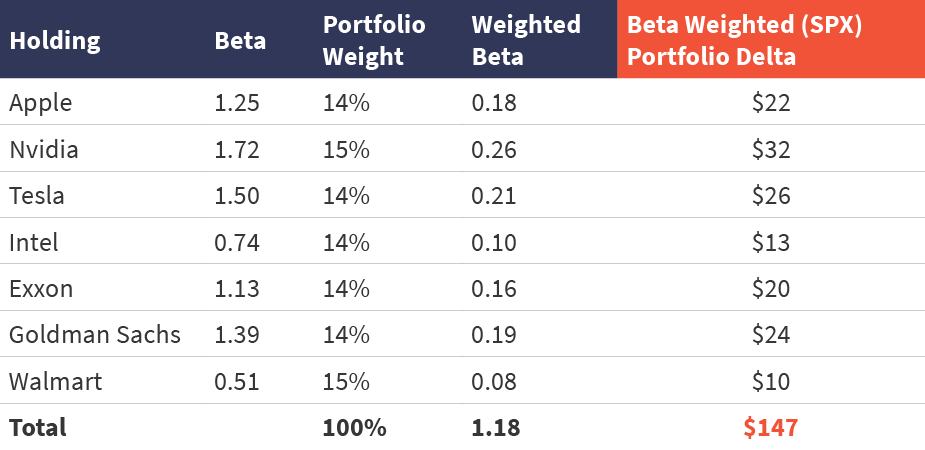

## Table of Contents

## What is the basic concept of hedging in finance?

Hedging in finance is like taking out insurance for your investments. It's a strategy that investors use to reduce the risk of losing money. Imagine you own a stock, but you're worried its value might drop because of some upcoming news. To hedge, you might buy another investment that will go up in value if the stock goes down. This way, any losses from the stock could be offset by gains from the other investment.

A common way to hedge is by using options, which are contracts that give you the right to buy or sell an asset at a set price. For example, if you own shares of a company, you could buy a put option, which allows you to sell those shares at a fixed price even if the market price drops. This can help limit your losses. Hedging doesn't eliminate risk entirely, but it can make your investments safer and more predictable.

## How do weights play a role in a hedging strategy?

Weights in a hedging strategy are like the amounts you decide to put into different parts of your plan. Imagine you're making a sandwich and you need to balance the ingredients. If you want to hedge your investments, you might choose to put more money into one type of investment and less into another. The weights tell you how much of your money goes where, helping you balance the risk and reward.

For example, if you own a stock and you're worried about its value dropping, you might decide to buy options to hedge. The weight you give to the options compared to the stock is important. If you think the stock is very risky, you might give a higher weight to the options, meaning you'll spend more money on them. This way, if the stock price falls, the options can help cover your losses. By adjusting these weights, you can fine-tune your hedging strategy to match your comfort level with risk.

## What are the common types of assets used for hedging?

Hedging often involves using different types of assets to protect against losses. One common asset for hedging is options. Options give you the right to buy or sell something at a set price in the future. For example, if you own a stock and are worried about its price dropping, you can buy a put option. This option lets you sell the stock at a fixed price, even if the market price falls. Another type of asset used for hedging is futures contracts. Futures are agreements to buy or sell an asset at a future date for a price set today. They are often used by farmers and commodity producers to lock in prices for their goods.

Another asset used for hedging is currency. If you have investments in different countries, changes in exchange rates can affect your returns. To hedge against this, you might use currency forwards or options. These financial instruments help you lock in exchange rates, reducing the risk of currency fluctuations. Stocks and bonds can also be used for hedging. For instance, if you think the stock market might go down, you could invest in bonds, which are generally safer. By balancing your portfolio with different types of assets, you can create a hedge that protects against various risks.

## Can you explain how to calculate hedging weights?

Calculating hedging weights is like figuring out how much of each ingredient to use in a recipe to balance the flavors. You need to decide how much of your money to put into the asset you want to hedge, and how much to put into the asset you're using as a hedge. For example, if you own a stock and you're worried it might lose value, you might decide to buy options to protect yourself. The weight you give to the options is how much money you're willing to spend on them compared to the stock. If you think the stock is very risky, you might give a higher weight to the options, meaning you'll spend more money on them.

To find the right weights, you need to think about how much risk you're willing to take and how much you think the stock and the options will move in value. A common way to do this is by using a formula that looks at the correlation between the stock and the options, as well as their volatility. If the stock and the options move in opposite directions a lot, you might need a smaller weight on the options to get good protection. But if they don't move together much, you might need a bigger weight on the options. It's all about finding the right balance so that if the stock goes down, the options can help cover your losses, keeping your overall investment safe.

## What is the difference between static and dynamic hedging?

Static hedging is like setting up a safety net and leaving it there. Once you put it in place, you don't change it much. For example, if you own a stock and you buy a put option to protect it, that's a static hedge. You buy the option once and then just wait to see if you need to use it. It's simple and doesn't need a lot of work after you set it up, but it might not be as good at protecting you if things change a lot over time.

Dynamic hedging, on the other hand, is more like constantly adjusting your safety net. You keep changing it to make sure it's always in the best position to catch you if you fall. If you're using dynamic hedging, you might keep buying and selling options or other assets to keep your hedge working well. This can be better at protecting you from big changes, but it takes more work and can cost more because you're always making adjustments.

## How does the choice of hedging weights affect portfolio risk?

The choice of hedging weights is like deciding how much of each ingredient to use in a recipe to balance the flavors. If you put too much of one thing and not enough of another, your dish might not taste right. Similarly, if you give too much weight to the asset you're using as a hedge, you might end up spending too much money on it, which could limit your potential gains. On the other hand, if you don't give enough weight to the hedge, you might not be protected enough if the value of your main investment goes down. It's all about finding the right balance to keep your portfolio safe without missing out on potential rewards.

Adjusting the weights in your hedging strategy can help you manage how much risk you're willing to take. If you think the market is very risky, you might want to give a higher weight to the hedge to protect your investments better. This means you'll spend more money on the hedge, but it could help you sleep better at night knowing you're more protected. If you're willing to take on more risk for the chance of higher returns, you might give a lower weight to the hedge. This way, you're not spending as much on protection, but you're also more exposed to market ups and downs. Finding the right weights is key to managing the risk in your portfolio.

## What are some common hedging strategies that utilize weights?

One common hedging strategy that uses weights is called delta hedging. Imagine you own some stock and you're worried it might lose value. To protect yourself, you can buy options. The weight you give to the options depends on something called the "delta," which tells you how much the option's price will change if the stock's price changes. If you set the weights right, the gains from the options can help cover any losses from the stock. It's like balancing a seesaw, making sure the weights on both sides are just right so it stays level no matter what happens.

Another strategy is portfolio diversification, where you spread your money across different types of investments. You might own stocks, bonds, and maybe some commodities. The weights you give to each of these investments can help you hedge against risk. For example, if you think the stock market might go down, you could give a higher weight to bonds, which are usually safer. By adjusting these weights, you can create a balance that protects your portfolio from big losses. It's like making a sandwich with different ingredients; you need to decide how much of each to use so it tastes just right and is good for you.

## How do market conditions influence the adjustment of hedging weights?

Market conditions are like the weather; they can change and affect how you plan your day. When the market is calm and steady, you might not need to change your hedging weights much. It's like when the weather is nice, you don't need to carry an umbrella. But if the market starts to get stormy, with lots of ups and downs, you might want to adjust your weights to protect your investments better. It's like putting on a raincoat when it starts to rain. If you think the market is going to be very risky, you might give more weight to your hedge to make sure you're safe.

For example, if you see that stock prices are falling a lot, you might decide to give more weight to options or bonds to protect your portfolio. It's like adding more salt to your soup if it's too bland. On the other hand, if the market seems to be doing well and you're feeling more confident, you might reduce the weight of your hedge to take advantage of potential gains. It's all about reading the market conditions and adjusting your weights to find the right balance between safety and opportunity.

## What are the mathematical models used to determine optimal hedging weights?

One common mathematical model used to determine optimal hedging weights is the Mean-Variance Optimization model. This model is like a recipe that helps you figure out how to mix your investments to get the best balance between risk and reward. It looks at how much each investment might go up or down (the variance) and how they move together (the covariance). By playing with the weights, you can find the mix that gives you the highest return for the least amount of risk. It's like trying different amounts of ingredients in a cake until you get the perfect taste without making it too sweet or too bland.

Another model is the Black-Scholes Model, which is often used for hedging with options. This model helps you figure out the price of an option and how much you should buy to protect your investments. It takes into account things like how long you have until the option expires, how much the stock price might move, and the interest rates. By using this model, you can calculate the right weights for your options so that they can help cover any losses from your stocks. It's like using a weather forecast to decide how many layers to wear so you're prepared for whatever the day brings.

## How can one evaluate the effectiveness of a hedging strategy based on weights?

Evaluating the effectiveness of a hedging strategy based on weights is like checking if your safety net is strong enough to catch you if you fall. You need to look at how well the weights you've chosen for your hedge are protecting your investments. One way to do this is by looking at the overall risk of your portfolio. If the weights are set right, your portfolio should be less risky than before you added the hedge. You can measure this by calculating the standard deviation of your portfolio's returns, which tells you how much your investments might go up or down. If the standard deviation goes down after you add the hedge, it means your weights are helping to reduce risk.

Another way to evaluate the effectiveness is by looking at how much the hedge costs you. If you're spending too much on the hedge, it might not be worth it, even if it's reducing risk. You can compare the cost of the hedge to the potential losses it's protecting you from. If the cost is less than the potential losses, then the weights are probably set well. It's like buying insurance; you want to make sure the premium you're paying is worth the protection you're getting. By looking at both the risk reduction and the cost, you can tell if your hedging weights are doing a good job of keeping your investments safe without costing too much.

## What are the advanced techniques for optimizing hedging weights in complex portfolios?

Optimizing hedging weights in complex portfolios is like fine-tuning a recipe with many ingredients. One advanced technique is using Monte Carlo simulations. This method involves running thousands of different scenarios to see how your portfolio might perform under various market conditions. By doing this, you can test different weights for your hedges and see which ones work best to reduce risk while keeping costs low. It's like trying different amounts of salt in your soup until you find the perfect balance that makes it taste just right.

Another technique is using machine learning algorithms. These can analyze huge amounts of data to find patterns and predict how different assets might move in the future. By feeding the algorithm data about your portfolio and the market, it can suggest the best weights for your hedges. This is like having a smart assistant who can look at all the ingredients in your kitchen and tell you exactly how much of each to use to make the best dish possible. Both of these techniques help you make more precise adjustments to your hedging weights, making your portfolio safer and more efficient.

## How do regulatory requirements impact the selection of hedging weights?

Regulatory requirements can change how you pick the weights for your hedges. Imagine you're making a sandwich, but there are rules about how much of each ingredient you can use. Some rules might say you can't use too much of certain ingredients, like risky investments, to protect your portfolio. This means you might need to use less of those ingredients and more of safer ones, like bonds or options, to keep your sandwich balanced and within the rules. It's all about making sure your hedging strategy follows the law while still keeping your investments safe.

These rules can also affect how much it costs to hedge your investments. If the rules make it harder to use certain types of hedges, like options or futures, you might have to pay more to get the same level of protection. It's like if the price of lettuce goes up, you might need to spend more to make your sandwich. So, when picking the weights for your hedges, you need to think about the rules and how they might change what you can do and how much it will cost. It's all about finding the right balance to keep your portfolio safe and legal.

## What is Understanding Hedging in Trading?

Hedging in trading refers to the implementation of strategies specifically designed to protect investments from the adverse effects of market fluctuations. While commonly recognized as a defensive strategy, hedging is also a strategic tool for assuming certain risks while minimizing exposure to others that are deemed undesirable. Essentially, hedging bolsters a trader's capacity to manage [volatility](/wiki/volatility-trading-strategies) and the inherent unpredictability of financial markets.

The primary objective of hedging is to identify specific risks that a trader intends to assume while concurrently eliminating those they prefer to avoid. This selective risk management is crucial as it allows traders to focus on opportunities that align with their investment goals without being overexposed to market volatilities that do not serve their strategy.

A common technique used in constructing a hedge involves taking offsetting positions in related securities. For instance, a trader holding a stock that they believe may face short-term volatility can mitigate risk by purchasing options on the same stock. These options serve as a safeguard by allowing the trader to retain potential upside gains while limiting downside losses. 

Mathematically, hedging can be expressed using the concept of expected return $E(R)$ and risk $\sigma$. The aim is to achieve a favorable balance such that:

$$
E(R_{\text{hedged}}) = E(R_{\text{portfolio}}) - E(R_{\text{hedge}})
$$

$$
\sigma_{\text{hedged}} < \sigma_{\text{portfolio}}
$$

where $R_{\text{hedged}}$ represents the return of the hedged position, $R_{\text{portfolio}}$ is the return of the original portfolio, and $R_{\text{hedge}}$ is the return from the hedge. The ultimate goal is to lower the overall risk $\sigma$ while maintaining a desirable expected return $E(R)$.

Effectively deploying hedging techniques requires an acute understanding of both the correlations between different assets and the timing of market events. This expertise is vital for implementing hedges that effectively neutralize risk while permitting the pursuit of strategic investment opportunities.

## Why is Hedging Essential in Algo Trading?

Algorithmic trading, also known as algo trading, represents a shift from traditional manual trading by utilizing computer systems to execute trades at speeds and frequencies beyond human capacity. One of the critical elements in algo trading is the management of risk, a task where hedging plays an indispensable role. 

Hedging allows traders to focus on desired risks while mitigating exposure to unwanted risks. In algebraic terms, consider a trader holding a portfolio of assets. The risk associated with this portfolio, denoted as $R$, can be decomposed into parts that the trader desires $R_d$ and those that are unwanted $R_u$. Mathematically, this can be represented as:

$$
R = R_d + R_u
$$

Hedging helps in minimizing $R_u$ while retaining or optimizing $R_d$. Through strategic hedging, traders can manage $R_u$ by taking opposing positions in selected assets or utilizing derivatives. For instance, if XYZ Corp has a strong technological edge but is susceptible to unpredictable production disruptions, a trader could use hedging to protect against the production risk while gaining from the technological advancements. This specific targeting contributes significantly to effective trading strategies, especially in volatile markets.

The art of hedging in algo trading also involves improving profitability by safeguarding against unforeseen market events. By counterbalancing potential losses with calculated hedging strategies, traders can enhance return probabilities. In practical terms, a trader could utilize futures contracts, options, or swaps to manage downside risks while maintaining exposure to favorable market movements.

Furthermore, hedging enables traders in algorithmic contexts to test and refine strategies through simulations, minimizing uncertainties and iteratively improving on risk-return profiles. By maintaining a systematic approach to risk management, traders can continually adjust their strategies based on both historical and real-time data insights, thus achieving more stable returns.

To summarize, hedging is critical in [algorithmic trading](/wiki/algorithmic-trading) for its foundational role in risk management. Traders are empowered to isolate specific risks, enhancing the effectiveness of their trading models and protecting their portfolios from unpredictable market changes. Exploring different hedging strategies can significantly bolster the success of algorithmic trading systems.

## What is Asset-Hedging in Algo Trading?

Asset-hedging is a vital component of algorithmic trading strategies, enabling traders to isolate and focus on specific risks while mitigating exposure to broader market variables. This strategy involves using alternative assets to construct a synthetic position that mimics the desired risk profile of a target asset or portfolio.

The primary goal of asset-hedging is to create a synthetic asset whose behavior can be traded upon, thus allowing traders to capitalize on particular market scenarios while minimizing the influence of undesired market factors. For instance, consider two technology companies—Stock X and Stock Y. By going long on Stock X and shorting Stock Y, traders can concentrate solely on technological disparities between the two firms. This combination isolates the technological risk [factor](/wiki/factor-investing) while curbing exposure to common market risks that typically impact both stocks.

Asset-hedging allows traders to benefit from the predictable price movements of the synthetic asset rather than volatility in the individual components. This is particularly useful in markets where certain asset pairs exhibit correlated movements or when trading on market-neutral strategies. The strategy can be mathematically represented through hedging ratios or coefficients that quantify the relative positions in the assets involved.

Mathematically, a simple hedge ratio $h$ can be calculated by the formula:

$$

h = \frac{\text{Cov}(X, Y)}{\text{Var}(Y)} 
$$

Here, $\text{Cov}(X, Y)$ represents the covariance between Stock X and Stock Y, while $\text{Var}(Y)$ is the variance of Stock Y. This ratio helps determine the appropriate proportion of shares in Stock Y to trade against Stock X to effectively hedge exposure.

Traders often employ sophisticated models and algorithms to continuously adjust these ratios based on real-time data, ensuring that the hedging strategy remains aligned with current market dynamics. This computational approach leverages [machine learning](/wiki/machine-learning) algorithms and statistical methods to enhance the precision and efficacy of hedging operations, allowing traders to swiftly exploit market inefficiencies. By strategically employing asset-hedging, traders can refine their exposure and optimize returns, mitigating potential downsides from broader market movements.

## References & Further Reading

[1]: Bergstra, J., Bardenet, R., Bengio, Y., & Kégl, B. (2011). ["Algorithms for Hyper-Parameter Optimization."](https://proceedings.neurips.cc/paper/2011/file/86e8f7ab32cfd12577bc2619bc635690-Paper.pdf) Advances in Neural Information Processing Systems 24.

[2]: ["Advances in Financial Machine Learning"](https://www.amazon.com/Advances-Financial-Machine-Learning-Marcos/dp/1119482089) by Marcos Lopez de Prado

[3]: ["Evidence-Based Technical Analysis: Applying the Scientific Method and Statistical Inference to Trading Signals"](https://www.amazon.com/Evidence-Based-Technical-Analysis-Scientific-Statistical/dp/0470008741) by David Aronson

[4]: ["Machine Learning for Algorithmic Trading"](https://github.com/stefan-jansen/machine-learning-for-trading) by Stefan Jansen

[5]: ["Quantitative Trading: How to Build Your Own Algorithmic Trading Business"](https://books.google.com/books/about/Quantitative_Trading.html?id=j70yEAAAQBAJ) by Ernest P. Chan