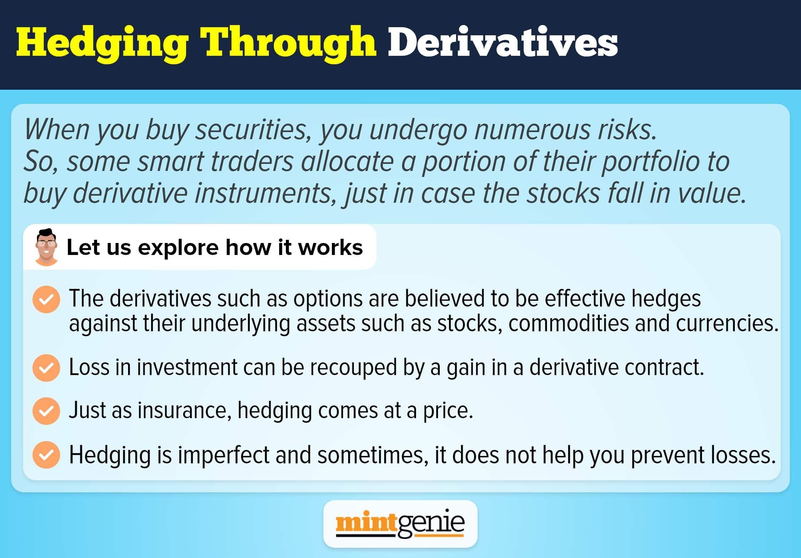

Hedging with derivatives plays a crucial role in the financial sector, where it serves as an essential risk management strategy. This technique is widely applied by traders, investors, and companies to mitigate financial risks. Algorithmic trading, which employs computer algorithms to execute trades, integrates derivative instruments to enhance hedging practices. This article examines how these derivatives, including options, futures, and swaps, are employed within the framework of algorithmic trading to manage risk.

Derivatives are financial instruments that derive their value from underlying assets, such as stocks, bonds, commodities, currencies, and indices. They are used extensively for hedging against various types of market risks, including price volatility, interest rate fluctuations, and currency exchange rate changes. By understanding the complexities of hedging, one can effectively safeguard against these uncertainties.



Algorithmic trading significantly improves the execution of hedging strategies by automating intricate processes and optimizing decision-making at high speeds. This automated approach allows for rapid responses to market changes, ensuring more precise and efficient hedging. As financial markets continue to evolve, algorithmic trading remains a vital tool for maintaining stability and achieving optimal financial outcomes.

## Table of Contents

## Understanding Hedging with Derivatives

Hedging is a crucial risk management technique that involves establishing a counterbalancing position in a related asset, with the intention of offsetting potential losses due to unfavorable market movements. This is typically achieved through the use of financial instruments known as derivatives. Derivatives are contracts whose value is contingent on the price of an underlying asset. The underlying assets can encompass a wide range of categories, including stocks, bonds, commodities, currencies, and indices. 

The primary derivatives used for hedging purposes are futures, options, forwards, and swaps. Each of these instruments plays a significant role in mitigating financial risks associated with market volatility.

1. **Futures**: Contracts obligating the transaction of an asset at a predetermined future date and price. Futures are standardized and traded on exchanges, making them a popular choice for hedging commodity price risks.

2. **Options**: Contracts granting the right, but not the obligation, to buy or sell an asset at a specified price before a predetermined expiration date. Options are versatile tools for managing risks in equity and foreign exchange markets, as they provide flexibility and a defined risk exposure.

3. **Forwards**: Similar to futures, forwards are contracts for an asset transaction at a set future date and price. However, forwards are customizable and traded over-the-counter, allowing parties to tailor the contract terms to hedge specific exposures, such as foreign currency fluctuations.

4. **Swaps**: These are agreements between two parties to exchange cash flows or financial instruments over a specified period. Swaps are commonly used to hedge interest rate and currency risks, providing organizations with a mechanism to stabilize cash flow against variable market conditions.

In [algorithmic trading](/wiki/algorithmic-trading), these derivatives are integral to implementing hedging strategies efficiently. The ability to automate and optimize the execution of complex derivative-based strategies ensures that firms can effectively manage risk in fast-moving markets. Algorithms can quickly adjust hedging positions in response to market data, thereby enhancing the robustness and responsiveness of the risk management process.

Mathematically, a simple hedging strategy using options may involve calculating the option's delta—a measure of how much the option price is expected to move for a $1 change in the price of the underlying asset. For instance, in a Python implementation, such a calculation might be performed using libraries like `numpy` and `scipy` to handle the necessary statistical computations.

```python
import numpy as np
from scipy.stats import norm

def calculate_option_delta(S, K, T, r, sigma, option_type='call'):
    d1 = (np.log(S / K) + (r + 0.5 * sigma**2) * T) / (sigma * np.sqrt(T))

    if option_type == 'call':
        delta = norm.cdf(d1)
    elif option_type == 'put':
        delta = norm.cdf(d1) - 1
    else:
        raise ValueError("option_type must be 'call' or 'put'")

    return delta

# Example usage
S = 100  # current stock price
K = 100  # option strike price
T = 1    # time to expiration in years
r = 0.05 # risk-free interest rate
sigma = 0.2 # volatility

print(f"Call Option Delta: {calculate_option_delta(S, K, T, r, sigma, 'call')}")
```

In practice, robust implementation of hedging methodologies requires a comprehensive understanding of financial markets, adept use of derivative instruments, and the integration of algorithmic tools to adapt to ever-changing market conditions.

## Types of Derivatives and Their Role in Hedging

Futures contracts, options, forward contracts, and swaps play critical roles in hedging strategies within the financial markets. Each of these derivative instruments has unique characteristics that offer distinct advantages for managing risks associated with market fluctuations.

Futures contracts are standardized agreements to purchase or sell an asset at a specified future date and price. These contracts are traded on exchanges and are primarily used to hedge against price risks. For example, a wheat farmer can lock in a selling price for their crop through futures contracts, mitigating the potential financial impact of a price decline at harvest.

Options differ from futures in that they grant the right, but not the obligation, to buy or sell an asset at a predetermined price prior to expiration. This flexibility is particularly beneficial in equity and currency markets, where price [volatility](/wiki/volatility-trading-strategies) can be substantial. Call options allow the holder to purchase the asset, while put options provide the option to sell. The strategic use of options can limit potential losses while allowing participation in favorable price movements.

Forward contracts share similarities with futures but are tailored agreements conducted over-the-counter (OTC), making them highly customizable. Forward contracts are instrumental in hedging specific risks such as currency fluctuations for corporations with international operations. A company expecting to receive foreign currency at a future date can enter into a forward contract to sell that currency and secure a known exchange rate, thus stabilizing cash flows.

Swaps, on the other hand, enable entities to exchange cash flows or financial instruments, typically employed for hedging [interest rate](/wiki/interest-rate-trading-strategies) and currency risks. In an interest rate swap, parties exchange fixed-rate and floating-rate interest payments to manage exposure to interest rate changes. For instance, a company with a variable rate loan might exchange its variable payments for fixed payments, thus insulating itself from rising interest rates.

The effective application of these derivatives within hedging strategies requires a deep understanding of market conditions and the specific risks faced by the hedger. Through careful selection and execution of these instruments, market participants can effectively manage financial exposures and achieve more predictable financial results.

## Algorithmic Hedging Strategies

Algorithmic hedging strategies leverage various techniques to mitigate financial risks associated with price changes, ensuring the stability of investment portfolios. 

Delta hedging is a strategy focused on balancing the delta of a portfolio. Delta measures the sensitivity of the portfolio's value to changes in the price of an underlying asset. By constantly adjusting the positions in underlying assets or options, delta hedging aims to maintain a delta-neutral position, thereby minimizing the impact of minor price fluctuations. In mathematical terms, the delta ($\Delta$) of an option is defined as the partial derivative of its price ($V$) with respect to the price of the underlying asset ($S$), expressed as:

$$
\Delta = \frac{\partial V}{\partial S}
$$

Statistical [arbitrage](/wiki/arbitrage) is an advanced trading strategy that identifies and exploits pricing inefficiencies in the market. Using mathematical models and statistical techniques, traders seek to ensure market neutrality by buying undervalued securities while short-selling overvalued ones. This practice relies heavily on computational algorithms to analyze large datasets, optimizing entry and [exit](/wiki/exit-strategy) points to achieve consistent profits despite market volatility.

Pairs trading involves opening simultaneous long and short positions in two correlated securities. The fundamental assumption here is that the prices of these securities will eventually revert to their historical correlation, allowing traders to profit from the convergence. The strategy requires meticulous statistical analysis to identify suitable pairs and is typically executed using automated systems to capitalize on fleeting opportunities.

Mean reversion is based on the hypothesis that asset prices fluctuate around a historical average or mean over time. Mean reversion strategies predict that extreme movements will eventually return to average levels, and trades are thus executed anticipating this reversion. By buying assets when their prices dip below the mean and selling when they rise above it, traders can exploit temporary anomalies, typically executing these strategies using algorithmic models to monitor and predict price movements.

Volatility trading focuses on the variability of asset prices rather than the price levels themselves. Traders employing this strategy utilize derivatives like options to bet on changes in volatility, often ignoring market direction. Through options like straddles and strangles, volatility trading enables the capture of profits from the magnitude of price movements rather than directional trends, making it a valuable tool for hedging against unpredictable market swings. 

Collectively, these algorithmic hedging strategies harness mathematical models, computational power, and statistical data to mitigate risks and optimize returns in dynamic financial markets.

## Technologies and Tools in Algorithmic Hedging

Algorithmic hedging employs a range of advanced technologies and tools to optimize financial risk management processes. Automated trading platforms and sophisticated risk management software form the backbone of these systems, enhancing both the efficiency of trade executions and the accuracy of risk assessments. These platforms use high-speed algorithms that process vast amounts of market data in real-time, allowing traders to respond swiftly to changing market conditions.

Application Programming Interfaces (APIs) play a crucial role in algorithmic hedging by enabling seamless integration with brokerage services. This integration allows the execution of complex hedging strategies programmatically, without manual intervention, thereby increasing the speed and consistency of trades. APIs facilitate communication between trading algorithms and execution venues, ensuring that algorithmic strategies are carried out precisely and efficiently.

Machine learning and [artificial intelligence](/wiki/ai-artificial-intelligence) (AI) are at the forefront of advancements in algorithmic hedging. These technologies contribute to improved prediction of market behaviors by analyzing historical data and identifying patterns that may indicate future price movements. AI-driven models can adapt to dynamic market conditions, enhancing the decision-making capabilities of algorithmic trading systems. For instance, [machine learning](/wiki/machine-learning) algorithms can be used to forecast volatility, identify arbitrage opportunities, and optimize the rebalancing of hedging positions.

Python, R, and MATLAB are essential quantitative research tools in the development, testing, and optimization of hedging models. Python, renowned for its versatility and extensive libraries like NumPy, pandas, and scikit-learn, facilitates data manipulation, statistical analysis, and machine learning. R is widely used for statistical computing and graphical representation, making it valuable for modeling and visualizing complex data sets. MATLAB provides a robust environment for numerical computation, enabling the simulation and [backtesting](/wiki/backtesting) of trading algorithms.

In practice, algorithmic hedging models leverage these tools to simulate various market scenarios and assess the potential impact on hedging strategies. Model validation and stress testing are crucial steps in ensuring the reliability and robustness of these strategies. By deploying sophisticated simulations, traders can gauge the effectiveness of their hedging approach under different market conditions and refine their models accordingly.

Overall, the integration of advanced technologies and quantitative tools in algorithmic hedging not only improves the precision and reliability of risk management strategies but also positions traders to capitalize on emerging opportunities in volatile markets. As these technologies continue to evolve, their role in shaping the future of financial risk management will likely expand, offering more sophisticated ways to manage and mitigate risks.

## Practical Applications and Real-World Examples

Commodity trading firms play a critical role in the global market, where the value of raw materials is subject to significant fluctuations. These firms employ hedging strategies by using derivatives, primarily futures contracts, to lock in prices for their raw materials. By doing so, firms can prevent adverse effects caused by price volatility, thereby ensuring better financial stability. For instance, an oil trading company may enter into a futures contract to sell oil at a predetermined price, safeguarding against potential declines in oil prices.

Financial institutions, such as banks and investment firms, integrate algorithmic hedging strategies to mitigate market risks in their portfolios. By leveraging derivatives like options and swaps, these institutions can manage exposure to various risk factors, including interest rate changes and market volatility. Algorithmic strategies enhance the efficiency of this process, allowing for real-time adjustments to hedge positions as market conditions evolve. This proactive approach is crucial in maintaining portfolio stability and achieving optimal financial performance.

Hedge funds are known for their sophisticated use of mathematical models and trading algorithms. These tools are employed not only for hedging purposes but also for speculative opportunities. Hedge funds may construct complex strategies involving a combination of options, futures, and swaps to exploit market inefficiencies. Such strategies often rely on methodologies like [statistical arbitrage](/wiki/statistical-arbitrage) and volatility trading, which require rigorous quantitative analysis and fast execution to capitalize on fleeting market opportunities.

Multinational corporations face constant challenges from currency exchange rate fluctuations, which can significantly impact their cash flows. To mitigate this risk, these corporations utilize derivatives like forward contracts and currency swaps. By entering into a forward contract, a corporation can lock in an exchange rate for future transactions, reducing the uncertainty of currency movements. This approach helps stabilize cash flows, ensuring that international operations remain financially viable despite external economic conditions.

Overall, the practical application of hedging through derivatives is indispensable for a wide range of entities in managing financial risks. Whether securing raw material prices, stabilizing investment portfolios, seizing market opportunities, or stabilizing currency movements, derivatives serve as vital instruments in achieving financial resilience.

## Challenges and Future Directions

Algorithmic hedging, integral to contemporary financial risk management, confronts several notable challenges that necessitate strategic foresight and technical agility. One primary challenge is the fast-paced evolution of market dynamics, where shifts in economic conditions, regulatory changes, and geopolitical events can significantly influence asset prices and volatility. As algorithmic systems are heavily reliant on historical data to forecast future market behaviors, ensuring the data's quality and relevance becomes crucial. Poor data quality or outdated information can lead to erroneous predictions and suboptimal trading decisions, undermining the efficacy of hedging strategies.

The advent of emerging technologies such as quantum computing holds the potential for revolutionary advances in algorithmic trading and hedging methodologies. Quantum computing can process complex computations at unparalleled speeds, which may significantly enhance the optimization of trading algorithms and the management of risk portfolios. This technology could facilitate the implementation of more sophisticated models that account for intricate market variables, potentially leading to a competitive edge for early adopters.

Ethical considerations are increasingly prominent as algorithmic trading systems become more entrenched in financial markets. Ensuring market fairness and transparency is critical to maintaining investor trust and the integrity of market operations. Algorithmic systems must be designed to avoid manipulative practices and ensure compliance with regulatory standards. There is a growing mandate for financial institutions to employ algorithmic strategies that are not only effective but also ethically sound, balancing profitability with responsibility.

Looking ahead, the continuous adaptation and innovation of hedging strategies are imperative to sustaining financial resilience amid volatile markets. As algorithms and markets evolve, there is an increasing need for strategies that can dynamically adjust to changing conditions and incorporate new technological capabilities. Financial entities must invest in ongoing research and development to refine and develop hedging models that are robust against a backdrop of uncertainty and complexity. Embracing cutting-edge technology and fostering a culture of ethical responsibility will be pivotal in shaping the future landscape of algorithmic hedging practices.

## Conclusion

Hedging with derivatives through algorithmic trading is a critical risk management practice in modern finance. This approach enables organizations and individuals to stabilize returns and secure costs amidst the unpredictable nature of financial markets. By effectively using derivatives such as options, futures, and swaps, traders can mitigate risks related to price volatility, interest rates, and currency fluctuations.

A comprehensive understanding of these financial instruments and the development of robust hedging strategies are key to optimizing financial outcomes. Algorithmic trading enhances this process by automating decision-making and refining execution speeds, allowing for precise and efficient management of financial risks. This not only aids in avoiding potential losses but also in capitalizing on market opportunities.

As financial markets continue to evolve, with rapid advancements in technology and changes in market dynamics, continuous improvement and innovation in hedging strategies are paramount. Emerging technologies, such as AI and quantum computing, hold the potential to further revolutionize algorithmic trading, offering more sophisticated tools for risk management. Maintaining adaptability and foresight in these strategies will be essential for achieving sustainable financial success in ever-changing market conditions.

## References & Further Reading

[1]: Hull, J. C. (2017). ["Options, Futures, and Other Derivatives"](https://elibrary.pearson.de/book/99.150005/9781292212920). Pearson Education.

[2]: Black, F., & Scholes, M. (1973). ["The Pricing of Options and Corporate Liabilities."](https://www.cs.princeton.edu/courses/archive/fall09/cos323/papers/black_scholes73.pdf) Journal of Political Economy, 81(3), 637-654.

[3]: Luenberger, D. G. (1997). ["Investment Science."](https://www.amazon.com/Investment-Science-David-G-Luenberger/dp/0199740089) Oxford University Press.

[4]: ["Advances in Financial Machine Learning"](https://www.amazon.com/Advances-Financial-Machine-Learning-Marcos/dp/1119482089) by Marcos Lopez de Prado

[5]: Chan, E. P. (2008). ["Quantitative Trading: How to Build Your Own Algorithmic Trading Business."](https://github.com/ftvision/quant_trading_echan_book) John Wiley & Sons.

[6]: Jorion, P. (2007). ["Value at Risk: The New Benchmark for Managing Financial Risk."](https://link.springer.com/article/10.1007/s11408-007-0057-3) McGraw-Hill Education.

[7]: Hull, J. C. (2018). ["Risk Management and Financial Institutions."](https://books.google.com/books/about/Risk_Management_and_Financial_Institutio.html?id=1J1QDwAAQBAJ) Wiley Finance.