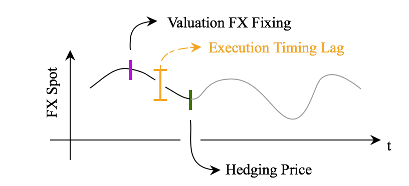

In the fast-evolving world of trading, hedging has emerged as a critical strategy to manage risk and enhance returns. Hedging involves taking a position in a related asset to offset potential losses, ensuring that the undesired risks are minimized. This strategy serves as a protective mechanism, allowing traders to shield their portfolios against adverse market movements by creating a counterbalancing position. The essence of hedging lies in its ability to maintain desired exposure while mitigating unwanted risks, thus enabling traders to maneuver through fluctuating market conditions with increased security.

Execution algorithms, or algo trading, play a pivotal role in optimizing the execution of hedging strategies, refining them for better market responsiveness. These algorithms facilitate the efficient and precise execution of trades by automating decision-making processes based on real-time data analysis. They ensure that large trades are executed with minimal market impact, utilizing strategies like volume-weighted average price (VWAP) and time-weighted average price (TWAP) to time the trades optimally. This technological edge allows traders to navigate complex markets, balancing risk and return with agility and precision.



Applying execution algorithms to hedging strategies can revolutionize trading approaches by providing enhanced control and adaptability to market conditions. As the trading landscape becomes increasingly sophisticated, the integration of these algorithms into hedging practices offers a path to optimizing returns while safeguarding positions against unpredictable market volatilities. As technology progresses, the ability to harness these advancements becomes imperative for traders aiming to capitalize on opportunities and mitigate risks effectively.

## Table of Contents

## Understanding Hedging in Trading

Hedging is a fundamental risk management strategy employed in trading to reduce exposure to unforeseen adverse price movements while preserving desired investment returns. At its core, hedging mitigates unwanted risks by taking offsetting positions in securities or derivatives related to an underlying asset. The primary objective is to create a more stable financial outlook by balancing potential losses with gains.

Traditionally, hedging is viewed as a defensive measure, akin to purchasing insurance for an investment portfolio. However, when applied strategically, it can also serve as an offensive tactic. By anticipating and targeting particular market opportunities, traders can employ hedging not only to protect investments but also to potentially enhance returns. This dual nature requires a thorough comprehension of market conditions and the strategic implementation of hedging methods.

Among the techniques employed in hedging are asset-hedging and time-hedging. Asset-hedging involves taking positions in assets that are negatively correlated with the investments at risk. For instance, if a trader anticipates a downturn in the energy market, they might offset potential losses in energy stocks by investing in other sectors or derivatives that rise when energy sector value declines. This approach effectively isolates and manages specific risks associated with asset price movements.

Time-hedging, on the other hand, focuses on the temporal aspect of trades. It involves timing the execution of trades to mitigate the adverse effects of price fluctuations at specific times. By strategically determining when to enter or [exit](/wiki/exit-strategy) a market, traders can avoid peak periods of [volatility](/wiki/volatility-trading-strategies), reducing the overall risk exposure. Timing strategies can be critical during events like earnings announcements or geopolitical developments that might cause sharp market movements. 

The cornerstone of successful hedging lies in understanding the intricate dynamics of the market and making informed decisions about which risks to mitigate. This requires continuous assessment of both the macroeconomic environment and asset-specific factors. Effective hedging also relies on data analytics to predict how various factors might impact asset prices and market movements. 

Overall, hedging is an essential practice for traders seeking to manage risk and optimize returns. It demands a nuanced understanding of market dynamics and a strategic approach to isolating and balancing different types of risk.

## The Role of Execution Algorithms in Hedging

Execution algorithms play a vital role in hedging by managing the execution of large orders to minimize market impact. This optimization is crucial for effective hedging, where precision and timing can significantly influence the outcome of risk management strategies.

### Algorithms for Trade Execution

Among the most commonly used execution algorithms are Volume Weighted Average Price (VWAP), Time Weighted Average Price (TWAP), and Implementation Shortfall (IS). Each of these algorithms serves a specific purpose:

1. **VWAP**: This algorithm aims to execute trades close to the average price weighted by volume over a given time period. VWAP is widely used by traders seeking to minimize market impact, as it spreads trades throughout the day, matching the natural market liquidity.

2. **TWAP**: TWAP divides a large order into equally-sized portions that are executed at regular intervals over a specified timeframe. This method is particularly useful when market conditions are unpredictable, as it prevents substantial price movement in response to large trades.

3. **IS (Implementation Shortfall)**: This algorithm minimizes the gap between the decision price and the final execution price. By focusing on the cost incurred due to market movement and trade execution, IS seeks to optimize the cost-effectiveness of the trading strategy.

### Automation and Real-time Data

The application of execution algorithms is enhanced through automation and real-time data analysis. Automated trading systems can continuously monitor market conditions and execute trades with high precision, adjusting strategies dynamically in response to changing variables. This capability ensures that hedging strategies are not only executed efficiently but are also responsive to real-time market conditions.

### Optimizing Hedging with Technology

Algorithmic trading integrates vast amounts of data, applying complex calculations to decide the optimal timing and size of trades within milliseconds. This precision minimizes slippage, the difference between expected and actual trade prices, thereby reducing the overall cost of hedging.

For instance, using Python, traders can leverage libraries such as `pandas` and `numpy` to analyze historical price data, while `scikit-learn` can help in creating predictive models to enhance decision-making. Here is a simple example of how Python can be used for a basic VWAP calculation:

```python
import numpy as np
import pandas as pd

# Example stock price and volume data
data = {
    'price': [100, 102, 101, 103, 105],
    'volume': [200, 180, 240, 300, 260]
}

df = pd.DataFrame(data)
df['VWAP'] = (df['price'] * df['volume']).cumsum() / df['volume'].cumsum()

print(df['VWAP'])
```

In this snippet, the VWAP is calculated by cumulatively summing the product of price and [volume](/wiki/volume-trading-strategy), then dividing by the cumulative volume. Such calculations can be scaled up to accommodate real-time trading environments, integrating live data feeds to provide ongoing execution guidance.

### Conclusion

Execution algorithms are indispensable in modern trading, offering precision and efficiency in executing hedging strategies. By using these tools, traders can substantially reduce market impact and optimize trading outcomes, thereby enhancing their ability to manage risk effectively. As algorithmic technology continues to develop, its role in hedging will undoubtedly expand, providing further opportunities for traders to refine their approaches to market uncertainties.

## Strategies for Asset-Hedging with Algorithms

Asset-hedging is a trading strategy that reduces risk by taking opposing positions in assets with correlated price movements. This often results in the creation of synthetic portfolios designed to balance exposure and exploit market inefficiencies. Execution algorithms play an essential role in this process by ensuring precise and timely execution of trades, thereby optimizing outcomes.

Pair trading is a popular asset-hedging strategy where a trader identifies two historically correlated assets. When the correlation deviates, the trader can buy the underperforming asset and sell the overperforming one, betting on the convergence of their prices. Execution algorithms can manage these trades efficiently by analyzing real-time data to identify entry and exit points, ensuring minimal market impact and reduced transaction costs.

Statistical [arbitrage](/wiki/arbitrage) is another sophisticated form of asset-hedging. It involves using quantitative models to identify and exploit relative mispricings between securities. The models often employ statistical and econometric techniques to predict price movements and generate trading signals. Execution algorithms can execute trades based on these signals at optimal times, with algorithms like Volume Weighted Average Price (VWAP) and Time Weighted Average Price (TWAP) managing trade size and timing to maximize profitability.

The creation and management of synthetic assets are crucial for fully leveraging the benefits of asset-hedging. Synthetic assets replicate the cash flows and risks of traditional assets through derivatives and other financial instruments. Algorithms facilitate this replication process by dynamically adjusting positions to mirror the target asset's payoff. For instance, Delta-neutral strategies in options trading aim to balance the portfolio's Delta (rate of change of an option's value) to zero, minimizing the effects of price changes. Algorithms can continuously monitor and adjust the portfolio to maintain this neutrality as market conditions evolve.

In conclusion, execution algorithms are integral to the efficient functioning of asset-hedging strategies. By optimizing the execution of trades and the management of synthetic portfolios, they enable traders to capitalize on mispricings while managing risks effectively.

## Time-Hedging and Its Application in Algo Trading

Time-hedging is a strategic approach in trading that focuses on minimizing risk by carefully selecting the timing of trade executions. This method is particularly potent when combined with execution algorithms, which are designed to analyze market conditions in real-time and determine the most advantageous moments to initiate or close a trade. By leveraging these algorithms, traders can enhance their ability to mitigate time-related risks and optimize returns.

Execution algorithms play a crucial role in time-hedging by utilizing data-driven insights to pinpoint optimal entry and exit points. These algorithms analyze market variables such as price volatility, trading volume, and [liquidity](/wiki/liquidity-risk-premium) to make informed decisions. For example, algorithms like Volume Weighted Average Price (VWAP) and Time Weighted Average Price (TWAP) are employed to ensure trades are executed gradually over a set time frame, thus reducing market impact and slippage.

Time-hedging proves particularly advantageous in scenarios where market conditions are highly dynamic, such as around earnings announcements or during periods of significant economic data releases. In these situations, the market can experience heightened volatility, making timing crucial to avoid adverse price movements. By strategically timing trades, traders can shield their portfolios from the negative effects of such volatility while potentially capitalizing on price fluctuations.

Algorithms facilitate the time-hedging process by automating the execution of trades based on predefined conditions. For instance, Python code can be used to implement a simple VWAP strategy. Here is a basic example:

```python
import pandas as pd

def execute_vwap_strategy(data):
    data['cumulative_volume'] = data['volume'].cumsum()
    data['cumulative_vol_price'] = (data['price'] * data['volume']).cumsum()
    data['vwap'] = data['cumulative_vol_price'] / data['cumulative_volume']

    buy_signal = data['price'] < data['vwap']
    return buy_signal

# Example data
data = pd.DataFrame({
    'price': [101, 102, 103, 104, 105],
    'volume': [200, 220, 250, 280, 300]
})

buy_signals = execute_vwap_strategy(data)
print(buy_signals)
```

In this code snippet, the VWAP is calculated, and a buy signal is generated when the current price is below the VWAP, indicating a potentially favorable entry point.

Time-hedging can also be effectively applied to seasonal patterns, where certain times of the year are known to influence asset prices. For instance, some stocks may exhibit predictable price behavior at the end of fiscal quarters. By applying execution algorithms, traders can systematically exploit these patterns to enhance investment outcomes.

In conclusion, time-hedging is an essential tactic in modern algo trading, allowing traders to navigate complex market environments with enhanced precision. Through the integration of execution algorithms, traders are empowered to make informed decisions that align with both their risk tolerance and profit objectives, ultimately contributing to more robust trading strategies.

## Challenges and Considerations in Hedging with Algorithms

Executing hedging strategies through algorithms presents a multifaceted challenge that requires a careful equilibrium between various factors, such as market conditions, execution speed, and technological infrastructure. These factors play a critical role in the success of algorithmically-driven hedging operations and must be considered judiciously.

One of the primary considerations is the order size. Large orders can significantly impact market prices, leading to slippage that erodes potential gains or amplifies losses. Algorithms must be designed to fragment large orders into smaller, more manageable pieces to mitigate market impact. This approach is in line with execution algorithms such as Volume Weighted Average Price (VWAP) and Time Weighted Average Price (TWAP), which aim to execute orders that align with the market's natural liquidity flow.

Furthermore, the infrastructure supporting [algorithmic trading](/wiki/algorithmic-trading) is of paramount importance. High-frequency trading requires robust and low-latency systems that can swiftly react to market changes. The quality of the trading infrastructure, including hardware, network latency, and data processing capabilities, directly affects an algorithm's performance. Traders must ensure that their infrastructure not only meets the demands of high-speed execution but also provides the reliability needed to handle market volatilities.

In addition to technical considerations, regulatory compliance is a significant concern when employing algorithms for hedging. Different jurisdictions have varied regulations governing algorithmic trading, requiring traders to stay informed of legal changes to avoid potential penalties. Ensuring that algorithms comply with market regulations, such as those set by the Securities and Exchange Commission (SEC) in the United States or the Markets in Financial Instruments Directive (MiFID II) in the European Union, is essential for maintaining legal and operational integrity.

While algorithms provide precision and speed, they require ongoing monitoring and adjustment to adapt to ever-changing market conditions. This need for dynamic responsiveness poses a challenge, as algorithms must be regularly updated and refined to incorporate new market insights and anomalies. Machine learning and other advanced analytical techniques can enhance an algorithm’s adaptability by enabling it to learn from past data and predict future market behaviors.

Common challenges faced by traders include the risk of algorithmic errors, such as coding bugs or unexpected market manipulations, which can lead to significant financial losses. To navigate these challenges, traders can implement rigorous testing protocols, such as [backtesting](/wiki/backtesting) historical data, and deploy real-time monitoring systems to detect anomalies early. Moreover, employing a hybrid approach that combines algorithmic execution with human oversight can provide an additional layer of security and decision-making strength.

Ultimately, optimizing hedging strategies using execution algorithms involves a continuous cycle of development, testing, and refinement. By understanding and addressing the challenges associated with algorithmic hedging, traders can improve the accuracy and efficiency of their hedging operations, allowing them to capitalize on market opportunities while minimizing risks.

## Conclusion

Hedging with execution algorithms represents a sophisticated approach to risk management and trade optimization in modern trading. This method merges advanced technology with strategic planning, allowing traders to perform hedging operations with increased efficiency and responsiveness. Execution algorithms, which arc systematically designed to analyze vast amounts of market data in real-time, provide traders with the ability to implement hedging strategies more precisely, thus reducing exposure to potential risks and improving trade outcomes.

As technology continues its rapid advancement, we can anticipate significant developments in the functionality and capability of execution algorithms. These advancements may introduce new opportunities for traders, enabling them to further refine their strategies and adapt to evolving market conditions with agility and precision. Sophisticated algorithms could provide deeper insights into market trends and offer predictive capabilities that were previously unattainable, thereby opening up new avenues for optimizing hedging processes.

Traders who master the utilization of execution algorithms for hedging are better positioned to capitalize on market opportunities while efficiently managing risks. This mastery involves not just understanding the algorithms themselves but also maintaining adaptability to integrate new technological developments and market strategies. By staying at the forefront of technological integration in trading practices, traders can enhance their decision-making processes and sustain a competitive edge in the financial markets. As such, these individuals or firms are likely to experience greater success in minimizing potential losses and capitalizing on profitable opportunities, thus achieving a more robust and resilient trading strategy.

## References & Further Reading

[1]: Chan, E. P. (2013). ["Algorithmic Trading: Winning Strategies and Their Rationale."](https://github.com/ftvision/quant_trading_echan_book) Wiley.

[2]: Lillo, F., Farmer, J. D., & Mantegna, R. N. (2003). ["Master curve for price-impact function."](https://www.nature.com/articles/421129a) Nature, 421(6919), 129-130.

[3]: Cartea, Á., Jaimungal, S., & Peñaranda, F. (2015). ["Algorithmic and High-Frequency Trading."](https://assets.cambridge.org/97811070/91146/frontmatter/9781107091146_frontmatter.pdf) Cambridge University Press.

[4]: Kissell, R. (2013). ["The Science of Algorithmic Trading and Portfolio Management."](https://www.sciencedirect.com/book/9780124016897/the-science-of-algorithmic-trading-and-portfolio-management) Academic Press.

[5]: Lopez de Prado, M. (2018). ["Advances in Financial Machine Learning."](https://www.amazon.com/Advances-Financial-Machine-Learning-Marcos/dp/1119482089) Wiley.

[6]: Aldridge, I. (2013). ["High-Frequency Trading: A Practical Guide to Algorithmic Strategies and Trading Systems."](https://onlinelibrary.wiley.com/doi/pdf/10.1002/9781119203803.fmatter) Wiley.

[7]: Narang, R. K. (2013). ["Inside the Black Box: A Simple Guide to Quantitative and High-Frequency Trading."](https://onlinelibrary.wiley.com/doi/book/10.1002/9781118662717) Wiley.