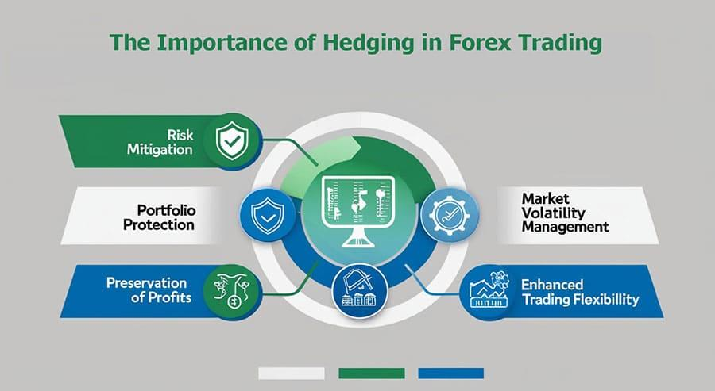

## Table of Contents

## What is hedging and why is it important in trading?

Hedging is like buying insurance for your investments. It's a way to protect yourself from losing too much money if things don't go as planned in the market. When you hedge, you make another investment that will gain value if your main investment loses value. This helps balance out your losses and keeps your overall financial situation more stable.

Hedging is important in trading because it helps manage risk. The financial markets can be unpredictable, and prices can change quickly. By using hedging strategies, traders can feel more secure knowing they have a backup plan. This can give them the confidence to make bolder investment decisions, knowing they have some protection in place if the market moves against them.

## What are execution algorithms and how do they work?

Execution algorithms are like smart helpers that traders use to buy or sell things in the market. They follow a set of rules to decide when and how to make these trades. This helps traders get the best price possible without causing too much fuss in the market. Imagine you want to sell a lot of apples at the market, but you don't want to drop the price too quickly. An execution algorithm would help you sell those apples slowly and carefully, so you get a good price for them.

These algorithms work by breaking big orders into smaller ones. Instead of selling all your apples at once, the algorithm might sell a few apples at a time. It looks at the current market prices and decides the best times to sell these smaller chunks. This way, it can keep the price stable and avoid scaring off other buyers. It's like sneaking the apples onto the market without anyone noticing too much, making sure you get a fair deal for each one.

## How can execution algorithms be used for hedging purposes?

Execution algorithms can help with hedging by making it easier to buy or sell things that protect your main investment. Imagine you own a lot of apples and you're worried the price might drop. You could use an execution algorithm to slowly buy oranges, which go up in price when apples go down. The algorithm would break your big order into small pieces and spread them out over time, so you don't affect the orange market too much. This way, if apple prices fall, the money you make from oranges can help cover your losses.

These algorithms are smart because they can watch the market and decide the best times to make trades. They look at things like how many oranges are being bought and sold right now and what the current prices are. By doing this, they can find the best moments to buy or sell, making sure you get a good deal on your oranges. This helps you hedge your apple investment without causing big changes in the orange market, keeping everything smooth and balanced.

## What are the basic types of hedging strategies that can be implemented using execution algorithms?

One basic type of hedging strategy that can be implemented using execution algorithms is the use of futures contracts. Imagine you own a lot of apples and you're worried their price might drop. You can use an execution algorithm to slowly buy futures contracts for oranges. These contracts promise to buy oranges at a set price in the future. If apple prices fall, the money you make from the oranges can help cover your losses. The algorithm breaks down your big order into smaller ones and spreads them out over time, so you don't affect the orange futures market too much.

Another common strategy is using options. Options give you the right, but not the obligation, to buy or sell something at a set price. If you're worried about your apples losing value, you can use an execution algorithm to buy put options on apples. This means you can sell your apples at a set price even if the market price drops. The algorithm will look at the market and decide the best times to buy these options, making sure you get a good deal. This way, you can protect your apple investment without causing big changes in the options market.

A third strategy involves using pairs trading. This is when you buy one thing and sell another thing that usually moves in the opposite direction. For example, if you own apples, you might sell oranges. If apple prices go down, orange prices usually go up, balancing out your losses. An execution algorithm can help you do this by carefully buying apples and selling oranges at the right times. It looks at the market and makes sure your trades don't cause too much disturbance, keeping everything smooth and helping you hedge your investment effectively.

## How do execution algorithms help in reducing the cost of hedging?

Execution algorithms help reduce the cost of hedging by breaking down big orders into smaller ones. Imagine you want to buy a lot of oranges to hedge against your apples. If you try to buy all the oranges at once, you might push the price up, making your hedge more expensive. But, an execution algorithm will buy the oranges little by little. This way, it doesn't affect the price much, and you end up paying less for your oranges. It's like sneaking into the market without causing a big splash, so you can get a better deal.

These algorithms also look at the market to find the best times to make trades. They check how many oranges are being bought and sold right now and what the current prices are. By doing this, they can buy your oranges when the price is low, saving you money. It's like waiting for a sale before you buy something. This careful timing helps keep your hedging costs down, making your overall investment strategy more efficient and less risky.

## What are the key factors to consider when selecting an execution algorithm for hedging?

When [picking](/wiki/asset-class-picking) an execution algorithm for hedging, you need to think about how fast it works. Some algorithms are quick and can make trades right away, while others take their time and spread trades out over a longer period. If you want to protect your investment quickly, you might choose a fast algorithm. But if you're worried about affecting the market too much, a slower one might be better. It's all about finding the right balance between speed and keeping the market calm.

Another thing to consider is how the algorithm decides when to make trades. Good algorithms look at things like current market prices and how many people are buying and selling. They use this information to find the best times to buy or sell, so you get a good deal on your hedge. You want an algorithm that's smart and can adapt to what's happening in the market. This way, it can help you hedge without spending too much money.

## How do different market conditions affect the performance of hedging with execution algorithms?

Different market conditions can really change how well hedging works when you use execution algorithms. When the market is calm and prices aren't moving around much, these algorithms can work really well. They can slowly buy or sell things to hedge your investments without causing big changes in the market. This helps you get a good deal and keep your costs down. But if the market is calm, you might not need to hedge as much because things are stable, so the algorithm might not be as busy.

On the other hand, when the market is wild and prices are jumping all over the place, using execution algorithms for hedging can be trickier. The algorithms have to work harder to find the right times to make trades. If prices are changing quickly, the algorithm might not be able to buy or sell at the best prices, which can make your hedge more expensive. But, if you're worried about big losses because the market is so unpredictable, a good algorithm can still help protect your investment by carefully making trades even in tough conditions.

## What are some common challenges faced when using execution algorithms for hedging, and how can they be mitigated?

One common challenge when using execution algorithms for hedging is market impact. When you make a big trade, it can change the price of what you're buying or selling. This can make your hedge more expensive. To fix this, you can use algorithms that break your big order into smaller ones and spread them out over time. This way, you don't affect the market too much, and you can get a better price for your hedge.

Another challenge is dealing with fast-changing markets. When prices are moving quickly, it's hard for the algorithm to find the best time to make trades. This can lead to higher costs and less effective hedging. To help with this, you can choose algorithms that are smart and can adapt to what's happening in the market. They can look at current prices and trading activity to make better decisions, even when things are unpredictable.

## How can traders optimize the use of execution algorithms for more effective hedging?

To make hedging better with execution algorithms, traders need to pick the right algorithm for the job. They should think about how fast the algorithm works and how it decides when to make trades. A fast algorithm is good when you need to protect your investment quickly, but a slower one might be better if you want to keep the market calm. Also, smart algorithms that can look at what's happening in the market and adapt to it can help you get a good deal on your hedge, even when prices are moving a lot.

Traders can also help their algorithms work better by keeping an eye on market conditions. When the market is calm, the algorithm can slowly make trades without causing big changes in prices. But when the market is wild, the algorithm needs to be careful and find the best times to buy or sell. By understanding how different market conditions affect the algorithm, traders can adjust their strategies to make their hedging more effective and less costly.

## What advanced techniques can be applied to enhance the hedging effectiveness using execution algorithms?

One advanced technique to make hedging better with execution algorithms is using [machine learning](/wiki/machine-learning). Machine learning can help the algorithm learn from past market data and make smarter decisions. For example, it can figure out patterns in how prices move and use this information to find the best times to buy or sell. This way, the algorithm can adapt to new market conditions and make your hedge more effective. It's like having a smart friend who can predict what might happen next and help you make the best moves.

Another technique is using multi-asset hedging strategies. Instead of just hedging with one thing, like oranges for your apples, you can use different kinds of investments. For example, you might use a mix of futures contracts, options, and even different stocks or currencies. The execution algorithm can handle all these different trades and find the best balance to protect your main investment. This can spread out your risk and make your hedge stronger. It's like having a safety net made of many different parts, so if one part fails, the others can still catch you.

## How do regulatory requirements impact the use of execution algorithms in hedging strategies?

Regulatory requirements can affect how traders use execution algorithms for hedging. Different countries have rules about trading and using algorithms. These rules might say how fast you can trade, how much you can trade at once, or what kinds of trades you can make. For example, some places might have rules to stop traders from affecting the market too much with big trades. Traders need to make sure their algorithms follow these rules, or they might get in trouble. This means they have to set up their algorithms to work within the limits set by the regulators.

Even though these rules can make things harder, they also help keep the market fair and safe. By following the rules, traders can make sure their hedging strategies are strong and legal. Sometimes, the rules might push traders to use more advanced techniques, like machine learning, to make their algorithms smarter and more careful. This can actually help improve their hedging, as long as they stay within the law. So, while regulatory requirements add some challenges, they also encourage better and safer trading practices.

## What future trends are expected in the use of execution algorithms for hedging?

In the future, we might see more use of smart technology like [artificial intelligence](/wiki/ai-artificial-intelligence) (AI) in execution algorithms for hedging. AI can help these algorithms learn from past market data and make better decisions. This means the algorithms can adapt to new situations quickly and find the best times to buy or sell. This could make hedging more effective and help traders protect their investments better. Imagine having a super smart friend who can predict what might happen in the market and help you make the best moves.

Another trend could be using more types of investments for hedging. Instead of just using one thing, like oranges to hedge apples, traders might use a mix of different things, like futures, options, and even different stocks or currencies. Execution algorithms will get better at handling all these different trades at once. This can spread out the risk and make the hedge stronger. It's like having a safety net made of many different parts, so if one part fails, the others can still catch you.

## References & Further Reading

[1]: Chan, E. P. (2013). ["Algorithmic Trading: Winning Strategies and Their Rationale."](https://github.com/ftvision/quant_trading_echan_book) Wiley.

[2]: Lillo, F., Farmer, J. D., & Mantegna, R. N. (2003). ["Master curve for price-impact function."](https://www.nature.com/articles/421129a) Nature, 421(6919), 129-130.

[3]: Cartea, Á., Jaimungal, S., & Peñaranda, F. (2015). ["Algorithmic and High-Frequency Trading."](https://assets.cambridge.org/97811070/91146/frontmatter/9781107091146_frontmatter.pdf) Cambridge University Press.

[4]: Kissell, R. (2013). ["The Science of Algorithmic Trading and Portfolio Management."](https://www.sciencedirect.com/book/9780124016897/the-science-of-algorithmic-trading-and-portfolio-management) Academic Press.

[5]: Lopez de Prado, M. (2018). ["Advances in Financial Machine Learning."](https://www.amazon.com/Advances-Financial-Machine-Learning-Marcos/dp/1119482089) Wiley.

[6]: Aldridge, I. (2013). ["High-Frequency Trading: A Practical Guide to Algorithmic Strategies and Trading Systems."](https://onlinelibrary.wiley.com/doi/pdf/10.1002/9781119203803.fmatter) Wiley.

[7]: Narang, R. K. (2013). ["Inside the Black Box: A Simple Guide to Quantitative and High-Frequency Trading."](https://onlinelibrary.wiley.com/doi/book/10.1002/9781118662717) Wiley.