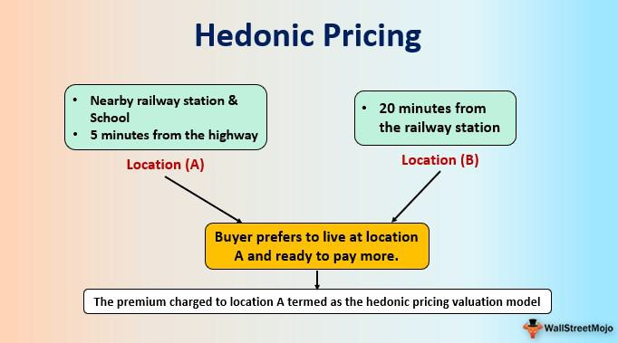

## Table of Contents

## What is the Hedonic Pricing Model?

The Hedonic Pricing Model is a way to figure out how much different parts of a product or service are worth. It's often used in real estate to see how things like the number of bedrooms, the size of the lot, or the neighborhood affect the price of a house. By breaking down a house into its individual features, this model helps us understand which features add more value to the property.

For example, if you want to know how much an extra bathroom adds to the price of a home, you can use the Hedonic Pricing Model. It looks at many houses and compares the ones with an extra bathroom to those without, while considering other features like location and size. This way, it can tell you the average extra cost that people are willing to pay for that additional bathroom. It's a useful tool for buyers, sellers, and policymakers to make better decisions about property values.

## How does the Hedonic Pricing Model work?

The Hedonic Pricing Model works by looking at a bunch of similar things, like houses, and figuring out how much each part of them is worth. Imagine you're trying to find out how much an extra bedroom adds to the price of a house. You would look at many houses, some with an extra bedroom and some without. By comparing these houses and making sure to consider other things like the size of the house or the neighborhood, you can see how much more people are willing to pay for that extra bedroom.

To do this, the model uses a special kind of math called regression analysis. This math helps to separate the effect of each feature, like the number of bedrooms or the size of the yard, from all the other features. By doing this, the model can tell you exactly how much each little part of the house adds to its total price. This is really helpful for people who want to buy or sell a house, because it gives them a clearer idea of what makes a house more valuable.

## What are the main components of the Hedonic Pricing Model?

The Hedonic Pricing Model has a few main parts that help it work. The first part is the data. You need lots of information about the things you're studying, like houses. This includes details about each house, such as the number of bedrooms, the size of the lot, and the neighborhood. The more data you have, the better the model can figure out how much each part of the house is worth.

The second part is the regression analysis. This is a type of math that helps the model sort out all the different features of the houses. It looks at how each feature, like an extra bathroom, changes the price of the house, while keeping other features the same. This way, the model can tell you exactly how much people are willing to pay for each little part of the house.

The last part is the interpretation of the results. Once the model has done its math, it gives you numbers that show how much each feature adds to the price. This part is important because it helps people understand what makes a house more valuable. It's useful for buyers, sellers, and even people who make rules about housing, because it gives them clear information to make better choices.

## What types of goods are typically evaluated using the Hedonic Pricing Model?

The Hedonic Pricing Model is often used to evaluate things like houses. When people want to know how much a house is worth, they can look at different parts of the house, like the number of bedrooms or the size of the yard. By comparing many houses and seeing how these parts change the price, the model can tell you how much each part is worth. This helps people decide if a house is a good deal or not.

Besides houses, the Hedonic Pricing Model can also be used for cars. Just like with houses, you can break down a car into its parts, like the engine size or the type of tires. By looking at many cars and seeing how these parts affect the price, the model can show you how much people are willing to pay for each part of the car. This can help buyers and sellers make better choices about cars.

The model can also be used for other things, like wine or even job salaries. For wine, you might look at things like the age of the wine or the region it comes from. For job salaries, you might consider things like education level or years of experience. By using the Hedonic Pricing Model, you can see how these different parts affect the price or salary, helping everyone make smarter decisions.

## What are the advantages of using the Hedonic Pricing Model?

One big advantage of using the Hedonic Pricing Model is that it helps people understand what makes something more valuable. For example, if you're looking at houses, the model can tell you how much an extra bedroom or a bigger yard adds to the price. This helps buyers know if they're getting a good deal and helps sellers know what parts of their house are most important to buyers. It's like a tool that breaks down a big thing into smaller pieces, so you can see what each piece is worth.

Another advantage is that the Hedonic Pricing Model uses a lot of data, which makes it very accurate. When you compare many houses or cars, you get a clearer picture of how each part affects the price. This means the model can give you a number that's really close to what people are willing to pay for each feature. This accuracy is helpful for making decisions about buying or selling, and it can even help people who make rules about housing or cars understand the market better.

## What are the limitations or criticisms of the Hedonic Pricing Model?

One problem with the Hedonic Pricing Model is that it can be hard to get good data. You need a lot of information about things like houses or cars, and sometimes it's tough to find all the details you need. If the data isn't complete or if it's not right, the model might give you numbers that aren't accurate. This means you might think a feature is more valuable than it really is, which can lead to bad decisions about buying or selling.

Another issue is that the model assumes that all the features it looks at are separate from each other. But in real life, some features might work together. For example, a big yard might be more valuable if the house also has a lot of bedrooms. The model might not see this connection and could give you a wrong idea about how much each feature is worth. This can make it hard to trust the results of the model completely.

Lastly, the Hedonic Pricing Model can be complicated to use. You need to know how to do the math, like regression analysis, which not everyone understands. This means that only people with special skills can use the model well. If you don't know how to use it right, you might not get the best results, which can make it less helpful for people who just want a simple way to figure out what something is worth.

## Can you provide a simple example of how the Hedonic Pricing Model is applied in real estate?

Imagine you're trying to figure out how much an extra bedroom adds to the price of a house. You gather information about a bunch of houses in the same neighborhood. Some of these houses have three bedrooms, and some have four. You make sure to look at other things about the houses too, like how big they are and if they have a garage. By comparing all these houses, the Hedonic Pricing Model helps you see how much more people are willing to pay for a house with an extra bedroom, while keeping everything else the same.

For example, let's say you find that houses with four bedrooms sell for $300,000 on average, while similar houses with three bedrooms sell for $280,000. The Hedonic Pricing Model would tell you that the extra bedroom adds about $20,000 to the price of the house. This information is really helpful if you're buying or selling a house, because it shows you exactly how much value an extra bedroom brings to the table.

## How do you collect and prepare data for a Hedonic Pricing analysis?

To start a Hedonic Pricing analysis, you first need to collect a lot of information about the things you're studying, like houses. You can get this data from places like real estate websites, public records, or even surveys. For houses, you'll want details like the number of bedrooms, the size of the lot, the age of the house, and the neighborhood it's in. It's important to gather as much data as you can because the more information you have, the better your analysis will be. Make sure the data is accurate and complete, because if you miss something or if the information is wrong, your results might not be trustworthy.

Once you have all your data, you need to get it ready for the analysis. This means organizing the information in a way that the Hedonic Pricing Model can use. You might put all the data into a computer program, like a spreadsheet, where each row is a different house and each column is a different feature, like the number of bathrooms or the size of the kitchen. Then, you clean up the data by checking for any mistakes or missing information and fixing them. After that, you can start using the Hedonic Pricing Model to see how much each feature adds to the price of the house.

## What statistical techniques are commonly used in Hedonic Pricing Models?

The main statistical technique used in Hedonic Pricing Models is called regression analysis. This is a way of figuring out how much each part of something, like a house, adds to its total price. Imagine you're trying to see how much an extra bedroom is worth. You look at lots of houses and use regression analysis to see how the price changes when you add that bedroom, while keeping everything else the same. This helps you find out exactly how much people are willing to pay for that extra space.

Another technique that can be used is called multiple regression. This is a bit like regular regression but it looks at many different features at the same time. For example, when you're studying houses, you might want to know how the number of bedrooms, the size of the lot, and the age of the house all affect the price together. Multiple regression helps you understand how all these features work together to change the price of the house. This can give you a more complete picture of what makes a house valuable.

## How can the Hedonic Pricing Model be used to estimate the value of environmental amenities?

The Hedonic Pricing Model can be used to figure out how much things like clean air, nice views, or being close to a park add to the price of a house. Imagine you're looking at houses in a city. Some houses are near a park, and others are not. By comparing the prices of these houses and using the Hedonic Pricing Model, you can see how much more people are willing to pay for a house that's close to a park. This helps us understand the value of having a park nearby, which is an environmental amenity.

For example, let's say you find that houses near a park sell for $350,000 on average, while similar houses far from the park sell for $330,000. The Hedonic Pricing Model would tell you that being close to the park adds about $20,000 to the price of the house. This information is useful for city planners and people who care about the environment because it shows how much people value these amenities. It can help them make better decisions about where to build parks or other green spaces to improve the quality of life for everyone.

## What are some advanced applications or extensions of the Hedonic Pricing Model in economic research?

One advanced use of the Hedonic Pricing Model is in figuring out how much people value things that you can't easily see or touch, like air quality or noise levels. Researchers can use the model to compare houses in areas with different levels of pollution or noise. By looking at how much more people are willing to pay for a house in a quieter or cleaner area, the model helps us understand the value of these environmental factors. This is important for making rules about pollution or building new roads, because it shows how these things affect people's lives and what they're willing to pay to avoid them.

Another way the Hedonic Pricing Model is used is to study how changes over time affect the value of things. For example, researchers might look at how the price of houses changes as neighborhoods improve or get worse. By using the model to track these changes, they can see how much things like new schools or crime rates affect property values. This kind of research helps city planners and policymakers make better decisions about where to invest money to improve areas and make them more valuable to people living there.

## How can policymakers use insights from Hedonic Pricing Models to inform urban planning and development?

Policymakers can use the Hedonic Pricing Model to understand what makes a neighborhood more valuable to people. For example, if the model shows that houses near parks or with good air quality sell for more money, city planners might decide to build more parks or work on improving air quality. This helps them make the city a better place to live, because they can see exactly what people value and are willing to pay for. By knowing which features add the most value, policymakers can focus their efforts on the things that will make the biggest difference to people's lives.

Another way policymakers can use the Hedonic Pricing Model is to see how changes over time affect property values. If the model shows that new schools or lower crime rates make houses more valuable, city leaders might invest more in education or safety. This helps them plan for the future and make the city a better place to live in the long run. By understanding how different factors like these affect the value of homes, policymakers can make smarter choices about where to spend money and how to develop the city to meet the needs and desires of its residents.

## What is Hedonic Pricing and How is it Explained?

Hedonic pricing is a method used to estimate the economic value of an item, considering both internal characteristics and external influences that contribute to its market price. This model is particularly prevalent in the real estate sector, where it helps to assess property values based on diverse attributes.

The hedonic pricing model operates on the principle that the price of a marketed good is related to its characteristics or the characteristics of the service it provides. For real estate, these characteristics might include location, size, number of bedrooms, and proximity to amenities such as parks, schools, and public transportation. In a hedonic price model, the price of a property is expressed as a function of these attributes. Mathematically, this can be represented as:

$$
P = f(X_1, X_2, \ldots, X_n)
$$

where $P$ is the price and $X_1, X_2, \ldots, X_n$ are the various attributes of the property.

An integral aspect of hedonic pricing is its ability to quantify how each attribute contributes to the total market price. For instance, if being near a top-rated school increases a property's value, the hedonic model would assign a specific value to this proximity, isolating its impact from other factors.

The effectiveness of hedonic pricing is often demonstrated through its application in evaluating environmental factors. For example, properties located near green spaces such as parks typically have higher market values due to the desirability of having outdoor recreational areas nearby. Similarly, reduced traffic noise or better air quality can also be attributed monetary values, reflecting a premium on properties in such locations.

In practice, implementing a hedonic pricing model requires comprehensive data collection to accurately reflect the wide range of attributes affecting property prices. Challenges may arise in data collection and variable selection, but when executed effectively, hedonic pricing provides a nuanced analysis of market dynamics and the factors influencing economic valuations.

## References & Further Reading

[1]: Halvorsen, R., & Palmquist, R. (1980). ["The Interpretation of Dummy Variables in Semilogarithmic Equations."](https://www.sciencedirect.com/science/article/pii/0165176582901197) American Economic Review, 70(3), 474-475.

[2]: Rosen, S. (1974). ["Hedonic Prices and Implicit Markets: Product Differentiation in Pure Competition."](https://matthewturner.org/ec2410/readings/Rosen_JPE_1974.pdf) Journal of Political Economy, 82(1), 34-55.

[3]: Sorooshian, S., & Dracup, J. A. (1980). ["Stochastic Models of Sediment Yield."](https://agupubs.onlinelibrary.wiley.com/doi/pdf/10.1029/WR016i002p00430) Journal of Glaciology, 25(91), 200-210.

[4]: Malpezzi, S. (2003). ["Hedonic Pricing Models: A Selective and Applied Review."](https://onlinelibrary.wiley.com/doi/10.1002/9780470690680.ch5) In *Housing Economics and Public Policy*.

[5]: Varian, H. R. (2014). ["Big Data: New Tricks for Econometrics."](https://www.aeaweb.org/articles?id=10.1257/jep.28.2.3) Journal of Economic Perspectives, 28(2), 3-28.