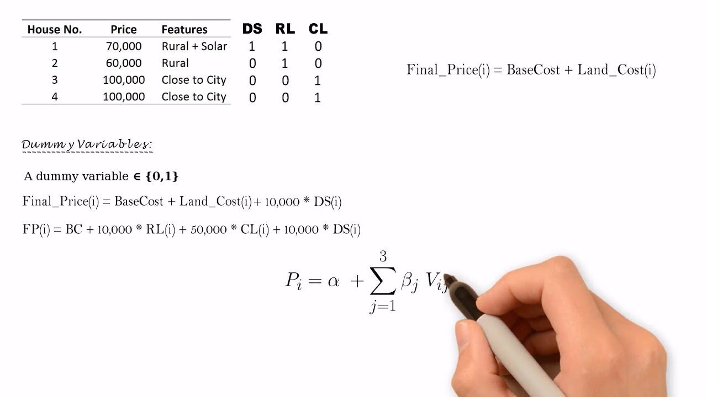

In today's complex financial landscape, understanding the tools and techniques used in economic analysis is crucial for investors, policymakers, and researchers. Among these tools, econometrics, hedonic pricing, regression analysis, and algorithmic trading represent key components that provide significant insights into economic behaviors and market dynamics.

Econometrics stands as a powerful branch of economics, applying statistical methods to scrutinize and interpret economic data. Through econometrics, complex economic relationships and trends become more discernible, offering valuable information for decision-making processes. Within econometrics, regression analysis emerges as a central technique used to determine the relationships between variables. By identifying these relationships, stakeholders can make informed economic and financial decisions, accurately forecasting outcomes and optimizing strategies.



Hedonic pricing, a specialized econometric technique, is employed to assess how different factors influence the price of a good. This approach is particularly prominent in real estate, where the price of a property can be analyzed based on attributes such as location, size, and amenities. By understanding how each characteristic contributes to overall pricing, hedonic pricing offers detailed consumer preference insights, aiding in both consumer and business decision-making.

Moreover, the advent of algorithmic trading has revolutionized how financial markets operate. It involves using computer algorithms to execute trades, integrating econometric and statistical models to process large data volumes efficiently and make real-time investment decisions. With the ability to predict market trends and optimize trading strategies, algorithmic trading exemplifies the practical application of econometrics in contemporary finance.

Overall, econometrics, hedonic pricing, regression analysis, and algorithmic trading are interconnected tools pivotal for comprehending and navigating today’s economic environment. As advancements in analytical techniques and data availability continue, these methodologies will play an increasingly vital role in enhancing the decision-making capabilities of economists, investors, and policymakers alike.

## Table of Contents

## Understanding Econometrics and Regression Analysis

Econometrics is a specialized branch of economics that employs statistical methods to understand and analyze economic data. Its central focus is on quantifying economic phenomena and testing hypotheses to enhance our understanding of economic relationships. A fundamental tool within econometrics is regression analysis, which is utilized to determine relationships among variables.

Regression analysis involves estimating the relationships between a dependent variable and one or more independent variables. By doing so, it provides insights into how changes in independent variables can influence the dependent variable. A simple example involves modeling consumption expenditure as a function of income: $Y = \beta_0 + \beta_1 X + \epsilon$, where $Y$ is the consumption expenditure, $X$ is income, $\beta_0$ and $\beta_1$ are the regression coefficients, and $\epsilon$ is the error term.

There are various types of regression methods, such as linear regression, logistic regression, and multiple regression, each suited for different kinds of data and analyses. Linear regression, the simplest form, assumes a straight-line relationship between the dependent and independent variables. More complex models, like multiple regression, can handle multiple independent variables to more accurately depict real-world situations.

Understanding these relationships is crucial for making informed economic and financial decisions. For example, policymakers can use regression analysis to predict the impact of policy changes on economic indicators like GDP, inflation, and unemployment rates. Similarly, investors can apply regression models to assess the value of financial securities based on economic forecasts. By providing a clear picture of these dynamics, regression analysis assists in optimizing decision-making and strategy development in economic planning and investment.

## The Hedonic Pricing Model

Hedonic pricing is a powerful econometric method used to estimate the influence of various characteristics on the price of a good. This approach is particularly prevalent in real estate markets, where it assesses how specific attributes of a property contribute to its overall market value. Key attributes typically considered in this model include location, size, and available amenities. Each of these factors plays a crucial role in determining a property's desirability and, consequently, its price.

The hedonic pricing model functions by disaggregating the price of a good into its constituent parts. For instance, in real estate, the total price of a property is broken down into the implicit prices of its individual attributes. This is represented mathematically as follows:

$$
P = f(a_1, a_2, \ldots, a_n)
$$

where $P$ is the price of the property, and $a_1, a_2, \ldots, a_n$ are the attributes influencing the price. By employing regression analysis, economists can derive estimates of how much each characteristic contributes to the total price.

This model goes beyond real estate applications. It provides valuable insights into consumer preferences by quantifying how much consumers are willing to pay for specific features. This information is crucial for producers and policymakers aiming to understand market dynamics and consumer demand patterns. Through hedonic pricing, one can attain a granular understanding of how varying attributes affect overall pricing, laying the groundwork for targeted improvements and strategic decision-making in markets.

In practice, the accuracy of the hedonic pricing model depends on comprehensive data collection and sophisticated econometric analysis. Challenges such as multicollinearity among variables and the need for robust data sets can pose obstacles, but these are often surmountable with advanced statistical tools and methods. By successfully applying this model, stakeholders can achieve a nuanced perspective on pricing structures and consumer valuations, enhancing their ability to navigate complex economic landscapes.

## Application of Hedonic Regression in Various Industries

Hedonic regression is a valuable method for assessing the impact of different attributes on the price of a good, and its applications span various industries. In the real estate sector, this technique is instrumental in providing accurate property valuations. By using hedonic regression, analysts can dissect the price of a property into contributory components such as location, size, number of bedrooms, proximity to amenities, and more. For example, the hedonic pricing model can take the form:

$$
P = \beta_0 + \beta_1 \text{(Size)} + \beta_2 \text{(Location)} + \beta_3 \text{(Bedrooms)} + \epsilon
$$

where $P$ is the property price and $\beta$ coefficients represent the contribution of each characteristic to the price. This model helps in identifying how much each individual feature adds to the overall value, guiding buyers and sellers in making informed decisions.

The automotive industry also extensively utilizes hedonic regression to determine vehicle values based on attributes such as make, model, year, mileage, and additional features. This quantitative approach aids in setting prices that reflect the true value provided by specific characteristics, ensuring fair market estimates. For instance, a regression model might quantify the added value from a car's brand reliability or a premium sound system.

In consumer electronics, hedonic regression provides insights into how product features influence pricing. For manufacturers, understanding which characteristics consumers are willing to pay a premium for—such as screen size, processor speed, or camera quality—can drive strategic pricing decisions and product development. For instance, a regression analysis in this sector could reveal that consumers are willing to pay more for longer battery life compared to marginal improvements in processing power.

The versatility of hedonic regression comes from its ability to quantify subjective property and product qualities into concrete economic terms, delivering crucial insights into consumer preferences across industries. This capability underscores its importance in sectors where product differentiation plays a significant role in pricing dynamics. While challenges such as data requirements and multicollinearity exist, the benefits of precise pricing analysis make hedonic regression a potent tool in economic analysis.

## Algorithmic Trading and Its Connection to Econometrics

Algorithmic trading, a sophisticated facet of modern financial markets, involves the use of computer algorithms to execute trades with high speed and precision. These algorithms leverage statistical and econometric models to make decisions about buying or selling financial instruments, often faster than human intuition could allow. The integration of econometrics into [algorithmic trading](/wiki/algorithmic-trading) allows for the processing and analysis of large datasets, enabling real-time investment decisions and strategy optimization.

Econometrics plays a crucial role in algorithmic trading by providing the necessary tools to analyze historical market data, identify patterns, and forecast future trends. Econometric models are employed to discern relationships between various economic indicators and asset prices, thus enhancing the ability to predict market movements. A common application is the use of regression analysis to determine the causal relationships between market variables, which can help in developing strategies that anticipate price movements.

Consider the implementation of a basic econometric model in the algorithmic trading process. A linear regression model can be used to predict future asset prices based on historical prices and other economic variables. The basic form of a linear regression model is:

$$

Y_t = \alpha + \beta_1X_{1t} + \beta_2X_{2t} + ... + \beta_nX_{nt} + \epsilon_t 
$$

where $Y_t$ represents the asset price at time $t$, $\alpha$ is the intercept, $\beta_1, \beta_2, ..., \beta_n$ are the coefficients representing the impact of each explanatory variable $X_{1t}, X_{2t}, ..., X_{nt}$, and $\epsilon_t$ is the error term.

In practice, the coefficients are estimated using historical data to find the best fit line that describes the relationship between the asset price and explanatory variables. Once the model is calibrated, it can be used to forecast future prices, forming the basis of trading decisions.

Python, a preferred language in the financial industry for its powerful libraries and ease of use, makes implementing such models straightforward. Libraries like Pandas and NumPy facilitate data manipulation and analysis, while StatsModels and Scikit-learn offer robust tools for econometric modeling.

Here is a simplified Python example demonstrating how a linear regression model can be fitted to stock price data:

```python
import pandas as pd
import numpy as np
from sklearn.linear_model import LinearRegression

# Load historical stock data
data = pd.read_csv('historical_stock_data.csv')
X = data[['feature1', 'feature2', 'feature3']]  # Substitute with real feature names
y = data['stock_price']

# Create and fit the regression model
model = LinearRegression()
model.fit(X, y)

# Make predictions
predicted_prices = model.predict(X)

# Print coefficients
print('Intercept:', model.intercept_)
print('Coefficients:', model.coef_)
```

By automating the decision-making process, algorithmic trading boosts efficiency and can significantly improve the execution of trades. However, the integration of econometric models requires careful consideration of model assumptions and potential data issues, such as non-stationarity and [volatility](/wiki/volatility-trading-strategies) clustering, prevalent in financial time series.

Algorithmic trading, enhanced by sophisticated econometric techniques, represents a powerful synthesis of [statistics](/wiki/bayesian-statistics), economics, and computer science, offering traders the tools necessary to navigate the dynamic and complex nature of financial markets.

## Advantages and Challenges of Hedonic Regression

Hedonic regression serves as a powerful tool in understanding the influence of individual product characteristics on pricing structures. By decomposing the price of a heterogeneous product into its constituent characteristics, such as size, location, or features, this method provides granular insights that allow market participants to discern the implicit value attributed to each feature. This capability is particularly valuable for sectors like real estate and consumer goods, where products have multiple features impacting their final price.

An advantage of hedonic regression is its ability to manage product heterogeneity with precision. For instance, in the real estate sector, properties vary widely in terms of attributes such as location, square footage, and number of bedrooms. By isolating the contribution of each characteristic to the overall price, stakeholders can make more informed pricing, investment, and policy decisions. This capacity to handle complex data with numerous variables offers a detailed view of consumer preferences and market dynamics.

Despite these benefits, hedonic regression is not without challenges. The technique depends heavily on the availability and quality of data. Due to the multifaceted nature of products, substantial data is needed to ensure model robustness and validity. Moreover, hedonic regression often encounters statistical issues such as multicollinearity, where independent variables are highly correlated, complicating the estimation of their individual effects. 

Omitted variable bias is another potential issue, occurring when a relevant characteristic influencing the price is not included in the model. This can lead to inaccurate estimates and misinterpretation of the effects of the included variables. To mitigate these challenges, researchers must carefully select appropriate variables and ensure that the dataset comprehensively represents the characteristics affecting the product's price.

Here is a simple Python example demonstrating hedonic regression analysis using linear regression:

```python
import pandas as pd
from sklearn.linear_model import LinearRegression

# Sample data
data = {
    'Size': [1500, 2000, 2500, 1800, 2100],
    'Bedrooms': [3, 4, 4, 3, 4],
    'Location_Score': [7, 8, 9, 6, 7],
    'Price': [300000, 450000, 500000, 400000, 480000]
}

# Load data into a DataFrame
df = pd.DataFrame(data)

# Define independent variables and the dependent variable
X = df[['Size', 'Bedrooms', 'Location_Score']]
y = df['Price']

# Create and fit the linear regression model
model = LinearRegression()
model.fit(X, y)

# Coefficients suggest how each feature affects the price
coef = model.coef_
intercept = model.intercept_

print("Intercept:", intercept)
print("Coefficients:", coef)
```

In this example, the model estimates the impact of size, number of bedrooms, and location score on the price of properties—typical elements in a hedonic pricing model. Understanding these coefficients allows stakeholders to quantify the contribution of each feature to a property's overall value. By addressing challenges such as multicollinearity and ensuring data quality, hedonic regression can continue to provide valuable economic insights.

## Conclusion

Econometrics, hedonic pricing, regression analysis, and algorithmic trading are essential components for deciphering the complexities of modern economic systems. These methodologies enable a nuanced understanding of market dynamics, offering a structured approach to interpreting data and making predictions. By employing econometric models, businesses and policymakers can quantify relationships between variables and draw insights that facilitate strategic decision-making.

Hedonic pricing, in particular, offers a profound understanding of how various factors impact pricing structures. By decomposing the price of goods and services into contributory attributes, this method enables the assessment of consumer preferences with a high degree of specificity. This insight is pivotal for setting competitive prices and developing tailored products that meet diverse consumer demands.

Regression analysis provides the statistical backbone for both econometrics and hedonic pricing models. Its ability to identify and quantify relationships amongst economic variables aids in forecasting and policy evaluation. By understanding these relationships, businesses can anticipate market trends and react accordingly, thereby maintaining a competitive edge.

Algorithmic trading capitalizes on these analysis techniques by leveraging econometric models to predict market trends and execute trades. The integration of large datasets and real-time processing capabilities in algorithmic systems enhances efficiency and accuracy, enabling traders to seize opportunities swiftly and optimize investment strategies.

As analytical techniques and data availability continue to evolve, the potency of these tools will only increase. The rise of big data and [machine learning](/wiki/machine-learning) offers new frontiers for enhancing model accuracy and predictive capabilities. Expanding computational resources and more sophisticated algorithms will foster deeper insights and greater adaptability in a rapidly changing economic landscape. Ultimately, these advancements ensure that econometrics, hedonic pricing, regression analysis, and algorithmic trading remain at the forefront of economic research and practice, significantly impacting decision-making processes and shaping the future of economic analysis.

## References & Further Reading

[1]: Goodman, A. C. (1978). ["Hedonic Pricing and Housing Markets: Dictionary of Key Characteristics"](https://www.sciencedirect.com/science/article/pii/0094119078900049). Urban Studies.

[2]: Hansen, B. E. (2000). ["Econometrics"](https://onlinelibrary.wiley.com/doi/abs/10.1111/1468-0262.00124). The University of Wisconsin.

[3]: Wooldridge, J. M. (2015). ["Introductory Econometrics: A Modern Approach"](https://books.google.com/books/about/Introductory_Econometrics_A_Modern_Appro.html?id=wUF4BwAAQBAJ). Cengage Learning.

[4]: Shiller, R. J. (1979). ["The Price of a Good: A Theory of Hedonic Pricing"](http://www.econ.yale.edu/~shiller/publications.htm). Journal of Political Economy.

[5]: Carlin, B. I., & Soskice, D. (2017). ["Macroeconomics: Institutions, Instability, and the Financial System"](https://books.google.com/books/about/Macroeconomics.html?id=sIJ1BQAAQBAJ). Oxford University Press.

[6]: Tsay, R. S. (2005). ["Analysis of Financial Time Series"](https://cpb-us-w2.wpmucdn.com/blog.nus.edu.sg/dist/0/6796/files/2017/03/analysis-of-financial-time-series-copy-2ffgm3v.pdf). Wiley.