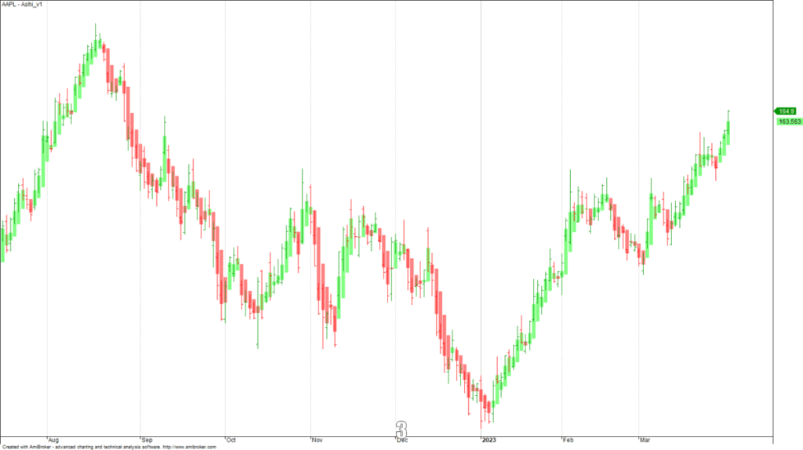

In the dynamic landscape of trading, strategies continually evolve to enhance profitability and precision. One innovative technique gaining traction is the Heikin Ashi strategy, particularly within the domain of algorithmic trading. This strategy employs a specialized charting method designed to improve trend identification, providing traders with a clearer perspective by smoothing out price fluctuations and filtering market noise.

The Heikin Ashi technique offers a distinct approach by utilizing modified candlesticks to represent price data. Unlike traditional candlestick charts that reflect real-time prices, Heikin Ashi emphasizes the continuity of trends, making it a valuable tool for identifying market directions with greater clarity. The calculation of Heikin Ashi data points involves averaging the open, close, high, and low prices, which generates a smoother representation of market trends and potential reversal points.



This article investigates into the application of the Heikin Ashi strategy within the paradigm of algorithmic trading, where automated systems leverage its potential for trend-following strategies. The advantages and limitations of this approach will be explored, along with its potential integration with other technical indicators to optimize trading algorithms. As traders seek refined methods to interpret market movements, the Heikin Ashi strategy presents a compelling option, meriting consideration within the broader context of trading tools and technologies.

## Table of Contents

## Understanding Heikin Ashi Candlesticks

Heikin Ashi, translated as 'average bar' from Japanese, offers a distinctive approach to representing price data, setting itself apart from traditional candlestick charts. While traditional candlesticks provide four key pieces of data—open, close, high, and low for a given time period—Heikin Ashi seeks to enhance the clarity of price movements by applying an average where each candlestick is calculated with a formula that uses the same four data points but in a way that smooths out the price curve over time. This smoothing is particularly beneficial for traders focusing on trend identification and market consolidation phases.

The method by which Heikin Ashi candlesticks are calculated involves using the average values of the open, close, high, and low prices. This construction results in a chart that provides a more refined and clearer view of market direction. The Heikin Ashi candlestick formula can be outlined as follows:

- **Close**: Calculated as the average of the open, high, low, and close of the current period:  
$$
  \text{Heikin Ashi Close} = \frac{\text{Open} + \text{High} + \text{Low} + \text{Close}}{4}

$$

- **Open**: Determined as the average of the previous period’s Heikin Ashi open and close:
$$
  \text{Heikin Ashi Open} = \frac{\text{Previous Heikin Ashi Open} + \text{Previous Heikin Ashi Close}}{2}

$$

- **High**: The highest value among the current period’s high, the current Heikin Ashi open, and the current Heikin Ashi close:
$$
  \text{Heikin Ashi High} = \max(\text{High, Heikin Ashi Open, Heikin Ashi Close})

$$

- **Low**: The lowest value among the current period’s low, the current Heikin Ashi open, and the current Heikin Ashi close:
$$
  \text{Heikin Ashi Low} = \min(\text{Low, Heikin Ashi Open, Heikin Ashi Close})

$$

By employing these formulas, Heikin Ashi candlesticks provide traders with a nuanced and coherent representation of market trends, thus potentially improving decision-making processes in trading practices by filtering out the intraday market noise that often occurs in more volatile periods. This attribute makes Heikin Ashi particularly advantageous for identifying trends, making it a valuable tool for traders seeking to assess long-term movements rather than moment-to-moment price actions.

## How to Calculate Heikin Ashi

Calculating Heikin Ashi candlesticks requires using a specific formula that differs from traditional candlestick calculations. This method relies on averaged data, which serves to smooth out price actions and highlight trends.

1. **Heikin Ashi Close:**  
   The close for a Heikin Ashi candlestick is calculated as the average of the open, high, low, and close prices. Mathematically, it can be expressed as:
$$
   \text{HA\_Close} = \frac{(\text{Open} + \text{High} + \text{Low} + \text{Close})}{4}

$$

2. **Heikin Ashi Open:**  
   The open is determined as the average of the open and close of the previous Heikin Ashi candlestick. This contributes to creating smoothed visualizations of price trends:
$$
   \text{HA\_Open} = \frac{(\text{Previous\_HA\_Open} + \text{Previous\_HA\_Close})}{2}

$$

3. **Heikin Ashi High and Low:**  
   The high and low values are derived not directly from the actual high and low of the period but from within a set of values that include the current period's high, the Heikin Ashi open, and close. The calculations are as follows:
$$
   \text{HA\_High} = \text{max}(\text{High}, \text{HA\_Open}, \text{HA\_Close})

$$
$$
   \text{HA\_Low} = \text{min}(\text{Low}, \text{HA\_Open}, \text{HA\_Close})

$$

For practical implementation, traders often utilize programming languages like Python to automate the calculation of Heikin Ashi values across datasets:

```python
def calculate_heikin_ashi(data):
    ha_open = (data['Open'].shift(1) + data['Close'].shift(1)) / 2
    ha_close = (data['Open'] + data['High'] + data['Low'] + data['Close']) / 4
    ha_high = data[['High', ha_open, ha_close]].max(axis=1)
    ha_low = data[['Low', ha_open, ha_close]].min(axis=1)

    heikin_ashi = pd.DataFrame({
        'HA_Open': ha_open,
        'HA_Close': ha_close,
        'HA_High': ha_high,
        'HA_Low': ha_low
    })

    return heikin_ashi
```

This code calculates the Heikin Ashi values for a given dataset using Pandas, a popular data manipulation library in Python, and constructs a DataFrame containing the computed Heikin Ashi open, close, high, and low prices. These artificial values facilitate a smoothed observation of market trends, advantageous for traders in identifying stable trends and potential reversals.

## Heikin Ashi vs Traditional Candlesticks

In the trading world, one fundamental question that traders often encounter is whether Heikin Ashi charts are superior to traditional candlestick charts. Understanding the distinction between these two types of charts is crucial for selecting the right strategy for specific trading objectives.

Heikin Ashi charts, unlike traditional candlesticks, are not designed to convey real-time prices. Instead, they serve as a technical indicator that offers a smoothed portrayal of price data. The smoothing effect is achieved by calculating each candle's parameters using average values, which helps to minimize market noise and facilitate a clearer identification of trends. As a consequence, Heikin Ashi is particularly valuable for traders aiming for trend clarity over precise price execution.

To illustrate, the Heikin Ashi close is derived by averaging the open, high, low, and close prices: \[ \text{HA\_Close} = \frac{(\text{Open} + \text{High} + \text{Low} + \text{Close})}{4} \]. This mathematical approach results in charts that allow traders to discern sustained trends and consolidations more effortlessly than with traditional candlestick patterns, which directly reflect market sentiment by depicting the open, high, low, and close of each time period with exactness.

The choice between Heikin Ashi and traditional candlesticks depends largely on the trader's specific requirements. If the priority is obtaining a clearer picture of long-term trends devoid of short-term fluctuations, Heikin Ashi provides that advantage. Conversely, for traders who prioritize precise entries and exits based on real-time price action and market sentiment, traditional candlesticks remain indispensable.

Ultimately, both chart types have their unique strengths and can complement different trading styles and strategies when used alongside other technical analysis tools. Integrating both forms into one's trading toolkit can provide a more comprehensive analysis by leveraging the strengths of each.

## Heikin Ashi Strategy in Algo Trading

Algorithmic trading leverages automated and pre-programmed trading instructions to execute trades at optimal conditions based on various market indicators. The Heikin Ashi approach, known for its ability to smooth price data and highlight trends, serves as a strong complement to these automated systems. Heikin Ashi's distinguishing feature is its capacity to strip away market noise, allowing algorithmic models to discern underlying trends more effectively. This characteristic is particularly beneficial for strategies focusing on [trend following](/wiki/trend-following).

By incorporating Heikin Ashi into algorithmic strategies, traders gain access to refined trend analyses that enhance decision-making processes. The smoothed representation of price data enables clearer visualization of market [momentum](/wiki/momentum), providing a strong foundation for algorithms programmed to identify trend continuations or reversals.

Successful integration of Heikin Ashi in [algorithmic trading](/wiki/algorithmic-trading) often involves pairing it with additional technical indicators to bolster performance. Indicators such as Moving Averages, Relative Strength Index (RSI), and Moving Average Convergence Divergence (MACD) can be used in tandem with Heikin Ashi to create a more robust strategy. For example, when a Heikin Ashi chart signals a trend, a Moving Average can confirm this by trending in the same direction. Similarly, an RSI or MACD can provide insights into the strength or weakness of a trend, helping algorithms filter out false signals and better pinpoint entry and [exit](/wiki/exit-strategy) points.

Implementing this composite strategy requires a sound understanding of both the individual indicators and their synergistic potential. Through systematic coding and [backtesting](/wiki/backtesting), algorithms can be fine-tuned to maximize the Heikin Ashi method's benefits within specific market conditions. This enhances the algorithm's ability to react to market changes with precision and accuracy.

Ultimately, the Heikin Ashi strategy's application in algorithmic trading represents an advanced methodology that, when used effectively, can improve the reliability and performance of automated trading systems. Meticulous parameter setting, strategic indicator combination, and continuous refinement through backtesting are crucial to unlocking the full potential of Heikin Ashi in algorithmic trading.

## Backtesting Heikin Ashi Strategies

Backtesting is an essential process in determining the viability and efficiency of Heikin Ashi strategies by applying them to historical market data. This method involves simulating trades based on historical price data to assess how a strategy would have performed in the past, thereby providing insights into its potential future performance. 

To backtest Heikin Ashi strategies effectively, traders often start with simple rules that leverage the unique characteristics of Heikin Ashi candlesticks. A common strategy involves initiating a buy position when the Heikin Ashi close price moves above the open price, and initiating a sell position when the reverse condition occurs. This approach takes advantage of the trend-smoothing attribute of Heikin Ashi, which can help identify consistent market movements while filtering out short-term fluctuations and noise.

The formula for the Heikin Ashi close price is as follows:

$$
\text{Heikin Ashi Close} = \frac{\text{Open} + \text{High} + \text{Low} + \text{Close}}{4}
$$

For the Heikin Ashi open price, the formula incorporates previous values:

$$
\text{Heikin Ashi Open (current)} = \frac{\text{Heikin Ashi Open (previous)} + \text{Heikin Ashi Close (previous)}}{2}
$$

These calculations provide the foundational values for generating buy and sell signals within the backtesting framework.

Python can be utilized for backtesting Heikin Ashi strategies, allowing for flexibility and scalability. An example script to backtest a simple strategy might include:

```python
import pandas as pd

# Sample data
data = pd.DataFrame({
    'Open': [1, 2, 3, 4],
    'High': [2, 3, 4, 5],
    'Low': [1, 2, 2, 3],
    'Close': [2, 2, 3, 4]
})

# Initialize Heikin Ashi Dataframe
data['HA_Close'] = (data['Open'] + data['High'] + data['Low'] + data['Close']) / 4
data['HA_Open'] = (data['Open'].shift(1) + data['Close'].shift(1)) / 2

def backtest(data):
    buy_points = []
    sell_points = []
    for i in range(1, len(data)):
        if data['HA_Close'][i] > data['HA_Open'][i]:  # Buy condition
            buy_points.append(i)
        elif data['HA_Close'][i] < data['HA_Open'][i]:  # Sell condition
            sell_points.append(i)
    return buy_points, sell_points

buy_points, sell_points = backtest(data)
```

Results from backtesting often highlight Heikin Ashi's advantage in long-term strategies, largely due to its trend-following capability. The smoothing effect of Heikin Ashi can make it well-suited for identifying sustained trends, which are beneficial in trend-following strategies. However, it is essential for traders to bear in mind the limitations and assumptions inherent in backtesting. 

While it can provide valuable insights, past performance does not guarantee future results, and various market conditions can affect the outcomes. Care must be taken to ensure robust statistical methods are used, including parameter optimization and sufficient historical data sampling. Proper backtesting practices are crucial for making informed decisions about the integration of Heikin Ashi strategies into a broader trading portfolio.

## Advanced Heikin Ashi Strategies with ADX

Heikin Ashi, when paired with the Average Directional Index (ADX), forms a sophisticated approach to trend-following strategies in algorithmic trading. Heikin Ashi charts provide a smoothed representation of market trends, but integrating ADX helps traders identify the strength of these trends, making them more reliable.

The ADX is a technical indicator that quantifies the strength of a trend without identifying its direction. It ranges from 0 to 100, where values above 25 typically indicate a strong trend and values below 20 suggest a weaker or non-existent trend. By using ADX alongside Heikin Ashi candlesticks, traders can pinpoint entry and exit points more effectively, leveraging the clarity from Heikin Ashi and the trend strength assessment from ADX.

A common strategy involves entering a long position when the Heikin Ashi candles confirm an upward trend and the ADX value is above 25, which indicates a strong trend. Conversely, an exit can be considered when the ADX falls below 25, signaling a weakening trend. Similarly, for short positions, traders might consider entering when Heikin Ashi candles show a downward trend and ADX confirms strength, following the reverse conditions for exiting.

The integration can also be illustrated in a simple Python code snippet for algorithmic trading systems:

```python
import pandas as pd

def calculate_heikin_ashi(df):
    ha_close = (df['open'] + df['high'] + df['low'] + df['close']) / 4
    ha_open = (df['open'].shift(1) + df['close'].shift(1)) / 2
    ha_high = df[['high', 'open', 'close']].max(axis=1)
    ha_low = df[['low', 'open', 'close']].min(axis=1)
    df['HA_Close'] = ha_close
    df['HA_Open'] = ha_open
    df['HA_High'] = ha_high
    df['HA_Low'] = ha_low
    return df

def calculate_adx(df, period=14):
    df['TR'] = df[['high', 'low', 'close']].max(axis=1) - df[['high', 'low', 'close']].min(axis=1)
    df['+DM'] = df['high'].diff()
    df['-DM'] = df['low'].diff()
    df['+DM'] = df['+DM'].where(df['+DM'] > 0, 0)
    df['-DM'] = df['-DM'].where(df['-DM'] < 0, 0).abs()
    df['TR_smooth'] = df['TR'].rolling(window=period).mean()
    df['+DM_smooth'] = df['+DM'].rolling(window=period).mean()
    df['-DM_smooth'] = df['-DM'].rolling(window=period).mean()
    df['+DI'] = 100 * df['+DM_smooth'] / df['TR_smooth']
    df['-DI'] = 100 * df['-DM_smooth'] / df['TR_smooth']
    df['DX'] = 100 * abs(df['+DI'] - df['-DI']) / (df['+DI'] + df['-DI'])
    df['ADX'] = df['DX'].rolling(window=period).mean()
    return df

# Sample usage
data = pd.read_csv('market_data.csv')
data = calculate_heikin_ashi(data)
data = calculate_adx(data)

# Example of entry and exit conditions
entries = (data['HA_Close'] > data['HA_Open']) & (data['ADX'] > 25)
exits = (data['ADX'] < 25)
```

This strategy, combining Heikin Ashi's trend depiction with ADX's trend strength analysis, allows traders to design more reliable and responsive trading algorithms. The combination leverages Heikin Ashi's ability to filter market noise and ADX's ability to ascertain trend strength, ultimately furnishing a powerful tool for effective trend assessment and optimization in algorithmic trading.

## Conclusion

Heikin Ashi serves as a robust tool for algorithmic traders, largely due to its ability to clarify trends within market data. By smoothing out price fluctuations and emphasizing general trends, it provides traders with a clearer perspective on market dynamics, which is essential for formulating long-term trading strategies. However, traders should be cautious of its limitations, particularly its inability to offer insights into real-time price movements. This lack of real-time precision can sometimes lead to delayed responses in fast-changing market environments, potentially impacting short-term trading decisions.

To optimize the use of Heikin Ashi, traders should consider integrating it with other technical indicators. Combinations with indicators such as the Moving Average Convergence Divergence (MACD), Relative Strength Index (RSI), or the Average Directional Index (ADX) can enhance the strategy's effectiveness by providing additional layers of analysis, such as momentum or trend strength. Furthermore, customizing parameters to align with specific market conditions can help mitigate the limitations associated with Heikin Ashi, allowing for more nuanced and adaptable trading strategies. By tailoring these strategies, traders can harness the full potential of Heikin Ashi, ensuring that it serves as a valuable component in their algorithmic trading toolkit.

## FAQs

### FAQs

#### What are the Heikin Ashi candlestick patterns?

Heikin Ashi candlestick patterns are similar to traditional candlestick patterns but are grounded in averaged price data, which can make them effective for trend identification. There are several key patterns to note:

1. **Bullish Pattern**: This emerges when there are several consecutive Heikin Ashi candles with no lower shadows (or very small ones) and higher high values. This pattern indicates a strong upward momentum.

2. **Bearish Pattern**: In this pattern, consecutive Heikin Ashi candles lack upper shadows and consistently have lower low values, signifying a continued downtrend.

3. **Doji (or Indecision Candle)**: This pattern appears when Heikin Ashi candles have small bodies and shadows extending in both directions, suggesting a potential reversal or consolidation phase.

These patterns emphasize trend direction over specific price levels, enabling traders to remain in trends longer by avoiding false signals common in standard candlestick charts.

#### Does Heikin Ashi strategy work well in volatile markets?

The Heikin Ashi strategy is particularly noted for its ability to smooth out price data and highlight prevailing trends. In volatile markets, traditional candlestick charts can present a significant amount of noise, leading to potential whipsaws and false signals. Heikin Ashi's smoothing effect helps mitigate this issue by presenting a more consistent view of price trends, thereby assisting in filtering out short-term [volatility](/wiki/volatility-trading-strategies).

However, this smoothing characteristic also results in a lag, which can delay signals compared to real-time price action. Therefore, while Heikin Ashi is effective in volatile conditions for maintaining a broader perspective on price direction, it may not be the best choice for traders who require immediate responses to rapid market changes.

The efficiency of Heikin Ashi in volatile markets can be enhanced by combining it with other indicators like the Average Directional Index (ADX) to measure trend strength and confirm trade signals. This ensures better adaptability and precision in entry and exit points within rapidly changing market conditions.

## References & Further Reading

[1]: ["Technical Analysis Using Multiple Timeframes"](https://www.amazon.com/Technical-Analysis-Using-Multiple-Timeframes/dp/B007NXQHWW) by Brian Shannon

[2]: ["Japanese Candlestick Charting Techniques"](https://www.amazon.com/Japanese-Candlestick-Charting-Techniques-Second/dp/0735201811) by Steve Nison

[3]: ["The Science of Algorithmic Trading and Portfolio Management"](https://www.sciencedirect.com/book/9780124016897/the-science-of-algorithmic-trading-and-portfolio-management) by Robert Kissell

[4]: ["Algorithmic Trading: Winning Strategies and Their Rationale"](https://www.wiley.com/en-us/Algorithmic+Trading%3A+Winning+Strategies+and+Their+Rationale-p-9781118460146) by Ernie Chan

[5]: "Heikin Ashi: A Better Candlestick" by Sylvain Vervoort, Stocks & Commodities Magazine, 2008.