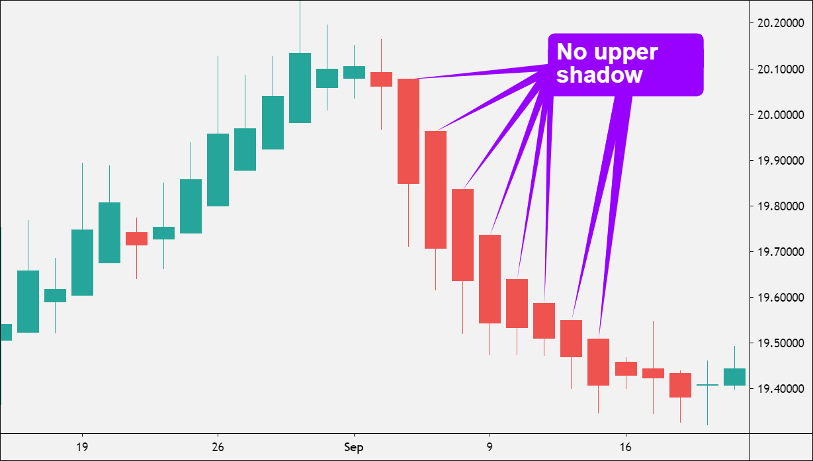

## Table of Contents

## What is the Heikin-Ashi technique and how does it differ from traditional candlestick charts?

The Heikin-Ashi technique is a type of chart used in technical analysis to show price movements in financial markets. It is similar to traditional candlestick charts but uses a different way to calculate and display the price data. In Heikin-Ashi charts, each candle is based on the average of the open, high, low, and close prices of the current and previous periods. This averaging helps to filter out some of the market noise and makes the chart look smoother and easier to read.

Heikin-Ashi charts differ from traditional candlestick charts in a few important ways. Traditional candlestick charts show the actual open, high, low, and close prices for each period, which can sometimes make the chart look choppy and hard to interpret. On the other hand, Heikin-Ashi charts smooth out these price movements, making trends easier to spot. For example, a series of hollow (or green) Heikin-Ashi candles indicates a strong uptrend, while a series of filled (or red) candles shows a strong downtrend. This can help traders make better decisions by focusing on the overall trend rather than short-term fluctuations.

## How are Heikin-Ashi candlesticks calculated?

Heikin-Ashi candlesticks are calculated using a special formula that takes the average of the open, high, low, and close prices from the current and previous periods. To find the open price of a Heikin-Ashi candle, you add the open and close prices of the previous candle and then divide by two. The close price of a Heikin-Ashi candle is the average of the open, high, low, and close prices of the current period. The high price is the highest value among the current period's high, the Heikin-Ashi open, and the Heikin-Ashi close. The low price is the lowest value among the current period's low, the Heikin-Ashi open, and the Heikin-Ashi close.

Using these formulas makes Heikin-Ashi charts look smoother than regular candlestick charts. This smoothing helps traders see the overall trend more easily. For example, if the market is going up, you will see a series of hollow or green Heikin-Ashi candles. If the market is going down, you will see a series of filled or red Heikin-Ashi candles. This can help traders make better decisions by focusing on the big picture rather than small, short-term changes.

## What do the colors of Heikin-Ashi candlesticks indicate?

The colors of Heikin-Ashi candlesticks help show whether the market is going up or down. A hollow or green Heikin-Ashi candlestick means the market is going up. When you see a lot of these green candles in a row, it tells you that the market is in a strong uptrend. Traders like to see this because it means the price is likely to keep going up.

On the other hand, a filled or red Heikin-Ashi candlestick means the market is going down. If you see a lot of these red candles one after the other, it shows that the market is in a strong downtrend. This helps traders know that the price might keep falling, so they can make better choices about when to buy or sell.

## How can Heikin-Ashi charts help in identifying market trends?

Heikin-Ashi charts help traders see market trends more clearly because they smooth out the price movements. Instead of showing the actual open, high, low, and close prices like regular candlestick charts, Heikin-Ashi charts use averages. This makes the chart look less choppy and helps traders focus on the overall direction of the market. When you see a series of green or hollow candles, it means the market is in an uptrend. On the other hand, a series of red or filled candles shows a downtrend.

These charts also make it easier to spot when a trend might be changing. For example, if you see smaller candles with upper and lower shadows after a long series of green candles, it could mean the uptrend is getting weaker. Similarly, if you start seeing smaller red candles with shadows after a long series of red candles, it might mean the downtrend is losing strength. By watching these patterns, traders can make better decisions about when to buy or sell, helping them take advantage of market trends.

## What are the advantages of using Heikin-Ashi over traditional candlestick charts for trading?

Heikin-Ashi charts help traders see trends more easily than traditional candlestick charts. They do this by smoothing out the price movements. Instead of showing the real open, high, low, and close prices, Heikin-Ashi charts use averages. This makes the chart look less choppy and helps traders focus on the big picture. When you see a lot of green or hollow candles in a row, it means the market is going up. If you see a lot of red or filled candles, it means the market is going down. This makes it easier to see if the market is in an uptrend or a downtrend.

Another advantage is that Heikin-Ashi charts can help traders spot when a trend might be changing. For example, if you see smaller candles with upper and lower shadows after a long series of green candles, it could mean the uptrend is getting weaker. If you start seeing smaller red candles with shadows after a long series of red candles, it might mean the downtrend is losing strength. By watching these patterns, traders can make better decisions about when to buy or sell. This can help them take advantage of market trends and make more informed trading choices.

## Can Heikin-Ashi charts be used for all types of financial markets?

Heikin-Ashi charts can be used for many different types of financial markets, like stocks, [forex](/wiki/forex-system), commodities, and cryptocurrencies. They work well because they help traders see the overall trend more easily. By smoothing out the price movements, Heikin-Ashi charts make it simpler to understand if the market is going up or down. This can be useful for anyone trading in these markets, whether they are new to trading or have been doing it for a long time.

However, Heikin-Ashi charts might not be perfect for every situation. Because they use averages, they can sometimes hide important short-term price changes that traders might need to know about. So, while they are great for spotting trends in many markets, it's a good idea to use them along with other types of charts and tools. This way, traders can get a fuller picture of what's happening in the market and make the best decisions for their trading strategy.

## How do you set up a basic Heikin-Ashi trading strategy?

Setting up a basic Heikin-Ashi trading strategy starts with understanding how to read the charts. Look for a series of green or hollow candles to spot an uptrend. This means the market is going up, and it might be a good time to buy. On the other hand, if you see a series of red or filled candles, it shows a downtrend, and it might be a good time to sell or short. Pay attention to the size of the candles too. Big candles mean the trend is strong, while smaller candles with shadows might mean the trend is getting weaker.

Once you know how to read the charts, you can use this information to make trading decisions. For example, if you see a strong uptrend with many green candles, you might decide to buy and hold until you see signs that the trend is changing. If you see smaller candles with shadows after a long uptrend, it could be a signal to sell and take your profits. The same goes for downtrends. If you see a strong downtrend with many red candles, you might decide to short the market. When you start seeing smaller candles with shadows, it might be time to cover your short position. Remember, it's always a good idea to use other tools and charts along with Heikin-Ashi to make the best trading decisions.

## What are common entry and exit signals in a Heikin-Ashi trading strategy?

In a Heikin-Ashi trading strategy, common entry signals are easy to spot. When you see a series of green or hollow candles, it means the market is in an uptrend. This is a good time to buy. If you see a big green candle after a few small ones, it's a strong sign that the uptrend is [picking](/wiki/asset-class-picking) up again. For downtrends, a series of red or filled candles means the market is going down. This is when you might want to sell or short. A big red candle after a few small ones can show that the downtrend is getting stronger.

Exit signals in Heikin-Ashi charts help you know when to sell or cover your position. If you're in an uptrend and you start seeing smaller green candles with upper and lower shadows, it might mean the trend is getting weaker. This could be a good time to sell and take your profits. In a downtrend, if you see smaller red candles with shadows, it might mean the trend is losing strength. This could be a signal to cover your short position. By watching these patterns, you can make smart choices about when to get in and out of the market.

## How can Heikin-Ashi be combined with other technical indicators to improve trading decisions?

Heikin-Ashi charts can be combined with other technical indicators to make better trading decisions. For example, you can use moving averages along with Heikin-Ashi charts. If you see a series of green Heikin-Ashi candles and the price is above the moving average, it can confirm that the market is in a strong uptrend. This can give you more confidence to buy. On the other hand, if you see a series of red Heikin-Ashi candles and the price is below the moving average, it can confirm a strong downtrend, and you might decide to sell or short.

Another useful indicator to use with Heikin-Ashi charts is the Relative Strength Index (RSI). The RSI can help you see if a market is overbought or oversold. If you see a strong uptrend with green Heikin-Ashi candles and the RSI is above 70, it might mean the market is overbought and could soon go down. This could be a signal to sell. If you see a strong downtrend with red Heikin-Ashi candles and the RSI is below 30, it might mean the market is oversold and could soon go up. This could be a signal to buy. By using these indicators together, you can get a better picture of what's happening in the market and make smarter trading choices.

## What are the limitations and potential pitfalls of using Heikin-Ashi charts?

Heikin-Ashi charts can make it hard to see the real price movements because they use averages. This means you might miss out on important short-term changes in the market. For example, if the market suddenly drops or jumps, you might not see it clearly on a Heikin-Ashi chart. This can be a problem if you need to know the exact prices to make quick trading decisions.

Another issue is that Heikin-Ashi charts can sometimes give false signals. Because they smooth out the price movements, they might show a trend that isn't really there. This can trick you into thinking the market is going up or down when it's not. It's important to use other tools and charts along with Heikin-Ashi to check if the signals are real. This way, you can avoid making bad trading choices based on false information.

## How does the Heikin-Ashi strategy perform in different market conditions, such as trending vs. ranging markets?

Heikin-Ashi charts work really well in trending markets. When the market is going up or down in a clear trend, Heikin-Ashi candles make it easy to see. You'll see a lot of green candles if the market is going up, and a lot of red candles if it's going down. This helps traders know when to buy or sell. For example, if you see a strong series of green candles, you might decide to buy and hold until the trend starts to change. But if you see a strong series of red candles, you might decide to sell or short. Heikin-Ashi charts make it easier to spot these trends and make good trading decisions.

However, Heikin-Ashi charts can be tricky in ranging markets. When the market is moving sideways and not going up or down in a clear way, Heikin-Ashi candles can be confusing. They might show false signals because they smooth out the price movements. This can make you think the market is trending when it's not. In these cases, it's important to use other tools and charts to check if the signals are real. By using Heikin-Ashi along with other indicators, you can get a better idea of what's happening in the market and avoid making bad trading choices.

## What advanced techniques can be applied to enhance the effectiveness of a Heikin-Ashi trading strategy?

One advanced technique to enhance the effectiveness of a Heikin-Ashi trading strategy is to use multiple time frames. By looking at Heikin-Ashi charts on different time frames, like daily and hourly charts, you can get a better view of the market. If the daily chart shows a strong uptrend with green candles and the hourly chart also shows green candles, it can give you more confidence that the market is really going up. This can help you make better entry and [exit](/wiki/exit-strategy) decisions. Another technique is to combine Heikin-Ashi charts with other technical indicators, like the Moving Average Convergence Divergence (MACD). If you see a strong uptrend on the Heikin-Ashi chart and the MACD line crosses above the signal line, it can confirm that the trend is strong and might be a good time to buy.

Another advanced technique is to use Heikin-Ashi charts for identifying potential reversal points. When you see a long series of green candles followed by smaller candles with upper and lower shadows, it might mean the uptrend is getting weaker. This could be a signal to sell and take your profits. You can use other tools like the RSI to check if the market is overbought, which can support your decision to sell. On the other hand, if you see a long series of red candles followed by smaller candles with shadows, it might mean the downtrend is losing strength. This could be a signal to cover your short position. By watching these patterns and using other indicators, you can spot when the market might be about to change direction and make smarter trading choices.

## What are Heikin Ashi Candlesticks and how do they work?

Heikin Ashi, translated as 'average bar' from Japanese, offers a distinctive approach to representing price data, setting itself apart from traditional candlestick charts. While traditional candlesticks provide four key pieces of data—open, close, high, and low for a given time period—Heikin Ashi seeks to enhance the clarity of price movements by applying an average where each candlestick is calculated with a formula that uses the same four data points but in a way that smooths out the price curve over time. This smoothing is particularly beneficial for traders focusing on trend identification and market consolidation phases.

The method by which Heikin Ashi candlesticks are calculated involves using the average values of the open, close, high, and low prices. This construction results in a chart that provides a more refined and clearer view of market direction. The Heikin Ashi candlestick formula can be outlined as follows:

- **Close**: Calculated as the average of the open, high, low, and close of the current period:  
$$
  \text{Heikin Ashi Close} = \frac{\text{Open} + \text{High} + \text{Low} + \text{Close}}{4}

$$

- **Open**: Determined as the average of the previous period’s Heikin Ashi open and close:
$$
  \text{Heikin Ashi Open} = \frac{\text{Previous Heikin Ashi Open} + \text{Previous Heikin Ashi Close}}{2}

$$

- **High**: The highest value among the current period’s high, the current Heikin Ashi open, and the current Heikin Ashi close:
$$
  \text{Heikin Ashi High} = \max(\text{High, Heikin Ashi Open, Heikin Ashi Close})

$$

- **Low**: The lowest value among the current period’s low, the current Heikin Ashi open, and the current Heikin Ashi close:
$$
  \text{Heikin Ashi Low} = \min(\text{Low, Heikin Ashi Open, Heikin Ashi Close})

$$

By employing these formulas, Heikin Ashi candlesticks provide traders with a nuanced and coherent representation of market trends, thus potentially improving decision-making processes in trading practices by filtering out the intraday market noise that often occurs in more volatile periods. This attribute makes Heikin Ashi particularly advantageous for identifying trends, making it a valuable tool for traders seeking to assess long-term movements rather than moment-to-moment price actions.

## How do you calculate Heikin Ashi?

Calculating Heikin Ashi candlesticks requires using a specific formula that differs from traditional candlestick calculations. This method relies on averaged data, which serves to smooth out price actions and highlight trends.

1. **Heikin Ashi Close:**  
   The close for a Heikin Ashi candlestick is calculated as the average of the open, high, low, and close prices. Mathematically, it can be expressed as:
$$
   \text{HA\_Close} = \frac{(\text{Open} + \text{High} + \text{Low} + \text{Close})}{4}

$$

2. **Heikin Ashi Open:**  
   The open is determined as the average of the open and close of the previous Heikin Ashi candlestick. This contributes to creating smoothed visualizations of price trends:
$$
   \text{HA\_Open} = \frac{(\text{Previous\_HA\_Open} + \text{Previous\_HA\_Close})}{2}

$$

3. **Heikin Ashi High and Low:**  
   The high and low values are derived not directly from the actual high and low of the period but from within a set of values that include the current period's high, the Heikin Ashi open, and close. The calculations are as follows:
$$
   \text{HA\_High} = \text{max}(\text{High}, \text{HA\_Open}, \text{HA\_Close})

$$
$$
   \text{HA\_Low} = \text{min}(\text{Low}, \text{HA\_Open}, \text{HA\_Close})

$$

For practical implementation, traders often utilize programming languages like Python to automate the calculation of Heikin Ashi values across datasets:

```python
def calculate_heikin_ashi(data):
    ha_open = (data['Open'].shift(1) + data['Close'].shift(1)) / 2
    ha_close = (data['Open'] + data['High'] + data['Low'] + data['Close']) / 4
    ha_high = data[['High', ha_open, ha_close]].max(axis=1)
    ha_low = data[['Low', ha_open, ha_close]].min(axis=1)

    heikin_ashi = pd.DataFrame({
        'HA_Open': ha_open,
        'HA_Close': ha_close,
        'HA_High': ha_high,
        'HA_Low': ha_low
    })

    return heikin_ashi
```

This code calculates the Heikin Ashi values for a given dataset using Pandas, a popular data manipulation library in Python, and constructs a DataFrame containing the computed Heikin Ashi open, close, high, and low prices. These artificial values facilitate a smoothed observation of market trends, advantageous for traders in identifying stable trends and potential reversals.

## Can you backtest Heikin Ashi strategies?

Backtesting is an essential process in determining the viability and efficiency of Heikin Ashi strategies by applying them to historical market data. This method involves simulating trades based on historical price data to assess how a strategy would have performed in the past, thereby providing insights into its potential future performance. 

To backtest Heikin Ashi strategies effectively, traders often start with simple rules that leverage the unique characteristics of Heikin Ashi candlesticks. A common strategy involves initiating a buy position when the Heikin Ashi close price moves above the open price, and initiating a sell position when the reverse condition occurs. This approach takes advantage of the trend-smoothing attribute of Heikin Ashi, which can help identify consistent market movements while filtering out short-term fluctuations and noise.

The formula for the Heikin Ashi close price is as follows:

$$
\text{Heikin Ashi Close} = \frac{\text{Open} + \text{High} + \text{Low} + \text{Close}}{4}
$$

For the Heikin Ashi open price, the formula incorporates previous values:

$$
\text{Heikin Ashi Open (current)} = \frac{\text{Heikin Ashi Open (previous)} + \text{Heikin Ashi Close (previous)}}{2}
$$

These calculations provide the foundational values for generating buy and sell signals within the [backtesting](/wiki/backtesting) framework.

Python can be utilized for backtesting Heikin Ashi strategies, allowing for flexibility and scalability. An example script to backtest a simple strategy might include:

```python
import pandas as pd

# Sample data
data = pd.DataFrame({
    'Open': [1, 2, 3, 4],
    'High': [2, 3, 4, 5],
    'Low': [1, 2, 2, 3],
    'Close': [2, 2, 3, 4]
})

# Initialize Heikin Ashi Dataframe
data['HA_Close'] = (data['Open'] + data['High'] + data['Low'] + data['Close']) / 4
data['HA_Open'] = (data['Open'].shift(1) + data['Close'].shift(1)) / 2

def backtest(data):
    buy_points = []
    sell_points = []
    for i in range(1, len(data)):
        if data['HA_Close'][i] > data['HA_Open'][i]:  # Buy condition
            buy_points.append(i)
        elif data['HA_Close'][i] < data['HA_Open'][i]:  # Sell condition
            sell_points.append(i)
    return buy_points, sell_points

buy_points, sell_points = backtest(data)
```

Results from backtesting often highlight Heikin Ashi's advantage in long-term strategies, largely due to its trend-following capability. The smoothing effect of Heikin Ashi can make it well-suited for identifying sustained trends, which are beneficial in trend-following strategies. However, it is essential for traders to bear in mind the limitations and assumptions inherent in backtesting. 

While it can provide valuable insights, past performance does not guarantee future results, and various market conditions can affect the outcomes. Care must be taken to ensure robust statistical methods are used, including parameter optimization and sufficient historical data sampling. Proper backtesting practices are crucial for making informed decisions about the integration of Heikin Ashi strategies into a broader trading portfolio.

## References & Further Reading

[1]: ["Technical Analysis Using Multiple Timeframes"](https://www.amazon.com/Technical-Analysis-Using-Multiple-Timeframes/dp/B007NXQHWW) by Brian Shannon

[2]: ["Japanese Candlestick Charting Techniques"](https://www.amazon.com/Japanese-Candlestick-Charting-Techniques-Second/dp/0735201811) by Steve Nison

[3]: ["The Science of Algorithmic Trading and Portfolio Management"](https://www.sciencedirect.com/book/9780124016897/the-science-of-algorithmic-trading-and-portfolio-management) by Robert Kissell

[4]: ["Algorithmic Trading: Winning Strategies and Their Rationale"](https://www.wiley.com/en-us/Algorithmic+Trading%3A+Winning+Strategies+and+Their+Rationale-p-9781118460146) by Ernie Chan

[5]: "Heikin Ashi: A Better Candlestick" by Sylvain Vervoort, Stocks & Commodities Magazine, 2008.