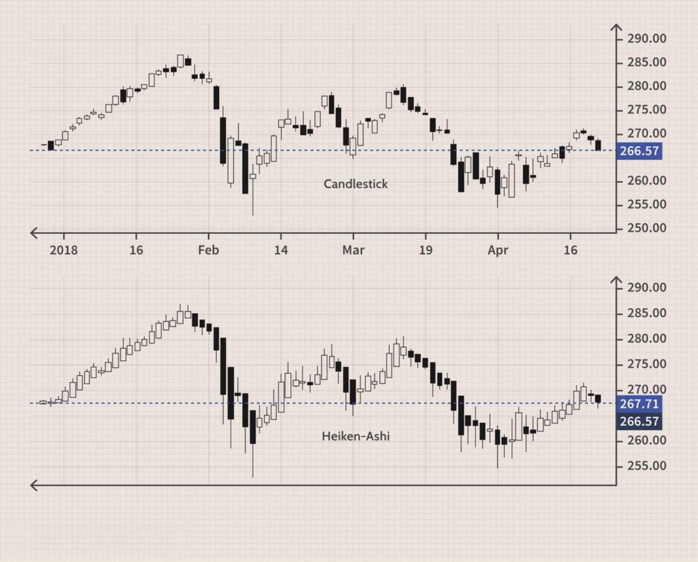

The world of trading is extensive and diverse, featuring a multitude of strategies and tools that traders employ to navigate the complexities of financial markets. Among these, technical analysis stands out as a fundamental approach for evaluating securities through the study of past market data, primarily price and volume. One technique within this domain that has been gaining traction is the Heikin-Ashi method. This approach is particularly favored for its capability to filter out market noise, making trend identification more straightforward and reliable.

Heikin-Ashi, which translates to "average bar" in Japanese, distinguishes itself by providing a smoother visual representation of price data. Unlike traditional candlestick charts, which depict daily market fluctuations using open, high, low, and close prices, Heikin-Ashi charts calculate these values through averages. This nuanced representation reduces the impact of insignificant market movements, allowing traders to observe trends in a more pronounced and less erratic manner.



Traders are increasingly incorporating Heikin-Ashi into their trading arsenals, especially those employing algorithmic strategies. By aiding in the simplification of trend recognition, Heikin-Ashi serves as a powerful tool to enhance decision-making processes. Understanding this technique's fundamentals equips traders to execute more informed and timely trades, a crucial aspect in a field where precision and timing can significantly impact outcomes. This article aims to explore the application of Heikin-Ashi in algorithmic trading strategies, offering insights into how it can refine and improve trading approaches.

## Table of Contents

## Understanding Heikin-Ashi

Heikin-Ashi, which translates to 'average bar' in Japanese, is a technique designed to modify traditional candlestick charts, providing a smoother visual representation of price movements. Unlike standard candlestick charts that rely on the actual open, high, low, and close prices for each bar, Heikin-Ashi employs a unique averaging method to calculate these values. This averaging technique is instrumental in filtering out market noise, thereby reducing insignificant fluctuations that often obscure clear trend interpretation.

The Heikin-Ashi method owes its origins to Munehisa Homma, a prominent rice trader in the 1700s, who is credited with its development. Homma's innovation offers traders a clearer picture of market trends by smoothing out erratic price swings. By essentially 'averaging' data, the resulting Heikin-Ashi candlesticks make it easier for traders to identify and follow trends.

Standard candlestick charts use the parameters: open, high, low, and close. Conversely, Heikin-Ashi adjusts these parameters as follows:

1. **Heikin-Ashi Close** ($\overline{C}$) is calculated by averaging the open, high, low, and close of the current period:
$$
   \overline{C} = \frac{\text{Open} + \text{High} + \text{Low} + \text{Close}}{4}

$$

2. **Heikin-Ashi Open** ($\overline{O}$) is derived from the average of the open and close of the previous Heikin-Ashi candle:
$$
   \overline{O} = \frac{\overline{O}_{\text{prev}} + \overline{C}_{\text{prev}}}{2}

$$
   where $\overline{O}_{\text{prev}}$ and $\overline{C}_{\text{prev}}$ are the open and close of the preceding Heikin-Ashi candle.

3. **Heikin-Ashi High** ($\overline{H}$) takes the maximum of three values: the current period's high, the current Heikin-Ashi open, and the current Heikin-Ashi close:
$$
   \overline{H} = \max(\text{High}, \overline{O}, \overline{C})

$$

4. **Heikin-Ashi Low** ($\overline{L}$) is determined by the minimum of the current period's low, the current Heikin-Ashi open, and the current Heikin-Ashi close:
$$
   \overline{L} = \min(\text{Low}, \overline{O}, \overline{C})

$$

Through these calculations, Heikin-Ashi charts aid traders by making prominent trends more visible, which helps in decision-making and strategic planning. This smoothing effect makes Heikin-Ashi a valuable tool for those seeking to discern the underlying trends in financial markets, thus assisting in the reduction of misleading signals often encountered in volatile market conditions.

## The Formula and Calculation

Heikin-Ashi candlesticks provide a unique method of visualizing market trends by averaging price data, which results in a smoother chart. This is achieved through specific calculations that redefine the Open, Close, High, and Low prices displayed in conventional candlestick charts.

### Heikin-Ashi Close

The Heikin-Ashi Close is calculated by taking the average of the Open, High, Low, and Close of the current period. The formula is expressed as:

$$
\text{HA\_Close} = \frac{\text{Open} + \text{High} + \text{Low} + \text{Close}}{4}
$$

This averaging process smoothens the data, thereby reducing market noise and making it easier to discern emerging trends.

### Heikin-Ashi Open

The Heikin-Ashi Open is derived from the average of the open and close of the previous Heikin-Ashi candle:

$$
\text{HA\_Open} = \frac{\text{HA\_Open (previous)} + \text{HA\_Close (previous)}}{2}
$$

By calculating the Open in this manner, the Heikin-Ashi technique creates continuity between candles, further aiding in trend visualization.

### Heikin-Ashi High and Low

The values for High and Low in Heikin-Ashi candlesticks are determined differently to highlight significant price movements:

$$
\text{HA\_High} = \max(\text{High, HA\_Open, HA\_Close})
$$

$$
\text{HA\_Low} = \min(\text{Low, HA\_Open, HA\_Close})
$$

The High is taken as the maximum, and the Low as the minimum among the current period’s High, Open, and Close values. This selection process ensures only the most pertinent price extremes are shown, contributing to the ease of trend identification.

The resulting Heikin-Ashi candles help traders easily spot ongoing trends, reducing the confusion caused by short-term price fluctuations prevalent in traditional candlestick charts. Here is an example of how you might use Python to calculate Heikin-Ashi values from a dataset:

```python
def calculate_heikin_ashi(prices):
    ha_open = (prices[0]['open'] + prices[0]['close']) / 2
    heikin_ashi = []

    for current in prices:
        ha_close = (current['open'] + current['high'] + current['low'] + current['close']) / 4
        ha_high = max(current['high'], ha_open, ha_close)
        ha_low = min(current['low'], ha_open, ha_close)

        heikin_ashi.append({
            'ha_open': ha_open,
            'ha_close': ha_close,
            'ha_high': ha_high,
            'ha_low': ha_low
        })

        ha_open = (ha_open + ha_close) / 2

    return heikin_ashi

# Example usage with a list of price data
price_data = [
    {'open': 10, 'high': 12, 'low': 9, 'close': 11},
    {'open': 11, 'high': 13, 'low': 10, 'close': 12},
    # Add more periods as needed
]

heikin_ashi_data = calculate_heikin_ashi(price_data)
print(heikin_ashi_data)
```

By transforming the conventional candlestick data with these formulas, traders can more effectively analyze market trends and react with strategies that are informed by clearer visual representations of price movements.

## Advantages and Limitations of Heikin-Ashi

Heikin-Ashi charts are recognized for their ability to filter out market noise, making them particularly effective for identifying trend directions. By employing an averaging technique, these charts smooth out erratic price movements, offering a clearer visual representation of prevailing market trends. This reduction of unnecessary noise enhances chart readability, enabling traders to make more informed decisions based on the underlying trend rather than being distracted by minor fluctuations.

However, the use of Heikin-Ashi charts does come with certain limitations. One significant drawback is the loss of specific price data, such as daily closing prices. This loss can be a critical [factor](/wiki/factor-investing) for traders whose strategies depend heavily on precise price actions, such as those involved in [day trading](/wiki/day-trading-spy) or [scalping](/wiki/gamma-scalping), where timing and exact entry/[exit](/wiki/exit-strategy) points are crucial.

To mitigate these limitations, traders are advised to use Heikin-Ashi charts in conjunction with other technical indicators. By doing so, they can complement the smoothed trend information with detailed price data, enhancing their overall strategy. This integrative approach allows traders to benefit from the clarity provided by Heikin-Ashi charts while still maintaining access to critical price points necessary for certain trading styles.

## Heikin-Ashi in Algorithmic Trading

Algorithmic trading systems leverage technical indicators to enhance decision-making processes and automate trade execution. Heikin-Ashi, known for its ability to smooth price data, has become a useful tool in these systems, particularly for trend identification.

The Heikin-Ashi technique uses an averaging method to address the challenges posed by market [volatility](/wiki/volatility-trading-strategies). By averaging price data, it reduces the impact of minor fluctuations that can lead to false signals in volatile markets. This distinctive characteristic is advantageous for traders who employ algorithmic strategies, as it allows them to focus on significant trend reversals rather than reacting to every price movement.

To implement Heikin-Ashi in [algorithmic trading](/wiki/algorithmic-trading), the technique can be integrated into a script or trading software using programming languages such as Python. An example of how this could be implemented in Python is provided below:

```python
import pandas as pd

def calculate_heikin_ashi(df):
    # Heikin-Ashi Close
    ha_close = (df['Open'] + df['High'] + df['Low'] + df['Close']) / 4

    # Heikin-Ashi Open: starts with the first row being same as Ope
    ha_open = [df['Open'][0]]
    for i in range(1, len(df)):
        ha_open.append((ha_open[i-1] + ha_close[i-1]) / 2)

    # Heikin-Ashi High and Low
    ha_high = pd.Series(data=None, index=df.index)
    ha_low = pd.Series(data=None, index=df.index)

    for i in range(len(df)):
        ha_high[i] = max(df['High'][i], ha_open[i], ha_close[i])
        ha_low[i] = min(df['Low'][i], ha_open[i], ha_close[i])

    heikin_ashi_df = pd.DataFrame({
        'Open': ha_open,
        'High': ha_high,
        'Low': ha_low,
        'Close': ha_close
    })

    return heikin_ashi_df

# Example usage
# df should be a DataFrame with columns: 'Open', 'High', 'Low', 'Close'
heikin_ashi_df = calculate_heikin_ashi(df)
```

This example illustrates how Heikin-Ashi values can be calculated, which can then inform the buy or sell logic in an automated trading system. By focusing only on determining significant trends, algorithms can be tuned to react to true trend reversals, thereby minimizing unnecessary trades.

Such an approach is particularly beneficial for systems that encounter frequent noisy data. Algorithmic models using Heikin-Ashi can be calibrated to capture fundamental market shifts without overreacting to temporary volatility, enhancing their accuracy and profitability. This capability makes Heikin-Ashi a valuable component in the suite of tools available for algorithmic trading.

## Heikin-Ashi vs. Other Chart Types

Heikin-Ashi and Renko charts are both used by traders to filter out market noise and visualize trends more effectively, but they differ significantly in their construction and the type of information they convey.

Heikin-Ashi charts use time-based data to provide a smoothed representation of price movements. This method involves modifying the traditional candlestick approach by averaging certain values to reduce minor fluctuations and emphasize the overall trend. The Heikin-Ashi chart accounts for four data points: open, high, low, and close, across each time period. The temporal aspect is integral, allowing traders to observe how trends unfold over a specified duration.

In contrast, Renko charts primarily focus on price movement, disregarding time to a large extent. Renko charts are constructed by adding a new brick only when the price moves a specified amount, thereby filtering out insignificant fluctuations. This approach accentuates pure price actions and helps in identifying significant trends and potential reversal points. A new brick is formed when the asset either rises or falls by the predetermined price unit, and each brick is equal in size, which simplifies the trend analysis but eliminates time as a factor.

The choice between Heikin-Ashi and Renko charts depends on a trader's strategy and objectives. Traders who prefer to analyze markets with a temporal context and appreciate the ability to view smoothed trends over specific timeframes may find Heikin-Ashi charts more intuitive. On the other hand, traders focused solely on price action without the influence of time might opt for Renko charts, particularly in volatile markets where rapid price changes can obscure longer-term trends.

Below is a conceptual overview of how these chart types can be constructed in Python, highlighting the difference in their data input:

```python
# Sample Python logic for creating a Heikin-Ashi chart
def heikin_ashi(close_prices, periods=10):
    ha_close = [(open_ + high + low + close) / 4 for open_, high, low, close in zip(open_prices, high_prices, low_prices, close_prices)]
    ha_open = [(open_prices[0] + close_prices[0]) / 2]  # Initialize with standard open
    for i in range(1, len(close_prices)):
        ha_open.append((ha_open[i-1] + ha_close[i-1]) / 2)
    # Assuming high and low can be derived similar to traditional highs and lows
    ha_high = [max(high_, ha_open[i], ha_close[i]) for i, high_ in enumerate(high_prices)]
    ha_low = [min(low_, ha_open[i], ha_close[i]) for i, low_ in enumerate(low_prices)]
    return ha_open, ha_high, ha_low, ha_close

# Sample Python logic for creating a Renko chart
def renko_chart(prices, brick_size):
    bricks = []
    last_price = prices[0]
    for price in prices:
        while abs(price - last_price) >= brick_size:
            new_brick = last_price + brick_size * ((price - last_price) // abs(price - last_price))
            bricks.append(new_brick)
            last_price = new_brick
    return bricks
```

These examples illustrate the distinction: Heikin-Ashi integrates time with smoothed price data, while Renko prioritizes discrete price movements irrespective of time intervals. The utility of these charts is thus context-dependent, blending distinct elements of visual and analytical strategies to cater to individual trader preferences.

## Conclusion

Heikin-Ashi provides a unique perspective for traders seeking to interpret market dynamics with clarity and precision. By employing its method of averaging prices, Heikin-Ashi effectively filters out market noise, helping traders identify genuine trends and execute more refined trading strategies. This approach lends itself well to both manual and automated trading systems, allowing traders to make informed decisions based on clearer trend patterns.

When combined with other analytical tools, Heikin-Ashi enhances a trader's ability to garner powerful insights into market behavior. Indicators such as moving averages or [volume](/wiki/volume-trading-strategy) analysis can complement Heikin-Ashi charts, providing a more comprehensive view of market conditions and potential trend reversals. For example, integrating moving averages with Heikin-Ashi could help confirm trend strength and direction, offering additional confirmation before entering or exiting trades.

In the context of algorithmic trading, Heikin-Ashi's capacity to smooth price action supports the reduction of false signals, which is particularly beneficial in volatile markets. By incorporating Heikin-Ashi calculations into trading algorithms, traders can automate strategies that respond to actual trend reversals while minimizing unnecessary trades, thus optimizing trading performance.

Ultimately, whether utilized in discretionary trading practices or embedded within algorithmic systems, the Heikin-Ashi technique remains a valuable asset in the technical analysis toolkit. Its ability to provide a simplified yet effective view of market trends continues to empower traders looking for more accuracy and control in their trading endeavors.

## References & Further Reading

[1]: Nison, S. (1991). ["Japanese Candlestick Charting Techniques: A Contemporary Guide to the Ancient Investment Techniques of the Far East."](https://archive.org/details/japanesecandlest0000niso) Prentice Hall Press.

[2]: Tharp, V. (2013). ["Trading Beyond the Matrix: The Red Pill for Traders and Investors."](https://www.amazon.com/Trading-Beyond-Matrix-Traders-Investors/dp/1118525663) Wiley.

[3]: Lo, A. W., & MacKinlay, A. C. (1999). ["A Non-Random Walk Down Wall Street."](https://www.jstor.org/stable/j.ctt7tccx) Princeton University Press.

[4]: Kaufman, P. J. (2005). ["The New Commodity Trading Systems and Methods."](https://www.amazon.com/New-Commodity-Trading-Systems-Methods/dp/0471878790) Wiley.

[5]: Murphy, J. J. (1999). ["Technical Analysis of the Financial Markets: A Comprehensive Guide to Trading Methods and Applications."](https://archive.org/details/technicalanalysi0000murp) New York Institute of Finance.

[6]: Elder, A. (2002). ["Come Into My Trading Room: A Complete Guide to Trading."](https://www.amazon.com/Come-Into-My-Trading-Room/dp/0471225347) Wiley.

[7]: Chan, E. P. (2009). ["Quantitative Trading: How to Build Your Own Algorithmic Trading Business."](https://github.com/ftvision/quant_trading_echan_book) Wiley.