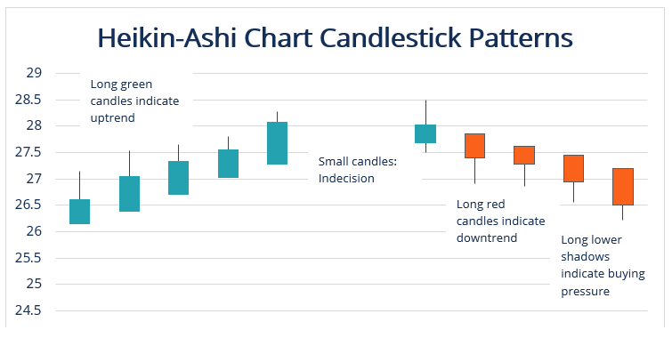

## Table of Contents

## What is the Heikin-Ashi technique?

The Heikin-Ashi technique is a type of chart used in trading to help make it easier to see trends in the price of a stock or other financial item. It is different from regular candlestick charts because it uses a special way to calculate the open, high, low, and close prices of each candle. This special calculation helps smooth out the chart, making it easier to spot trends and see if the market is going up or down.

In a Heikin-Ashi chart, if the candles are mostly green with no lower shadows, it means the market is strongly going up. On the other hand, if the candles are mostly red with no upper shadows, it shows a strong downward trend. Traders use these signals to decide when to buy or sell. This technique can help traders see the overall direction of the market more clearly and make better decisions.

## How does Heikin-Ashi differ from traditional candlestick charts?

Heikin-Ashi charts and traditional candlestick charts look different because they calculate their candles in different ways. In a traditional candlestick chart, each candle shows the real open, high, low, and close prices of a stock for a specific time period. But in a Heikin-Ashi chart, the open, high, low, and close prices are calculated using a special formula. This formula uses the average of the previous candle's prices and the current period's prices to create a smoother chart.

Because of this special calculation, Heikin-Ashi charts make it easier to see the overall trend of the market. When you look at a Heikin-Ashi chart, you can quickly tell if the market is going up or down by the color and shape of the candles. Green candles with no lower shadows show a strong uptrend, while red candles with no upper shadows show a strong downtrend. This makes it easier for traders to decide when to buy or sell compared to traditional candlestick charts, which can sometimes be harder to read because they show more price fluctuations.

## What are the basic components of a Heikin-Ashi candlestick?

A Heikin-Ashi candlestick has four main parts: the open, high, low, and close prices. But these parts are calculated differently than in regular candlestick charts. The open price of a Heikin-Ashi candle is the average of the open and close prices of the previous candle. The close price is the average of the open, high, low, and close prices of the current period. The high price is the highest value among the current period's high, the open, and the close. The low price is the lowest value among the current period's low, the open, and the close.

These special calculations make Heikin-Ashi candles look smoother than regular candlesticks. When you see a Heikin-Ashi chart, green candles show that the market is going up, and red candles show that the market is going down. If the candles are green with no lower shadows, it means the uptrend is very strong. If the candles are red with no upper shadows, it means the downtrend is very strong. This helps traders see the overall trend more easily and make better decisions about when to buy or sell.

## How do you calculate the Heikin-Ashi candlestick values?

To calculate the values for a Heikin-Ashi candlestick, you need to use a special formula that looks at both the current and previous periods' prices. The open price of a Heikin-Ashi candle is found by taking the average of the open and close prices of the previous candle. This means you add the previous candle's open and close prices together and then divide by two. The close price of a Heikin-Ashi candle is calculated by averaging the open, high, low, and close prices of the current period. You add all these prices together and then divide by four.

The high and low prices of a Heikin-Ashi candle are a bit different. The high price is the highest value among three numbers: the current period's high, the Heikin-Ashi open price, and the Heikin-Ashi close price. You compare these three numbers and pick the biggest one. The low price is the lowest value among the current period's low, the Heikin-Ashi open price, and the Heikin-Ashi close price. You compare these three numbers and pick the smallest one. By using these calculations, Heikin-Ashi candles help smooth out price movements and make it easier to see trends in the market.

## What does a Heikin-Ashi chart tell you about market trends?

A Heikin-Ashi chart helps you see the big picture of where the market is going. When you look at the chart, you can tell if the market is going up or down by the color and shape of the candles. If the candles are mostly green and they don't have any lower shadows, it means the market is strongly going up. This is a good sign for people who want to buy because it shows that the trend is strong and likely to keep going up. On the other hand, if the candles are mostly red and they don't have any upper shadows, it means the market is strongly going down. This is a warning for people who want to sell because it shows that the trend is strong and likely to keep going down.

By looking at these patterns, you can make better choices about when to buy or sell. The Heikin-Ashi chart smooths out the ups and downs you see in regular candlestick charts, so it's easier to see the overall direction of the market. If you see a mix of green and red candles, it might mean the market is not sure which way to go. This can help you decide if you should wait before making a move. Overall, Heikin-Ashi charts are a helpful tool for understanding market trends and making smart trading decisions.

## How can Heikin-Ashi help in identifying market reversals?

Heikin-Ashi charts can help you spot when the market might be getting ready to change direction. If you see a long string of green candles showing a strong uptrend, and then suddenly a red candle appears with an upper shadow, it could mean the market is starting to turn around. This red candle with an upper shadow shows that the buyers are losing control and sellers are starting to take over, which might be the start of a new downward trend.

On the flip side, if you see a long string of red candles showing a strong downtrend, and then a green candle appears with a lower shadow, it could mean the market is about to reverse. This green candle with a lower shadow shows that the sellers are losing control and buyers are starting to take over, which might be the start of a new upward trend. By watching for these changes in the candles, you can get early signs that the market might be ready to switch directions, helping you make better trading choices.

## What are the advantages of using Heikin-Ashi over traditional candlesticks?

Heikin-Ashi charts make it easier to see the big picture of the market's direction. They smooth out the ups and downs you see in regular candlestick charts, so it's simpler to spot trends. When you look at a Heikin-Ashi chart, you can quickly tell if the market is going up or down by the color and shape of the candles. This helps traders make better choices about when to buy or sell because they can see the overall trend more clearly.

Another advantage of Heikin-Ashi charts is that they can help you spot when the market might be getting ready to change direction. If you see a long string of green candles and then a red candle with an upper shadow, it could mean the market is starting to turn around. This early warning can help traders get ready for a new trend. So, Heikin-Ashi charts are a helpful tool for understanding market trends and making smart trading decisions.

## What are the limitations or potential drawbacks of Heikin-Ashi charts?

Heikin-Ashi charts are great for seeing the big picture of the market, but they can also make it hard to see the small details. Because these charts smooth out the price movements, you might miss some important changes in the market. For example, if you're looking at a Heikin-Ashi chart, you might not see quick ups and downs that could be important for making quick trading decisions. This means you could miss out on some good trading chances if you only use Heikin-Ashi charts.

Another problem with Heikin-Ashi charts is that they can sometimes make you think a trend is stronger than it really is. Because the candles are calculated in a special way, the chart might keep showing a trend even after it has started to change. This can trick you into thinking the market is still going in one direction when it's actually starting to go the other way. So, it's a good idea to use Heikin-Ashi charts along with other types of charts and tools to get a better understanding of the market.

## How can traders use Heikin-Ashi charts to set entry and exit points?

Traders can use Heikin-Ashi charts to set entry and [exit](/wiki/exit-strategy) points by looking at the color and shape of the candles. When you see a long string of green candles with no lower shadows, it means the market is strongly going up. This is a good time to think about buying, because the trend looks strong and likely to keep going. If you see a red candle with an upper shadow after a lot of green candles, it might be a sign that the market is starting to turn around. This could be a good time to sell or get ready to sell, because it looks like the trend might be changing.

On the other hand, if you see a long string of red candles with no upper shadows, it means the market is strongly going down. This could be a good time to think about selling, because the trend looks strong and likely to keep going down. If you see a green candle with a lower shadow after a lot of red candles, it might be a sign that the market is starting to turn around. This could be a good time to buy or get ready to buy, because it looks like the trend might be changing. By watching these patterns on Heikin-Ashi charts, traders can make better decisions about when to enter or exit the market.

## Can Heikin-Ashi be combined with other technical indicators, and if so, how?

Yes, traders often use Heikin-Ashi charts along with other technical indicators to make better trading decisions. Heikin-Ashi charts are great for seeing the big picture of the market, but they can miss some small details. By using other indicators like moving averages, traders can get a clearer idea of when to buy or sell. For example, if a Heikin-Ashi chart shows a strong uptrend with green candles and a moving average line starts to go up too, it can confirm that the trend is strong and it might be a good time to buy.

Other indicators like the Relative Strength Index (RSI) or the Moving Average Convergence Divergence (MACD) can also be used with Heikin-Ashi charts. These indicators can help traders see if the market is overbought or oversold, which can be important for deciding when to enter or exit a trade. For instance, if a Heikin-Ashi chart shows a strong downtrend with red candles and the RSI is in the oversold area, it might be a good time to think about buying because the market could be ready to turn around. By combining Heikin-Ashi charts with other technical indicators, traders can get a more complete picture of the market and make smarter trading choices.

## What are some common strategies that incorporate Heikin-Ashi?

One common strategy that uses Heikin-Ashi charts is [trend following](/wiki/trend-following). Traders look for long strings of green candles with no lower shadows to find a strong uptrend. When they see this, they might decide to buy because the trend looks strong and likely to keep going. On the other hand, if they see a long string of red candles with no upper shadows, it shows a strong downtrend. This could be a good time to sell because the trend looks strong and likely to keep going down. By following these trends on a Heikin-Ashi chart, traders can make decisions about when to enter or exit the market.

Another strategy is to watch for signs of a market reversal. If traders see a long string of green candles and then a red candle with an upper shadow, it might mean the market is starting to turn around. This could be a good time to sell or get ready to sell because the trend might be changing. On the flip side, if they see a long string of red candles and then a green candle with a lower shadow, it might mean the market is starting to turn around. This could be a good time to buy or get ready to buy because the trend might be changing. By looking for these reversal signs on Heikin-Ashi charts, traders can catch early warnings of a new trend and make better trading choices.

## How does the effectiveness of Heikin-Ashi vary across different time frames and markets?

The effectiveness of Heikin-Ashi charts can change depending on the time frame you're looking at. On shorter time frames, like a few minutes or hours, Heikin-Ashi charts might not be as helpful because they smooth out the price movements a lot. This means you might miss quick changes in the market that could be important for making fast trading decisions. But on longer time frames, like days or weeks, Heikin-Ashi charts can be really useful. They help you see the big picture of where the market is going, making it easier to spot trends and decide when to buy or sell.

Heikin-Ashi charts can also work differently in different markets. In markets that move a lot, like stocks or [forex](/wiki/forex-system), Heikin-Ashi charts can help you see the overall trend more clearly. This can be really helpful for traders who want to follow the trend and make decisions based on it. But in markets that don't move as much, like some commodities, Heikin-Ashi charts might not show clear trends. In these cases, other types of charts or indicators might be better for making trading decisions. So, it's a good idea to think about the time frame and the market you're trading in when you decide to use Heikin-Ashi charts.

## What is Heikin-Ashi and how does it work?

Heikin-Ashi, which translates to 'average bar' in Japanese, is a technique designed to modify traditional candlestick charts, providing a smoother visual representation of price movements. Unlike standard candlestick charts that rely on the actual open, high, low, and close prices for each bar, Heikin-Ashi employs a unique averaging method to calculate these values. This averaging technique is instrumental in filtering out market noise, thereby reducing insignificant fluctuations that often obscure clear trend interpretation.

The Heikin-Ashi method owes its origins to Munehisa Homma, a prominent rice trader in the 1700s, who is credited with its development. Homma's innovation offers traders a clearer picture of market trends by smoothing out erratic price swings. By essentially 'averaging' data, the resulting Heikin-Ashi candlesticks make it easier for traders to identify and follow trends.

Standard candlestick charts use the parameters: open, high, low, and close. Conversely, Heikin-Ashi adjusts these parameters as follows:

1. **Heikin-Ashi Close** ($\overline{C}$) is calculated by averaging the open, high, low, and close of the current period:
$$
   \overline{C} = \frac{\text{Open} + \text{High} + \text{Low} + \text{Close}}{4}

$$

2. **Heikin-Ashi Open** ($\overline{O}$) is derived from the average of the open and close of the previous Heikin-Ashi candle:
$$
   \overline{O} = \frac{\overline{O}_{\text{prev}} + \overline{C}_{\text{prev}}}{2}

$$
   where $\overline{O}_{\text{prev}}$ and $\overline{C}_{\text{prev}}$ are the open and close of the preceding Heikin-Ashi candle.

3. **Heikin-Ashi High** ($\overline{H}$) takes the maximum of three values: the current period's high, the current Heikin-Ashi open, and the current Heikin-Ashi close:
$$
   \overline{H} = \max(\text{High}, \overline{O}, \overline{C})

$$

4. **Heikin-Ashi Low** ($\overline{L}$) is determined by the minimum of the current period's low, the current Heikin-Ashi open, and the current Heikin-Ashi close:
$$
   \overline{L} = \min(\text{Low}, \overline{O}, \overline{C})

$$

Through these calculations, Heikin-Ashi charts aid traders by making prominent trends more visible, which helps in decision-making and strategic planning. This smoothing effect makes Heikin-Ashi a valuable tool for those seeking to discern the underlying trends in financial markets, thus assisting in the reduction of misleading signals often encountered in volatile market conditions.

## What is the Formula and Calculation?

Heikin-Ashi candlesticks provide a unique method of visualizing market trends by averaging price data, which results in a smoother chart. This is achieved through specific calculations that redefine the Open, Close, High, and Low prices displayed in conventional candlestick charts.

### Heikin-Ashi Close

The Heikin-Ashi Close is calculated by taking the average of the Open, High, Low, and Close of the current period. The formula is expressed as:

$$
\text{HA\_Close} = \frac{\text{Open} + \text{High} + \text{Low} + \text{Close}}{4}
$$

This averaging process smoothens the data, thereby reducing market noise and making it easier to discern emerging trends.

### Heikin-Ashi Open

The Heikin-Ashi Open is derived from the average of the open and close of the previous Heikin-Ashi candle:

$$
\text{HA\_Open} = \frac{\text{HA\_Open (previous)} + \text{HA\_Close (previous)}}{2}
$$

By calculating the Open in this manner, the Heikin-Ashi technique creates continuity between candles, further aiding in trend visualization.

### Heikin-Ashi High and Low

The values for High and Low in Heikin-Ashi candlesticks are determined differently to highlight significant price movements:

$$
\text{HA\_High} = \max(\text{High, HA\_Open, HA\_Close})
$$

$$
\text{HA\_Low} = \min(\text{Low, HA\_Open, HA\_Close})
$$

The High is taken as the maximum, and the Low as the minimum among the current period’s High, Open, and Close values. This selection process ensures only the most pertinent price extremes are shown, contributing to the ease of trend identification.

The resulting Heikin-Ashi candles help traders easily spot ongoing trends, reducing the confusion caused by short-term price fluctuations prevalent in traditional candlestick charts. Here is an example of how you might use Python to calculate Heikin-Ashi values from a dataset:

```python
def calculate_heikin_ashi(prices):
    ha_open = (prices[0]['open'] + prices[0]['close']) / 2
    heikin_ashi = []

    for current in prices:
        ha_close = (current['open'] + current['high'] + current['low'] + current['close']) / 4
        ha_high = max(current['high'], ha_open, ha_close)
        ha_low = min(current['low'], ha_open, ha_close)

        heikin_ashi.append({
            'ha_open': ha_open,
            'ha_close': ha_close,
            'ha_high': ha_high,
            'ha_low': ha_low
        })

        ha_open = (ha_open + ha_close) / 2

    return heikin_ashi

# Example usage with a list of price data
price_data = [
    {'open': 10, 'high': 12, 'low': 9, 'close': 11},
    {'open': 11, 'high': 13, 'low': 10, 'close': 12},
    # Add more periods as needed
]

heikin_ashi_data = calculate_heikin_ashi(price_data)
print(heikin_ashi_data)
```

By transforming the conventional candlestick data with these formulas, traders can more effectively analyze market trends and react with strategies that are informed by clearer visual representations of price movements.

## References & Further Reading

[1]: Nison, S. (1991). ["Japanese Candlestick Charting Techniques: A Contemporary Guide to the Ancient Investment Techniques of the Far East."](https://archive.org/details/japanesecandlest0000niso) Prentice Hall Press.

[2]: Tharp, V. (2013). ["Trading Beyond the Matrix: The Red Pill for Traders and Investors."](https://www.amazon.com/Trading-Beyond-Matrix-Traders-Investors/dp/1118525663) Wiley.

[3]: Lo, A. W., & MacKinlay, A. C. (1999). ["A Non-Random Walk Down Wall Street."](https://www.jstor.org/stable/j.ctt7tccx) Princeton University Press.

[4]: Kaufman, P. J. (2005). ["The New Commodity Trading Systems and Methods."](https://www.amazon.com/New-Commodity-Trading-Systems-Methods/dp/0471878790) Wiley.

[5]: Murphy, J. J. (1999). ["Technical Analysis of the Financial Markets: A Comprehensive Guide to Trading Methods and Applications."](https://archive.org/details/technicalanalysi0000murp) New York Institute of Finance.

[6]: Elder, A. (2002). ["Come Into My Trading Room: A Complete Guide to Trading."](https://www.amazon.com/Come-Into-My-Trading-Room/dp/0471225347) Wiley.

[7]: Chan, E. P. (2009). ["Quantitative Trading: How to Build Your Own Algorithmic Trading Business."](https://github.com/ftvision/quant_trading_echan_book) Wiley.