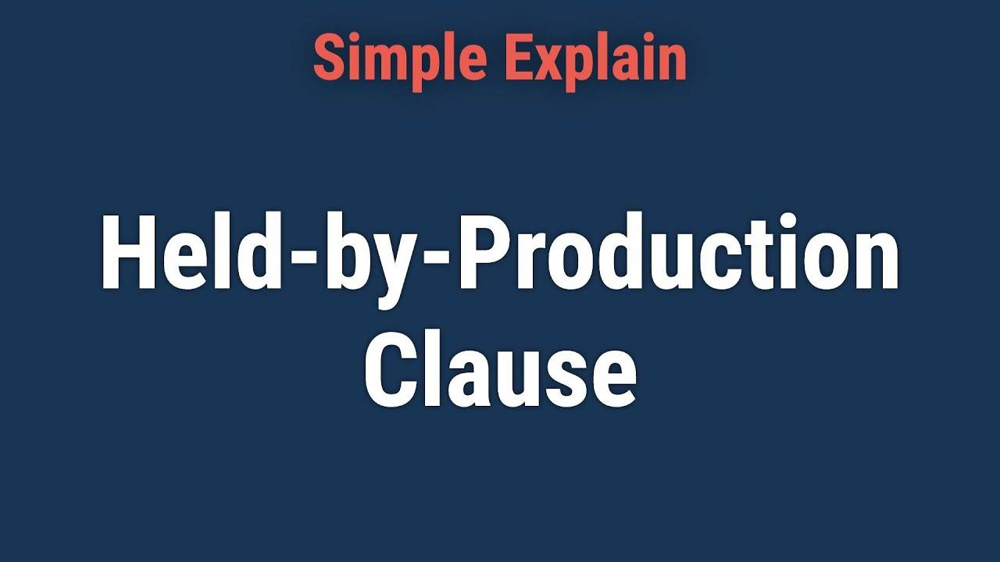

## Table of Contents

## What is a Held-By-Production Clause?

A Held-By-Production Clause is a part of an oil and gas lease agreement. It means that as long as the land is producing oil or gas, the lease will stay active. This clause helps the oil company keep the lease without having to pay more money to the landowner if they are successfully getting resources from the land.

Sometimes, the lease might say that the land has to produce a certain amount of oil or gas to keep the lease active. If the production drops below this amount, the lease could end unless the company starts paying the landowner again. This clause is important because it gives the oil company a reason to keep producing and helps the landowner know when the lease might end.

## How does a Held-By-Production Clause affect oil and gas leases?

A Held-By-Production Clause keeps an oil and gas lease active as long as the land is producing oil or gas. This means the oil company doesn't have to pay the landowner more money to keep the lease if they are successfully getting resources from the land. It's like a reward for the company to keep producing oil or gas because they can hold onto the lease without extra costs.

Sometimes, the lease might say that the land needs to produce a certain amount of oil or gas to keep the lease going. If the production falls below this amount, the lease might end unless the company starts paying the landowner again. This clause is important because it gives the oil company a reason to keep producing and helps the landowner know when the lease might end.

## What are the typical conditions that trigger a Held-By-Production Clause?

The Held-By-Production Clause in an oil and gas lease usually starts working when the land begins to produce oil or gas. This means that as long as the land is giving out oil or gas, the lease stays active without the oil company needing to pay more money to the landowner. It's like saying, "Keep producing, and you can keep the lease."

Sometimes, the lease might have a rule about how much oil or gas needs to be produced to keep the lease going. If the amount of oil or gas being produced drops below this set level, the lease might end unless the company starts paying the landowner again. This rule helps make sure the oil company keeps working hard to get oil or gas out of the land.

## Can a Held-By-Production Clause extend the term of a lease indefinitely?

Yes, a Held-By-Production Clause can extend the term of a lease indefinitely as long as the land keeps producing oil or gas. This means that if the oil company keeps getting oil or gas from the land, they can keep the lease without having to pay more money to the landowner.

Sometimes, the lease might say that the land needs to produce a certain amount of oil or gas to keep the lease going. If the production drops below this amount, the lease might end unless the company starts paying the landowner again. But if the production stays above this level, the lease can go on and on without an end date.

## What are the benefits of a Held-By-Production Clause for the lessee?

A Held-By-Production Clause is good for the lessee, which is the oil company, because it lets them keep the lease as long as they are getting oil or gas from the land. This means they don't have to pay more money to the landowner to keep the lease if they are doing well. It's like a reward for the oil company to keep working hard and producing oil or gas.

Sometimes, the lease might say that the oil company needs to produce a certain amount of oil or gas to keep the lease going. If they can do this, the lease can go on and on without an end date. This gives the oil company a big reason to keep producing because they can hold onto the lease without extra costs.

## What are the potential drawbacks of a Held-By-Production Clause for the lessor?

For the lessor, which is the landowner, a Held-By-Production Clause can mean they might not get more money from the oil company for a long time if the land keeps producing oil or gas. If the oil company is doing well and getting a lot of oil or gas, the lease can go on and on without the landowner getting extra payments. This can be tough for the landowner because they might be counting on that money.

Sometimes, the lease might say that the oil company needs to produce a certain amount of oil or gas to keep the lease going. If the production drops below this amount, the lease might end unless the company starts paying the landowner again. But if the production stays above this level, the landowner might not see any more money for a very long time, even if the value of the land or the oil and gas goes up.

## How is 'production' defined under a Held-By-Production Clause?

Under a Held-By-Production Clause, 'production' usually means that the land is giving out oil or gas. This can be any amount of oil or gas that is being taken out of the land and sold. Sometimes, the lease might say that the oil company needs to produce a certain amount of oil or gas to keep the lease going. This amount is called the "minimum production requirement."

If the oil company can keep producing oil or gas at or above this minimum level, the lease stays active without the oil company having to pay more money to the landowner. This is good for the oil company because it means they can keep the lease as long as they are doing well. But if the production drops below the minimum level, the lease might end unless the company starts paying the landowner again.

## What happens if production ceases under a Held-By-Production Clause?

If production stops under a Held-By-Production Clause, the lease might end. This means the oil company would have to start paying the landowner again to keep the lease, or the lease could end completely. The lease agreement usually says what happens if production stops, so it's important for both the oil company and the landowner to know what the rules are.

Sometimes, the lease might give the oil company a little time to fix the problem and start producing oil or gas again. This time is called a "grace period" or "shut-in period." If the oil company can start producing again during this time, the lease can keep going. But if they can't, the lease might end, and the oil company would have to give the land back to the landowner.

## Are there any legal precedents or case studies that illustrate the application of Held-By-Production Clauses?

One important case that shows how Held-By-Production Clauses work is the Texas Supreme Court case called "Natural Gas Pipeline Company of America v. Pool" from 1984. In this case, the court had to decide if the lease should keep going even though the wells weren't producing much. The court said that as long as the wells were still able to produce oil or gas in paying quantities, the lease should stay active. This means that even if the wells weren't producing a lot, the lease could still go on if they were making some money.

Another case that helps explain Held-By-Production Clauses is "Claude C. v. Exxon Corp." from the Oklahoma Supreme Court in 1988. In this case, the court looked at whether the oil company had to keep paying the landowner when production stopped. The court decided that if the oil company could show they were trying to fix the problem and start producing again, they could keep the lease without paying more money during a short time called a "shut-in period." This case shows that oil companies might get a little time to fix things before the lease ends.

## How can the terms of a Held-By-Production Clause be negotiated or modified?

The terms of a Held-By-Production Clause can be changed by talking it over between the oil company and the landowner before they sign the lease. They can agree on things like how much oil or gas needs to be produced to keep the lease going, or how long the oil company gets if production stops before they have to start paying again. Both sides need to think about what they want and what they can live with, and then put it in writing in the lease agreement.

Sometimes, the oil company might want to change the terms later if things aren't going as planned. They can ask the landowner to agree to new terms, but the landowner doesn't have to say yes. If both sides can agree on new terms, they can sign a new agreement or change the old one. It's important for the landowner to be careful and maybe talk to a lawyer before agreeing to any changes, to make sure the new terms are fair.

## What are the differences between a Held-By-Production Clause and a Continuous Drilling Clause?

A Held-By-Production Clause and a Continuous Drilling Clause are two different ways to keep an oil and gas lease going. A Held-By-Production Clause means the lease stays active as long as the land is producing oil or gas. This means the oil company doesn't have to pay more money to the landowner if they are getting oil or gas from the land. Sometimes, the lease might say the oil company needs to produce a certain amount of oil or gas to keep the lease going. If production stops, the lease might end unless the company starts paying the landowner again.

A Continuous Drilling Clause, on the other hand, lets the oil company keep the lease by drilling new wells. This means the oil company has to keep drilling new wells to keep the lease active, even if the old wells are still producing oil or gas. The lease might say the oil company has to start drilling a new well within a certain time after finishing the last one. This clause is good for the oil company because it lets them explore more of the land, but it can be hard if they can't keep up with the drilling schedule.

## How do state laws and regulations impact the enforcement of Held-By-Production Clauses?

State laws and regulations can change how Held-By-Production Clauses work. Each state might have its own rules about what counts as "production" and how long a lease can last. For example, some states might say that even if a well is not producing much oil or gas, it can still count as production if it's making some money. Other states might have rules about how long an oil company can wait before they have to start paying the landowner again if production stops.

These state laws can make a big difference in how a lease is enforced. If the state has strict rules, the oil company might have to follow them closely to keep the lease going. On the other hand, if the state has more relaxed rules, the oil company might have more freedom in how they manage the lease. It's important for both the oil company and the landowner to know the state laws so they can understand their rights and responsibilities under the lease.

## References & Further Reading

[1]: Lowe, Scott J., "Oil and Gas Law in a Nutshell," 7th Edition (West Academic Publishing, 2019). This book provides a comprehensive overview of the legal aspects of oil and gas leasing, including the importance of HBP clauses.

[2]: Kramer, Bruce M., "The Law of Pooling and Unitization," LexisNexis. This text discusses legal and regulatory frameworks relevant to pooling and unitization in oil and gas production, which often intersect with HBP clauses.

[3]: Smith, Ernest E., Dzienkowski, John S., Anderson, Owen L., Lowe, John S., and Weaver, Jacqueline L., "Texas Law of Oil and Gas," 3rd Edition (LexisNexis, 2019). Offers insights into the application of HBP clauses within the context of Texas oil and gas law.

[4]: Jin, Pei-Yu & Yu, Hong. "Algorithmic Trading Based on Mean Reversion." Journal of Innovation in Digital Ecosystems (2018). Discusses how algorithmic trading strategies can be applied within the context of energy markets.

[5]: Mitchell, John V., and Marcel, Valérie, "Oil Titans: National Oil Companies in the Middle East," Brookings Institution Press (2006). Explores the dynamics of oil and gas markets and leases, with relevance to HBP clauses.

[6]: "Casing the Promised Land: The Impact of Hydraulic Fracturing on Local Government," Duke University Energy Initiative. Examines technological impacts such as hydraulic fracturing on leasing agreements under HBP clauses.