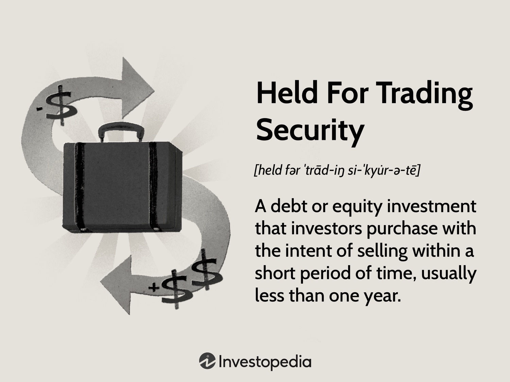

The intersection of financial assets, fair value adjustments, held-for-trading securities, and algorithmic trading represents a pivotal convergence point in modern financial markets. Each element plays a crucial role in influencing investment decisions and shaping financial reporting. Financial assets, considered as investments purposed for income generation or profit, must be accurately valued to reflect their true market worth through fair value adjustments. This practice is essential for maintaining transparency in financial statements and ensuring that the reported earnings are a true reflection of a company's performance and asset management efficacy.

Held-for-trading securities, a specific classification of financial assets, are characterized by their intent for quick resale to capture short-term market inefficiencies. They stand distinct from other asset categories such as held-to-maturity or available-for-sale securities, reflecting a strategic choice to capitalize on market volatility. Their valuation and the consequent adjustments are vital in making impromptu investment decisions and adhering to regulatory standards.



Algorithmic trading introduces a technological dimension that has revolutionized the way trades are executed. By employing sophisticated algorithms, traders can execute orders at speed and precision beyond human capability, capitalizing on asset price movements with minimal delay. The integration of algorithmic trading with held-for-trading securities provides traders with tools to maximize short-term gains and enhance market liquidity. However, this fusion demands a deep comprehension of how real-time fair value adjustments influence algorithmic decisions and trading outcomes.

For both seasoned investors and newcomers, comprehending the joint dynamics of these components is paramount. Mastery of the subject equips market participants with strategic insights into crafting robust investment strategies and understanding financial disclosures. This exploration will lay the groundwork for assessing each component's role and their synergetic impact on the financial ecosystem. With the evolving nature of markets and technological advancements, keeping abreast of these concepts is imperative for sustained success and adaptability in the financial profession.

## Table of Contents

## Understanding Financial Assets and Fair Value Adjustment

Financial assets are resources that individuals or entities hold with the primary goal of generating income or profits. These assets encompass a wide range of investments, including stocks, bonds, mutual funds, and derivatives. The valuation and reporting of these financial assets are a crucial aspect of financial accounting, directly impacting both earnings and financial statements.

Fair value adjustment is the process of estimating the current market value of an asset or liability. This practice is integral to accurate financial reporting as it reflects true market conditions, thereby ensuring that investors and stakeholders have a realistic view of a company's financial health. The fair value of an asset can fluctuate due to changes in market conditions, interest rates, or economic forecasts, which necessitate regular adjustments.

Accounting principles and standards such as the International Financial Reporting Standards (IFRS) and Generally Accepted Accounting Principles (GAAP) provide guidance on fair value measurement. These standards establish a framework for recognizing and measuring financial assets. According to IFRS 13, fair value is defined as "the price that would be received to sell an asset or paid to transfer a liability in an orderly transaction between market participants at the measurement date."

The methodology for determining fair value typically involves the use of market-based measurements whenever possible. This can include quoted market prices for identical or similar assets. In the absence of such prices, more complex valuation techniques like discounted cash flow models may be employed.

Adjustments to fair value can have a significant impact on a company's balance sheet. For instance, an increase in fair value increases the asset's value on the balance sheet and may result in unrealized gains, which improve profitability metrics. Conversely, a decrease in fair value can lead to unrealized losses that might adversely affect a company’s financial appeal. Thus, accurate valuation is crucial for both management and investors to make informed decisions.

Python can be employed to illustrate a simple example of fair value adjustment using an asset's market price data:

```python
import numpy as np

# Example: Fair value adjustment of a stock
market_prices = np.array([100, 105, 110, 102, 108])  # Historical market prices of the asset
current_price = 110  # Current market price of the asset

# Calculate the average market price
average_price = np.mean(market_prices)

# Determine the fair value adjustment
fair_value_adjustment = current_price - average_price

print(f"Fair Value Adjustment: {fair_value_adjustment:.2f}")
```

In this example, the fair value adjustment is calculated by comparing the current market price with the average price over a specific period. A positive adjustment indicates an increase in value, while a negative adjustment suggests a decrease.

In conclusion, financial assets and fair value adjustments play a pivotal role in financial reporting and investment decision-making. Understanding the principles behind fair value adjustments and their effects on financial statements is essential for maintaining accurate and reliable accounting practices, thereby enhancing the transparency and trustworthiness of financial information presented to investors and stakeholders.

## An Insight into Held-for-Trading Securities

Held-for-trading securities are financial instruments acquired by investors with the primary goal of generating profits through short-term market movements. Unlike long-term investment securities, these assets are purchased for the potential of quick gains due to their [liquidity](/wiki/liquidity-risk-premium) and sensitivity to market price fluctuations. Typically, held-for-trading securities include stocks, bonds, derivatives, and other financial instruments that can be rapidly bought and sold.

From an accounting perspective, held-for-trading securities are classified as current assets on a company's balance sheet. This classification reflects their status as assets intended to be held for only a brief period, usually less than a year. One crucial aspect of these securities is that their value must be adjusted on financial statements to reflect their fair market value. This adjustment ensures that the income statement accurately portrays unrealized gains and losses associated with these assets.

### Differentiation from Other Asset Classifications

Held-for-trading securities differ significantly from other classifications, such as held-to-maturity and available-for-sale securities. Held-to-maturity securities are those that a company intends to keep until they mature, which generally means they are not exposed to market price [volatility](/wiki/volatility-trading-strategies) in the same way. These are measured at their amortized cost and do not require fair value adjustments on financial statements unless they are impaired. Available-for-sale securities, on the other hand, are those a company is willing to sell before maturity but not necessarily in the short term. These securities are also adjusted to their fair value but impact other comprehensive income rather than directly affecting the income statement like held-for-trading securities.

### Role in Active Trading Strategies

The classification of securities as held-for-trading has significant implications for trading strategies. Because these assets are highly liquid and sensitive to price changes, they are ideal for active trading strategies that aim to exploit short-term market inefficiencies. Traders who employ these strategies seek to capitalize on quick price movements, using techniques such as [momentum](/wiki/momentum) trading, [arbitrage](/wiki/arbitrage), and even [algorithmic trading](/wiki/algorithmic-trading), which uses computer algorithms to execute trades at optimal times.

Given their designation as current assets, companies must comply with financial regulations that require full disclosure of fair value adjustments and trading intentions. This compliance ensures transparency in financial reporting, providing investors and regulators with a clear picture of a company's trading activities and market exposure.

Understanding the nuances of held-for-trading securities—how they are categorized, the requirement for fair value adjustments, and their strategic role—can assist traders and financial analysts in crafting effective investment strategies. This knowledge not only aids in achieving compliance with financial regulations but also enhances decision-making processes by aligning asset management with market objectives and risk profiles.

## Algorithmic Trading: A Technological Revolution

Algorithmic trading, a transformative development in financial markets, employs advanced computer algorithms to automate trading processes. This method enables the execution of trades at optimal times and speeds, often capitalizing on minute market fluctuations that are impractical for human traders to exploit efficiently. By leveraging algorithmic trading, financial institutions and traders seek to enhance trading efficiency, reduce transaction costs, and increase the potential for short-term gains, particularly when dealing with held-for-trading securities.

Held-for-trading securities, characterized by their short-term holding period and frequent market valuation adjustments, are particularly well-suited to algorithmic trading. Algorithms, designed to analyze large datasets and execute trades based on predefined criteria, integrate seamlessly with the dynamic nature of these securities. The speed and precision offered by algorithms enable traders to respond almost instantaneously to market events, thus maximizing profit potential from fluctuations in security prices. For example, a simple trading algorithm could be structured in Python as follows:

```python
# Sample Python code for a basic trading algorithm
import pandas as pd

# Load market data
data = pd.read_csv('market_data.csv')

# Define simple moving average strategy
short_window = 20
long_window = 50

# Calculate moving averages
data['Short_MA'] = data['Close'].rolling(window=short_window).mean()
data['Long_MA'] = data['Close'].rolling(window=long_window).mean()

# Create signals
data['Signal'] = 0
data['Signal'][short_window:] = np.where(data['Short_MA'][short_window:] > data['Long_MA'][short_window:], 1, 0)

# Generate trading orders
data['Position'] = data['Signal'].diff()

# Display the data with signals
print(data)
```

Technology and data analysis play pivotal roles in refining trading strategies within algorithmic trading. Advances in [machine learning](/wiki/machine-learning) and [artificial intelligence](/wiki/ai-artificial-intelligence) allow for the development of complex algorithms capable of identifying patterns in historical trading data and forecasting future market movements. This capability not only enhances market efficiency by ensuring more accurate pricing but also aids in the formulation of strategies that capitalize on transient market opportunities.

The rewards of algorithmic trading are matched by inherent risks. The reliance on pre-programmed algorithms means that any flaws in the logic or unforeseen market conditions can lead to significant losses. Furthermore, the speed at which transactions occur can exacerbate market volatility, as evidenced in several past instances of flash crashes. Thus, a comprehensive risk management framework, incorporating both automated safeguards and human oversight, is crucial to mitigating these risks.

In summary, algorithmic trading represents a significant technological advancement in the financial trading landscape. Its integration with held-for-trading securities offers lucrative opportunities for maximizing short-term gains, though it demands a rigorous approach to technology deployment and risk management. As computational power and data analysis capabilities continue to evolve, algorithmic trading is poised to further transform the efficiency and dynamics of global financial markets.

## The Interplay of Fair Value Adjustments in Algorithmic Trading

Fair value adjustments play a pivotal role in the operation of algorithmic trading, as they ensure that financial instruments are accurately priced, reflecting current market conditions. The synchronization of real-time market data with valuation models is essential for making informed trading decisions and optimizing outcomes.

Real-time market valuation is integral to algorithmic trading because it allows for the precise adjustment of trading strategies in response to market fluctuations. Algorithms, programmed to respond to changes in asset prices, rely on fair value adjustments to maintain the relevance of their strategies. This real-time updating enables traders to capitalize on short-term price movements, enhancing the potential for profit and reducing the risk of holding mispriced assets.

Algorithmic traders employ several strategies to leverage fair value adjustments in predicting market movements. One common approach is the use of [statistical arbitrage](/wiki/statistical-arbitrage), where algorithms identify and exploit pricing inefficiencies between correlated financial instruments. By leveraging up-to-date fair value estimates, traders can quickly execute trades that correct these discrepancies. Additionally, machine learning algorithms are increasingly utilized to anticipate future price trends based on historical data and real-time market conditions. These models incorporate fair value inputs to refine predictions and improve accuracy.

The continuous flow of market data and ongoing valuation assessments are critical in optimizing trading performance. Algorithms analyze vast datasets to detect patterns and anomalies that signal trading opportunities. They apply techniques such as moving averages, relative strength index (RSI), and Bollinger Bands, which depend on accurate price valuations. Here is an example of how an algorithm might use Python to implement a simple moving average crossover strategy:

```python
import pandas as pd

def moving_average_crossover(data, short_window=40, long_window=100):
    data['short_mavg'] = data['close'].rolling(window=short_window, min_periods=1).mean()
    data['long_mavg'] = data['close'].rolling(window=long_window, min_periods=1).mean()

    data['signal'] = 0
    data['signal'][short_window:] = np.where(
        data['short_mavg'][short_window:] > data['long_mavg'][short_window:], 1, 0
    )

    data['positions'] = data['signal'].diff()
    return data

# Assuming 'market_data' is a DataFrame with a 'close' price column.
market_data = pd.DataFrame(...) # Load your market data
strategy_result = moving_average_crossover(market_data)
```

In this code snippet, the algorithm calculates short-term and long-term moving averages to generate buy or sell signals based on market price inputs. Accurate fair value calculations enhance the precision of these signals, contributing to better trading outcomes.

In summary, the effective integration of fair value adjustments in algorithmic trading facilitates enhanced decision-making and improved profitability. By deploying strategies that incorporate real-time price evaluations and continuous market assessments, traders can maintain competitive advantages and optimize their positions amidst fluctuating market conditions.

## Case Studies and Practical Examples

While the PDF document intended for reference is absent, we can extract meaningful insights regarding the application of fair value adjustments, held-for-trading securities, and algorithmic trading through well-documented case studies. These examples provide practical frameworks for understanding how these financial concepts are leveraged by industry leaders to optimize performance in dynamic markets.

### Fair Value Adjustments in Trading Strategies

One notable example is the implementation of fair value accounting by **Goldman Sachs**. They meticulously adjust their financial assets to reflect current market conditions, thus providing transparent and timely information to their stakeholders. By adopting International Financial Reporting Standards (IFRS) for fair value measurements, Goldman Sachs improves its decision-making processes regarding asset purchases and sales. Their quarterly financial reports often highlight how adjusting asset values based on market fluctuations affects their earnings and overall financial health, ensuring investors have a clear understanding of the company's financial position.

### Algorithmic Trading and Held-for-Trading Securities

A profound implementation of algorithmic trading can be observed in **Renaissance Technologies**, a [hedge fund](/wiki/hedge-fund-trading-strategies) known for its highly effective [quantitative trading](/wiki/quantitative-trading) strategies. They employ complex algorithms to trade held-for-trading securities, capitalizing on micro-movements in stock prices. Renaissance Technologies' approach involves analyzing large datasets to identify trading opportunities, allowing them to execute trades at high speed and with remarkable precision.

The Fund's `Medallion Fund` is particularly noteworthy, as it uses predictive models and statistical arbitrage to maximize short-term investments. The integration of machine learning and statistical analysis enables Renaissance to predict market trends effectively, adjusting their strategies in response to real-time data and market conditions.

### Integrating Fair Value Adjustments with Algorithmic Trading

A successful case of integrating fair value adjustments with algorithmic trading strategies is evident in the operations of **Two Sigma Investments**. This firm uses data-driven, technology-focused approaches to refine its trading strategies. By implementing algorithmic systems that account for real-time market data and fair value adjustments, Two Sigma identifies undervalued or overvalued assets. This strategy optimizes their investment decisions and enhances trading outputs.

Two Sigma’s algorithms [factor](/wiki/factor-investing) in continuous valuation assessments, allowing them to recalibrate their market positions swiftly in response to price changes. This level of agility and precision underscores the effectiveness of combining fair value adjustments with robust algorithmic trading systems.

### Best Practices and Common Pitfalls

These case studies emphasize several best practices, including:

1. **Technological Integration**: Using advanced technologies for data analysis and trading optimization is crucial.

2. **Compliance and Standardization**: Adhering to fair value accounting standards ensures transparency and aids strategic planning for investors.

3. **Continuous Data Monitoring**: Real-time data is essential for adapting strategies to current market conditions.

Common pitfalls to avoid include over-reliance on algorithms without adequate human oversight, leading to potential market misjudgments or regulatory compliance issues. Furthermore, failure to update algorithms and datasets continuously can diminish trading efficacy and increase risk exposure.

In conclusion, organizations utilizing fair value adjustments effectively in conjunction with algorithmic trading gain a significant competitive edge in financial markets. The precise implementation of these strategies results in optimized trading performance and enhanced financial reporting, serving as valuable lessons for emerging market participants.

## Conclusion

In summary, the intricate relationship between fair value adjustments, held-for-trading securities, and algorithmic trading is central to understanding the modern financial landscape. Fair value adjustments ensure that financial statements reflect current market conditions, providing transparency and relevance to investors. Held-for-trading securities, with their short-term profit focus, align well with the dynamic nature of algorithmic trading, which optimizes trade execution using sophisticated algorithms and real-time data.

The importance of understanding these interactions lies in their ability to inform investment decisions and financial reporting. Accurate fair value assessments impact not just regulatory compliance but also the strategic positioning of investors in fast-moving markets. With algorithmic trading becoming increasingly prevalent, the capacity to integrate these data-driven techniques with fair value insights offers a significant competitive edge.

Looking ahead, the trajectory of financial asset management is poised for continued evolution, driven by advancements in technology and data analytics. Emerging trends suggest a future where real-time valuation and trading automation become more refined, necessitating ongoing learning and adaptation. As markets become more complex, the fusion of financial acumen with technological prowess will be crucial for investors and institutions alike.

Continuous education and a proactive approach toward embracing technological shifts will be essential for staying ahead in this rapidly changing environment. Engaging with cutting-edge research and leveraging innovative tools will empower professionals to navigate the future of financial markets effectively.

## References & Further Reading

[1]: Christensen, J. A., & Demski, J. S. (2003). ["Accounting Theory: An Information Content Perspective."](https://searchworks.stanford.edu/view/10013829) McGraw-Hill.

[2]: ["Fair Value Measurement"](https://viewpoint.pwc.com/dt/us/en/pwc/accounting_guides/fair_value_measureme/fair_value_measureme__9_US/chapter_4_concepts_u_US/45_inputs_to_fair_va_US.html) International Financial Reporting Standards (IFRS) 13.

[3]: Aldridge, I. (2013). ["High-Frequency Trading: A Practical Guide to Algorithmic Strategies and Trading Systems."](https://www.amazon.com/High-Frequency-Trading-Practical-Algorithmic-Strategies/dp/1118343506) Wiley.

[4]: Harris, L. (2003). ["Trading and Exchanges: Market Microstructure for Practitioners."](https://www.amazon.com/Trading-Exchanges-Market-Microstructure-Practitioners/dp/0195144708) Oxford University Press.

[5]: Golub, A. & Crum, C. (2009). ["Risk Management for Algorithms: Avoiding Errant Trades That Impact the Entire Industry."](https://www.semanticscholar.org/paper/Risk-Management-Lessons-Worth-Remembering-from-the-Golub-Crum/2bc7fbd50472105bb3dd7c2d51456fba1949d3b2) IEEE.