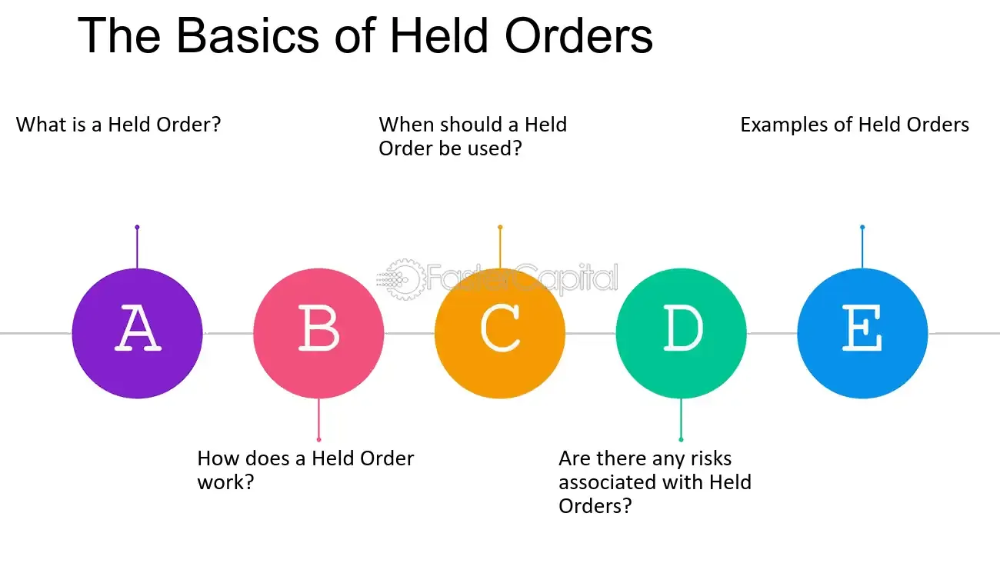

## Table of Contents

## What is a held order in trading?

A held order in trading is when a broker gets an order from a client but doesn't act on it right away. Instead, the broker waits for the right moment to buy or sell the stocks. This can be useful if the client wants to buy or sell at a specific price or under certain market conditions.

For example, if a client wants to buy a stock but only if the price drops to a certain level, the broker will hold the order until that price is reached. This can help the client get a better deal. However, there's also a risk because the market can change quickly, and the order might not get filled if the price doesn't reach the desired level.

## How does a held order differ from a not-held order?

A held order and a not-held order are different in how a broker handles them. With a held order, the broker waits for the right moment to buy or sell. The client might want to buy a stock at a specific price, so the broker holds the order until that price is reached. This can help the client get a better deal, but there's a risk because the market can change quickly.

On the other hand, a not-held order gives the broker more freedom. The broker can decide when to buy or sell without waiting for specific conditions. This means the broker can act quickly to get the best possible price for the client. However, this also means the client has less control over when the order is filled.

In simple terms, a held order is more controlled and waits for certain conditions, while a not-held order lets the broker act faster and with more flexibility. Both have their pros and cons depending on what the client wants and how the market is moving.

## What are the basic mechanisms of executing a held order?

When a client gives a held order, the broker waits for the right time to buy or sell. The client might say, "Buy this stock if the price goes down to $50." So, the broker keeps an eye on the stock price and waits until it hits $50 before buying. This helps the client get the stock at the price they want. But, there's a risk because if the price never reaches $50, the order won't be filled.

The broker uses special tools and systems to watch the stock price all the time. These tools alert the broker when the price hits the target. Once the price is right, the broker quickly places the order to buy or sell. This way, the broker makes sure the order is filled at the best possible time, following the client's instructions.

## Can you explain the role of a broker in managing held orders?

A broker plays a key role in managing held orders by waiting for the right time to buy or sell based on the client's instructions. When a client gives a held order, they might say, "Buy this stock when it reaches $50." The broker then keeps a close watch on the stock's price, using special tools and systems to track it. These tools alert the broker when the price hits the target, so the broker knows exactly when to act.

Once the price reaches the desired level, the broker quickly places the order to buy or sell. This helps make sure the order is filled at the best possible time, following the client's wishes. The broker's job is to be patient and attentive, waiting for the right moment to execute the order while keeping the client's goals in mind. This way, the client can get the stock at the price they want, but there's always a risk that the price might never reach the target, and the order won't be filled.

## What are the common applications of held orders in the stock market?

Held orders are often used by people who want to buy or sell stocks at a specific price. For example, if someone wants to buy a stock but only if the price drops to $50, they can give their broker a held order. The broker will then wait until the stock price reaches $50 before buying it. This helps the person get the stock at the price they want, which can save them money.

Another common use of held orders is for people who want to sell a stock at a certain price. If someone owns a stock and wants to sell it when the price goes up to $100, they can use a held order. The broker will keep an eye on the stock price and sell it once it hits $100. This way, the person can make sure they sell the stock at the best possible price, which can help them earn more money.

## How do held orders impact trading strategies?

Held orders can really change how people trade. They let people buy or sell stocks at the exact price they want. This means someone can wait for a stock to go down to a certain price before buying it. This can be a smart move if they think the stock will keep going down. But, it can also be risky because if the stock never reaches that price, they might miss out on buying it at all.

Using held orders also helps people sell stocks at the best time. If someone owns a stock and wants to sell it when it goes up to a certain price, a held order can make that happen. This can help them make more money because they can wait for the stock to reach its highest price before selling. But, like with buying, there's a risk that the stock might not reach that price, so they might have to wait a long time or miss out on selling at a good price.

## What are the regulatory considerations for using held orders?

When using held orders, there are rules that brokers and clients need to follow. These rules are set by groups like the Securities and Exchange Commission (SEC) in the U.S. The main rule is that brokers must do their best to get the best price for their clients. They need to be careful and fair when they handle held orders. They also need to keep good records of all orders, so they can show they did everything right.

Another thing to think about is how long a held order can stay open. Some rules say that if an order is not filled after a certain time, it might need to be canceled or changed. This helps make sure that orders are not forgotten and that clients get what they want. Also, brokers need to tell their clients about any risks, like the chance that the order might not be filled if the market doesn't move the right way. This way, clients know what they are getting into when they use held orders.

## How can held orders be used to manage risk in trading?

Held orders can help manage risk in trading by letting people buy or sell stocks at a price they choose. For example, if someone thinks a stock might go down but wants to buy it at a lower price, they can set a held order to buy at that price. This way, they don't have to buy the stock at a high price and can wait for a better deal. It helps them avoid losing money if the stock price drops more than they expect.

Using held orders also helps people sell stocks at a price they are happy with. If someone owns a stock and wants to sell it when it goes up to a certain price, they can set a held order to sell at that price. This can help them make sure they sell the stock at the best time and get the most money for it. But, they need to remember that if the stock never reaches that price, they might have to keep the stock longer than they want or sell it at a lower price.

## What are the advantages of using held orders for institutional investors?

Held orders can be really helpful for big investors like institutions. They can use held orders to buy or sell stocks at the exact price they want. This is good because it lets them wait for the best time to make a move. For example, if an institution wants to buy a lot of stock but only if the price goes down to a certain level, they can use a held order. This way, they can save money and get a better deal on their investment.

Another advantage is that held orders help institutions manage their big trades without moving the market too much. When big investors buy or sell a lot of stock at once, it can change the price. But with held orders, they can spread out their trades over time. This means they can buy or sell without causing big price changes. It helps them keep their trading secret and get the best prices for their clients.

## Can you discuss any potential drawbacks or limitations of held orders?

One big problem with held orders is that they might not get filled. If someone wants to buy a stock at a certain price, they have to wait for the price to reach that level. But what if the price never goes down to what they want? They could miss out on buying the stock at all. This can be frustrating and risky, especially if the stock starts to go up instead. It's like waiting for a sale that never happens.

Another issue is that held orders can take a long time to fill. If someone is waiting for a stock to reach a certain price, it might take days, weeks, or even months. During that time, the market can change a lot. The stock might go up, and they miss out on making money. Or, something big might happen in the world that changes the stock's price. So, held orders can make people wait longer than they want, and they might miss other good chances to trade.

## How do technological advancements affect the use of held orders?

Technology has made it easier to use held orders. Now, brokers can use special computer programs to watch stock prices all the time. These programs can send alerts when a stock reaches the price someone wants. This means brokers don't have to watch the market all day and night. They can set up the held order and let the computer do the work. This makes it faster and easier to buy or sell stocks at the right time.

But, technology also brings new challenges. Sometimes, the computer programs can make mistakes or the internet might go down. If that happens, the held order might not work the way it should. Also, with so many people using technology to trade, the market can move very quickly. This means the price someone wants might only last for a short time. So, even with technology, there's still a risk that the held order won't get filled at the right price.

## What are some advanced strategies that incorporate held orders for expert traders?

Expert traders can use held orders to make smart moves in the market. One advanced strategy is called "layering." This is when a trader places many held orders at different prices. They do this to see how the market reacts and to find the best price to buy or sell. For example, a trader might put in held orders to buy a stock at $50, $51, and $52. By watching which orders get filled, they can learn about the market and make better choices. This helps them get the best deal and manage their risk.

Another strategy is called "order slicing." This is when a trader breaks up a big order into smaller held orders. They do this to keep the market from moving too much because of their trade. For example, if a trader wants to buy a million shares of a stock, they might put in held orders for 100,000 shares at a time. This way, they can slowly buy the shares without making the price go up too much. It helps them get a better price and keep their trading plans secret. Both of these strategies show how held orders can be used in smart ways to trade better.

## References & Further Reading

[1]: Aldridge, I. (2013). ["High-Frequency Trading: A Practical Guide to Algorithmic Strategies and Trading Systems."](https://www.amazon.com/High-Frequency-Trading-Practical-Algorithmic-Strategies/dp/1118343506) John Wiley & Sons.

[2]: Narang, R. K. (2013). ["Inside the Black Box: A Simple Guide to Quantitative and High-Frequency Trading."](https://onlinelibrary.wiley.com/doi/book/10.1002/9781118662717) John Wiley & Sons.

[3]: Kissell, R. (2013). ["The Science of Algorithmic Trading and Portfolio Management."](https://www.sciencedirect.com/book/9780124016897/the-science-of-algorithmic-trading-and-portfolio-management) Academic Press.

[4]: Harris, L. (2002). ["Trading and Exchanges: Market Microstructure for Practitioners."](https://academic.oup.com/book/52292) Oxford University Press.

[5]: Hasbrouck, J. (2007). ["Empirical Market Microstructure: The Institutions, Economics, and Econometrics of Securities Trading."](https://academic.oup.com/book/52241) Oxford University Press.