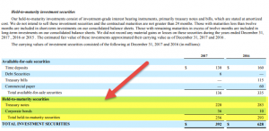

In the ever-evolving landscape of financial investments, fixed income securities play a vital role in both portfolio diversification and risk management. These investments provide investors with a predictable income stream and are typically viewed as safer than other asset classes like equities. Among fixed income assets, held-to-maturity (HTM) securities are particularly attractive for those seeking stability and certainty in returns. HTM securities are debt instruments that investors commit to holding until a specified maturity date. This commitment reflects the investor's confidence in the creditworthiness of the issuer and the stability of the securities' returns.

As technology advances, algorithmic trading has reshaped the approach to managing these securities. Algorithms allow for faster, more efficient trading by automating processes and enabling rapid responses to market changes. This technological integration in financial markets provides new opportunities for enhancing investment strategies. Algorithmic trading can quickly adjust portfolios to align with market dynamics, potentially optimizing the management of HTM securities.



Understanding the interaction between fixed income investments, HTM securities, and algorithmic trading is essential for investors. It provides a framework for maximizing returns while minimizing risk in today's complex financial markets. By leveraging both traditional investment principles and cutting-edge technology, investors can better navigate challenges and opportunities in the evolving financial landscape.

## Table of Contents

## Understanding Fixed Income Financial Investments

Fixed income investments are a category of financial instruments designed to provide investors with a consistent income stream in the form of regular, fixed interest payments. These securities are primarily used by entities such as governments, corporations, and other organizations to raise necessary capital. The nature of fixed income investments offers certain unique characteristics that distinguish them from other financial assets.

One of the hallmark features of fixed income securities is their predictable income streams. Unlike equities, where dividends can fluctuate based on company performance and other factors, fixed income securities offer payments that are typically set in advance. This reliability makes them an attractive option for investors seeking steady revenue, as it allows for more precise financial planning.

These investments usually carry lower risk compared to equities. The predictability of interest payments, along with the return of principal upon maturity, makes fixed income securities less volatile. This characteristic makes them particularly appealing during times of market uncertainty, providing a safer harbor for investors looking to mitigate risks in their portfolios.

Common types of fixed income securities include bonds, treasury bills, and money market instruments. Bonds, which represent loans made to the issuer by the investor, are a cornerstone of fixed income investing. These can range from government bonds, which are generally considered very safe, to corporate bonds, which may offer higher yields in compensation for greater risk. Treasury bills, typically issued by governments, are short-term securities that mature in a year or less and are used to manage [liquidity](/wiki/liquidity-risk-premium) needs. Money market instruments, such as certificates of deposit and commercial paper, provide short-term funding for financial institutions and corporations.

Investors are drawn to fixed income investments not only for their stability but also for their ability to preserve capital. This preservation is achieved through the return of the original investment amount at maturity, assuming there are no defaults. Furthermore, fixed income securities often serve as a diversification tool within an investment portfolio. By spreading risk and reducing dependency on volatile equity markets, these instruments can enhance overall portfolio performance.

Overall, fixed income investments offer a blend of stability, income generation, and risk mitigation, making them an integral part of diversified investment strategies. Understanding the nuances of these securities can help investors make informed decisions to align their investment goals with their risk tolerance and time horizons.

## Held-to-Maturity Securities: A Deep Dive

Held-to-maturity (HTM) securities are a specific classification of fixed income securities that an investor has the intention and ability to hold until the securities reach their maturity date. This intent is significant because it influences how these securities are reported and treated in financial statements.

HTM securities are accounted for differently than other classifications such as trading or available-for-sale securities. They are recorded on the balance sheet at their amortized cost rather than their market value. The amortized cost is calculated using the effective [interest rate](/wiki/interest-rate-trading-strategies) method, ensuring that the periodic interest income recognized on the financial statements reflects the yield to maturity of the investment. This method mitigates fluctuations in reported earnings due to changes in market interest rates and provides a more stable depiction of financial performance[^1^].

One of the primary advantages of HTM securities is the consistent stream of income they provide. Investors receive interest payments at regular intervals, which can be particularly appealing in uncertain economic environments where steady income is prioritized. Additionally, by holding the securities to maturity, investors can effectively manage interest rate risk as the fixed returns are locked in, insulating them from the [volatility](/wiki/volatility-trading-strategies) of interest rate changes in the market.

HTM securities, however, are generally less liquid compared to other types of investments. Since these assets are not intended to be sold before maturity, they may not be easily converted into cash without potential loss of principal. This characteristic can be seen as a disadvantage for investors needing immediate liquidity but can also serve as a commitment device, ensuring a stable income stream until maturity.

The decision to classify a security as held-to-maturity is indicative of the investor's confidence in both the stability and creditworthiness of the issuer. This classification signals a long-term investment strategy focused on stability and predictability rather than short-term capital gains. Furthermore, stringent accounting guidelines require clear documentation of the intent and ability to hold such securities until they mature, reinforcing the investor's commitment to this approach[^2^].

[^1^]: Financial Accounting Standards Board (FASB) guidelines and International Financial Reporting Standards (IFRS) provide detailed methodologies for accounting HTM securities.
[^2^]: U.S. Securities and Exchange Commission (SEC) regulations on reporting of held-to-maturity securities in corporate financial statements.

## The Rise of Algorithmic Trading in Fixed Income Markets

Algorithmic trading, often termed algo trading, employs computer algorithms to automate trading decisions, execution, and strategies. This technology-driven approach has gained significant traction in fixed income markets, where it is used to optimize trading efficiency and reduce costs. The primary advantage of [algorithmic trading](/wiki/algorithmic-trading) is its ability to process large volumes of fixed income securities rapidly, facilitating trades at much higher speeds than traditional trading methods.

In fixed income markets, algorithmic trading enhances the dynamism and responsiveness of trading activities. Algorithms can instantly react to market changes, making trades more dynamic and adaptable. This capability is crucial in fixed income markets, where market conditions can fluctuate rapidly due to economic indicators, interest rate changes, and geopolitical events.

Fixed income markets pose unique challenges to algorithmic trading, primarily due to the market's structure and liquidity issues. Unlike equity markets, where information is more uniformly available, fixed income markets are often characterized by fragmented information and varying levels of transparency. This complexity can make it difficult for algorithms to make accurate predictions or trading decisions, necessitating advanced analytical techniques and robust data processing capabilities.

Moreover, while algorithmic trading introduces efficiencies, it also presents potential risks such as overshooting of prices and increased volatility, particularly in less liquid segments of the fixed income market. Thus, careful calibration of algorithms is necessary to mitigate these risks, ensuring that they operate effectively within the specific parameters of fixed income markets.

To illustrate the mechanics behind algorithmic trading, consider a basic example using Python. Here we outline a simple algorithmic strategy for trading fixed income securities based on moving averages:

```python
import pandas as pd

# Sample data: hypothetical bond prices
data = {'Date': ['2023-01-01', '2023-01-02', '2023-01-03', '2023-01-04', '2023-01-05'],
        'Price': [100, 102, 101, 103, 105]}
df = pd.DataFrame(data)
df['Date'] = pd.to_datetime(df['Date'])

# Calculate moving averages
df['Short_MA'] = df['Price'].rolling(window=2).mean()
df['Long_MA'] = df['Price'].rolling(window=4).mean()

# Generate trading signals
df['Signal'] = 0  # Default no position
df.loc[df['Short_MA'] > df['Long_MA'], 'Signal'] = 1  # Buy signal
df.loc[df['Short_MA'] < df['Long_MA'], 'Signal'] = -1  # Sell signal

print(df)
```

The code above demonstrates a simple algorithmic approach using moving averages to generate buy and sell signals for fixed income securities. While simplistic, this approach illustrates the potential for algorithms to provide timely trading signals that exploit short-term price movements.

In conclusion, algorithmic trading is transforming fixed income markets by offering enhanced speed, efficiency, and adaptability. However, the complexity of these markets demands sophisticated algorithms capable of addressing structural and liquidity challenges. As such, algorithmic trading presents both opportunities and challenges for modern investors seeking to navigate the intricacies of fixed income markets.

## Synergies Between Held-to-Maturity Securities and Algorithmic Trading

Combining held-to-maturity (HTM) strategies with algorithmic trading offers significant advantages for investors seeking efficiency and precision in their investment operations. By leveraging algorithms, investors can optimize the acquisition process of HTM securities. Algorithms can analyze vast amounts of data to identify undervalued assets, providing opportunities for investors to enhance returns. This optimization process relies on the capability of algorithms to detect pricing inefficiencies and market trends that may not be immediately apparent to human traders.

Algorithmic trading also aids in managing portfolio duration and interest rate risk. Automated rebalancing decisions can be executed using predefined criteria, allowing for swift adjustments in response to fluctuating market conditions. By automating these processes, investors can maintain optimal portfolio composition without constant manual oversight, thereby reducing exposure to interest rate volatility and other market risks.

Cost efficiency is another advantage of integrating algorithmic trading with HTM securities. Algorithms can execute trades at favorable prices by quickly responding to market changes, thereby minimizing transaction costs. The ability to continuously scan the market enables algorithms to time trades optimally, ensuring that investors achieve the best possible prices while minimizing slippage and other costs associated with trading.

Despite these benefits, potential challenges must be acknowledged. Market distortion is a notable concern, as high-frequency trading driven by algorithms can lead to rapid price movements that may not reflect fundamental asset values. Additionally, the effectiveness of algorithmic trading hinges on the accuracy and completeness of the data utilized. Inaccurate or incomplete data can lead to erroneous trading decisions, potentially resulting in financial losses.

Thus, while algorithmic trading offers distinct advantages in the management of HTM securities, it is crucial for investors to remain vigilant about potential market distortions and ensure the reliability of the data driving their algorithms. Balancing technological advantages with thoughtful strategy remains key in optimizing investment outcomes.

## Challenges and Considerations

Algorithmic trading in fixed income markets provides numerous advantages but also comes with significant challenges and considerations that investors must address. One prominent issue is technological dependency. As trading processes automate, the reliance on technology increases, which can introduce vulnerabilities. Cybersecurity risks are particularly concerning as they can compromise trading systems, leading to financial losses and breaches of sensitive data. Therefore, implementing robust security measures is essential to safeguard data integrity and privacy.

Volatility in fixed income markets presents another challenge. If algorithms are not adequately programmed to consider all relevant variables, unexpected market shifts could result in trading strategies malfunctioning. This can lead to suboptimal trading decisions with potentially severe financial consequences. Hence, it is crucial for algorithms to incorporate comprehensive data analysis to account for the various factors influencing market conditions.

Moreover, while algorithms can efficiently handle a large [volume](/wiki/volume-trading-strategy) of trades, they should not replace human judgment entirely. Human intuition and expertise play a critical role in interpreting complex market signals that may not be immediately apparent through algorithmic analysis. Maintaining a balanced approach ensures that algorithmic trading supports, rather than supplants, human decision-making processes.

Furthermore, regulatory compliance is a vital consideration in algorithmic trading. Regulations surrounding financial markets evolve, and staying informed about these changes is crucial for ensuring compliance. Investors and institutions must regularly review and update their trading practices to align with new regulatory standards.

In conclusion, while algorithms enhance speed and efficiency in trading, investors must navigate these challenges mindfully to ensure the continued effectiveness and security of their trading strategies.

## Conclusion

Fixed income investments, especially held-to-maturity securities, offer crucial stability to investors navigating uncertain financial markets. By providing predictable returns and a safeguard against volatile market conditions, these securities act as a cornerstone for a balanced investment portfolio.

Algorithmic trading has significantly transformed the management of fixed income securities, introducing elements of agility and efficiency into trading strategies. Algorithms can swiftly analyze vast amounts of data to generate trading signals, execute trades at optimal prices, and adjust exposures dynamically in response to market changes. This increased agility aids investors in capitalizing on fleeting market opportunities that might otherwise be missed with traditional trading methods.

Nevertheless, while algorithmic trading offers numerous advantages, it also introduces a set of challenges requiring careful consideration. Technological dependency and the risk of cyber threats necessitate robust security measures to protect sensitive information and maintain data integrity. Moreover, over-reliance on algorithms at the expense of human judgment could lead to suboptimal decision-making, particularly in scenarios where algorithms may not account for every market nuance.

Integrating technology with traditional investment approaches enables investors to extract higher value from their portfolios. By combining the precision of algorithms with strategic human oversight, investors can enhance portfolio performance and manage risks more effectively. This synergy allows for the rebalancing of portfolios in a manner that caters to both immediate market dynamics and long-term financial goals.

As the financial environment continues to evolve, staying informed and adaptable is crucial for navigating opportunities and challenges in fixed income investments and algorithmic trading. Continuous learning and adaptation to emerging technologies and market trends will be key for investors seeking to maintain a competitive edge. As technology progresses and market conditions shift, investors must remain vigilant and proactive, ensuring their strategies are both innovative and resilient.

## References & Further Reading

[1]: ["Held-to-Maturity Securities: Accounting and Reporting by Corporations"](https://www.investopedia.com/terms/h/held-to-maturity-security.asp) - U.S. Securities and Exchange Commission

[2]: "Fixed Income Securities: Tools for Today's Markets" by Bruce Tuckman and Angel Serrat - A comprehensive book covering the fundamental concepts of fixed income securities.

[3]: ["The Art of Algorithmic Trading: How to Make a Fortune in Short Time"](https://www.investopedia.com/articles/active-trading/101014/basics-algorithmic-trading-concepts-and-examples.asp) by Justine Larson

[4]: "Algorithmic Trading and DMA: An Introduction to Direct Access Trading Strategies" by Barry Johnson - A book outlining strategies and techniques in algorithmic trading.

[5]: ["Financial Accounting Standards Board (FASB) - Accounting Standards Codification"](https://fasb.org/standards) - The source of authoritative U.S. generally accepted accounting principles (GAAP).