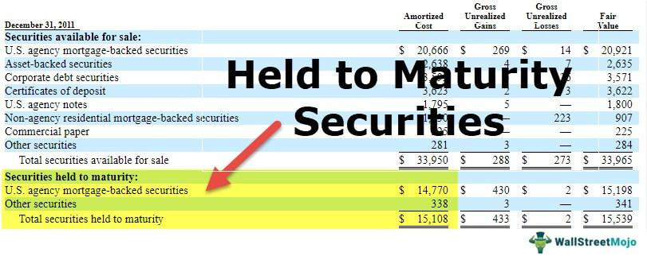

## Table of Contents

## What are held-to-maturity securities?

Held-to-maturity securities are investments that a company plans to keep until they reach their due date. These are usually bonds or other debt instruments that have a fixed interest rate and a set time when they will mature. Companies buy these securities because they want a steady and predictable income stream. By holding onto them until they mature, the company knows exactly how much money it will get back, which helps with financial planning.

When a company decides to classify a security as held-to-maturity, it must follow strict accounting rules. These rules say that the security should be recorded on the company's balance sheet at its original cost, and any interest earned should be reported as income over time. The company cannot sell these securities before they mature unless there is a very good reason, like a sudden need for cash. If a company does sell these securities early too often, it might not be allowed to use this classification in the future, which could affect how it reports its finances.

## How do held-to-maturity securities differ from other types of securities?

Held-to-maturity securities are different from other types of securities because they are bought with the plan to keep them until they reach their maturity date. This means the company expects to hold onto these investments, usually bonds, until they pay out their full value. Other types of securities, like trading securities or available-for-sale securities, can be bought and sold more freely. Companies might buy trading securities to make quick profits by selling them when their prices go up. Available-for-sale securities can be sold if the company needs cash or if it thinks it can get a better return elsewhere.

The accounting for held-to-maturity securities is also different. These securities are recorded on the company's balance sheet at their original cost, and the interest they earn is slowly added to the company's income over time. This is different from trading securities, which are valued at their current market price, and any changes in that price can affect the company's income right away. Available-for-sale securities are also valued at market price, but changes in their value go to a part of the company's equity called "other comprehensive income," not directly to the income statement, until they are sold. So, held-to-maturity securities provide a more predictable income and less fluctuation in financial reporting compared to other types of securities.

## What are the main characteristics of held-to-maturity securities?

Held-to-maturity securities are investments that a company plans to keep until they reach their maturity date. These are usually bonds or other debt instruments that have a fixed [interest rate](/wiki/interest-rate-trading-strategies) and a set time when they will mature. Companies choose these securities because they want a steady and predictable income stream. By holding onto them until they mature, the company knows exactly how much money it will get back, which helps with financial planning.

When a company decides to classify a security as held-to-maturity, it must follow strict accounting rules. These rules say that the security should be recorded on the company's balance sheet at its original cost, and any interest earned should be reported as income over time. The company cannot sell these securities before they mature unless there is a very good reason, like a sudden need for cash. If a company sells these securities early too often, it might not be allowed to use this classification in the future, which could affect how it reports its finances.

## Why would an investor choose to hold securities to maturity?

An investor might choose to hold securities to maturity because they want a safe and predictable return on their investment. When you hold a security until it matures, you know exactly how much money you will get back at the end. This is especially helpful if you need a steady income, like if you are retired and living off your investments. By holding the security to maturity, you don't have to worry about the ups and downs of the market, which can be stressful and unpredictable.

Another reason to hold securities to maturity is to match your investment with your financial plans. If you know you will need a certain amount of money at a specific time in the future, like for a big purchase or to pay for a child's education, holding a security to maturity can be a good way to make sure that money is there when you need it. Plus, if you hold the security to maturity, you don't have to pay taxes on any gains until you actually get the money, which can be a nice tax advantage.

## What types of securities are typically classified as held-to-maturity?

Securities that are typically classified as held-to-maturity are usually bonds or other types of debt instruments. These can include government bonds, corporate bonds, and municipal bonds. They all have a fixed interest rate and a set date when they will mature. Investors choose these because they want a safe and steady return on their money. By holding the bond until it matures, they know exactly how much money they will get back at the end.

These securities are different from stocks or other investments that can go up and down in value. When you hold a bond to maturity, you don't have to worry about the market's ups and downs. This makes them a good choice for people who need a reliable income, like retirees. Also, if you plan to use the money for something specific in the future, like buying a house or paying for education, holding a bond to maturity can help make sure the money is there when you need it.

## How are held-to-maturity securities accounted for on financial statements?

Held-to-maturity securities are recorded on a company's balance sheet at their original cost. This means that when a company buys a bond, for example, it writes down the amount it paid for it. Over time, as the bond earns interest, this interest is added to the company's income statement gradually. This is different from other types of securities, where the value might change based on the market.

The company can't sell these securities before they mature unless there's a really good reason, like needing cash suddenly. If a company sells these securities early too often, it might not be allowed to use this classification in the future. This could affect how the company reports its finances. So, held-to-maturity securities provide a steady and predictable income, which is why companies choose them.

## What are the risks associated with holding securities to maturity?

Holding securities to maturity can be safe, but there are still some risks. One big risk is if the company that issued the bond goes bankrupt. If that happens, you might not get your money back at all. Another risk is interest rate risk. If interest rates go up after you buy the bond, you might miss out on better returns from new bonds that have higher rates. Also, if you need to sell the bond before it matures because you need cash, you might have to sell it for less than what you paid for it.

Inflation can also be a problem. If prices go up a lot while you're holding the bond, the money you get back at the end might not be worth as much as you thought. This is because inflation makes money less valuable over time. So, even though holding securities to maturity can give you a steady income, you need to think about these risks and make sure they fit with your overall financial plan.

## How does the intent to hold to maturity affect investment strategy?

When an investor decides to hold securities to maturity, it shapes their investment strategy in a big way. They choose to focus on stability and predictability rather than trying to make quick profits from buying and selling. This means they are looking for investments like bonds that have a fixed interest rate and a set date when they will get their money back. By holding these securities until they mature, investors can plan their finances better because they know exactly how much money they will have at a specific time in the future. This is really helpful for people who need a steady income, like retirees, or those saving for a big future expense.

However, this strategy also means the investor is willing to accept some risks. If the company that issued the bond goes bankrupt, the investor might lose their money. Also, if interest rates go up after they buy the bond, they might miss out on better returns from new bonds. Inflation is another thing to watch out for. If prices rise a lot over time, the money the investor gets back at the end might not be worth as much as they expected. So, while holding securities to maturity can give a steady income, investors need to think about these risks and make sure this strategy fits with their overall financial goals.

## Can you provide examples of held-to-maturity securities in a real-world context?

Imagine a retiree named Susan. Susan wants a steady income to help her live comfortably after she stops working. She decides to invest in U.S. Treasury bonds, which are a type of held-to-maturity security. These bonds have a fixed interest rate and a set date when they will mature. Susan buys a 10-year Treasury bond with a face value of $10,000 and an interest rate of 2%. She knows that every year, she will get $200 in interest, and at the end of 10 years, she will get her $10,000 back. This helps Susan plan her finances because she knows exactly how much money she will have coming in.

Now, think about a company called Green Energy Inc. They need to plan for a big project in 5 years and want to make sure they have the money ready. They decide to buy corporate bonds from another company, which they classify as held-to-maturity securities. These bonds have a 5-year term and a 3% interest rate. Green Energy Inc. buys bonds worth $500,000. They know that over the next 5 years, they will earn $15,000 in interest each year, and at the end of the 5 years, they will get their $500,000 back. This helps them make sure they have the funds for their project when they need it.

## What are the regulatory requirements for classifying securities as held-to-maturity?

When a company decides to classify a security as held-to-maturity, it must follow rules set by accounting standards like the Generally Accepted Accounting Principles (GAAP) or International Financial Reporting Standards (IFRS). The main rule is that the company must have the positive intent and ability to hold the security until it matures. This means the company should not plan to sell the security before its maturity date unless there's a big change in plans or an emergency. If a company sells these securities early too often, it might not be allowed to use this classification in the future. This could affect how the company reports its finances.

These rules are strict because held-to-maturity securities are recorded on the company's balance sheet at their original cost, and the interest they earn is slowly added to the company's income over time. This is different from other types of securities, which can be bought and sold more freely and might be recorded at their current market value. By following these rules, the company can show a steady and predictable income, which helps with financial planning. But, if the company doesn't follow these rules, it might have to change how it reports its finances, which can cause problems.

## How do changes in interest rates impact the value of held-to-maturity securities?

Changes in interest rates can affect held-to-maturity securities, but in a different way than other types of investments. When you hold a security to maturity, you plan to keep it until it reaches its due date. This means you don't care about the price of the security going up or down in the market because you are going to get the full amount back at the end. So, even if interest rates change, the value of your held-to-maturity security on your balance sheet stays the same. You bought it at a certain price, and that's what it's worth to you until it matures.

However, there is still an impact from interest rate changes, especially if you need to sell the security before it matures. If interest rates go up after you buy the security, new bonds will have higher interest rates. This makes your old bond less attractive to other investors because they can get a better deal with the new bonds. If you have to sell your bond early, you might have to sell it for less than what you paid for it. But if you can hold onto it until it matures, you will still get the full amount back, so the change in interest rates doesn't matter as much to you.

## What are the tax implications of holding securities to maturity?

When you hold securities to maturity, you don't have to pay taxes on any gains until you actually get the money back at the end. This can be a big advantage because it lets you delay paying taxes until the security matures. For example, if you buy a bond and hold it until it matures, you won't have to pay taxes on the interest you earn each year until you get the final payment. This can help you keep more of your money working for you over time.

However, once the security matures and you get your money, you will have to pay taxes on the interest you earned. The tax rate depends on your income and the type of security you held. For instance, interest from U.S. Treasury bonds is taxed at the federal level but not at the state level. On the other hand, interest from corporate bonds is usually taxed at both the federal and state levels. So, it's important to think about these tax rules when you decide to hold securities to maturity.

## References & Further Reading

[1]: ["Held-to-Maturity Securities: Accounting and Reporting by Corporations"](https://www.investopedia.com/terms/h/held-to-maturity-security.asp) - U.S. Securities and Exchange Commission

[2]: "Fixed Income Securities: Tools for Today's Markets" by Bruce Tuckman and Angel Serrat - A comprehensive book covering the fundamental concepts of fixed income securities.

[3]: ["The Art of Algorithmic Trading: How to Make a Fortune in Short Time"](https://www.investopedia.com/articles/active-trading/101014/basics-algorithmic-trading-concepts-and-examples.asp) by Justine Larson

[4]: "Algorithmic Trading and DMA: An Introduction to Direct Access Trading Strategies" by Barry Johnson - A book outlining strategies and techniques in algorithmic trading.

[5]: ["Financial Accounting Standards Board (FASB) - Accounting Standards Codification"](https://fasb.org/standards) - The source of authoritative U.S. generally accepted accounting principles (GAAP).