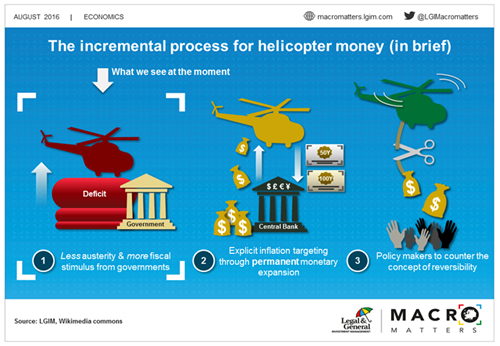

Helicopter money, which originated as a theoretical construct, has progressively emerged as a feasible monetary policy tool used to address economic challenges in contemporary settings. First proposed by economist Milton Friedman in 1969, the concept envisages distributing money directly to the public—akin to dropping it from a helicopter—to inject liquidity into the economy and stimulate consumer spending. This approach bypasses traditional banking mechanisms, providing a streamlined method to bolster economic activity.

The increasing interest in helicopter money is reflected in recent economic strategies, especially during periods of pronounced economic stagnation or crisis, such as the COVID-19 pandemic. In such scenarios, conventional monetary policies like setting interest rates and quantitative easing often struggle to provide sufficient stimulus, which has prompted policymakers to consider more direct interventions.

Additionally, the modern economic landscape has introduced more complex interactions between monetary policy and financial markets, influenced greatly by advancements in technology, such as algorithmic trading. Algorithmic trading utilizes pre-defined criteria and automated systems to execute trades, thus playing a significant role in today's financial markets by impacting liquidity and market dynamics. This technological front interacts with monetary policy through variables like liquidity and volatility introduced by unconventional measures such as helicopter money.

This article examines the multifaceted role of helicopter money within the broader scope of economic management. It intricately links monetary policy, economic stimulus efforts, and the technological advancements in financial markets. The exploration aims to provide a comprehensive understanding of how helicopter money not only aims to support immediate economic recovery but also influences long-term economic growth, inflationary trends, and the operational dynamics of financial markets. By studying these interconnected components, the article will outline the evolving strategies in modern economic and financial policymaking.

## Table of Contents

## Understanding Helicopter Money

Helicopter money, a concept first introduced by economist Milton Friedman, serves as a metaphor for simplified monetary expansion: imagine a helicopter dropping money over a community. This imaginative device was employed to discuss the potential impacts of a straightforward approach to increasing the money supply. The core idea is to distribute direct cash injections to the population, thereby stimulating economic activity and increasing inflation when necessary.

Originally conceived as a theoretical thought experiment, helicopter money has transitioned into practical discourse, especially in situations marked by significant economic lethargy. In recent years, particularly during the economic dislocations caused by the COVID-19 pandemic, central banks around the globe have implemented measures analogous to helicopter money. For instance, direct payments to individuals were part of the fiscal responses in several countries, aiming to alleviate economic distress and stabilize consumption levels.

The mechanism of helicopter money is distinct in its direct approach, bypassing traditional banking intermediaries. By doing so, it offers an immediate boost to [liquidity](/wiki/liquidity-risk-premium), enhancing consumer spending capacity without the delay entrenched in banking or credit channels. This can be critical in kickstarting economic cycles, especially when traditional monetary policies, such as [interest rate](/wiki/interest-rate-trading-strategies) cuts or quantitative easing, are rendered less effective due to already low interest rates or other extenuating economic conditions.

The direct nature of helicopter money can be particularly beneficial in swiftly augmenting disposable income, potentially leading to increased demand for goods and services. This, in turn, can encourage businesses to ramp up production, hire more workers, and invest in growth, thereby supporting a broader economic recovery. However, the influence of helicopter money on inflation is contingent upon how the increased demand interacts with the current economic capacity and supply chains. If demand significantly outstrips supply, there could be inflationary pressures.

Overall, helicopter money represents a paradigm shift in monetary policy strategies, moving towards more direct forms of economic stimulation in the face of stagnation or deflationary threats. This adaptation reflects a growing recognition of the need for innovative monetary tools capable of responding to unprecedented economic challenges.

## Monetary Policy and Economic Stimulus

Traditional monetary policy encompasses several key instruments such as interest rate adjustments and quantitative easing (QE), with the primary objective of controlling the money supply and ensuring economic stability. Interest rate manipulation serves as a crucial mechanism for influencing economic activity. Lower interest rates tend to stimulate borrowing and investment, whereas higher rates can curb inflationary pressures by discouraging excessive spending.

Quantitative easing, another vital tool, involves central banks purchasing government securities or other financial assets from the market to inject liquidity into the economy. This process aims to lower interest rates further and encourage lending and investment, particularly when standard interest rate policies have become less effective. However, during significant economic downturns, such as the 2008 financial crisis or the recent COVID-19 pandemic, traditional tools may inadequately stimulate the economy, necessitating the exploration of unconventional methods like helicopter money.

Helicopter money represents a direct approach to economic stimulus. By bypassing financial intermediaries, such as banks, it aims to enhance disposable income directly through mechanisms like cash transfers or reductions in tax liabilities. This method seeks to increase consumer spending directly, thereby boosting aggregate demand. The concept posits that if people receive money "dropped" from a governmental "helicopter," they are more likely to spend it immediately, thus addressing deflationary pressures and revitalizing stagnant markets.

In combination with fiscal stimulus measures, helicopter money can serve as a potent tool for injecting liquidity into an economy combating deflation. Fiscal stimulus typically involves government spending increases or tax cuts to prop up demand. The synergy between helicopter money and fiscal policy enhances their collective efficacy, allowing for more immediate and discernible impacts on economic activity.

However, the implementation of helicopter money is fraught with challenges, foremost among them being the potential for inflationary pressures. Significant increases in the money supply, without proportional increases in output, can lead to inflation. Therefore, careful calibration and robust policy frameworks are necessary to prevent potential adverse effects on price stability. Policymakers must weigh the short-term benefits of economic recovery against possible long-term inflationary consequences, ensuring that interventions are sustainable and well-aligned with broader economic goals.

## Algorithmic Trading in Modern Financial Markets

Algorithmic trading, an integral component of modern financial markets, leverages advanced computer algorithms to automate and execute trading orders based on a set of pre-defined criteria. These criteria can include timing, price, quantity, or any other mathematical model. Such trading techniques have fundamentally reshaped the landscape of financial markets by increasing speed and accuracy of transactions while reducing operational costs.

The introduction of helicopter money—where funds are distributed directly to the public to spur economic activity—can significantly affect the liquidity and [volatility](/wiki/volatility-trading-strategies) of financial markets. This increased liquidity can lead to heightened market volatility, as more capital becomes available, driving potential shifts in asset prices. For [algorithmic trading](/wiki/algorithmic-trading) systems, this environment necessitates adjustments in operational parameters, particularly in risk management protocols.

Algorithmic traders must recalibrate their algorithms to swiftly respond to economic stimuli and regulatory changes tied to helicopter money policies. This can involve adjusting risk assessment models, optimizing order execution strategies, and ensuring robust error handling mechanisms are in place. For instance, the calculation of risk-reward ratios or the use of stop-loss orders might need to be refined to accommodate increased market unpredictability.

Furthermore, the incorporation of macroeconomic indicators into algorithmic trading systems is crucial. These indicators, such as inflation rates, consumer confidence indices, and monetary policy signals, provide insights into potential market shifts driven by economic policies like helicopter money. By analyzing these factors, algorithms can better forecast market movements, thereby optimizing trade executions and maintaining profitability.

The interplay between economic stimulus measures and algorithmic trading technology underscores the necessity for agile and adaptive trading strategies. Traders and developers must continually refine their algorithms to handle the rapid changes in market conditions caused by direct economic interventions. This dynamic environment highlights the importance of real-time data analysis and predictive analytics in algorithmic trading frameworks.

In conclusion, while helicopter money can create opportunities through increased liquidity, it challenges algorithmic trading systems to continuously innovate and adapt to maintain efficiency and profitability amidst fluctuating market conditions.

## Impact of Helicopter Money on the Economy

Helicopter money, a monetary policy tool that involves distributing money directly to the public, aims to provide immediate economic stimulation by boosting liquidity and enhancing consumer spending. This policy can lead to increased economic activity as individuals with more disposable income are likely to increase their consumption of goods and services. However, the effectiveness and consequences of helicopter money depend on several factors, including the existing economic conditions and the policy's implementation scale.

One of the potential consequences of helicopter money is inflationary pressure. If the increase in consumer demand driven by the additional money supply surpasses the economy's capacity to produce goods and services, prices may rise, leading to inflation. This is especially pertinent if the economy is already operating near its full capacity, as the supply side may struggle to meet the increased demand. The relationship between money supply, demand, and inflation can be described using the Quantity Theory of Money formula, $MV = PQ$, where $M$ is the money supply, $V$ is the velocity of money, $P$ is the price level, and $Q$ is the quantity of goods and services produced. An increase in $M$ without a corresponding increase in $Q$ may result in higher $P$.

Another potential issue is the devaluation of currency. An excessive influx of money can lead to currency devaluation, as the real value of currency may decline when the market perceives an oversupply of money relative to the economy's output. This devaluation can result in fiscal challenges, such as increased costs for imports, which can harm the balance of trade and potentially lead to a decrease in the country's purchasing power on the international stage.

For helicopter money to be effective without causing macroeconomic instability, careful policy calibration is necessary. Policymakers must assess the economy's capacity to absorb additional spending to prevent overheating and ensure the supply side can respond appropriately to increased demand. Additionally, there must be a focus on balancing the short-term benefits of economic stimulation against the risks of long-term growth constraints. Sustainable economic growth requires maintaining a stable economic environment, preventing excessive inflation, and avoiding long-lasting distortions in the financial markets.

Overall, while helicopter money can provide a swift economic boost, it is crucial to consider the broader economic implications and potential unintended consequences. Policymakers need to implement this tool judiciously, with a comprehensive understanding of the existing economic landscape and an emphasis on sustainable policy frameworks.

## Challenges and Controversies

Helicopter money, while a theoretically appealing economic stimulus tool, faces several challenges and controversies that bring into question its long-term applicability and effectiveness. One of the primary concerns is the potential risk of inflation. When central banks distribute funds directly to consumers, the resulting increase in aggregate demand can lead to higher prices, especially if the supply side of the economy doesn't adjust accordingly. This risk of inflation can undermine economic stability, necessitating precise calibration of helicopter money deployments.

Moreover, the irreversibility of monetary expansion is another significant critique. Once money has been distributed, retracting it from the economy without causing disruptions or loss of consumer confidence can be problematic. Critics argue that relying too heavily on such policies might erode fiscal discipline, enticing future policymakers to prioritize short-term monetary financing over the development and maintenance of sustainable fiscal policies that address the structural issues within an economy.

Equity in the distribution of helicopter money is contentious as well. Ensuring that funds are distributed fairly across different socio-economic groups is challenging and prone to political bias. Mismanagement in fund allocation could exacerbate existing wealth disparities, favoring some groups at the expense of others and potentially leading to socio-economic turmoil.

Addressing these challenges requires strategic and careful policy design. Policymakers must work to create frameworks that not only provide immediate monetary relief but also support long-term economic stability. This involves aligning helicopter money with broader economic goals, such as reducing unemployment and promoting equitable growth across different sectors of the economy.

The discourse on the ethical implications and overall efficacy of helicopter money within the global economic landscape is ongoing. As policymakers consider this unorthodox tool, they must weigh the immediate benefits of economic stimulus against the potential for unintended consequences that could impact fiscal discipline and inflated inequality, thereby shaping the future of monetary policy.

## The Future of Economic Policy and Trading

As economies confront evolving challenges, the adoption of innovative monetary policies, such as helicopter money, is expected to play a significant role in economic strategy. Helicopter money, by directly increasing consumers' disposable income, presents an opportunity to stimulate economic activity without relying on traditional banking mechanisms. However, its implementation demands careful consideration, particularly in the context of algorithmic trading systems operating within financial markets.

Algorithmic trading systems, which rely on executing trades through predefined algorithms, need to respond adeptly to shifts in economic policy to sustain market stability. The introduction of helicopter money as an economic stimulus can substantially alter market conditions by affecting liquidity, interest rates, and consumer spending behavior. Consequently, algorithmic systems must be designed to rapidly adjust their parameters, including risk management protocols, to accommodate these changes.

Key to managing the effects of helicopter money on trading systems is the incorporation of robust risk management strategies. Algorithms must be equipped with predictive analytics that can interpret macroeconomic indicators and anticipate the impacts of policy-driven economic stimuli. This involves integrating [machine learning](/wiki/machine-learning) models capable of adjusting trading strategies in real-time based on fluctuations in market dynamics induced by fiscal interventions such as helicopter money.

Moreover, the development of future strategies requires a collaborative effort between policymakers and traders. Policymakers need to consider the implications of helicopter money on financial markets, while traders must refine their algorithmic systems to leverage these economic tools effectively. This partnership is essential to foster balanced economic growth and is crucial for the sustainable deployment of helicopter money and the strategic responses of trading systems.

Building a framework that harmonizes helicopter money's economic benefits with trading strategies involves continuous innovation in financial technology and policy design. Such frameworks should focus on maintaining financial stability while maximizing the positive impact of direct economic stimuli. By doing so, economies can navigate new challenges efficiently, harnessing the potential of helicopter money alongside advanced algorithmic trading to drive future economic growth and stability.

## Conclusion

Helicopter money presents a pivotal shift in economic policy, serving as a direct alternative to traditional stimulus methods. This approach challenges established monetary paradigms, demanding innovative strategies in fiscal and market management. By directly injecting liquidity into the economy, helicopter money short-circuits conventional channels, providing an immediate boost to consumer spending and economic activity. This presents an opportunity to address stagnation, but it also necessitates careful calibration to prevent inflationary pressures and currency devaluation.

The integration of helicopter money with algorithmic trading further complicates real-time market dynamics. Algorithmic systems, which rely on pre-set criteria and macroeconomic indicators, must adapt swiftly to policy-induced liquidity changes. This intersection requires a new consideration for trading strategies that can respond promptly to market volatility and shifts in monetary policy. The agility of these systems to reflect new economic inputs will be crucial in maintaining market stability and ensuring profitable outcomes.

Policymakers face the challenge of balancing short-term economic benefits with the potential long-term impacts on financial stability. The effects of helicopter money must be weighed against risks like inflation and fiscal discipline erosion. Sustainable implementation relies on crafting policy frameworks that maximize economic recovery while minimizing unintended consequences. Future strategies will hinge on helicopter money's effectiveness in fostering robust economic growth and maintaining market equilibrium. Its potential role in revitalizing economies underscores the need for ongoing research and collaboration between economic and financial sector stakeholders.

## References & Further Reading

Friedman, M. (1969). *The Optimum Quantity of Money and Other Essays.* Aldine Transaction. This seminal work discusses the principles of monetary policy and includes the concept of "helicopter money" as a theoretical tool to illustrate direct monetary expansion.

Bernanke, B. S., & Reinhart, V. R. (2004). *Conducting Monetary Policy at Very Low Short-term Interest Rates.* American Economic Review. The authors examine unconventional monetary policy measures, relevant to understanding the context in which helicopter money might be applied.

Buiter, W. H. (2014). *The Simple Analytics of Helicopter Money: Why It Works - Always.* National Bureau of Economic Research Working Paper Series. Buiter presents a detailed analysis of how helicopter money functions in a theoretical context, addressing its effectiveness as a policy tool.

Gagnon, J. E. (2016). *Quantitative Easing: An Underappreciated Success.* Peterson Institute for International Economics. This paper evaluates quantitative easing, an important backdrop to discussions about more direct approaches like helicopter money.

Lopez de Prado, M. (2018). *Advances in Financial Machine Learning.* Wiley. This book provides insights into the integration of algorithmic trading in financial markets, which can be impacted by policies like helicopter money.

Aronson, D. R. (2006). *Evidence-Based Technical Analysis: Applying the Scientific Method and Statistical Inference to Trading Signals.* Wiley. Aronson's work explores scientific methods in trading, highlighting how data-driven approaches can adapt to changes in economic stimuli.

Jansen, S. (2020). *Machine Learning for Algorithmic Trading: Predictive Models to Ticker Data and Order Handling Strategies.* Packt Publishing. Jansen discusses advanced predictive models in trading, with potential applications in responding to monetary policy shifts.

Chan, E. P. (2008). *Quantitative Trading: How to Build Your Own Algorithmic Trading Business.* Wiley Trading. This comprehensive guide on constructing algorithmic trading systems underscores the need for adaptability in volatile markets affected by policies like helicopter money.