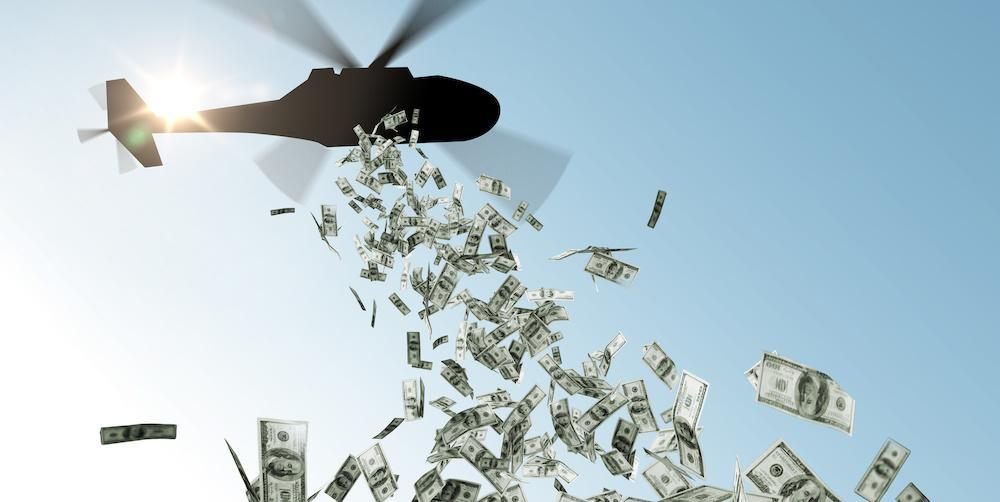

## Table of Contents

## What is helicopter money?

Helicopter money is a term used to describe a type of economic policy where money is given directly to people. The idea is to boost spending and help the economy grow. It's called "helicopter money" because it's like money falling from the sky, given to everyone without them having to do anything.

This idea was first talked about by an economist named Milton Friedman. He used the example of a helicopter dropping money to explain how giving money directly to people could help the economy. Governments and central banks might use this method during tough economic times to encourage people to spend more and help the economy recover.

## Where did the term 'helicopter money' originate?

The term 'helicopter money' was first used by Milton Friedman, a famous economist. He made up this idea to explain how giving money directly to people could help the economy. He imagined a helicopter flying over a town and dropping money for everyone to pick up. This simple picture helped people understand the idea better.

Friedman used this example in his writings to talk about how giving money to people could make them spend more. When people spend more, it can help businesses and the whole economy grow. Even though it's just an example, the idea of 'helicopter money' has been talked about by governments and economists when they want to help the economy during tough times.

## How does helicopter money differ from other forms of monetary policy?

Helicopter money is different from other forms of monetary policy because it gives money directly to people. Other types of monetary policy, like lowering interest rates or buying bonds, work by making it easier for banks to lend money. These methods hope that the money will eventually reach people and businesses, but it's not a direct handout like helicopter money. With helicopter money, the government or central bank just gives money to everyone, hoping they will spend it and help the economy grow.

Another difference is that helicopter money is meant to be a one-time thing, not something that happens all the time. When a central bank lowers interest rates or buys bonds, it's usually part of a longer plan to manage the economy. Helicopter money is more like an emergency tool, used when the economy is really struggling and needs a quick boost. It's a way to get money into people's hands fast, so they can start spending and help the economy recover.

## What are the potential economic benefits of implementing helicopter money?

Helicopter money can help the economy by giving people more money to spend. When people get money for free, they often use it to buy things they need or want. This extra spending can help businesses sell more, which might make them hire more workers or invest in new projects. As businesses do better, the whole economy can grow, and more people can find jobs. This can be especially helpful during tough economic times when people are saving money instead of spending it.

Another benefit of helicopter money is that it can help people who are struggling financially. When the economy is bad, many people might lose their jobs or have less money to spend. Giving them money directly can help them pay for basic things like food and housing. This can make life easier for people who are having a hard time and help keep the economy from getting worse. By supporting people directly, helicopter money can make the economy more stable and help everyone feel more secure.

## What are the potential risks and drawbacks of helicopter money?

One big risk of helicopter money is that it might make prices go up a lot. When everyone gets extra money, they might spend more, which can make businesses raise their prices. If prices keep going up too fast, it can cause inflation. Inflation means that the money people have doesn't buy as much as it used to, which can be hard on everyone, especially people who don't have much money to start with.

Another problem with helicopter money is that it might make people expect to get free money all the time. If people think the government will keep giving them money, they might stop saving or working as hard. This could make the economy less stable in the long run because people might not be ready for times when there's no extra money coming in. It's important for people to save and plan for the future, and helicopter money could make it harder for them to do that.

## Can you provide historical examples where helicopter money was used?

In 2020, during the COVID-19 pandemic, the United States used a form of helicopter money called the CARES Act. The government sent checks to millions of Americans to help them pay for things while many people were out of work. The idea was to give people money so they could keep spending and help the economy stay strong even though businesses were closed. This was one of the biggest uses of helicopter money in recent history, and it helped a lot of people who were struggling.

Another example happened in Hong Kong in 2011. The government there gave money to every adult to help the economy during a tough time. They called it a "cash handout," and it was meant to make people spend more and help businesses. It worked a bit like helicopter money because everyone got money without having to do anything special to get it. This helped the economy in Hong Kong for a while, but it also made some people worry about inflation and whether it was a good long-term plan.

## How is helicopter money distributed to the public?

Helicopter money is given to people in a simple way. Usually, the government or central bank sends money directly to people's bank accounts. They might use a check or a direct deposit to make sure everyone gets the money. The idea is to make it easy for people to get the money so they can start spending it right away.

Sometimes, the government might give out the money based on certain rules. For example, they might give more money to people who earn less or have kids. This way, they can help the people who need it the most. But the main thing is that everyone who qualifies gets the money without having to do anything special to get it.

## What role does government play in the implementation of helicopter money?

The government plays a big role in making helicopter money happen. They decide how much money to give out and who should get it. The government might choose to give the same amount to everyone, or they might give more to people who need it more, like those with lower incomes or families with children. They also figure out how to send the money, like using checks or direct deposits into bank accounts. The government works with the central bank to make sure the money gets to people quickly and easily.

Once the government decides to use helicopter money, they have to explain it to everyone. They need to tell people why they're giving out money and how it will help the economy. The government also has to watch what happens after they give out the money. They need to see if people start spending more and if the economy gets better. If things don't work out as planned, the government might need to change their plan or try something different to help the economy.

## How does helicopter money affect inflation and deflation?

Helicopter money can make prices go up, which is called inflation. When the government gives people free money, they might spend more on things they want or need. If a lot of people start spending more at the same time, businesses might raise their prices because they know people have more money to spend. If prices keep going up too fast, it can cause a lot of inflation, which means the money people have doesn't buy as much as it used to. This can be hard on everyone, especially people who don't have much money to start with.

On the other hand, helicopter money can also help fight deflation, which is when prices keep going down. Deflation can happen when people are scared about the economy and stop spending money. If the government gives people money directly, it can make them feel better and start spending again. When people spend more, businesses might not need to lower their prices as much, which can help stop deflation. So, helicopter money can be a way to keep prices from falling too much and help the economy stay stable.

## What are the long-term effects of helicopter money on an economy?

Helicopter money can help the economy in the short term, but it can also cause problems in the long run. When people get free money, they might spend more right away, which can make businesses do better and help the economy grow. But if people start expecting to get free money all the time, they might stop saving or working as hard. This can make the economy less stable because people might not be ready for times when there's no extra money coming in. It's important for people to save and plan for the future, and helicopter money could make it harder for them to do that.

Another long-term effect of helicopter money is that it might cause a lot of inflation. When everyone gets more money to spend, businesses might raise their prices because they know people have more money. If prices keep going up too fast, it can make life harder for everyone, especially people who don't have much money to start with. Inflation can also make it harder for the government to help the economy in the future because people might expect even more money to keep up with rising prices. So, while helicopter money can be a quick fix, it's important to think about how it might affect the economy over time.

## How do different economic theories view the concept of helicopter money?

Different economic theories have different views on helicopter money. Some economists, like those who follow Keynesian theory, think helicopter money can be a good way to help the economy during tough times. They believe that giving money directly to people can make them spend more, which can help businesses and create jobs. Keynesians see it as a way to boost demand when the economy is not doing well, and they think it can be especially useful when other methods, like lowering interest rates, don't work.

On the other hand, economists who follow more conservative theories, like monetarism, are often worried about the risks of helicopter money. They think that giving out free money can cause too much inflation, which can make prices go up a lot and hurt the economy in the long run. Monetarists believe that the government should be careful about how much money it prints and gives away, because too much money can make the value of money go down. They prefer other ways to help the economy, like controlling the money supply more carefully.

## What are the current debates and future prospects for helicopter money in global economies?

Helicopter money is a big topic in today's world, especially after the big economic problems caused by the COVID-19 pandemic. Some people think it's a good idea to give money directly to people when the economy is struggling. They say it can help people pay for what they need and keep spending, which can make businesses do better and help the economy grow. Countries like the United States have already used this idea to help people during tough times, and some think it might be used more often in the future. But there's a lot of debate about whether it's a good long-term plan. Some worry that giving out free money too often might make people expect it all the time, which could make them stop saving or working hard.

On the other hand, many people are worried about the risks of helicopter money. One big worry is that it might cause too much inflation, where prices go up a lot and make life harder for everyone. If the government keeps giving out money, businesses might raise their prices because they know people have more money to spend. This could make the economy less stable in the long run. Another worry is that helicopter money might not be fair to everyone. Some people might need the money more than others, and giving the same amount to everyone might not be the best way to help those who are struggling the most. As countries keep looking for ways to help their economies, the debate about helicopter money will likely continue, with different ideas about how to use it and what the future might hold.

## What are the challenges and controversies?

Economic criticisms of helicopter money primarily revolve around the risks of inflation and the potential irreversibility of monetary expansion. Helicopter money, by injecting funds directly into the economy without the expectation of repayment, can lead to an oversupply of money. This influx of cash can increase consumer demand, but if production capacities do not keep pace, it may lead to inflationary pressures. Inflation occurs when the increase in money supply surpasses economic growth, leading to a rise in prices across goods and services. The formula for the inflation rate $i$ can be expressed as follows:

$$
i = \frac{P_1 - P_0}{P_0} \times 100
$$

where $P_1$ is the price level at a later period, and $P_0$ is the initial price level.

The irreversibility of monetary expansion associated with helicopter money is a concern because once the money is distributed, it permanently increases the money base. This can pose long-term challenges for central banks attempting to control inflation. Unlike traditional tools such as [interest rate](/wiki/interest-rate-trading-strategies) adjustments or quantitative easing, which can be reversed or modulated over time, helicopter money lacks inherent mechanisms for withdrawal, making it harder to retract once the economic conditions stabilize.

Political and ethical debates add another layer of complexity. One significant concern is the equitable distribution of funds. Deciding who receives the money and how much each entity gets can lead to disparities and perceived injustices, potentially exacerbating socioeconomic inequalities. There is also the potential for these policies to be misused or leveraged for political gain, with governments possibly resorting to helicopter money for short-term popularity rather than long-term economic health.

The potential impact on future economic stability and fiscal responsibility is another critical discussion point. The prospect of deploying helicopter money as a routine policy tool may undermine fiscal discipline, encouraging reliance on monetary financing over structural reforms and sustainable fiscal policies. This approach might shift expectations among market participants, leading to altered behaviors that could destabilize financial markets.

In conclusion, while helicopter money offers a robust solution during severe economic downturns, its implementation invites substantial challenges and controversies. Policymakers must balance immediate economic needs against long-term financial stability, ensuring that such measures do not compromise the broader economic framework. Careful consideration and strategic planning are required to mitigate these concerns and harness the potential benefits of helicopter money within the global economic landscape.

## References & Further Reading

[1]: Friedman, M. (1969). "The Optimum Quantity of Money and Other Essays." Aldine Transaction.

[2]: Bernanke, B. S., & Reinhart, V. R. (2004). ["Conducting Monetary Policy at Very Low Short-term Interest Rates."](https://www.aeaweb.org/articles?id=10.1257/0002828041302118) American Economic Review, 94(2), 85-90.

[3]: Buiter, W. H. (2014). ["The Simple Analytics of Helicopter Money: Why It Works - Always."](http://www.economics-ejournal.org/economics/journalarticles/2014-28/) National Bureau of Economic Research Working Paper Series.

[4]: Gagnon, J. E. (2016). ["Quantitative Easing: An Underappreciated Success."](https://www.semanticscholar.org/paper/Quantitative-Easing%3A-An-Underappreciated-Success-Gagnon/e820c20f3a834344d00313e2f814e34552741e65) Peterson Institute for International Economics.

[5]: Lopez de Prado, M. (2018). ["Advances in Financial Machine Learning."](https://www.amazon.com/Advances-Financial-Machine-Learning-Marcos/dp/1119482089) Wiley.

[6]: Aronson, D. R. (2006). ["Evidence-Based Technical Analysis: Applying the Scientific Method and Statistical Inference to Trading Signals."](https://www.amazon.com/Evidence-Based-Technical-Analysis-Scientific-Statistical/dp/0470008741) Wiley. 

[7]: Jansen, S. (2020). ["Machine Learning for Algorithmic Trading: Predictive Models to Ticker Data and Order Handling Strategies."](https://github.com/stefan-jansen/machine-learning-for-trading) Packt Publishing. 

[8]: Chan, E. P. (2008). ["Quantitative Trading: How to Build Your Own Algorithmic Trading Business."](https://github.com/ftvision/quant_trading_echan_book) Wiley Trading. 