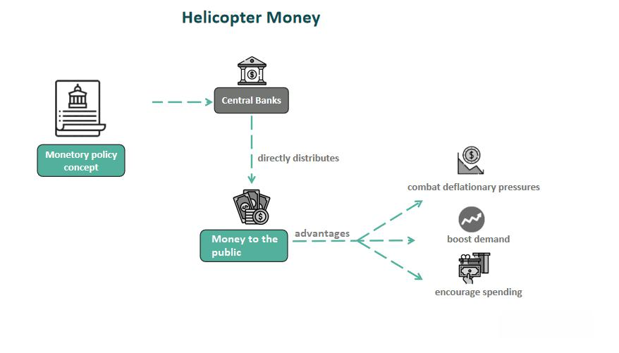

This article explores the interconnected themes of helicopter money, monetary policy, economic stimulus, and algorithmic trading. Helicopter money is an unconventional monetary policy tool aimed at injecting liquidity directly into the economy. Unlike traditional approaches such as quantitative easing, helicopter money involves central banks distributing funds directly to the public, potentially increasing consumer spending and economic activity. This strategy, while offering immediate liquidity, also invites debates on its long-term macroeconomic impacts, such as inflation and debt sustainability.

In tandem with this, monetary policy forms a cornerstone of economic strategy, with central banks leveraging various tools to control money supply and achieve macroeconomic stability. During economic crises, unconventional measures, including helicopter money, are considered to bolster demand and mitigate downturns. The outcomes from these interventions shape the economic landscape, influencing not only consumer behavior but also the operations of financial markets.



Algorithmic trading, which utilizes computer programs to execute trades based on pre-defined criteria, represents a modern innovation in financial markets that is sensitive to economic conditions. The speed and efficiency of algorithmic trading are impacted by macroeconomic policies like helicopter money, requiring traders to adapt to rapid market fluctuations induced by such stimuli.

This article aims to provide a comprehensive overview of how these elements are integrated into modern economic strategies, addressing the broader implications for financial stability and growth. By examining the dynamics among helicopter money, monetary policy, and algorithmic trading, we seek to understand the evolving landscape of economic measures designed to sustain and enhance global economic health.

## Table of Contents

## Understanding Helicopter Money

Helicopter money is a monetary policy instrument that entails the direct distribution of funds from central banks to citizens, aiming to stimulate economic activity. This concept was initially introduced by economist Milton Friedman in 1969 as a thought experiment to illustrate the effects of monetary expansion on the economy. The metaphor suggests that money would be dropped from a helicopter to be picked up by the public, thus increasing the money supply and boosting consumption and economic growth.

In recent years, the concept of helicopter money has garnered more practical interest, particularly during periods of economic stagnation and crises, such as the global financial downturn of 2008 and the COVID-19 pandemic. During these times, traditional monetary policy tools like interest rate adjustments proved to be less effective, especially when interest rates were already near zero, a condition known as the "zero lower bound". This limitation led economists and policymakers to consider alternative strategies, including helicopter money, to rejuvenate economic activity.

Helicopter money differs from conventional monetary policy measures, such as quantitative easing (QE), in both execution and financial consequences. Quantitative easing involves the central bank purchasing financial assets, like government bonds, from commercial banks and other financial institutions, with the goal of lowering interest rates and increasing monetary supply through indirect channels. The funds from QE ultimately reach the public as banks lend more, but this process is intermediated and can be slow or ineffective if banks hoard the [liquidity](/wiki/liquidity-risk-premium) due to risk aversion or insufficient loan demand.

Conversely, helicopter money bypasses these intermediaries by directly infusing consumers with purchasing power, potentially through cash payments or tax rebates funded by the central bank. This direct injection theoretically provides a more immediate stimulus to aggregate demand, as consumers are expected to spend rather than save the additional resources, thereby invigorating economic activity and contributing to inflationary pressures, which may be desirable during deflationary periods.

However, implementing helicopter money poses complex challenges, such as determining the mechanism for distribution, the appropriate scale of intervention, and addressing potential inflationary risks. While it offers a powerful tool to address economic stagnation, the policy must be carefully calibrated to balance short-term economic boosts with long-term financial stability and fiscal sustainability.

## Monetary Policy and Economic Stimulus

Monetary policy encompasses actions by central banks, such as [interest rate](/wiki/interest-rate-trading-strategies) adjustments, open market operations, and changes in reserve requirements, to control the money supply and achieve macroeconomic objectives like controlling inflation, managing employment, and stabilizing the currency. These strategies aim to foster economic growth, especially during periods of financial instability or recession.

During economic downturns, conventional monetary tools sometimes prove inadequate, necessitating unconventional measures such as helicopter money. Typically, central banks might pursue rate cuts or quantitative easing by purchasing financial assets to inject liquidity into the economy. However, these methods may not suffice when interest rates are near zero or when banks hoard liquidity instead of distributing it through loans and investments.

Helicopter money represents a more direct method of economic stimulus, entailing the central bank issuing currency directly to citizens, circumventing commercial banks to boost consumer spending without enlarging public debt. This approach theoretically increases aggregate demand by enhancing disposable income and consumption in an economy with stagnant demand. However, critics often express concerns regarding its inflationary potential, as an excess money supply can erode currency value and inflate prices.

Fiscal stimulus, an approach employed alongside helicopter money, involves government expenditure and tax policies to stimulate economic activity. Unlike helicopter money, fiscal policy increases government debt by financing public projects or directly supporting consumers and businesses through cash transfers and subsidies. The synergy of fiscal stimulus with helicopter money can accelerate economic recovery by saturating the market with liquidity while maintaining consumer and investor confidence.

These combined economic stimulations aggressively target deflationary pressures by addressing stagnant demand and employment disruptions. In scenarios like the global financial crisis or pandemic-induced recessions, where private sector spending contracts sharply, such dual approaches aim to stabilize and revitalize the economy efficiently. However, their implementation necessitates meticulous calibration to avoid over-expansion of the money supply, which could trigger hyperinflation and depreciate currency values globally. The delicate balance of stimulating demand while safeguarding against inflationary risks underscores the intricacies inherent in integrating helicopter money with broader monetary and fiscal policies.

## Algorithmic Trading in Modern Financial Markets

Algorithmic trading has revolutionized modern financial markets by utilizing sophisticated computer algorithms to execute trades at incredibly high speeds and volumes. These algorithms are designed to identify and capitalize on market opportunities by following pre-defined criteria, including statistical models, technical indicators, and market sentiments. By automating the trading process, [algorithmic trading](/wiki/algorithmic-trading) minimizes human error and allows traders to execute complex trading strategies with precision and efficiency.

The influence of market conditions, such as those potentially affected by helicopter money policies, on algorithmic trading is notable. Helicopter money, a form of direct economic stimulus, can alter liquidity levels and market [volatility](/wiki/volatility-trading-strategies), which are critical factors for algorithmic trading systems. In a market characterized by increased liquidity due to central bank interventions, such as direct cash infusions, algorithmic traders may experience changes in bid-ask spreads and price dynamics. These alterations necessitate adjustments in trading algorithms to maintain profitability and manage risk effectively.

Algorithmic trading systems must be agile enough to account for rapid market changes resulting from economic stimulus measures. For example, a sudden injection of liquidity might temporarily lower borrowing costs and boost asset prices, requiring algorithms to adjust their trading parameters in real-time. This could involve recalibrating risk management protocols, such as stop-loss orders or position sizing, based on the new market conditions. Additionally, algorithms may need to incorporate macroeconomic indicators that signal potential shifts in monetary policy to anticipate future market trends.

Consider a basic Python implementation to simulate a simple [momentum](/wiki/momentum)-based trading algorithm reacting to market conditions:

```python
import numpy as np

# Sample market data: closing prices
market_data = np.array([100, 102, 105, 107, 110])

# Calculating simple moving average (SMA)
window_size = 3
sma = np.convolve(market_data, np.ones(window_size)/window_size, 'valid')

# Simple momentum strategy: buy if price > SMA
signals = market_data[window_size-1:] > sma

# Trading logic
positions = np.where(signals, 1, 0)  # Buy (1) if signal is true, else hold (0)
```

In this rudimentary example, the algorithm uses a simple moving average (SMA) as an indicator to decide whether to initiate a buy position. Although basic, such strategies must continually evolve to respond to the fast-changing market landscape influenced by broader economic policies like helicopter money.

In conclusion, algorithmic trading in modern financial markets represents a dynamic interplay between technology and economic policy. As new monetary policies, including unconventional ones like helicopter money, come into effect, they introduce new variables that trading algorithms must consider. The ability for these systems to swiftly adapt to evolving conditions is paramount for maintaining a competitive edge in the high-speed world of algorithmic trading.

## Impact of Helicopter Money on the Economy

Helicopter money refers to the direct distribution of funds to the public by central banks, which can lead to immediate increases in consumer spending. This increase in liquidity can stimulate demand across various markets, providing a short-term boost to economic activity. By directly increasing the amount of disposable income available to consumers, helicopter money aims to bypass the slower mechanisms of credit markets and fiscal policy, potentially leading to rapid economic stimulation.

While helicopter money offers the promise of quick economic revitalization, it also presents significant risks. One of the primary concerns is inflation. As consumer spending rises, so does demand for goods and services, which might outstrip supply. This demand-pull effect can lead to higher prices and, thus, inflation. If the supply side of the economy does not adjust quickly enough to meet the new level of demand, prolonged inflationary pressures can arise.

Moreover, excessive use of helicopter money can lead to currency devaluation. This is primarily because the increased money supply can decrease the value of the currency in foreign exchange markets. A devaluation can make imports more expensive and contribute further to inflation, creating a vicious cycle of economic challenges.

Managing these potential risks requires careful calibration of helicopter money policies. Policymakers must consider the capacity of the economy to absorb increased spending without triggering runaway inflation or significant currency depreciation. This includes assessing factors such as output gaps, labor market conditions, and overall economic resilience.

Long-term implications of helicopter money necessitate a balance between short-term economic boosts and sustainable growth strategies. While the immediate influx of liquidity can jumpstart economic activity, it must be aligned with broader monetary and fiscal policies to ensure that growth does not lead to macroeconomic instability.

Economists often highlight the importance of structural reforms and supply-side improvements in conjunction with demand-side measures like helicopter money. Ensuring sustainable growth may involve investing in infrastructure, education, and technology to increase productivity and potential output.

In conclusion, while helicopter money can serve as an effective tool for economic stimulation during downturns, its implications must be carefully managed to prevent adverse effects such as inflation and currency devaluation. Balancing short-term economic gains with long-term stability is crucial to the successful integration of helicopter money into broader economic strategies.

## Challenges and Controversies

Economic criticisms of helicopter money primarily revolve around the risks of inflation and the potential irreversibility of monetary expansion. Helicopter money, by injecting funds directly into the economy without the expectation of repayment, can lead to an oversupply of money. This influx of cash can increase consumer demand, but if production capacities do not keep pace, it may lead to inflationary pressures. Inflation occurs when the increase in money supply surpasses economic growth, leading to a rise in prices across goods and services. The formula for the inflation rate $i$ can be expressed as follows:

$$
i = \frac{P_1 - P_0}{P_0} \times 100
$$

where $P_1$ is the price level at a later period, and $P_0$ is the initial price level.

The irreversibility of monetary expansion associated with helicopter money is a concern because once the money is distributed, it permanently increases the money base. This can pose long-term challenges for central banks attempting to control inflation. Unlike traditional tools such as interest rate adjustments or quantitative easing, which can be reversed or modulated over time, helicopter money lacks inherent mechanisms for withdrawal, making it harder to retract once the economic conditions stabilize.

Political and ethical debates add another layer of complexity. One significant concern is the equitable distribution of funds. Deciding who receives the money and how much each entity gets can lead to disparities and perceived injustices, potentially exacerbating socioeconomic inequalities. There is also the potential for these policies to be misused or leveraged for political gain, with governments possibly resorting to helicopter money for short-term popularity rather than long-term economic health.

The potential impact on future economic stability and fiscal responsibility is another critical discussion point. The prospect of deploying helicopter money as a routine policy tool may undermine fiscal discipline, encouraging reliance on monetary financing over structural reforms and sustainable fiscal policies. This approach might shift expectations among market participants, leading to altered behaviors that could destabilize financial markets.

In conclusion, while helicopter money offers a robust solution during severe economic downturns, its implementation invites substantial challenges and controversies. Policymakers must balance immediate economic needs against long-term financial stability, ensuring that such measures do not compromise the broader economic framework. Careful consideration and strategic planning are required to mitigate these concerns and harness the potential benefits of helicopter money within the global economic landscape.

## The Future of Economic Policy and Trading

As global economies face unprecedented challenges, the exploration of innovative monetary policies remains crucial. Helicopter money, in particular, holds potential as a tool for immediate economic stimulus, bypassing traditional banking systems to deliver direct cash injections to individuals and businesses. This direct stimulation method may become increasingly relevant in navigating future economic landscapes, especially during times of severe economic downturns or financial crises.

The adaptability and resilience of algorithmic trading systems are crucial in responding to these monetary policy shifts. Algorithmic trading, which relies on computer algorithms to execute a large number of trades at high speeds, is sensitive to changes in market conditions such as those induced by helicopter money. As such, trading algorithms must be meticulously crafted to incorporate the potential repercussions of direct fiscal interventions like helicopter money. 

When central banks opt for policies that lead to sudden inflows of cash into the economy, it can result in increased market volatility and altered asset pricing models. Algorithm developers need to integrate robust risk management and predictive analytics to navigate the effects of such policy measures. For example, algorithms could be enhanced to react dynamically to news relating to economic policy changes or shifts in consumer spending patterns driven by direct cash distribution. A simple Python snippet that could begin to analyze policy effects on market conditions might look like:

```python
import pandas as pd
import numpy as np

# Assume df contains columns 'date', 'market_index', and 'helicopter_money_news'

def detect_volatility_spike(df, window=5):
    """Detects spikes in market volatility coinciding with helicopter money news.

    Args:
    df (DataFrame): DataFrame containing market data and policy news.
    window (int): Rolling window for volatility calculation.

    Returns:
    DataFrame: Original DataFrame with additional volatility column.
    """
    df['returns'] = df['market_index'].pct_change()
    df['volatility'] = df['returns'].rolling(window=window).std()
    return df

# Example usage
df = pd.DataFrame({'date': pd.date_range('2023-01-01', periods=100),
                   'market_index': np.random.randn(100).cumsum(),
                   'helicopter_money_news': np.random.choice([0, 1], size=100, p=[0.95, 0.05])})
df = detect_volatility_spike(df)
```

Looking forward, the integration of helicopter money and algorithmic trading into future economic policy strategies necessitates an innovative approach. Policymakers and traders must work in tandem to harness the benefits of direct economic stimuli while mitigating potential downsides such as inflation or increased market instability. This may involve the development of frameworks that ensure the equitable, efficient, and sustainable deployment of helicopter money, alongside advanced algorithmic trading strategies that can accurately respond to rapid policy shifts. Such strategies could facilitate a synergistic relationship between economic policy formulation and financial market operations, paving the way for balanced economic growth.

## Conclusion

Helicopter money represents a critical juncture in modern economic discourse, linking the concept of direct financial stimulus with the broader objective of maintaining financial market stability. Unlike traditional monetary policy tools, helicopter money entails the distribution of currency directly to the populace, bypassing conventional financial intermediaries. This approach is innovative but also contentious, as it challenges standard economic paradigms and introduces new variables into the economic equation.

The full implications of helicopter money become apparent when examining its intersection with monetary policy and algorithmic trading. The injection of liquidity via helicopter money can significantly influence monetary policy decisions by augmenting or complementing traditional tools like interest rate adjustments and quantitative easing. Central banks must weigh the potential inflationary pressures and currency valuation effects against the anticipated increase in aggregate demand.

Furthermore, algorithmic trading systems, which dominate modern financial markets, are sensitive to such economic measures. These systems rely on predefined algorithms to make high-frequency trading decisions, often reacting instantaneously to market signals. The unpredictable nature of helicopter money's impact on market conditions requires these algorithms to adapt rapidly, ensuring that trading strategies remain effective and profitable. Adjustments may involve recalibrating risk assessments or developing new predictive models to account for the direct fiscal stimuli introduced by helicopter money.

The ongoing discourse about helicopter money's role in addressing economic challenges highlights the need for innovative strategies. Policymakers must consider not only the immediate economic benefits but also the long-term sustainability of such measures. The exploration of helicopter money's role in modern economic policy, combined with the adaptability of algorithmic trading systems, underscores the dynamic interaction between direct stimulus initiatives and financial market behavior.

Ultimately, the future deployment of helicopter money as an economic tool will depend on its ability to effectively balance the demand for rapid economic recovery with the imperative of maintaining fiscal responsibility and market stability. As global economies continue to evolve, the principles governing these strategies will be crucial in shaping how nations respond to complex economic challenges.

## References & Further Reading

[1]: Friedman, M. (1969). "The Optimum Quantity of Money and Other Essays." Aldine Transaction.

[2]: Bernanke, B. S., & Reinhart, V. R. (2004). ["Conducting Monetary Policy at Very Low Short-term Interest Rates."](https://www.aeaweb.org/articles?id=10.1257/0002828041302118) American Economic Review, 94(2), 85-90.

[3]: Buiter, W. H. (2014). ["The Simple Analytics of Helicopter Money: Why It Works - Always."](http://www.economics-ejournal.org/economics/journalarticles/2014-28/) National Bureau of Economic Research Working Paper Series.

[4]: Gagnon, J. E. (2016). ["Quantitative Easing: An Underappreciated Success."](https://www.semanticscholar.org/paper/Quantitative-Easing%3A-An-Underappreciated-Success-Gagnon/e820c20f3a834344d00313e2f814e34552741e65) Peterson Institute for International Economics.

[5]: Lopez de Prado, M. (2018). ["Advances in Financial Machine Learning."](https://www.amazon.com/Advances-Financial-Machine-Learning-Marcos/dp/1119482089) Wiley.

[6]: Aronson, D. R. (2006). ["Evidence-Based Technical Analysis: Applying the Scientific Method and Statistical Inference to Trading Signals."](https://www.amazon.com/Evidence-Based-Technical-Analysis-Scientific-Statistical/dp/0470008741) Wiley. 

[7]: Jansen, S. (2020). ["Machine Learning for Algorithmic Trading: Predictive Models to Ticker Data and Order Handling Strategies."](https://github.com/stefan-jansen/machine-learning-for-trading) Packt Publishing. 

[8]: Chan, E. P. (2008). ["Quantitative Trading: How to Build Your Own Algorithmic Trading Business."](https://github.com/ftvision/quant_trading_echan_book) Wiley Trading.