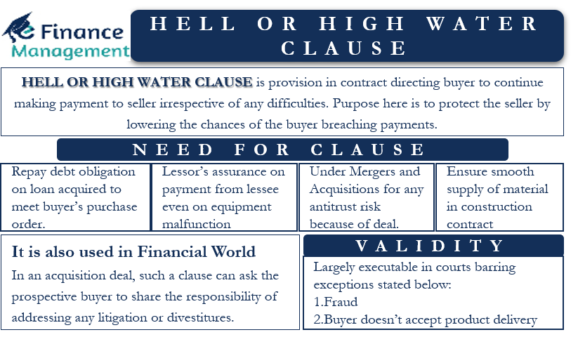

## Table of Contents

## What is a Hell or High Water Clause?

A Hell or High Water Clause is a part of a contract that says one side has to keep paying or doing something, no matter what happens. It's often used in big deals, like when a company leases equipment or buys something important. The name comes from the idea that you have to keep your promise even if there are huge problems, like hell or a big flood.

This clause is important because it makes sure that the person or company getting the payments can count on the money coming in. It protects them from losing out if the other side runs into trouble. But, it can be tough for the person who has to keep paying, because they can't stop, even if things go really wrong for them.

## Why is it called a 'Hell or High Water' Clause?

The term 'Hell or High Water' comes from a saying that means you'll do something no matter what happens. It's like saying you'll keep your promise even if there are big problems, like a fire from hell or a huge flood. This is why the clause in contracts got this name. It shows that the person or company has to keep paying or doing what they promised, no matter what goes wrong.

In contracts, this clause is used to make sure that one side can always count on getting paid or getting what they need. It's like a strong promise that can't be broken easily. But it can be hard for the person who has to keep paying because they can't stop, even if they have big problems themselves.

## In which types of contracts is a Hell or High Water Clause commonly used?

A Hell or High Water Clause is often used in contracts where one side needs to be sure they will keep getting paid or getting what they need, no matter what happens. This kind of clause is common in equipment leasing agreements. For example, if a company leases heavy machinery, they might have to keep making payments even if the machinery breaks down or they can't use it anymore.

It's also used in big deals where a company is buying something important, like in asset purchase agreements. If a company is buying a big asset, like a factory, they might have to keep paying for it even if the factory isn't making money or if they run into other problems. This clause helps the seller feel safe because they know they will get their money, no matter what happens to the buyer.

In finance, Hell or High Water Clauses can be found in loan agreements or bond contracts. For instance, if a company takes out a loan, they might have to keep paying it back even if their business is struggling. This protects the lender because they know they will get their money back, no matter what happens to the borrower.

## What are the key components of a Hell or High Water Clause?

A Hell or High Water Clause has a few main parts that make it work. The first part is the promise to pay or do something, no matter what happens. This means that one side has to keep their end of the deal, even if they run into big problems. The second part is about what happens if the person or company doesn't keep their promise. There might be penalties or other consequences if they don't pay or do what they said they would.

The third part is often about what can't be used as an excuse to not pay or do something. This can include things like the equipment breaking down, the business not making money, or even natural disasters. The clause makes it clear that none of these things can stop the payments or actions that were promised. Together, these parts make sure that one side can always count on getting what they need, no matter what happens.

## How does a Hell or High Water Clause protect the seller or service provider?

A Hell or High Water Clause helps the seller or service provider feel safe because it makes sure they will get paid no matter what happens. If a company leases equipment or buys something big, this clause means they have to keep making payments even if they have problems. This is good for the seller because they know the money will keep coming in, even if the buyer has trouble.

The clause stops the buyer from using excuses like equipment breaking down or their business not doing well to stop paying. This means the seller doesn't have to worry about losing money if something goes wrong for the buyer. It makes the deal more secure for the seller or service provider because they can count on getting paid, no matter what.

## What are the potential risks for the buyer or client when agreeing to a Hell or High Water Clause?

Agreeing to a Hell or High Water Clause can be risky for the buyer or client. The main risk is that they have to keep paying no matter what happens. This means if their business runs into trouble or the equipment they leased stops working, they still have to make the payments. It can be hard to keep up with these payments if they are struggling financially, and it might make their problems even worse.

Another risk is that the buyer can't use common excuses to stop paying. If something goes wrong, like a natural disaster or the product not working as expected, they still have to pay. This can feel unfair to the buyer because they might feel stuck with a bad deal. They need to be very sure they can handle the payments before agreeing to this kind of clause.

## Can you provide an example of a Hell or High Water Clause in a contract?

Here's an example of a Hell or High Water Clause in a contract for leasing heavy machinery: "The Lessee agrees to make all lease payments on time, no matter what happens. This means the Lessee has to pay even if the machinery breaks down or they can't use it anymore. The Lessee can't stop paying because of problems with the machinery, their business not making money, or any other reason."

In this example, the company leasing the machinery (the Lessee) has to keep paying the lease payments no matter what. This clause protects the company that owns the machinery (the Lessor) because they know they will keep getting paid, even if the Lessee has big problems. It's a strong promise that the Lessee can't break easily, but it can be tough for them if they run into trouble.

## How can a Hell or High Water Clause be negotiated or modified?

A Hell or High Water Clause can be negotiated or changed by talking about it before signing the contract. The buyer or client might ask to add some conditions that let them stop paying if really bad things happen, like a big natural disaster or if the equipment stops working and can't be fixed. They might also ask for a way to end the contract early if they can't keep paying. It's important for both sides to talk about what could go wrong and agree on what should happen in those cases.

Sometimes, the seller or service provider might agree to change the clause a little bit if it helps make the deal happen. They might be okay with adding some exceptions or letting the buyer out of the contract early if they pay a fee. But, they will want to make sure they are still protected and will get their money. It's all about finding a balance that works for both sides.

## What are the legal implications of a Hell or High Water Clause in different jurisdictions?

The legal implications of a Hell or High Water Clause can be different in different places. In some countries, these clauses are strong and courts will make sure they are followed. This means if you agree to a Hell or High Water Clause, you have to keep paying no matter what. But in other places, the law might let you stop paying if something really bad happens, like a big disaster or if the product you bought stops working and can't be fixed. It's important to know the rules in your area before signing a contract with this kind of clause.

In the United States, for example, Hell or High Water Clauses are usually strong and hard to get out of. Courts often say that if you agreed to the clause, you have to keep your promise. But there can be some exceptions. If the other side did something wrong or tricked you into signing the contract, a court might let you stop paying. In Europe, some countries have laws that protect buyers more, so a Hell or High Water Clause might not be as strong. It's a good idea to talk to a lawyer who knows the laws in your area to understand how these clauses work where you live.

## How have Hell or High Water Clauses been interpreted in court cases?

In court cases, Hell or High Water Clauses are usually taken very seriously. Judges often say that if you agreed to the clause, you have to keep paying no matter what happens. This was seen in a case called In re: Powers, where a company tried to stop paying for leased equipment because it broke down. The court said the company still had to pay because of the Hell or High Water Clause in their contract. This shows how strong these clauses can be in court.

However, there are times when courts might let someone out of a Hell or High Water Clause. If the other side did something wrong, like lying or breaking the law, a court might say the clause doesn't count. For example, in the case of Wells Fargo Equipment Finance, Inc. v. Retterath, the court let the buyer stop paying because the seller had not been honest about the equipment. This shows that while Hell or High Water Clauses are strong, they can be challenged if there is a good reason.

## What alternatives exist to a Hell or High Water Clause for managing contract risk?

One way to manage contract risk without a Hell or High Water Clause is to use a performance-based clause. This means the buyer only has to pay if the equipment or service works well. If it breaks down or doesn't do what it's supposed to, the buyer can stop paying or get their money back. This is fairer for the buyer because they don't have to keep paying if they're not getting what they need. The seller might agree to this if they are sure their product or service is good and will work well.

Another option is to include a force majeure clause. This clause lets both sides stop the contract if something really big and unexpected happens, like a natural disaster or a war. It's a way to protect both the buyer and the seller from things they can't control. The buyer doesn't have to keep paying if a big problem stops them from using the equipment or service, and the seller doesn't have to keep providing it if they can't because of the big problem. This can make the contract feel safer for both sides.

## How might future trends affect the use and enforceability of Hell or High Water Clauses?

In the future, changes in laws and how people think about fairness might change how Hell or High Water Clauses are used and enforced. More countries might pass laws to protect buyers from having to pay for things that don't work or if really bad things happen. This could mean that Hell or High Water Clauses become less common because they are seen as too hard on buyers. Also, if people start to care more about fairness in contracts, courts might be less likely to make buyers keep paying no matter what.

Technology could also play a big role. With new ways to check if equipment is working or if a service is being provided, contracts might start to use performance-based clauses more often. These clauses say you only have to pay if the equipment or service is doing what it should. This could make Hell or High Water Clauses less popular because buyers and sellers might like having a contract that is fairer and based on how well things are working.

## References & Further Reading

[1]: Bergstra, J., Bardenet, R., Bengio, Y., & Kégl, B. (2011). ["Algorithms for Hyper-Parameter Optimization."](https://dl.acm.org/doi/10.5555/2986459.2986743) Advances in Neural Information Processing Systems 24.

[2]: ["Advances in Financial Machine Learning"](https://www.amazon.com/Advances-Financial-Machine-Learning-Marcos/dp/1119482089) by Marcos Lopez de Prado

[3]: Darrell Duffie, "Measuring Corporate Default Risk," Clarendon Lectures in Finance, Oxford University Press, 2011. 

[4]: Narang, R. P. (2013). ["Inside the Black Box: A Simple Guide to Quantitative and High-Frequency Trading."](https://www.wiley.com/en-us/Inside%20the%20Black%20Box:%20A%20Simple%20Guide%20to%20Systematic%20Investing,%203rd%20Edition-p-9781119931904) Wiley.

[5]: Shleifer, A. (2000). ["Inefficient Markets: An Introduction to Behavioral Finance."](https://academic.oup.com/book/27761) Oxford University Press.