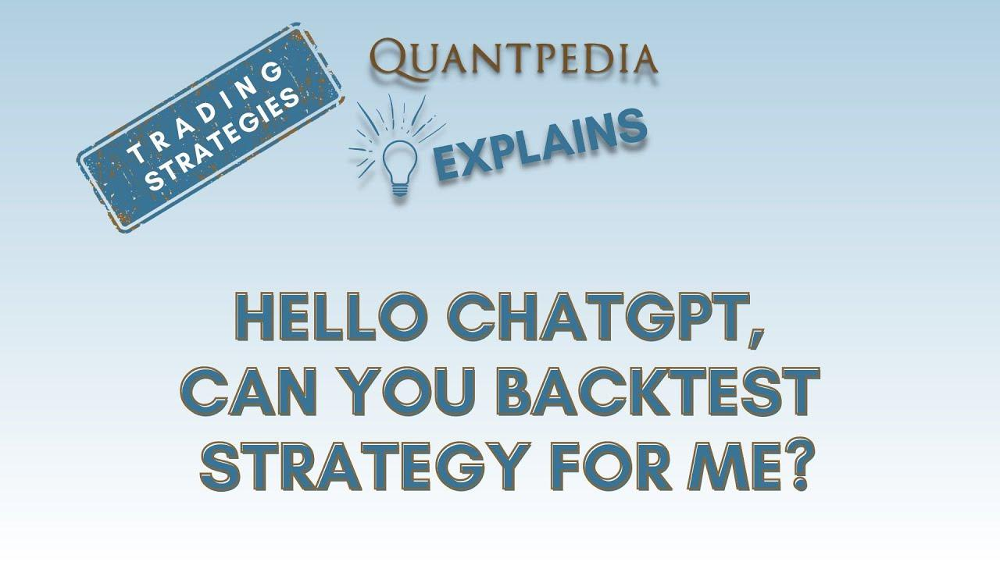

## Table of Contents

## What is backtesting and why is it important for trading strategies?

Backtesting is when you test a trading strategy using old market data to see how it would have worked in the past. It's like pretending to trade with historical prices to see if your strategy would have made money or lost money. You can use a computer program to do this, which makes it quick and easy to test many different strategies.

Backtesting is important for trading strategies because it helps you understand if your strategy is good or not before you use real money. By looking at how your strategy would have done in the past, you can see if it might work well in the future. This can save you from losing money on a bad strategy and help you feel more confident when you start trading for real.

## How can ChatGPT assist with backtesting trading strategies?

ChatGPT can help with backtesting trading strategies by giving you ideas and explaining how different strategies work. You can ask ChatGPT about specific trading rules or indicators, and it can tell you how they might have performed in the past. This can help you understand which strategies might be worth testing further. For example, if you're thinking about using a moving average crossover strategy, ChatGPT can explain how it works and give you examples of how it might have done in different market conditions.

However, ChatGPT itself cannot actually run the backtests for you. It doesn't have the ability to process large amounts of historical data or perform the calculations needed to see how a strategy would have performed over time. For that, you would need to use special software or programming languages like Python, which are designed for backtesting. But ChatGPT can still be very useful by helping you learn about different strategies and giving you tips on what to look for when you do your own backtesting.

## What are the basic steps to backtest a trading strategy?

To backtest a trading strategy, you first need to decide on the strategy you want to test. This could be something simple like buying when a stock's price goes above its 50-day moving average and selling when it drops below. Once you have your strategy, you need to gather historical data for the stocks or assets you want to test it on. This data should include prices, volumes, and any other information your strategy uses. You can get this data from financial websites or databases.

After you have your data, you use a computer program or software to run the backtest. This software will apply your trading rules to the historical data to see how your strategy would have performed. It will show you things like how much money you would have made or lost, how often you would have traded, and how risky the strategy was. Make sure to check if the results make sense and if the strategy would have worked well in different market conditions. If the backtest looks good, you might want to try the strategy with a small amount of real money to see how it works in the real world.

## What data is required to effectively backtest a trading strategy?

To effectively backtest a trading strategy, you need historical price data for the stocks, commodities, or other assets you want to test. This data should include the open, high, low, and close prices for each trading day, as well as the trading [volume](/wiki/volume-trading-strategy). Some strategies might also need other information like dividends, stock splits, or interest rates. The more detailed and accurate the data, the better your backtest will be. You can get this data from financial databases or websites that offer historical market information.

Once you have the price data, you also need to consider the time frame for your backtest. Depending on your strategy, you might need data from several years to make sure it works in different market conditions. For example, a strategy that works well in a bull market might not work in a bear market. Make sure the data covers enough time to include different economic cycles. This way, you can see if your strategy is robust and can handle various market situations.

## How do you select an appropriate time frame for backtesting?

Choosing the right time frame for backtesting is important because it helps you see how your trading strategy would work in different market situations. You want to pick a time frame that is long enough to include both good and bad market conditions. For example, if you only test your strategy over a short period when the market was going up, you might think it's great, but it could fail when the market goes down. So, a good rule is to use at least 3 to 5 years of data. This way, you can see how your strategy does in bull markets, bear markets, and everything in between.

The time frame you choose also depends on the kind of trading you plan to do. If you are [day trading](/wiki/day-trading-spy), you might need data with 1-minute or 5-minute intervals to test your strategy accurately. But if you are a long-term investor, daily or weekly data might be enough. The key is to match the time frame of your backtest to the time frame of your trading strategy. This makes sure that the results you get from backtesting are useful for how you plan to trade in the future.

## What are common pitfalls to avoid when backtesting with ChatGPT?

When using ChatGPT to help with backtesting, one common pitfall is relying too much on it for the actual backtesting process. ChatGPT can explain strategies and give you ideas, but it can't run the backtests for you. You need special software or programming skills to do that. If you depend on ChatGPT to do the backtesting, you might think you've tested your strategy when you haven't, which can lead to bad decisions when you start trading with real money.

Another pitfall is not understanding the limitations of ChatGPT's knowledge. It can give you general advice and examples, but it might not know about the latest market trends or specific details about certain stocks or assets. This means you could miss important information that could affect your strategy's performance. Always double-check the information ChatGPT gives you with other sources to make sure it's accurate and up-to-date.

## How can you validate the results of a backtest performed by ChatGPT?

You can't really validate the results of a backtest performed by ChatGPT because ChatGPT can't actually do backtesting. It can only talk about strategies and give you ideas, but it can't run the tests or show you how a strategy would have done in the past. If you want to check if a trading strategy works, you need to use special software or write code to do the backtesting yourself.

To make sure your backtest results are good, you should use real data and test over a long time to see how the strategy does in different market conditions. After you run the backtest with the right tools, you can look at the results to see if the strategy makes money, how often it trades, and how risky it is. If everything looks good, you might want to try it with a small amount of real money to see if it works in the real world.

## What advanced metrics should you consider when evaluating backtest performance?

When you backtest a trading strategy, you want to look at more than just how much money you would have made. One important metric is the Sharpe Ratio, which tells you how much return you are getting for the risk you are taking. A higher Sharpe Ratio means your strategy is doing well compared to the risk involved. Another useful metric is the Sortino Ratio, which is similar but only looks at the bad risk, or downside risk. This can be helpful because it focuses on the risk of losing money, which is often what traders worry about the most.

You should also pay attention to the Maximum Drawdown, which shows the biggest loss you would have faced at any point during the backtest. This helps you understand how bad things could get, which is important for managing your emotions and sticking to your strategy during tough times. Additionally, consider the Win Rate and the Profit Factor. The Win Rate tells you how often your trades are successful, while the Profit Factor compares your total wins to your total losses. These metrics together give you a fuller picture of how your strategy might perform in the real world.

## How can you incorporate risk management into your backtesting process with ChatGPT?

When you're thinking about backtesting a trading strategy, you can use ChatGPT to help you figure out how to include risk management. Risk management is all about protecting your money and making sure you don't lose too much. You can ask ChatGPT about different ways to manage risk, like setting stop-loss orders, which automatically sell a stock if it drops to a certain price, or using position sizing, which means deciding how much money to put into each trade. ChatGPT can explain these ideas and help you understand how they might fit into your strategy.

Once you have these ideas from ChatGPT, you need to actually test them in your backtesting software. You can't use ChatGPT to run the backtests, but it can help you think through how to set up your risk management rules. For example, you might decide to backtest your strategy with different stop-loss levels to see which one works best. By doing this, you can see how well your strategy handles risk and if it can still make money even when things don't go perfectly. This way, you'll be better prepared for real trading.

## What are the limitations of backtesting trading strategies using ChatGPT?

ChatGPT can help you learn about trading strategies and give you ideas on how to manage risk, but it can't actually do the backtesting for you. Backtesting means testing a strategy with old market data to see how it would have done, and you need special software or programming skills to do that. ChatGPT can explain what backtesting is and suggest what data you might need, but it can't run the tests or show you the results. So, if you rely on ChatGPT to backtest your strategy, you might think you've tested it when you haven't, which can lead to bad decisions when you start trading with real money.

Another limitation is that ChatGPT's knowledge might not be up-to-date or specific enough for your needs. It can give you general advice and examples, but it might not know about the latest market trends or details about certain stocks or assets. This means you could miss important information that could affect how your strategy performs. Always double-check the information ChatGPT gives you with other sources to make sure it's accurate and current. This way, you can use ChatGPT to learn and get ideas, but you'll need to do the actual backtesting yourself with the right tools.

## How can you optimize a trading strategy based on backtest results from ChatGPT?

You can't really optimize a trading strategy based on backtest results from ChatGPT because it can't actually do backtesting. ChatGPT can help you understand different trading strategies and give you ideas on how to manage risk, but it can't run the tests or show you how a strategy would have done in the past. If you want to see if your strategy works, you need to use special software or programming skills to do the backtesting yourself. Once you have the results, you can look at them to see what works and what doesn't.

After you run the backtest with the right tools, you can start optimizing your strategy. Look at the results to see if the strategy makes money, how often it trades, and how risky it is. If you see that the strategy loses money in certain market conditions, you might want to change your rules to handle those situations better. For example, if your strategy does poorly when the market goes down, you could add a rule to sell stocks faster when they start dropping. By trying different changes and running more backtests, you can find the best way to make your strategy work well.

## What are the best practices for scaling a backtested strategy to live trading?

When you want to start using a strategy you've backtested in real trading, it's important to start small. Instead of putting all your money into the strategy right away, begin with a small amount. This way, if something goes wrong, you won't lose a lot of money. It also gives you a chance to see how the strategy works in the real world, which can be different from what you saw in the backtest. Keep an eye on how it's doing and be ready to make changes if needed.

Another good practice is to keep using the same rules you used in your backtest. Don't start changing things just because the market feels different. Stick to your plan and give it time to work. Also, think about the costs of trading, like fees and taxes, which you might not have included in your backtest. These can affect how much money you make, so make sure to account for them when you start trading for real.

## What is Understanding Backtesting in Algorithmic Trading?

Backtesting is a methodological approach used to evaluate and refine trading strategies by simulating their performance on historical data. This process serves as an essential tool for traders and analysts who seek to quantify the effectiveness of trading strategies before deploying them in live markets. The underlying premise is that strategies which performed well in the past may have the potential to succeed in the future, although this is not always guaranteed.

During [backtesting](/wiki/backtesting), a trader applies specific trading rules to historical market data to determine how a strategy would have performed over a defined period. This provides valuable insights into the strategy's expected returns and risk profile. A critical aspect of backtesting is the use of key performance metrics, such as returns, [volatility](/wiki/volatility-trading-strategies), the Sharpe ratio, and drawdowns, to evaluate the strategy.

- **Returns** measure the overall profit or loss achieved by the strategy over the test period.

- **Volatility** assesses the degree of variation in the trading strategy's returns, indicating the level of risk involved.

- The **Sharpe ratio** is a metric that indicates the risk-adjusted return of a strategy, calculated as:
$$
  \text{Sharpe Ratio} = \frac{E[R] - R_f}{\sigma_R}

$$

  where $E[R]$ is the expected return, $R_f$ is the risk-free rate, and $\sigma_R$ is the standard deviation of the return.

- **Drawdowns** represent the peak-to-trough decline in a strategy's equity curve, gauging the strategy's capacity to manage sustained losses.

Traditionally, backtesting has been performed using tools such as Excel and programming languages like Python. Excel provides a user-friendly interface for implementing simple trading models and analyzing their performance using its in-built functions and macros. However, for more complex strategies, Python is often preferred due to its robust libraries such as Pandas and NumPy for data manipulation, as well as libraries like Matplotlib for visualization. Python's rich ecosystem also includes dedicated libraries for quantitative finance, such as Backtrader and Zipline, which offer structures and tools specifically designed for backtesting.

Backtesting remains a crucial component in the toolbox of quantitative analysts and traders, enabling the empirical evaluation of strategies and supporting informed decision-making in trading operations. Through the integration of thorough backtesting procedures, traders can better assess a strategy’s risk-return trade-off and enhance the probability of success in live trading environments.

## References & Further Reading

[1]: Bergstra, J., Bardenet, R., Bengio, Y., & Kégl, B. (2011). ["Algorithms for Hyper-Parameter Optimization."](https://papers.nips.cc/paper/4443-algorithms-for-hyper-parameter-optimization) Advances in Neural Information Processing Systems 24.

[2]: ["Advances in Financial Machine Learning"](https://www.amazon.com/Advances-Financial-Machine-Learning-Marcos/dp/1119482089) by Marcos Lopez de Prado

[3]: ["Evidence-Based Technical Analysis: Applying the Scientific Method and Statistical Inference to Trading Signals"](https://www.amazon.com/Evidence-Based-Technical-Analysis-Scientific-Statistical/dp/0470008741) by David Aronson

[4]: ["Machine Learning for Algorithmic Trading"](https://github.com/stefan-jansen/machine-learning-for-trading) by Stefan Jansen

[5]: ["Quantitative Trading: How to Build Your Own Algorithmic Trading Business"](https://books.google.com/books/about/Quantitative_Trading.html?id=j70yEAAAQBAJ) by Ernest P. Chan