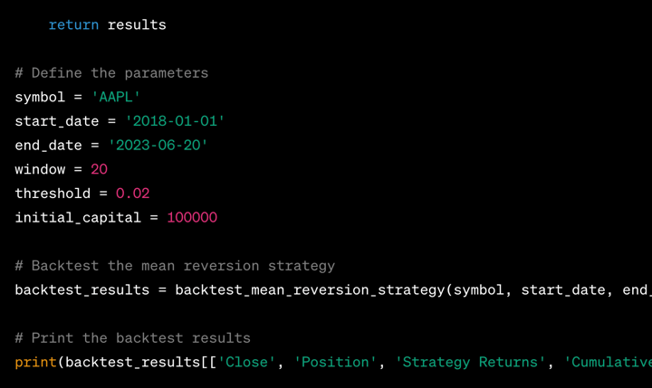

The rapid evolution of artificial intelligence (AI) has significantly influenced various sectors, notably transforming the landscape of finance. One of the critical functions within finance, particularly in algorithmic trading, is backtesting trading strategies. This process enables traders to evaluate the potential effectiveness of their strategies by applying them to historical market data, thereby providing insights into how these strategies might perform in live trading environments. Backtesting not only serves as a testing ground for strategies but also as a means to refine and optimize them before capital is allocated in real markets.

In recent years, AI innovations, exemplified by models like ChatGPT, have introduced new dimensions to backtesting processes. These AI models possess the capability to handle vast amounts of data, generate sophisticated analyses, and even automate tasks traditionally performed manually by traders. By leveraging such AI technologies, traders can potentially enhance the efficiency and precision of backtesting, gaining more comprehensive insights while reducing the time and effort required compared to conventional methods.



This article will explore how ChatGPT specifically can be used in backtesting trading strategies within algorithmic trading. It aims to explain the procedural setup for utilizing ChatGPT, the advantages it might offer to traders seeking to refine their strategies, and the inherent limitations that accompany its use. Furthermore, the continual advancements in AI technology promise further enhancements in trading practices, suggesting a promising future where AI not only aids but possibly transforms decision-making processes in trading. Through these discussions, the article will highlight the potential of AI as a pivotal element in shaping the next generation of trading strategies and methodologies.

## Table of Contents

## Understanding Backtesting in Algorithmic Trading

Backtesting is a methodological approach used to evaluate and refine trading strategies by simulating their performance on historical data. This process serves as an essential tool for traders and analysts who seek to quantify the effectiveness of trading strategies before deploying them in live markets. The underlying premise is that strategies which performed well in the past may have the potential to succeed in the future, although this is not always guaranteed.

During [backtesting](/wiki/backtesting), a trader applies specific trading rules to historical market data to determine how a strategy would have performed over a defined period. This provides valuable insights into the strategy's expected returns and risk profile. A critical aspect of backtesting is the use of key performance metrics, such as returns, [volatility](/wiki/volatility-trading-strategies), the Sharpe ratio, and drawdowns, to evaluate the strategy.

- **Returns** measure the overall profit or loss achieved by the strategy over the test period.

- **Volatility** assesses the degree of variation in the trading strategy's returns, indicating the level of risk involved.

- The **Sharpe ratio** is a metric that indicates the risk-adjusted return of a strategy, calculated as:
$$
  \text{Sharpe Ratio} = \frac{E[R] - R_f}{\sigma_R}

$$

  where $E[R]$ is the expected return, $R_f$ is the risk-free rate, and $\sigma_R$ is the standard deviation of the return.

- **Drawdowns** represent the peak-to-trough decline in a strategy's equity curve, gauging the strategy's capacity to manage sustained losses.

Traditionally, backtesting has been performed using tools such as Excel and programming languages like Python. Excel provides a user-friendly interface for implementing simple trading models and analyzing their performance using its in-built functions and macros. However, for more complex strategies, Python is often preferred due to its robust libraries such as Pandas and NumPy for data manipulation, as well as libraries like Matplotlib for visualization. Python's rich ecosystem also includes dedicated libraries for quantitative finance, such as Backtrader and Zipline, which offer structures and tools specifically designed for backtesting.

Backtesting remains a crucial component in the toolbox of quantitative analysts and traders, enabling the empirical evaluation of strategies and supporting informed decision-making in trading operations. Through the integration of thorough backtesting procedures, traders can better assess a strategy’s risk-return trade-off and enhance the probability of success in live trading environments.

## ChatGPT's Role in Backtesting Strategies

Artificial Intelligence (AI) is progressively modernizing the financial sector, introducing novel methods to enhance traditional processes. One such innovation is the employment of ChatGPT, an AI language model developed by OpenAI, in backtesting trading strategies. This section explores the transformative role ChatGPT plays in backtesting by analyzing its capabilities, comparing it to conventional methods, and presenting illustrative examples like the risk parity asset allocation strategy.

ChatGPT offers remarkable capabilities in handling data and generating analyses, making it an invaluable tool in backtesting tasks. Its proficiency in natural language processing enables it to understand and interpret complex datasets, facilitating a deeper analysis of trading strategies. ChatGPT can process large volumes of historical market data, enabling simulations of trading strategies to assess their potential performance. This automation of backtesting tasks reduces the time and effort traditionally required, therein streamlining the evaluation process.

When comparing ChatGPT to traditional backtesting methods, such as using Excel or Python scripts, its efficiency and user-friendliness become apparent. Typically, traditional backtesting methods demand significant programming skills and manual input, which can be time-consuming and prone to human errors. ChatGPT, however, can automate these processes with inputs defined in natural language, making it accessible to traders without extensive programming knowledge. Moreover, ChatGPT can offer insightful interpretations of backtested results, which can directly inform strategic alterations and optimizations.

ChatGPT can be particularly effective when used to assess complex strategies like the risk parity asset allocation strategy. Risk parity aims to allocate assets by equalizing their risk contributions, rather than their capital weights. This can be computationally intensive, requiring accurate estimation of asset volatilities and correlation matrices. ChatGPT's capability to automate these calculations and provide strategic insights can expedite the evaluation and adjustment of such strategies. 

For instance, to backtest a risk parity strategy using ChatGPT, a trader needs to input the desired asset classes and historical data. ChatGPT can then automate the complex calculations necessary to determine the optimal allocation that equalizes risk contributions. Additionally, ChatGPT can simulate how this allocation would have historically performed, offering insights into the strategy's robustness against various market conditions.

By integrating ChatGPT into the backtesting process, traders can significantly enhance both the efficiency and comprehensiveness of their strategy evaluations. Yet, despite these advancements, it remains crucial to validate ChatGPT's analyses and remain aware of its limitations, particularly concerning data quality and AI 'hallucinations'—wherein the AI might output incorrect or nonsensical information.

## Steps to Backtest a Strategy Using ChatGPT

To backtest a trading strategy using ChatGPT, traders can follow these systematic steps to ensure an effective analysis:

### Step 1: Preparing the Data
To begin, gather the relevant historical financial data that corresponds to the asset or index of interest. This data typically includes price data such as open, high, low, close prices, and [volume](/wiki/volume-trading-strategy). Sources for this data may include financial databases, brokerage platforms, or data vendors. Ensure that the data is clean, formatted appropriately, and free of errors or anomalies. For automation within ChatGPT, converting this data to a CSV or similar structured format is recommended.

### Step 2: Setting Up ChatGPT
Input the prepared data into ChatGPT for processing. This can be done by coding a script in Python or another programming language that formats the data and submits it to the ChatGPT interface. Utilize APIs or interfacing libraries, like OpenAI's API, to facilitate the interaction. For instance, to set up the initial environment, the following Python code can be used:

```python
import openai

# Set up the OpenAI API with your key
openai.api_key = 'your-api-key'

# Define the data and prompt for analysis
historical_data = read_data('historical_data.csv')  # User-defined function to read data
prompt = f"Analyze this trading strategy with the following data: {historical_data}"

# Send data to ChatGPT
response = openai.Completion.create(
  engine="text-davinci-003",
  prompt=prompt,
  max_tokens=1000
)

# Extract response output
analysis_output = response['choices'][0]['text']
```

### Step 3: Inputting the Trading Strategy
Next, clearly define and input the trading strategy to be tested. Articulate rules for entry and [exit](/wiki/exit-strategy) points, indicators used, and any conditions that trigger trades. An explanatory prompt might look like:

```
"Here's a moving average crossover strategy. Trade data: {historical_data}. The strategy is: Buy when the 50-day MA crosses above the 200-day MA and sell when it crosses below."
```

### Step 4: Interpreting ChatGPT's Output
Once the strategy and data are submitted, interpret the output generated by ChatGPT. This output should include insights such as hypothetical returns, maximum drawdown, Sharpe ratio, and other relevant metrics. Evaluate the strategy performance based on these key metrics to determine its viability:

- **Returns:** "$\frac{\text{Final Portfolio Value} - \text{Initial Portfolio Value}}{\text{Initial Portfolio Value}} \times 100\%$"
- **Volatility:** Standard deviation of returns.
- **Sharpe Ratio:** "$\frac{\text{Average Return} - \text{Risk-free Rate}}{\text{Volatility}}$"
- **Drawdown:** Maximum observed loss from a peak to a trough before a new peak is attained.

### Step 5: Making Informed Decisions
Utilize the insights obtained from the analysis to make informed decisions. Identify strengths and weaknesses within the strategy. Consider adjustments that could improve performance, such as refining entry/exit points, incorporating additional indicators, or adjusting time frames.

### Step 6: Practical Tips for Optimization
For optimization, consider backtesting over various periods and market conditions to test the robustness. It's imperative to avoid overfitting by ensuring that any adjustments are justified based on market logic rather than merely improving past performance. Additionally, constantly update the model with new data and re-evaluate as needed to ensure continued effectiveness.

By following these steps, traders can effectively employ ChatGPT to backtest trading strategies, maximizing the potential for successful outcomes while remaining agile to changing market dynamics.

## Limitations and Considerations

When employing ChatGPT for backtesting trading strategies, several inherent limitations and considerations must be addressed to ensure effective use. A primary challenge lies in data availability and computing constraints. ChatGPT, while adept at processing and generating text-based insights, is not inherently equipped to access or process large datasets, especially those containing real-time or proprietary market data. Most trading algorithms require vast and specific datasets to accurately simulate historical trading performance. Thus, traders need to integrate ChatGPT with systems that provide robust data handling and computation capabilities.

Regarding accuracy and reliance on historical data, ChatGPT's performance hinges on the quality and breadth of data input. Historical data is crucial as it serves as the foundation upon which model predictions and insights are based. However, reliance on such data can be a double-edged sword, especially if the dataset fails to capture outliers, market anomalies, or regime shifts that could skew results. ChatGPT does not inherently validate the accuracy of the provided data, making it essential for users to ensure data reliability and completeness before use.

Another critical issue is the risk of overfitting. ChatGPT can simulate complex models and, if allowed, might overly tailor strategies to historical datasets, capturing noise rather than underlying patterns. This results in models that perform well on historical data but poorly on unseen data. Traders must be vigilant about testing their strategies on out-of-sample data, maintaining a strict line between training and testing datasets, and implementing regularization techniques to mitigate overfitting risks.

Additionally, the phenomenon known as "hallucinations"—where AI generates outputs that are plausible-sounding but inaccurate or nonsensical—presents a unique challenge. Such inaccuracies can be detrimental when deriving trade signals or strategy modifications. To mitigate these risks, users should cross-reference ChatGPT outputs with established analytical tools and seek corroborating evidence before implementing AI-driven insights into practical trading scenarios. Establishing robust verification procedures and incorporating human expertise ensures that AI-enhanced backtesting aligns with real-world market behaviors and sound financial principles.

## Future Implications

As [artificial intelligence](/wiki/ai-artificial-intelligence) (AI) technology continues to advance, its potential to transform trading and backtesting strategies becomes increasingly significant. The ongoing development of models like ChatGPT, with regular updates and improvements, will likely have profound implications for [algorithmic trading](/wiki/algorithmic-trading). One key [factor](/wiki/factor-investing) driving this transformation is the enhancement of AI capabilities in processing vast amounts of data and generating insightful analyses. These improvements make AI an invaluable tool for traders seeking to refine and optimize their strategies.

ChatGPT's continuous evolution promises to augment the efficiency and accuracy of backtesting processes. Recent updates have focused on increasing the models' contextual understanding and analytical proficiency, enabling more precise interpretations of market data and historical trends. This capacity enhances researchers' and traders' ability to identify profitable patterns and reduce the time spent analyzing extensive datasets. Moreover, these advancements allow AI models to better accommodate updates in market conditions, leading to more adaptive trading strategies.

The integration of AI into [quantitative trading](/wiki/quantitative-trading) strategies and decision-making processes could significantly alter the landscape of financial markets. AI's ability to quickly analyze and synthesize information from disparate sources allows traders to make more informed decisions. For instance, quantitative strategies could leverage AI to test multiple scenarios simultaneously, optimizing decision-making based on predicted outcomes. This integration enables a deeper understanding of market dynamics and informs the development of innovative trading models tailored to evolving economic conditions.

As the role of AI expands, its function as a "virtual junior data analyst" may revolutionize the trading industry. AI's capability to undertake substantial analytical workloads frees human analysts to focus on more strategic initiatives. By performing routine data analysis and backtesting tasks, AI allows human traders to concentrate on interpreting results and deciding on strategy adjustments. This shift in operational dynamics not only enhances efficiency but also offers traders the opportunity to explore complex strategies previously limited by resource constraints.

The implications of AI advancements extend beyond improved backtesting and trading strategies. They suggest a future where AI acts as an integral component of trading operations, continuously learning and adapting to new market conditions. This could lead to the development of highly sophisticated trading ecosystems, where AI isn't just a tool, but a critical partner in strategic planning and execution. It points toward a time when AI's insights drive a significant portion of trading decisions, leading to increased profitability and reduced risk for market participants.

## Conclusion

ChatGPT has shown remarkable potential in backtesting trading strategies, offering several comparative advantages over traditional methods. Its ability to handle vast datasets, generate insightful analysis, and automate repetitive tasks positions it as a formidable tool for traders looking to optimize their strategies. By leveraging ChatGPT, traders can streamline their backtesting processes, derive faster insights, and potentially enhance the accuracy of their trading models.

The integration of AI in trading heralds a new era where decision-making is increasingly driven by data and advanced computational techniques. As AI technologies continue to evolve, they promise to provide traders with more sophisticated tools to better navigate complex financial markets. Tools like ChatGPT can augment a trader's ability to test and implement strategies efficiently, adapting to the dynamic nature of financial environments. This could lead to more innovative trading solutions and improved risk management practices.

However, while the prospects are promising, traders are advised to approach AI-driven tools with a balanced perspective. It is crucial to remain aware of the inherent limitations, such as potential biases in data inputs and the possibility of AI generating inaccurate predictions or "hallucinations." Understanding these limitations fosters a more effective use of such tools and helps prevent over-reliance on AI outputs without human oversight.

As AI continues to reshape the landscape of algorithmic trading, its role is likely to expand, serving as a critical component in the development and execution of trading strategies. By acting as a virtual assistant, AI can complement human expertise, enabling traders to achieve greater efficiency and precision. Embracing AI technologies like ChatGPT, while maintaining analytical skepticism, can lead to significant advancements in the field and usher in higher levels of innovation and profitability in trading practices.

## References & Further Reading

[1]: Bergstra, J., Bardenet, R., Bengio, Y., & Kégl, B. (2011). ["Algorithms for Hyper-Parameter Optimization."](https://papers.nips.cc/paper/4443-algorithms-for-hyper-parameter-optimization) Advances in Neural Information Processing Systems 24.

[2]: ["Advances in Financial Machine Learning"](https://www.amazon.com/Advances-Financial-Machine-Learning-Marcos/dp/1119482089) by Marcos Lopez de Prado

[3]: ["Evidence-Based Technical Analysis: Applying the Scientific Method and Statistical Inference to Trading Signals"](https://www.amazon.com/Evidence-Based-Technical-Analysis-Scientific-Statistical/dp/0470008741) by David Aronson

[4]: ["Machine Learning for Algorithmic Trading"](https://github.com/stefan-jansen/machine-learning-for-trading) by Stefan Jansen

[5]: ["Quantitative Trading: How to Build Your Own Algorithmic Trading Business"](https://books.google.com/books/about/Quantitative_Trading.html?id=j70yEAAAQBAJ) by Ernest P. Chan