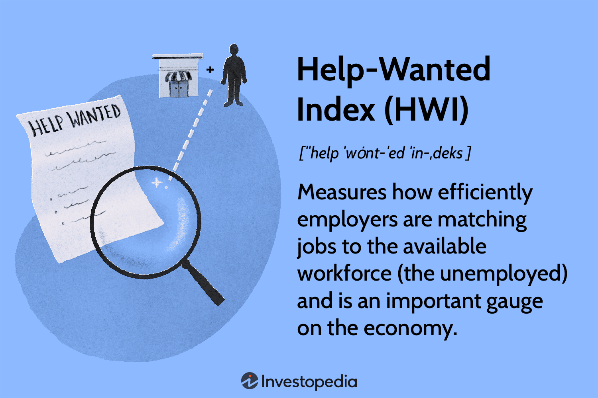

## Table of Contents

## What is the Help-Wanted Index?

The Help-Wanted Index is a measure that shows how many job openings there are in the market. It is used to understand how easy or hard it is for people to find jobs. The index is calculated by looking at the number of job ads in newspapers and online. A high number means there are lots of job openings, which is good for people looking for work.

This index is important because it helps economists and policymakers see trends in the job market. If the index goes up, it might mean the economy is doing well because businesses are hiring more. If it goes down, it could be a sign that the economy is slowing down and fewer jobs are available. By watching the Help-Wanted Index, people can get a sense of whether it's a good time to look for a job or if they should wait.

## How is the Help-Wanted Index calculated?

The Help-Wanted Index is calculated by counting the number of job ads in newspapers and online. People who make the index look at how many job ads there are in a certain area or across the whole country. They then compare this number to a base year to see if there are more or fewer job ads now than before. This gives them a number that shows how the job market is doing.

The index is usually shown as a number where 100 means the same number of job ads as the base year. If the index is over 100, it means there are more job ads now than in the base year, which is good news for people looking for work. If it's under 100, it means there are fewer job ads, which might make it harder to find a job. By comparing the index over time, economists can see if the job market is getting better or worse.

## What does the Help-Wanted Index measure?

The Help-Wanted Index measures how many job openings there are by counting job ads in newspapers and online. It tells us if it's easy or hard for people to find jobs. The index compares the number of job ads now to the number from a base year. If the index is over 100, it means there are more job ads now than in the base year, which is good for job seekers. If it's under 100, there are fewer job ads, which might make finding a job harder.

This index is important because it helps people understand the job market. Economists and policymakers use it to see if the economy is doing well or if it's slowing down. When the index goes up, it often means businesses are hiring more, which is a sign of a strong economy. When it goes down, it might mean fewer jobs are available, which could be a sign of economic trouble. By watching the Help-Wanted Index, people can decide if it's a good time to look for a job or if they should wait.

## Why is the Help-Wanted Index important for economists?

The Help-Wanted Index is important for economists because it helps them understand how many jobs are available. By looking at the number of job ads, economists can see if it's easy or hard for people to find work. This information is important because it tells them if the economy is doing well or not. If the index is high, it means there are lots of job openings, which is a good sign for the economy. If it's low, it might mean the economy is slowing down.

Economists use the Help-Wanted Index to make decisions and give advice. For example, if the index shows more job ads, they might tell the government to keep doing what they're doing because the economy is strong. If the index goes down, they might suggest ways to help people find jobs, like starting new programs or changing laws. By watching the Help-Wanted Index, economists can help guide the economy in the right direction.

## How often is the Help-Wanted Index updated?

The Help-Wanted Index is usually updated every month. This means that once a month, people who make the index look at all the job ads in newspapers and online to see how many there are. They then compare this number to the number from a base year to see if there are more or fewer job ads now.

By updating the index every month, economists and people looking for jobs can see the latest changes in the job market. If the index goes up, it might mean more jobs are available, which is good news. If it goes down, it could mean fewer jobs are available, which might make it harder to find work.

## Can the Help-Wanted Index predict economic trends?

The Help-Wanted Index can help predict economic trends because it shows how many job openings there are. When the index goes up, it often means the economy is doing well. Businesses are hiring more people, which is a good sign. Economists look at the index to see if the economy might grow or shrink in the future. If the index is high, they might predict that the economy will keep growing.

On the other hand, if the Help-Wanted Index goes down, it can be a warning sign. A lower index might mean fewer jobs are available, which could mean the economy is slowing down. Economists use this information to guess what might happen next. They might suggest ways to help the economy, like starting new job programs or changing laws. By watching the Help-Wanted Index, economists can get a sense of where the economy is headed.

## What are the limitations of the Help-Wanted Index?

The Help-Wanted Index has some limitations that people should know about. One big problem is that it only looks at job ads in newspapers and online. But not all jobs are advertised this way. Some jobs are found through friends, family, or networking. So, the index might miss a lot of job openings that are not in ads. This means the index might not show the full picture of the job market.

Another limitation is that the index can be slow to update. It is updated once a month, which means it might not show the latest changes in the job market right away. If something big happens in the economy, like a new law or a big company closing, the index might not show it until the next month. This can make it hard for economists and job seekers to react quickly to changes in the job market.

## How does the Help-Wanted Index compare to other employment indicators?

The Help-Wanted Index is one way to look at the job market, but there are other employment indicators too. One common indicator is the unemployment rate, which shows the percentage of people who are not working but are looking for a job. The unemployment rate is updated every month and gives a quick snapshot of how many people are out of work. Unlike the Help-Wanted Index, the unemployment rate looks at people, not job ads. This can be useful because it tells us how many people need jobs, not just how many jobs are being advertised.

Another indicator is the job openings and labor turnover survey (JOLTS), which counts the number of job openings, hires, and separations in the U.S. JOLTS is also updated monthly and gives a broader view of the job market than the Help-Wanted Index. It looks at actual job openings, not just ads, so it can show more about what is happening in different industries. The Help-Wanted Index might miss jobs that are not advertised, while JOLTS tries to capture all job openings. Both the Help-Wanted Index and these other indicators help economists and policymakers understand the job market, but they each have their own strengths and weaknesses.

## What historical trends have been observed in the Help-Wanted Index?

Over time, the Help-Wanted Index has shown some interesting patterns. During good economic times, the index often goes up because more businesses are hiring and there are more job ads. For example, in the late 1990s, the index was high because the economy was booming and many companies were looking for workers. On the other hand, during economic downturns, like the 2008 financial crisis, the index dropped a lot. This was because fewer companies were hiring, and there were fewer job ads in newspapers and online.

Another trend we see is that the Help-Wanted Index can change a lot from month to month. Sometimes, it goes up and down quickly because of seasonal changes, like more jobs in the summer or fewer in the winter. Also, big events like new laws or big companies closing can make the index change suddenly. Economists look at these trends to understand what's happening in the job market and to predict what might happen next. By watching the Help-Wanted Index over time, they can see if the economy is getting better or worse.

## How can businesses use the Help-Wanted Index for strategic planning?

Businesses can use the Help-Wanted Index to plan their hiring. If the index is high, it means there are a lot of job ads and the job market is good. This can be a good time for businesses to hire new people because there are more workers looking for jobs. They can also use this time to look for the best workers since more people might be applying. On the other hand, if the index is low, it means fewer job ads and a tougher job market. Businesses might need to offer better pay or benefits to attract workers during these times.

The Help-Wanted Index can also help businesses plan for the future. If the index is going up, it might mean the economy is getting better. Businesses can use this information to decide when to expand or start new projects. They might hire more people or open new locations because they know more workers will be available. If the index is going down, it might be a sign that the economy is slowing down. Businesses can then be more careful with their spending and hiring, maybe waiting for better times to grow. By watching the Help-Wanted Index, businesses can make smarter plans and be ready for changes in the job market.

## What are the regional variations in the Help-Wanted Index across different countries?

The Help-Wanted Index can show different numbers in different parts of the world. In countries like the United States, the index might be high in big cities like New York or San Francisco because there are many businesses and jobs there. But in smaller towns or rural areas, the index might be lower because there are fewer job ads. In Europe, countries like Germany might have a high index because their economy is strong and there are lots of jobs. But in places like Greece, the index might be lower because their economy has had more problems and fewer jobs are available.

In Asia, countries like Japan and South Korea might have different Help-Wanted Index numbers too. In Japan, the index might be high in big cities like Tokyo where there are many job opportunities. But in smaller cities or the countryside, it might be lower. In South Korea, the index could be high because their economy is growing fast and many new jobs are being created. But in other parts of Asia, like some areas in India, the index might be lower because there are not as many job ads. By looking at the Help-Wanted Index in different regions, we can see how the job market is doing in different parts of the world.

## How has the methodology of the Help-Wanted Index evolved over time?

The way the Help-Wanted Index is made has changed over time. When it started, people counted job ads in newspapers. This was a good way to see how many jobs were available. But as the internet grew, more and more job ads moved online. So, the people making the index had to start counting online job ads too. This change helped the index stay useful because it now looked at more places where jobs are listed.

Now, the Help-Wanted Index uses a mix of newspaper and online job ads to get its numbers. It also uses computers to help count the ads faster and more accurately. The index still compares the number of job ads to a base year, but it can now look at ads from all over the country or even the world. These changes have made the Help-Wanted Index a better tool for understanding the job market today.

## What are the components and how is the calculation of HWI done?

The Help-Wanted Index (HWI) is constructed through a meticulous process that aggregates data from job advertisements across multiple platforms, including both traditional print media and modern online listings. This aggregation is critical in representing a comprehensive view of job demand in the economy. The data is collected and normalized to account for various market influences, such as seasonal fluctuations and the broader economic cycle, ensuring that the index accurately portrays the underlying labor market conditions.

To achieve this, the calculation of the HWI involves several key steps. First, job advertisement data is gathered across different sources, each potentially having varying levels of importance in signaling job market dynamics. In the calculation of the index, weights are assigned to these sources based on their relevance, reach, and reliability. This weighted approach ensures that more influential sources have a proportionate impact on the calculation of the index, thus enhancing its accuracy.

The normalization process that follows adjusts the raw data to neutralize the effects of seasonal patterns, such as increased hiring during holiday seasons or academic cycles, which might otherwise distort the interpretation of the index. Seasonally adjusted data provides a clearer picture of trends by filtering out these regular variations. Historical baselines are then used to compare the aggregated and normalized data. This comparison involves establishing a benchmark or a historical average against which current data can be measured, allowing for the detection of significant deviations that may indicate shifts in labor market conditions.

Mathematically, the calculation could be represented as a weighted average of job listings, adjusted seasonally, expressed as:

$$
\text{HWI} = \frac{1}{N} \sum_{i=1}^{N} (w_i \cdot J_i)
$$

Where:  
- $N$ is the number of data sources (e.g., newspapers, online platforms).
- $w_i$ is the weight assigned to each source based on its influence.
- $J_i$ is the number of job listings from the source $i$, seasonally adjusted.

The systematic approach not only ensures that the HWI accurately reflects the current state of the labor market but also makes it a reliable leading indicator for economic analysis, particularly in identifying trends connected to employment fluctuations. Through a detailed combination of aggregation, weighting, and normalization, the HWI emerges as a robust tool for understanding labor demand, contributing valuable insights for various economic stakeholders.

## References & Further Reading

[1]: Kroft, K., & Pope, D. (2014). ["Does Online Search Improve Matching Efficiency? Evidence from a Natural Experiment."](https://www.journals.uchicago.edu/doi/10.1086/673374) The Quarterly Journal of Economics.

[2]: Conference Board. (1951). ["Help-Wanted Index."](https://www.investopedia.com/terms/h/helpwantedindex.asp) The Conference Board.

[3]: Jovanovic, B. (1979). ["Job Matching and the Theory of Turnover."](https://www.journals.uchicago.edu/doi/10.1086/260808) Journal of Political Economy, 87(5), Part 1, 972-990.

[4]: Autor, D. H. (2001). ["Wiring the Labor Market."](https://www.aeaweb.org/articles?id=10.1257/jep.15.1.25).pdf) Journal of Economic Perspectives, 15(1), 25-40.

[5]: Byrne, D., & Corrado, C. (2017). ["ICT Prices and ICT Services: What Do They Tell Us About Productivity and Technology?"](https://www.federalreserve.gov/econres/feds/files/2017015r1pap.pdf).

[6]: Gomber, P., Arndt, B., Lutat, M., & Uhle, T. (2011). ["High-Frequency Trading."](https://papers.ssrn.com/sol3/papers.cfm?abstract_id=1858626) Business & Information Systems Engineering, 3(2), 153-162.

