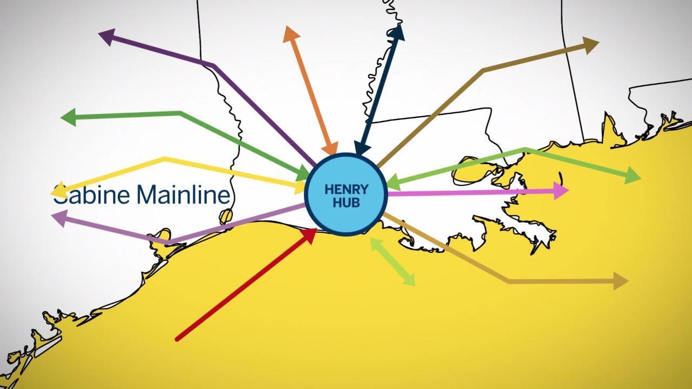

The natural gas energy market is a crucial component of the global energy landscape, providing a significant source of energy that fuels electricity generation, heating, and industrial processes worldwide. As nations seek to transition towards cleaner energy solutions, natural gas stands out due to its relatively lower carbon emissions compared to other fossil fuels, thereby playing a pivotal role in achieving global energy goals.

At the heart of the U.S. natural gas futures market lies Henry Hub, a key trading point located in Erath, Louisiana. Serving as the primary delivery location for New York Mercantile Exchange (NYMEX) natural gas contracts, Henry Hub is a central player whose pricing mechanism often sets the benchmark for natural gas prices not only across North America but also for certain segments of the global liquefied natural gas (LNG) market. The prices determined at Henry Hub are influenced by factors such as supply-demand dynamics, seasonal variations, and geopolitical events, thereby impacting both national and international markets.



In recent years, the advent of algorithmic trading has revolutionized the way natural gas contracts are transacted at Henry Hub. Utilizing sophisticated algorithms and computational power, algorithmic trading enables market participants to execute trades at unprecedented speeds and efficiency. This technological advancement is changing the landscape of the energy market, allowing traders to capitalize on price movements and optimize their trading strategies with precision.

This article examines how the variegated interplay between the Henry Hub market and algorithmic trading strategies fosters new opportunities for traders and investors. Those who can harness the insights derived from these complex systems often find themselves with a substantial competitive edge in the rapidly evolving energy market. Understanding the innovations at Henry Hub and their implications can thus guide investors in making informed decisions and potentially realizing significant financial gains.

## Table of Contents

## Understanding Henry Hub and Its Significance

Henry Hub is a critical node in the natural gas network of the United States, located in Erath, Louisiana. It functions as the primary pipeline hub, facilitating the transportation and distribution of natural gas across the country. The significance of Henry Hub extends beyond its geographical location; it serves as the designated delivery point for the New York Mercantile Exchange (NYMEX) natural gas futures contracts, a factor that consolidates its importance in the financial trading arena.

The hub is a vital convergence point, connecting with multiple key pipelines, such as the Acadian, Columbia Gulf, and Texas Gas, among others. These interconnections allow for seamless distribution and movement of natural gas to various regions, impacting the broader U.S. gas markets in both supply and price. This network of pipelines ensures that Henry Hub acts as a central point in the supply chain, influencing not only regional but also national markets.

One of the central roles of Henry Hub is its influence on settlement prices, which serve as benchmarks for natural gas markets across North America and some global Liquefied Natural Gas (LNG) markets. The price at Henry Hub is often used as a benchmark reference for spot, forward, and futures markets, given its status as a standardized and accessible delivery point.

The pricing mechanism at Henry Hub is of critical importance to global gas producers. Prices are determined by actual physical trading assets, market forces, and regulatory environments, making Henry Hub a reliable indicator of gas prices. The hub's ability to provide transparent and efficient price signals attracts various stakeholders within the energy markets, effectively setting the tone for pricing strategies in other locations influenced by North American market dynamics.

Overall, Henry Hub's location, connectivity, and its role as a price-setting benchmark underscore its significance in the natural gas market, impacting a wide range of commercial activities and strategic decisions by stakeholders within the global energy ecosystem.

## The Role of Algorithmic Trading in the Energy Market

Algorithmic trading employs a set of complex algorithms to automate trading processes, allowing for the execution of trades at high speeds and with minimal human intervention. This method has increasingly permeated energy markets such as natural gas, where precision and speed are valuable assets.

A key advantage of [algorithmic trading](/wiki/algorithmic-trading) in the energy sector is enhanced trading efficiency. Algorithms are designed to process vast amounts of market data rapidly, identifying trading opportunities that may be missed by manual analysis. By automating the trade execution process, algorithms can capitalize on these opportunities almost instantaneously. This capability is crucial in energy markets, where prices can fluctuate significantly due to changes in supply and demand, geopolitical events, and other factors.

In addition to improving efficiency, algorithmic trading can significantly reduce transaction costs. High-frequency trading ([HFT](/wiki/high-frequency-trading-strategies)), a subset of algorithmic trading, facilitates the rapid buying and selling of contracts, minimizing the bid-ask spread and lowering the impact of trading on prices. By optimizing these factors, traders can maximize their returns while minimizing costs.

Despite these advantages, algorithmic trading also presents challenges, notably with respect to market [volatility](/wiki/volatility-trading-strategies) and risk management. The rapid execution of trades can exacerbate market volatility, particularly if many algorithms respond to the same market signal simultaneously. Moreover, algorithms are not immune to errors and glitches, which can result in unintended trades and financial losses. Risk management strategies such as setting stop-loss limits, diversifying algorithmic approaches, and continuously monitoring algorithm performance are essential to mitigate these risks.

A deep understanding of algorithmic trading mechanisms can enable market participants to make more informed and strategic trading decisions. Familiarity with algorithms' logic and operational parameters allows traders to tailor their strategies to specific market conditions, optimizing the performance of their trading models. For instance, traders can program algorithms to leverage [machine learning](/wiki/machine-learning) techniques, which adapt and refine trading strategies based on historical data patterns and predictive analytics.

By mastering algorithmic trading, professionals in the energy market can gain a competitive advantage, harnessing technology to anticipate and respond to market changes with unprecedented speed and accuracy. As the trading landscape continues to evolve, the ability to integrate cutting-edge algorithms into trading strategies will be a determinant of success in navigating the dynamic environment of natural gas and other energy commodities.

## Algorithmic Trading Strategies for Henry Hub

Momentum-based algorithms are pivotal in leveraging natural gas price trends at Henry Hub. These algorithms identify and exploit price [momentum](/wiki/momentum) by analyzing historical prices and [volume](/wiki/volume-trading-strategy) data to forecast future movements. A commonly used momentum strategy is the Moving Average Crossover, where short-term and long-term moving averages are observed to signal buy or sell triggers. For instance, a bullish signal is generated when a short-term moving average, such as a 20-day average, crosses above a longer-term moving average, like a 50-day average, indicating a potential upward trend.

Mean-reversion strategies offer another approach, focusing on the premise that natural gas prices at Henry Hub will revert to their mean or average value over time after extreme price movements. This strategy is operationalized by identifying statistical arbitrages where the asset is either overpriced or underpriced relative to its historical average. Traders use statistical tools, such as the Z-score, to determine deviation from the mean and execute trades that capitalize on these discrepancies. The formula for the Z-score is:

$$
Z = \frac{(X - \mu)}{\sigma}
$$

where $X$ represents the current price, $\mu$ is the mean price, and $\sigma$ is the standard deviation.

Volatility [arbitrage](/wiki/arbitrage) entails profiting from anticipated changes in natural gas price volatility at Henry Hub due to shifts in supply and demand. This strategy does not depend directly on the direction of price changes but rather on the magnitude of those changes. Techniques such as straddles or strangles in options trading are employed, where traders buy both a put and a call option of the asset at the same strike price and expiry to benefit from large price swings, irrespective of the direction.

Machine learning technologies are integrated within these strategies to enhance predictive accuracy. By employing models like neural networks or support vector machines, traders can identify complex patterns and relationships within large datasets that manual analysis might overlook. Python libraries such as TensorFlow and scikit-learn are commonly used for implementing such machine learning models.

```python
from sklearn.preprocessing import StandardScaler
from sklearn.svm import SVR
import numpy as np

# Sample data for prices
prices = np.array([3.2, 3.3, 3.1, 3.8, 3.5]).reshape(-1, 1)

# Feature scaling
scaler = StandardScaler()
prices_scaled = scaler.fit_transform(prices)

# Support Vector Regression model
svr_model = SVR(kernel='rbf')
svr_model.fit(prices_scaled[:-1], prices_scaled[1:])

# Predicting the next price movement
next_price_scaled = svr_model.predict(prices_scaled[-1].reshape(1, -1))
next_price = scaler.inverse_transform(next_price_scaled.reshape(-1, 1))
```

Finally, traders must maintain the ability to adapt strategies based on real-time market data and news, crucial for responding swiftly to unexpected market events or regulatory changes. Access to reliable data feeds and sophisticated analytics platforms is essential. Leveraging news sentiment analysis or real-time economic indicators through APIs can provide the edge needed to adjust trading positions proactively and remain competitive in the volatile landscape of the Henry Hub natural gas market.

## Challenges and Opportunities in Algorithmic Trading at Henry Hub

Data accuracy and accessibility are crucial components for optimizing algorithm performance in the Henry Hub market. High-quality, real-time data feeds enable algorithms to make informed trading decisions, while data inaccuracies can lead to erroneous outcomes and financial losses. Historically, energy markets faced challenges with data dissemination, but advancements in technology have improved data collection and analysis, thus enhancing trading strategies. Traders often rely on Application Programming Interfaces (APIs) to access updated market information swiftly, ensuring algorithms have the best possible input data for decision-making.

Regulatory changes in the energy market represent another significant challenge for algorithmic traders. The complex landscape of regulations affects how natural gas contracts are traded, with compliance being a critical aspect of trading models. Regulatory bodies such as the Federal Energy Regulatory Commission (FERC) in the United States can introduce new guidelines or modify existing rules, impacting trading operations. Traders must build flexibility into their algorithms to adapt to these changes without significant disruptions. It is essential for algorithm developers to incorporate compliance checks and constantly monitor legal developments within their trading strategies.

Technological advancements in trading platforms present numerous opportunities for traders at Henry Hub. The development of sophisticated trading platforms provides enhanced tools for algorithmic trading, including features that facilitate [backtesting](/wiki/backtesting), optimization, and live execution of trading strategies. Enhanced processing power, cloud computing, and machine learning tools are being integrated into these platforms, allowing for better prediction models and improved decision-making processes. For instance, machine learning algorithms can analyze vast datasets to identify subtle patterns that may indicate future price movements, thus providing traders a competitive advantage.

Networking with experienced traders contributes to collaborative strategies and offers opportunities to learn from others' successes and failures. Engagement in trading communities and forums can foster the exchange of ideas and strategies, and collaboration with seasoned traders may even lead to partnerships that leverage diverse expertise. Such networks can become sources of qualitative insights that complement quantitative algorithmic models, leading to more robust trading strategies.

The evolving energy landscape necessitates the continuous adaptation of algorithms. Changes in natural gas production, consumption patterns, and geopolitical factors can significantly impact the market dynamics at Henry Hub. For example, the transition towards renewable energy sources and shifts in government energy policies can alter supply-demand balances, affecting price volatility. Algorithms must be frequently updated to account for these changes, utilizing machine learning techniques to refine models based on new data. Ultimately, the ability to swiftly adapt to an ever-changing market environment is crucial for maintaining a competitive edge in algorithmic trading at Henry Hub.

## Conclusion

Henry Hub remains a pivotal entity in the natural gas energy market, fundamentally influencing global pricing mechanisms and strategies. This influence is further amplified by the advent of algorithmic trading, which has significantly transformed the trading processes associated with this hub. Algorithmic trading, characterized by the use of sophisticated algorithms to execute trades at high speed, has introduced a new level of efficiency and precision in managing natural gas contracts. This innovation allows traders to swiftly capitalize on market fluctuations, leveraging vast datasets to predict and respond to market movements with increased accuracy.

The strategic implementation of algorithmic trading has become a hallmark of success within this competitive market. Traders who effectively utilize these algorithms can anticipate shifts in supply, demand, and pricing trends, thereby gaining a substantial competitive advantage. Such foresight is paramount, given the intrinsic volatility and complexity of the natural gas sector. By employing these technological strategies, traders can enhance their decision-making processes, optimize their portfolios, and ultimately realize more robust investment returns.

Understanding the intricate dynamics of the Henry Hub market, coupled with proficiency in algorithmic trading techniques, presents lucrative investment avenues. As technological advancements continue to reshape the landscape, those who remain informed and adaptable will be better positioned to exploit emerging opportunities. It is vital for market participants to engage in continuous learning and refinement of their trading algorithms to navigate the ongoing evolution within this sector effectively. This commitment to adaptation and innovation will be essential for thriving amidst the changing tides of the energy market.

## References & Further Reading

[1]: Brown, S. P., & Yücel, M. K. (2008). ["Market Arbitrage: European and North American Natural Gas Prices"](https://www.jstor.org/stable/41323202) Federal Reserve Bank of Dallas, Economic Letter.

[2]: Cornell, B. (2013). ["Understanding the Tax and Regulatory Implications of U.S. Natural Gas Futures Contracts."](https://www.sciencedirect.com/science/article/pii/S1090951618309271) Journal of Energy Markets.

[3]: ["Energy Trading and Investing: Trading, Risk Management, and Structuring Deals in the Energy Markets"](https://www.amazon.com/Energy-Trading-Investing-Management-Structuring/dp/1259835383) by Davis Edwards.

[4]: ["Algorithmic and High-Frequency Trading"](https://www.amazon.com/Algorithmic-High-Frequency-Trading-Mathematics-Finance/dp/1107091144) by Álvaro Cartea, Sebastian Jaimungal, & José Penalva.

[5]: Yoon, P. S., & Rosenbaum, M. (2014). ["The Microstructure of the U.S. Natural Gas Market."](https://www.nature.com/articles/nchem.687) Journal of Commodity Markets. 

[6]: ["Quantitative Energy Finance: Modeling, Pricing, and Hedging in Energy and Commodity Markets"](https://link.springer.com/book/10.1007/978-1-4614-7248-3) by Fred Espen Benth and Valery A. Kholodnyi.