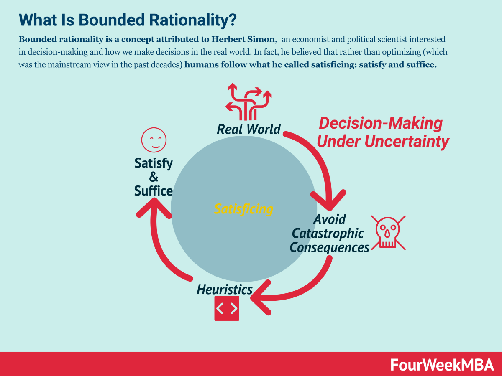

## Table of Contents

## Who was Herbert A. Simon?

Herbert A. Simon was a smart man who was born in 1916 and died in 2001. He was a professor at Carnegie Mellon University and won a Nobel Prize in Economics in 1978. He was known for his work in many areas, like economics, computer science, and psychology. He was very curious and liked to learn about how people make decisions and solve problems.

One of his big ideas was called "bounded rationality." This means that people can't always make the best choices because they don't have all the information they need, and they can't think about everything at once. Instead, they make good enough choices based on what they know. This idea changed how people think about decision-making in economics and other fields.

Simon also helped start the field of artificial intelligence. He worked on making computers that could think and solve problems like humans. He wrote a book called "The Sciences of the Artificial" that talked about how computers and other man-made things work. His work in AI and other areas made him very important in many fields.

## What is bounded rationality?

Bounded rationality is an idea that says people can't always make the best choices because they have limits on what they can know and think about. Imagine you're trying to pick the best apple from a tree, but you can only see a few apples and you don't have time to check every single one. You'll pick the best apple you can see, but it might not be the very best apple on the tree. That's what bounded rationality is about.

This idea was introduced by Herbert A. Simon, who said that people use "satisficing" instead of trying to find the perfect solution. Satisficing means finding a solution that is good enough, not perfect. Because we can't know everything and we can't think about everything at once, we make decisions based on what we know and what we can handle. This way of thinking changed how people understand decision-making in many fields, like economics and psychology.

## How did Herbert A. Simon contribute to the field of economics?

Herbert A. Simon made a big impact on economics with his idea of bounded rationality. He said that people can't always make the best choices because they don't have all the information they need and they can't think about everything at once. Instead, people make good enough choices based on what they know. This idea changed how economists think about how people make decisions. Before Simon, many economists thought people always made the best choices, but Simon showed that's not always possible.

Simon's work also led to the idea of "satisficing," which means finding a solution that is good enough, not perfect. This idea is important in economics because it helps explain why people might not always choose the best option, even if it's available. For example, someone might buy a cheaper phone that meets their needs instead of spending more time and money to find the perfect phone. Simon's ideas made economists think more about how real people make decisions, not just how they should make them. In 1978, Simon won the Nobel Prize in Economics for his work on decision-making and problem-solving.

## What role did Simon play in the development of artificial intelligence?

Herbert A. Simon played a big role in the early days of [artificial intelligence](/wiki/ai-artificial-intelligence). He worked with Allen Newell to create one of the first AI programs called the Logic Theorist in the 1950s. This program could solve math problems by thinking like a human. Simon and Newell showed that computers could be programmed to do more than just follow instructions; they could think and solve problems in ways that were similar to how people do it.

Simon also wrote a book called "The Sciences of the Artificial," which talked about how computers and other man-made things work. In this book, he explained how AI could be used to understand how people think and make decisions. His ideas helped shape the field of AI and made people think about how computers could be used to study human behavior. Simon's work in AI was so important that he is often called one of the founders of the field.

## Can you explain Simon's concept of satisficing?

Satisficing is an idea that Herbert A. Simon came up with to explain how people make decisions when they can't find the perfect answer. Instead of looking for the best possible choice, people look for a choice that is good enough. This happens because we don't have all the information we need and we can't think about everything at once. So, when faced with a decision, like choosing what to eat for dinner, we might pick something that meets our basic needs instead of spending a lot of time searching for the perfect meal.

This concept is really important because it shows that people often make decisions that are "satisfactory" and "sufficient," rather than trying to find the absolute best option. For example, if you're buying a new phone, you might not spend weeks researching every model. Instead, you'll pick one that meets your needs and is within your budget. Simon's idea of satisficing helps us understand that in real life, good enough is often good enough, and that's okay.

## How does bounded rationality differ from the traditional economic theory of rationality?

Bounded rationality and traditional economic theory of rationality are different in how they see people making choices. Traditional economic theory says that people always make the best choices. They have all the information they need, and they can think about everything to find the perfect answer. This idea is called "rational choice theory." It's like saying that if you're buying a toy, you'll look at every toy in the store, compare them all, and pick the very best one.

But Herbert A. Simon's idea of bounded rationality says that people can't always do that. We don't have all the information, and we can't think about everything at once. So, instead of finding the perfect choice, we find a choice that's good enough. This is called "satisficing." It's like if you're buying a toy, you might not look at every toy in the store. You'll just pick one that looks good and meets your needs. Bounded rationality helps us understand that in real life, people often make choices that are good enough, not perfect.

## What are some of the key books written by Herbert A. Simon?

Herbert A. Simon wrote many important [books](/wiki/algo-trading-books). One of his most famous books is called "Administrative Behavior." In this book, he talks about how people make decisions in organizations. He explains that people don't always make the best choices because they have limits on what they can know and think about. This book was very important for understanding how businesses and governments work.

Another key book by Simon is "The Sciences of the Artificial." This book is about how computers and other man-made things work. Simon explains how artificial intelligence can help us understand how people think and make decisions. This book helped start the field of AI and made people think about how computers could be used to study human behavior.

Simon also wrote a book called "Models of Man." In this book, he talks about how people make choices and solve problems. He introduces the idea of bounded rationality and explains how people often look for good enough solutions instead of perfect ones. This book changed how people think about decision-making in many fields, like economics and psychology.

## How did Simon's work influence organizational behavior and decision-making?

Herbert A. Simon's work had a big impact on how people think about organizational behavior and decision-making. He wrote a book called "Administrative Behavior" where he explained that people in organizations don't always make the best choices. Instead, they make choices based on what they know and what they can handle at the time. This idea is called bounded rationality. Simon said that because people can't know everything and can't think about everything at once, they often look for solutions that are good enough, not perfect. This changed how people understand decision-making in businesses and governments.

Simon's ideas also led to the concept of satisficing, which means finding a solution that meets your needs but might not be the best possible one. In organizations, this means that managers and employees often make decisions that are good enough to keep things running smoothly, instead of spending a lot of time trying to find the perfect answer. Simon's work made people realize that it's okay to make good enough decisions, and this has helped improve how organizations work. By understanding that people have limits, organizations can set up better ways to help people make decisions and solve problems.

## What awards and recognitions did Herbert A. Simon receive for his contributions?

Herbert A. Simon received many important awards for his work. One of the biggest awards he got was the Nobel Prize in Economics in 1978. He won this prize for his ideas about how people make decisions and solve problems. Simon's work changed how people think about economics and other fields. He also received the Turing Award in 1975, which is a very important award in computer science. This award was for his work in artificial intelligence and how computers can think like humans.

Simon was also recognized in other ways. He was given the National Medal of Science in 1986, which is one of the highest honors in the United States for scientists. This award was for his work in many different areas, like economics, computer science, and psychology. Simon was also a member of the National Academy of Sciences and the American Academy of Arts and Sciences. These memberships show that he was respected by other scientists and scholars. Overall, Simon's many awards and recognitions show how important his work was in many different fields.

## How did Simon's theories on decision-making apply to computer science and AI?

Herbert A. Simon's theories on decision-making, especially bounded rationality and satisficing, had a big impact on computer science and artificial intelligence. He believed that just like humans, computers can't always find the perfect solution to a problem. Instead, they can be programmed to find solutions that are good enough. This idea helped shape how AI programs are made. Simon and his colleague Allen Newell created one of the first AI programs called the Logic Theorist, which could solve math problems by thinking in a way that was similar to how humans do it. This showed that computers could be taught to make decisions and solve problems, even if they didn't have all the information.

Simon's work also influenced how computers are used to study how people think and make choices. In his book "The Sciences of the Artificial," he explained how AI can help us understand human behavior. He showed that computers can be used to model how people make decisions under the limits of what they know and can think about. This helped start the field of AI and made people think about how computers can be used to learn more about how humans work. Simon's ideas helped bridge the gap between computer science and other fields like psychology and economics, showing that AI can be useful in understanding and improving how we make decisions.

## What criticisms or limitations have been identified regarding Simon's theory of bounded rationality?

Some people have said that Herbert A. Simon's idea of bounded rationality might be too simple. They think it doesn't fully explain how people make choices. For example, some critics say that the theory focuses too much on the limits people have, like not having enough information or time. They argue that it doesn't consider other important things that can affect decisions, like emotions or social influences. Also, some say that the theory doesn't explain how people can still make good choices even when they don't have all the information they need.

Another criticism is that bounded rationality might not work the same way in every situation. Some people think that the theory is good for understanding everyday decisions, like what to eat for lunch, but it might not be as helpful for big, important decisions, like choosing a career. Critics also say that the idea of satisficing, or finding a good enough solution, might not always be the best way to make decisions. Sometimes, trying to find the perfect answer might be worth the extra time and effort. These criticisms show that while Simon's theory is very helpful, it might need to be used along with other ideas to fully understand how people make choices.

## How has Simon's work on bounded rationality been applied in modern AI and machine learning research?

Herbert A. Simon's idea of bounded rationality has been really important in modern AI and [machine learning](/wiki/machine-learning). It helps researchers understand that computers, just like people, can't always find the perfect solution to a problem. They have to work with the information they have and make choices that are good enough. This idea has led to the development of algorithms that can make decisions quickly, even when they don't have all the information. For example, in machine learning, algorithms are often designed to find solutions that work well enough, instead of spending a lot of time searching for the best possible answer. This approach helps make AI systems more practical and efficient.

Simon's concept of satisficing, or finding a good enough solution, is also used in AI. In many real-world applications, like self-driving cars or recommendation systems, AI needs to make decisions in real-time. These systems use satisficing to make choices that meet the current needs without needing to find the perfect answer. This way, they can keep working smoothly and safely. By using Simon's ideas, AI researchers can create systems that work better in the real world, where perfect information and unlimited time are not available.

## References & Further Reading

[1]: Simon, H. A. (1955). ["A Behavioral Model of Rational Choice."](https://www.jstor.org/stable/1884852) The Quarterly Journal of Economics, 69(1), 99-118.

[2]: Simon, H. A. (1979). ["Rational Decision Making in Business Organizations."](https://www.jstor.org/stable/1808698) The American Economic Review, 69(4), 493-513.

[3]: Gigerenzer, G., & Selten, R. (Eds.). (2001). ["Bounded Rationality: The Adaptive Toolbox."](https://psycnet.apa.org/record/2001-00702-000) MIT Press.

[4]: ["Herbert Simon and the Concept of Rationality: Boundaries and Procedures."](https://www.researchgate.net/publication/262630113_Herbert_A_Simon_and_the_concept_of_rationality_Boundaries_and_procedures) The Journal of Economic Psychology, Volume 33, February 2012, Pages 181-187.

[5]: Newell, A., & Simon, H. A. (1972). ["Human Problem Solving."](https://psycnet.apa.org/record/1973-10478-000) Prentice-Hall.