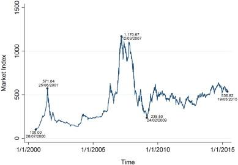

The stock market is a complex system influenced by a wide array of factors that drive investor behavior. Among these factors, the herd instinct is particularly noteworthy. Herd instinct is characterized by the tendency of investors to follow the crowd, often leading to collective movements in buying and selling that mimic the behavior of a larger group. This article examines the effects of herd instinct on investment behavior and algorithmic trading, highlighting how this phenomenon can impact decision-making processes in financial markets.

Understanding herd instinct is crucial for investors aiming to make well-informed decisions. By recognizing the psychological and behavioral elements that contribute to this propensity to follow the crowd, investors can develop strategies to mitigate its effects. In addition to exploring these behavioral drivers, the article will also address algorithmic trading. With automation increasingly defining trading practices, it's important to understand how algorithms may inadvertently replicate herd behavior, further influencing market dynamics.



Through an analysis of herd instinct and its prevalence in investment practices, this article aims to provide insights that investors can use to enhance their decision-making and adopt strategies that minimize the potential downsides of following the crowd.

## Table of Contents

## Understanding Herd Instinct in the Stock Market

Herd instinct in the stock market is a phenomenon where individuals are inclined to mimic the actions of a larger group, often resulting in substantial asset reallocations that lack comprehensive personal analysis. This collective behavior can give rise to notable investment bubbles or contribute to market downturns as it skews conventional market dynamics.

One of the most significant manifestations of herd instinct in recent history was the dotcom bubble of the late 1990s. During this period, excessive optimism towards internet-based companies led investors to heavily purchase tech stocks, rapidly inflating their valuations. This buying frenzy was primarily driven by the fear of missing out on potential profits as everyone around seemed to be investing in these ventures. When these companies failed to generate expected earnings, the bubble burst, leading to a massive market crash and substantial financial losses.

Similarly, the housing crisis of 2008 exemplifies herd behavior. Easily accessible credit and a booming housing market prompted many to invest heavily in real estate, often without due diligence regarding the quality of their investments. As more individuals bought property, prices soared beyond sustainable levels. Once the market corrected, it resulted in severe economic repercussions on a global scale.

Underlying herd behavior are social and psychological factors that date back to human evolutionary development. Originally, following the crowd provided survival advantages; in modern financial markets, however, this primitive instinct can lead to detrimental outcomes. Investors acting on herd mentality often make decisions rooted in emotion rather than sound financial analysis, amplifying the effects of market trends and contributing to [volatility](/wiki/volatility-trading-strategies).

Understanding these propensities allows investors to recognize the pitfalls associated with herd mentality. By maintaining awareness of its origins and implications, individuals can develop strategies to make judicious financial decisions, avoiding the cascading failures that typify market bubbles and crashes.

## Psychological and Behavioral Drivers

Human beings are inherently social creatures, and this social nature plays a significant role in shaping behaviors, particularly within the stock market. One of the most profound manifestations of this social inclination is herd behavior, where individuals make decisions collectively rather than independently. This behavior is primarily driven by psychological factors such as the fear of missing out (FOMO) and the innate desire for profit, both of which can overshadow rational decision-making processes.

FOMO is a powerful motivator in investment decisions. When investors observe others capitalizing on opportunities, the urge to follow suit can be overwhelming. The fear is that by not participating, they risk losing potential gains that everyone else appears to be securing. This can lead to hasty and poorly considered investment decisions, aligning individual behavior with that of the larger group without substantive evidence or analysis.

Psychological biases further compound the influence of herd behavior. Confirmation bias, for instance, involves seeking out information that confirms pre-existing beliefs while disregarding evidence to the contrary. In the context of trading, this bias leads investors to focus on data that supports their decision to follow the crowd, thus perpetuating herd mentality even in the face of contradictory evidence.

Social proof is another fundamental driver of herd behavior. It is the psychological phenomenon where individuals mimic the actions of others under the assumption that these actions reflect correct behavior. In stock markets, this translates to investors buying or selling based on the observed actions of their peers rather than their independent analysis. This behavior can propagate trends in asset prices, causing significant shifts without a basis in fundamental valuations.

Recognizing and acknowledging these psychological drivers is crucial for investors aiming to steer clear of herd behavior traps. Awareness of these biases enables investors to critically assess their motivations and decisions, fostering a more disciplined and rational approach to trading. By understanding the psychological underpinnings of herd behavior, investors can better resist the pull of the crowd and focus on strategies that are aligned with their personal investment goals and risk tolerance.

## Impact on Investment Behavior

Herd behavior significantly impacts investment behavior, manifesting in increased market volatility as groups of investors tend to make similar decisions. This collective movement often results in the distortion of asset prices, where securities become either overvalued or undervalued. During speculative bubbles, prices can escalate far beyond their intrinsic values, commonly defined as the worth of an asset based on [fundamental analysis](/wiki/fundamental-analysis), which considers financial data and market conditions. Typically, this results in sharp declines when the bubble bursts, leading to substantial financial losses.

A notable example of this phenomenon was the Dotcom Bubble of the late 1990s and early 2000s. Investors, fueled by optimism and herd mentality, injected massive capital into internet-based companies, rapidly inflating stock prices. When the bubble burst, it resulted in a massive market downturn. Similarly, the 2008 financial crisis showcased how collective behavior spurred by herd instincts contributed to an unsustainable housing market boom, followed by a catastrophic crash.

This tendency for herd behavior is often driven by psychological factors, including fear of missing out (FOMO) and an emotional response to market trends, such as panic selling during downturns. Additionally, cognitive biases like confirmation bias—where investors search for information that confirms their existing beliefs—exacerbate herd behavior. In these scenarios, investors face challenges in distinguishing between rational decision-making and emotional reactions. Emotional investing often leads to decisions that are not aligned with sound financial judgment, further increasing market volatility and distorting asset prices.

The mathematical modeling of herd behavior's impact on volatility can utilize financial metrics like the volatility index (VIX) or employ statistical tools to analyze historical price data and trading volumes. For instance, a Python script could analyze price movements during identified bubbles to quantify volatility increases:

```python
import numpy as np
import pandas as pd
import matplotlib.pyplot as plt

# Example code: Analyzing historical stock prices to measure volatility
data = pd.read_csv('stock_data.csv')  # Assume this CSV contains historical stock price data with 'Date' and 'Price' columns
data['Return'] = data['Price'].pct_change()

# Calculating rolling volatility
data['Volatility'] = data['Return'].rolling(window=30).std() * np.sqrt(252)

# Plotting
plt.figure(figsize=(12, 6))
plt.plot(data['Date'], data['Volatility'], label='Rolling Volatility')
plt.xlabel('Date')
plt.ylabel('Volatility')
plt.title('Historical Stock Volatility During Bubble Periods')
plt.legend()
plt.show()
```

This script calculates rolling volatility of stock prices, providing insights into market volatility dynamics during specific periods. Such analysis enhances understanding of how herd behavior exacerbates volatility, offering investors tools to better predict potential market excesses and prepare for eventual corrections. By recognizing these patterns, investors can improve their strategic positioning, aiming for rational, long-term investment decisions over emotive, short-term reactions.

## Algorithmic Trading and Herd Behavior

Algorithmic trading is the employment of computerized systems designed to execute trades automatically based on a set of pre-defined rules and parameters. The primary aim of these systems is to optimize trading efficiency by minimizing human error and emotional influence in decision-making processes. However, despite their design to be purely rational and data-driven, [algorithmic trading](/wiki/algorithmic-trading) can inadvertently contribute to herd behavior in the stock market.

Algorithms are programmed to respond to particular market conditions, data inputs, or signals. For example, an algorithm might be instructed to buy a stock when its moving average crosses a certain threshold or to sell based on unfavorable earnings announcements. Due to the widespread use of similar technical indicators and triggers, multiple algorithms may react similarly to the same set of market signals. This coordinated reaction can lead to simultaneous buy or sell actions across a large number of market participants, creating a cascading effect that resembles herd behavior.

The effect of algorithmic trading on market movements can be significant. When algorithms are triggered en masse, their collective actions can lead to rapid shifts in asset prices, thereby amplifying volatility. This phenomenon can be observed in situations where minor market fluctuations are exaggerated due to the [volume](/wiki/volume-trading-strategy) and speed of trades executed by these systems. As a result, short-term price movements can deviate considerably from an asset’s intrinsic value.

A well-documented instance illustrating this effect is the Flash Crash of May 6, 2010. During this event, the Dow Jones Industrial Average plunged nearly 1,000 points within minutes, only to recover most of its losses shortly thereafter. High-frequency trading algorithms, which execute numerous trades in fractions of a second, were implicated in this rapid market movement. These algorithms, reacting to large sell orders, exacerbated the market irregularities, highlighting the potential of such systems to artificially propagate herd-like behavior.

While algorithms aim to eschew human emotional influence, the automated nature of their responses can become a double-edged sword. The simultaneous execution of trading strategies across numerous platforms means that the electronic herd can act even faster than human traders, sometimes with unpredictable consequences.

In conclusion, while algorithmic trading provides a tool for efficiency and rationality in financial markets, it also holds the potential to mirror and amplify herd behavior. Recognizing and understanding this dynamic allows market participants to develop more comprehensive strategies to mitigate its possible repercussions on market stability.

## Strategies to Avoid Herd Instinct

To effectively avoid succumbing to herd instinct in the stock market, investors must adopt a disciplined and analytical approach. The following strategies can help in maintaining a level-headed investment strategy:

1. **Conduct Thorough Research and Rely on Personal Analysis**: Before making any investment decisions, it is vital to gather and evaluate data comprehensively. Investors should study financial statements, industry trends, macroeconomic indicators, and any relevant news that might impact an asset's value. By forming an investment thesis based on factual information and statistical analysis, investors can make informed decisions rather than following the crowd.

2. **Develop a Personalized Investment Strategy Aligned with Risk Tolerance**: Investors should create an investment strategy that aligns with their financial goals, time horizon, and risk tolerance. This involves asset allocation, wherein capital is distributed among various asset classes such as stocks, bonds, and real estate according to the investor's risk appetite. A well-structured plan can help in resisting emotional responses to market movements influenced by herd behavior.

3. **Embrace a Contrarian Approach**: Contrarian investors seek opportunities by going against prevailing market trends. This strategy involves buying undervalued assets when prices are low due to widespread selling and selling overvalued assets when prices are high due to excessive buying. An example of contrarian thinking could be using the Relative Strength Index (RSI) to identify overbought or oversold conditions, indicating potential price reversals.

   ```python
   # Example: Calculating RSI in Python
   import pandas as pd
   def calculate_RSI(data, period = 14):
       delta = data['Close'].diff()
       gain = (delta.where(delta > 0, 0)).rolling(window=period).mean()
       loss = (-delta.where(delta < 0, 0)).rolling(window=period).mean()
       rs = gain / loss
       rsi = 100 - (100 / (1 + rs))
       return rsi

   # Assuming 'df' is a DataFrame with historical stock prices
   df['RSI'] = calculate_RSI(df)
   ```

4. **Focus on Long-term Investment Goals**: It is crucial for investors to keep sight of their long-term financial objectives rather than being swayed by short-term market volatility. Investing with a long-term perspective helps in weathering temporary market fluctuations and emphasizes growth over time through compound returns. 

5. **Consider Professional Financial Advice**: Engaging with a financial advisor can provide objective insights and guidance that are detached from the emotional aspects of investing. Advisors can help investors maintain discipline, diversify portfolios, and adhere to strategic investment approaches, thereby minimizing the impact of herd behavior.

By implementing these strategies, investors can strengthen their investment decision-making process, isolating it from the irrational influence of herd instinct, and ultimately achieve more consistent financial outcomes.

## Conclusion

Herd instinct is a potent force in the stock market, exerting significant influence over investor behavior and trading strategies. This behavioral phenomenon, while rooted in psychological and social tendencies, manifests in the financial markets as collective [momentum](/wiki/momentum) where investors, driven by emotions such as fear and greed, tend to follow the movements of the majority rather than relying on independent analysis and rational decision-making.

By understanding and acknowledging herd instinct, investors can take concrete steps to mitigate its potentially detrimental effects. One fundamental approach is to develop an awareness of the psychological biases that lead to herd behavior, such as confirmation bias and the fear of missing out (FOMO). Recognizing these tendencies can help investors maintain objectivity and make decisions based on sound research and analysis rather than market noise.

Algorithmic trading, despite its efficiency in executing trades rapidly according to predefined criteria, can also amplify market movements associated with herd behavior. Algorithms often rely on similar data and signals, resulting in synchronized trading actions that can exacerbate price volatility and mimic human herd behavior on a grand scale. Thus, while algorithmic trading seeks to remove emotional biases, it may inadvertently contribute to the herd effect.

Adopting strategies to counteract herd instinct is crucial for fostering more rational and successful investment decisions. Investors are encouraged to conduct thorough due diligence, focus on long-term investment goals, and possibly employ contrarian strategies that involve acting contrary to prevailing market trends. Such approaches, coupled with professional financial guidance, can help investors stay grounded and make well-informed choices amidst the often unpredictable dynamics of the stock market.

## References & Further Reading

[1]: Shiller, R. J. (2000). ["Irrational Exuberance."](https://press.princeton.edu/books/paperback/9780691173122/irrational-exuberance) Princeton University Press.

[2]: Barber, B. M., & Odean, T. (1999). ["The Courage of Misguided Convictions."](https://faculty.haas.berkeley.edu/odean/Papers%20current%20versions/FAJ%20NovDec99%20Barber%20and%20Odean.pdf) Financial Analysts Journal, 55(6), 41-55. 

[3]: Kahneman, D. (2011). ["Thinking, Fast and Slow."](https://link.springer.com/article/10.1007/s00362-013-0533-y) Farrar, Straus and Giroux.

[4]: Taleb, N. N. (2007). ["The Black Swan: The Impact of the Highly Improbable."](https://en.wikipedia.org/wiki/The_Black_Swan:_The_Impact_of_the_Highly_Improbable) Random House.

[5]: Prechter, R. R. (2001). ["The Wave Principle of Human Social Behavior and the New Science of Socionomics."](https://www.elliottwave.com/education/books/the-wave-principle-of-human-social-behavior/) New Classics Library.

[6]: Lux, T. (1995). ["Herd Behaviour, Bubbles and Crashes."](https://www.jstor.org/stable/2235156) The Economic Journal, 105(431), 881-896.

[7]: Devenow, A., & Welch, I. (1996). ["Rational Herding in Financial Economics."](https://www.ivo-welch.info/research/journalcopy/1996-eer.pdf) European Economic Review, 40(3-5), 603-615.

[8]: Hirshleifer, D. (2001). ["Investor Psychology and Asset Pricing."](https://onlinelibrary.wiley.com/doi/abs/10.1111/0022-1082.00379) The Journal of Finance, 56(4), 1533-1597. 

[9]: Lo, A. W., & MacKinlay, A. C. (1999). ["A Non-Random Walk Down Wall Street."](https://www.jstor.org/stable/j.ctt7tccx) Princeton University Press.