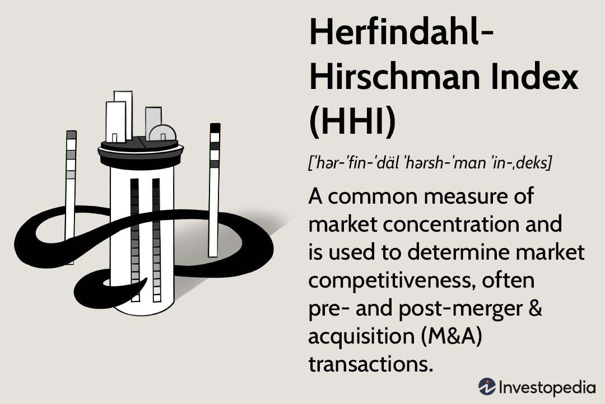

The Herfindahl-Hirschman Index (HHI) is a fundamental economic indicator that quantifies market concentration and competition levels. It is primarily used by regulatory bodies to assess the competitive dynamics of industries, particularly during mergers and acquisitions, to ensure that no monopolistic structures emerge that could stifle competition and innovation. The computational simplicity of the HHI allows for a straightforward evaluation of market concentration. It is calculated by squaring the market share of each firm competing in a market and then summing the resulting numbers. The formula for HHI is:

$$
HHI = \sum_{i=1}^{N} s_i^2
$$



where $s_i$ represents the market share of firm $i$, and $N$ is the total number of firms in the market. The index ranges from values approaching zero, which indicate a highly competitive market with numerous small players, to a maximum of 10,000, denoting a monopoly where a single firm dominates the entire market. An HHI below 1,500 suggests a competitive marketplace, 1,500 to 2,500 reflects moderate concentration, and values above 2,500 indicate high concentration.

Algorithmic trading, characterized by the use of computer algorithms for rapid trade execution, necessitates a comprehensive understanding of market concentration. The HHI plays a pivotal role in this context by providing insights into the structure and competitiveness of the market environment in which algorithms operate. In highly concentrated markets, indicated by higher HHI values, traders might expect reduced liquidity and potentially increased volatility, influencing algorithmic trading strategies and risk management approaches. By contrast, lower HHI values suggest a more competitive marketplace, offering opportunities for different strategic approaches, including more stable and diverse trading strategies.

This article will explore the application of the HHI within algorithmic trading, explaining how traders can use it to optimize trading outcomes. It will also discuss the benefits and limitations of the index, emphasizing the importance of integrating it with other analytical tools to capture the nuances of market behavior and improve decision-making processes in trading strategies.

## Table of Contents

## Understanding the Herfindahl-Hirschman Index (HHI)

The Herfindahl-Hirschman Index (HHI) is a metric used to assess market concentration by considering the market shares of all firms within a particular market. It is calculated as follows:

$$
\text{HHI} = \sum_{i=1}^{N} s_i^2
$$

where $s_i$ represents the market share of firm $i$ in percentage form, and $N$ is the total number of firms in the industry. The HHI values span from nearly zero to 10,000, where a value approaching zero signals a highly competitive market with many small competitors, while a value nearing 10,000 indicates a monopoly or extreme concentration by one or a few firms.

One of the key advantages of the HHI is its simplicity, facilitating its widespread use in economic analysis. Regulatory bodies such as the U.S. Department of Justice and the Federal Trade Commission utilize the HHI to evaluate mergers and acquisitions, ensuring that such business moves do not significantly harm competitive market conditions. An increase in HHI after a merger can alert regulators to potential monopolistic or anti-competitive behavior. For example, a pre- and post-merger comparison of HHI values helps in assessing how industry dynamics might shift, aiding decisions on whether to approve or block mergers.

Despite these valuable applications, the HHI has limitations. While it offers a quantitative snapshot of market concentration, it may not fully capture the nuanced complexities of real-world markets. Markets are often affected by factors like geographic segmentation, barriers to entry, product differentiation, and varying consumer preferences, which HHI does not account for. For example, a market with a high HHI might still be competitive if barriers to entry are low and new firms can easily enter, which the static nature of HHI does not depict.

Overall, while the Herfindahl-Hirschman Index provides essential insights into market concentration and competition levels, it should be employed alongside other analytical tools and market evaluations to form a comprehensive understanding of market dynamics.

## HHI Application in Algorithmic Trading

Algorithmic trading benefits significantly from the application of the Herfindahl-Hirschman Index (HHI) as it offers essential insights into market concentration, directly influencing [liquidity](/wiki/liquidity-risk-premium) and [volatility](/wiki/volatility-trading-strategies). A high HHI value signifies a market dominated by a few firms, leading to concentrated markets. These conditions often pose risks such as reduced liquidity and increased price volatility, both of which are critical factors in [algorithmic trading](/wiki/algorithmic-trading). Traders in such environments prioritize risk management and hedging strategies to mitigate potential adverse effects. For instance, in markets with higher HHI, algorithms might be adjusted to minimize exposure to price swings and to better manage liquidity constraints.

Conversely, in competitive markets characterized by low HHI values, liquidity is generally higher, and price volatility is lower. Such conditions are conducive to stable trading strategies, allowing algorithmic traders to implement strategies that rely more on price predictability and execution certainty. This competitive setting provides ample opportunities for traders to capitalize on the fluid market dynamics without the heightened risk associated with concentrated markets.

Moreover, the integration of HHI with other analytical tools can enhance the precision and adaptability of algorithmic trading strategies. For example, employing [machine learning](/wiki/machine-learning) techniques alongside HHI can allow traders to detect patterns and adapt to market changes more swiftly and effectively. Python code can be instrumental in this regard, providing a robust platform for data analysis and model implementation. Here is a simple example of how HHI might be integrated into a Python-based algorithmic trading strategy:

```python
import numpy as np

def calculate_hhi(market_shares):
    return np.sum(np.square(market_shares))

def trading_strategy(market_data, threshold_low, threshold_high):
    market_shares = market_data['market_shares']
    hhi = calculate_hhi(market_shares)

    if hhi > threshold_high:
        # High HHI, adjust strategy for risk management
        return "risk_management_mode"
    elif hhi < threshold_low:
        # Low HHI, capitalize on stable market conditions
        return "stable_trading_mode"
    else:
        # Otherwise, maintain a neutral strategy
        return "neutral_strategy_mode"

# Example market data
market_data_example = {
    'market_shares': [0.2, 0.3, 0.1, 0.4]  # Example market shares
}

strategy = trading_strategy(market_data_example, 1000, 2500)
print(f"Selected Trading Strategy: {strategy}")
```

In this simplified example, the function `calculate_hhi` computes the HHI from given market shares, and the `trading_strategy` function selects an appropriate strategy based on the calculated HHI and specified thresholds. This approach highlights how HHI can be a pivotal component of algorithmic trading systems, guiding decision-making processes in accordance with the prevailing market concentration conditions.

## Examples and Case Studies

In industries like energy, high Herfindahl-Hirschman Index (HHI) values are prevalent due to the dominance of a few firms. This can lead to reduced liquidity because market power is concentrated, causing limited competition and potential manipulation of prices. For instance, in the oil and gas sector, large firms control significant market shares, leading to an HHI that signals a high concentration. This scenario often results in higher barriers to entry for new competitors, thereby stifling innovation and limiting options for consumers. An HHI calculation for such a market might show values exceeding 2,500, a threshold indicating significant concentration as per the U.S. Department of Justice guidelines.

Conversely, sectors like retail food services often exhibit low HHI values, suggesting that these markets are competitive with numerous small players. This high level of competition contributes to ample liquidity, as it is easier for new entrants to participate and for consumers to benefit from competitive pricing and diverse offerings. The retail food industry typically shows HHI values well below 1,500, reflecting a fragmented market landscape that encourages dynamic competition.

In the tech industry, HHI values can fluctuate significantly due to mergers and acquisitions. Notable case studies include the merger of companies like Facebook and WhatsApp, where regulatory scrutiny centered around potential shifts in market concentration. These mergers can cause substantial changes in HHI values, which may affect market entry strategies and competitive dynamics. For instance, an increase in HHI post-merger suggests reduced competition and may trigger regulatory intervention to mitigate monopolistic tendencies.

The telecommunications industry provides another insightful perspective on HHI's role. Regulatory actions, such as enforcing divestitures or blocking mergers, can shift HHI values to promote a healthier competitive environment. For example, decisions by authorities to prevent mergers that would lead to excessively high HHI values can maintain lower concentration levels, thereby fostering innovation and improving service quality for consumers.

These examples highlight the importance of HHI in strategic market assessments. They also demonstrate the need for algorithmic trading models to adjust their strategies based on industry-specific HHI insights. Understanding how market concentration influences liquidity and price volatility allows traders to tailor their approaches, optimizing outcomes and managing risks effectively.

## Advantages and Limitations of HHI in Algorithmic Trading

The Herfindahl-Hirschman Index (HHI) serves as a straightforward yet powerful tool in evaluating market concentration, making it highly applicable in the field of algorithmic trading. Its primary advantage lies in its ability to swiftly calculate and provide insights into the competitive landscape of a market, which is pivotal for making informed trading decisions. The HHI is computed by summing the squares of the market shares of all firms competing in a market:

$$
\text{HHI} = \sum_{i=1}^{N} s_i^2
$$

where $s_i$ represents the market share of firm $i$, expressed as a percentage, and $N$ is the total number of firms. This formula encapsulates how market concentration can inform algorithms about market dynamics such as liquidity and volatility.

However, the index is not without limitations. A key drawback is its inability to account for geographic distinctions or product differentiation within a market, factors that are often critical in comprehensive market evaluations. The HHI presumes markets are homogeneous, which may not always hold true, especially in global trading environments where regional variations can significantly impact market dynamics.

Moreover, relying solely on the HHI can result in an oversimplification of market conditions. Markets are complex systems influenced by various variables beyond concentration, such as regulatory environments, technological advancements, and external macroeconomic factors. Consequently, traders need to employ additional analytical tools alongside HHI to capture these complexities. Techniques such as machine learning and advanced statistical methods can be integrated with the HHI to enhance the depth and accuracy of market analyses.

For example, machine learning algorithms can be trained to recognize patterns and anomalies in market data that the HHI alone might not detect. By incorporating such technologies, traders can leverage both historical data and real-time inputs to refine their market strategies and improve the precision of their predictive models.

In summary, while the Herfindahl-Hirschman Index offers a valuable initial snapshot of market concentration, its limitations necessitate a more comprehensive approach to algorithmic trading analyses. Integrating HHI with broader analytical frameworks and emerging technologies ensures traders can better navigate and optimize within complex market structures.

## Conclusion

The Herfindahl-Hirschman Index (HHI) remains a crucial tool in algorithmic trading, providing essential insights into market concentration and competitive dynamics. Its ability to simplify market assessments by quantifying market structure through the square of market shares makes it an accessible benchmark for traders. However, to achieve a comprehensive market evaluation, it is vital for traders to combine HHI with advanced analytical tools. 

Recent advancements in data analytics, including machine learning and [artificial intelligence](/wiki/ai-artificial-intelligence), present an opportunity to enhance the application of HHI. These technologies allow traders to refine their analysis of market conditions by integrating HHI with real-time data and predictive modeling. This integration can lead to more precise trading strategies that respond effectively to shifts in market concentration.

Understanding market concentration levels is essential for traders aiming to optimize trading outcomes and manage associated risks. A well-informed trading strategy that accounts for the competitive landscape can lead to more stable and profitable decisions. 

As algorithmic trading continues to evolve, the fusion of HHI with cutting-edge analytics is expected to maintain its relevance and importance. By leveraging these combined resources, traders can not only navigate the complexities of current markets but also anticipate future shifts, ensuring sustained competitive advantage in algorithmic trading.

## References & Further Reading

U.S. Department of Justice: The Herfindahl-Hirschman Index (HHI) documentation provided by the U.S. Department of Justice is a crucial resource for legal and competitive assessment insights. This documentation outlines how HHI is used by regulators to assess market concentration and guide decisions in antitrust cases. The index's simplicity makes it a favored tool for evaluating potential anticompetitive consequences of mergers and acquisitions.

Lopez de Prado, M. (2018). Advances in Financial Machine Learning: This book explores the integration of advanced analytics with trading strategies, offering insights into how machine learning techniques can enhance the application of HHI in financial contexts. It provides practical examples and frameworks for incorporating HHI within algorithmic trading systems to evaluate market concentration and adapt trading strategies accordingly.

Chan, E. P. (2008). Quantitative Trading: Eric Chan's work serves as a practical guide for setting up algorithmic trading strategies with insights from the Herfindahl-Hirschman Index. The book discusses various quantitative techniques and their application to trading, highlighting the importance of understanding market dynamics through HHI to optimize trading outcomes.

Jansen, S. (2020). Machine Learning for Algorithmic Trading: This book addresses the application of machine learning techniques alongside HHI for developing sophisticated trading strategies. It provides a comprehensive approach to algorithmic trading, emphasizing the integration of machine learning models with market concentration indicators like HHI to improve decision-making processes in trading.

These resources collectively offer valuable insights into understanding and applying the Herfindahl-Hirschman Index in algorithmic trading contexts. They provide guidance on leveraging advanced analytics and quantitative techniques to evaluate market competition and influence strategic trading decisions.

