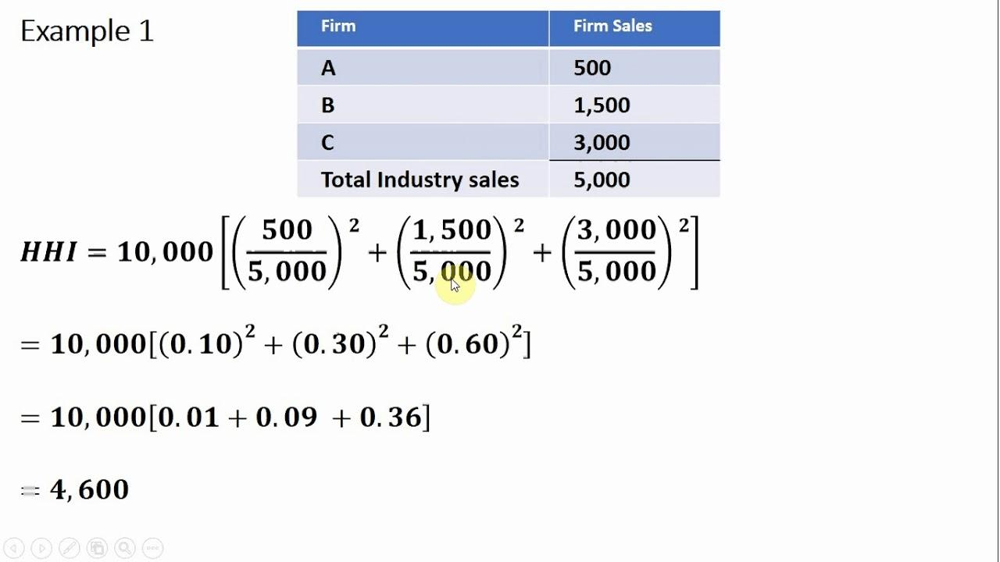

## Table of Contents

## What is the Herfindahl-Hirschman Index (HHI)?

The Herfindahl-Hirschman Index, or HHI, is a way to measure how competitive a market is. It does this by looking at the size of the companies in the market. To calculate the HHI, you take the market share of each company, square it, and then add all those numbers together. If the HHI is close to zero, it means the market is very competitive with many small companies. If the HHI is close to 10,000, it means one company has all the market share, which is not competitive at all.

The HHI is used by people like economists and government agencies to see if a market is too concentrated. For example, if a big company wants to buy a smaller one, the government might use the HHI to decide if the merger would make the market less competitive. Generally, an HHI below 1,500 is seen as a competitive market, between 1,500 and 2,500 is seen as moderately concentrated, and above 2,500 is seen as highly concentrated. This helps in making decisions about business deals and regulations to keep markets fair and competitive.

## Why is the HHI used in economics and business?

The HHI is used in economics and business to understand how competitive a market is. It helps people see if a market has lots of small companies or just a few big ones. By knowing this, economists and business people can tell if the market is healthy and fair. If a market has many companies, it's usually good for customers because they have more choices and prices might be lower. But if there are only a few big companies, they might control prices and limit choices.

The HHI is also important when big companies want to merge or buy other companies. Governments use the HHI to decide if these deals are okay. If a merger would make the market less competitive, the government might stop it to protect customers and smaller businesses. This helps keep markets open and fair for everyone. By using the HHI, people can make better decisions about business and rules to make sure markets work well for everyone.

## What is the basic formula for calculating the HHI?

The basic formula for calculating the Herfindahl-Hirschman Index (HHI) is pretty simple. You take the market share of each company in the market, square that number, and then add up all those squared numbers. So, if a company has a 10% market share, you square 10 to get 100. You do this for every company and then add all those numbers together.

For example, if you have three companies with market shares of 30%, 50%, and 20%, you would square 30 to get 900, square 50 to get 2500, and square 20 to get 400. Then you add those numbers together: 900 + 2500 + 400 = 3800. That's your HHI. This number helps you see how concentrated the market is.

## How do you interpret the HHI values?

The HHI helps us understand how competitive a market is. A low HHI means the market has many small companies and is very competitive. If the HHI is below 1,500, the market is seen as competitive. This is good because it means customers have lots of choices and companies have to keep prices low to attract business. A medium HHI, between 1,500 and 2,500, means the market is moderately concentrated. There are fewer companies, and they might have more control over prices. 

A high HHI, above 2,500, shows that the market is very concentrated. This usually means a few big companies have most of the market share. It can be bad for customers because they have fewer choices and prices might be higher. The HHI is important for deciding if big companies should be allowed to merge. If a merger would make the HHI go up a lot, the government might stop it to keep the market competitive and fair for everyone.

## Can you provide a simple example of calculating HHI for a market?

Let's say we have a small market with four companies. Company A has a 40% market share, Company B has 30%, Company C has 20%, and Company D has 10%. To find the HHI, we square each company's market share and then add them all together. So, we square 40 to get 1600, square 30 to get 900, square 20 to get 400, and square 10 to get 100. When we add these numbers up, we get 1600 + 900 + 400 + 100 = 3000.

This HHI of 3000 tells us that the market is highly concentrated. It's above 2,500, which means a few big companies have most of the market share. In this case, Company A and Company B together have 70% of the market, which is a lot. This could mean less competition and higher prices for customers. If another big company wanted to buy one of these companies, the government might look at the HHI and decide if it's a good idea or if it would make the market even less competitive.

## What are the thresholds for market concentration according to the HHI?

The Herfindahl-Hirschman Index (HHI) helps us understand how competitive a market is by using different thresholds. If the HHI is below 1,500, we say the market is competitive. This means there are many small companies, and customers have lots of choices. Prices are usually lower because companies have to compete to attract customers.

If the HHI is between 1,500 and 2,500, we call the market moderately concentrated. There are fewer companies, and they might have more control over prices. This can mean less competition and fewer choices for customers, but it's not as bad as a highly concentrated market.

When the HHI goes above 2,500, the market is considered highly concentrated. This means a few big companies have most of the market share. It can be bad for customers because they have fewer choices and prices might be higher. Governments often look at the HHI to decide if big companies should be allowed to merge, to keep the market fair and competitive.

## How does the HHI help in assessing market competition?

The HHI helps us see how competitive a market is by looking at how big the companies in it are. It does this by taking each company's share of the market, squaring that number, and then adding all those squared numbers together. If the HHI is low, it means the market has lots of small companies, which is good because it means more competition. More competition usually means lower prices and more choices for customers.

When the HHI is high, it means the market is controlled by just a few big companies. This can be bad because these companies might raise prices and limit choices for customers. Governments use the HHI to decide if big companies should be allowed to merge or buy other companies. If a merger would make the HHI go up a lot, the government might stop it to keep the market fair and competitive for everyone.

## What are the limitations of using the HHI as a measure of market concentration?

The HHI can be a helpful tool, but it has some limitations. One big problem is that it doesn't show if companies are competing with each other even if they are in the same market. For example, two companies might sell different products that customers don't see as the same thing, but the HHI would still count them as part of the same market. This can make the market look more concentrated than it really is. Also, the HHI doesn't consider how easy it is for new companies to start up in the market. If it's easy for new companies to come in, the market might be more competitive than the HHI suggests.

Another limitation is that the HHI can be affected by how we define the market. If we make the market definition too small, the HHI might make the market look more concentrated. If we make it too big, it might look less concentrated. This can make it hard to compare different markets or to make decisions about business deals. Also, the HHI doesn't tell us about how companies might be working together to control prices or limit competition, which can be a big problem in some markets. So, while the HHI is useful, it's important to use other tools and information too to get a full picture of how competitive a market is.

## How can changes in HHI over time indicate market dynamics?

Changes in the HHI over time can show us how a market is changing. If the HHI goes up, it means the market is getting more concentrated. This can happen if big companies buy smaller ones or if smaller companies go out of business. When the HHI goes up, it might mean there's less competition, and customers might have fewer choices and pay higher prices. On the other hand, if the HHI goes down, it means the market is getting more competitive. This can happen if new companies start up or if big companies split into smaller ones. A lower HHI usually means more choices for customers and lower prices.

Looking at how the HHI changes can help us understand market dynamics better. For example, if the HHI keeps going up over several years, it might mean that the market is becoming less competitive and that big companies are getting more control. This could be a sign that the government needs to step in to make sure the market stays fair. If the HHI goes down over time, it might mean that the market is healthy and that new companies are finding it easy to start up and compete. By watching the HHI, we can see trends and make better decisions about business and rules to keep markets working well for everyone.

## What are some advanced applications of the HHI in economic analysis?

The HHI is used in advanced ways to look at competition in markets over time. Economists use it to see if markets are getting more or less competitive. They do this by comparing the HHI at different times. If the HHI goes up a lot, it might mean big companies are buying smaller ones or that it's hard for new companies to start up. If the HHI goes down, it could mean new companies are coming into the market and making it more competitive. This helps economists predict how markets might change in the future and what rules might be needed to keep markets fair.

Another advanced use of the HHI is in international trade and competition policy. Governments use the HHI to see if companies from other countries are making markets less competitive. For example, if a big company from another country wants to buy a local company, the government might use the HHI to decide if this would be bad for competition. The HHI can also be used to compare how competitive different countries' markets are. This helps in making trade deals and rules that keep markets open and fair for everyone. By using the HHI in these ways, economists and governments can make better decisions about business and trade to help markets work well.

## How does the HHI relate to antitrust regulations and merger evaluations?

The HHI is really important for antitrust regulations and deciding if companies can merge. Antitrust laws are rules that make sure markets stay fair and competitive. When a big company wants to buy another company, the government looks at the HHI to see if the merger would make the market less competitive. If the HHI goes up a lot because of the merger, the government might say no to stop the market from becoming too concentrated. This helps keep prices low and gives customers more choices.

In merger evaluations, the HHI helps the government see how the market might change after the merger. If the HHI is already high and the merger would make it go even higher, it's a sign that the merger could hurt competition. The government uses the HHI to decide if the merger is okay or if it needs to be changed to keep the market fair. By using the HHI, the government can make sure that big companies don't get too much control and that smaller companies can still compete.

## Can you discuss a real-world case where HHI was used to assess market concentration?

One real-world case where the HHI was used to assess market concentration is the proposed merger between T-Mobile and Sprint in the United States. In 2018, when these two big cell phone companies wanted to merge, the government used the HHI to see if it would be bad for competition. Before the merger, the HHI for the wireless market was already pretty high, showing that the market was concentrated. If T-Mobile and Sprint merged, the HHI would go up even more. The government worried that this would mean fewer choices for customers and higher prices. In the end, the merger was allowed, but only after T-Mobile and Sprint agreed to sell some of their business to another company to keep the market more competitive.

Another example is the merger between Anheuser-Busch InBev and Grupo Modelo in the beer industry. In 2013, when these two big beer companies wanted to merge, the U.S. Department of Justice looked at the HHI to see if it would make the beer market too concentrated. The HHI showed that the market was already moderately concentrated, and the merger would make it even more so. The government was worried that this would mean less competition and higher prices for beer. In the end, the merger was allowed, but only after Anheuser-Busch InBev agreed to sell some of its business to keep the market competitive. These cases show how the HHI helps the government make decisions about big business deals to keep markets fair for everyone.

## What is the Herfindahl-Hirschman Index (HHI) and how is it understood?

The Herfindahl-Hirschman Index (HHI) is a widely recognized measure of market concentration, calculated by squaring the market share of each firm within a given industry and then summing these squared values. Mathematically, the HHI is represented as:

$$
\text{HHI} = \sum_{i=1}^{N} s_i^2
$$

where $s_i$ denotes the market share of firm $i$ expressed as a percentage, and $N$ is the total number of firms in the market. 

The index serves as an indicator of the level of competition versus monopoly within a market. An HHI value approaching zero suggests a highly competitive market, as it implies a large number of firms with relatively equal market shares. Conversely, an HHI reaching the upper limit of 10,000 implies a monopoly, where a single firm dominates the entire market. This occurs because a single firm with 100% market share (i.e., $s_1 = 100$) would yield an HHI of $100^2 = 10,000$.

The HHI's straightforward computation and intuitive interpretation make it a popular tool for economists and regulators, especially in scenarios involving mergers and acquisitions. Regulatory bodies, such as antitrust authorities, often employ the HHI to assess potential impacts of corporate mergers on market concentration. An increase in the HHI post-merger implies reduced competition, which could trigger regulatory scrutiny to ensure fair market practices and the prevention of monopolistic behaviors. 

The utility of the HHI lies not just in its simplicity, but also in its ability to provide a quick snapshot of market structure, aiding various stakeholders in making informed decisions regarding market dynamics.

## What are the advantages and limitations of HHI in algorithmic trading?

The Herfindahl-Hirschman Index (HHI) offers several advantages as a tool for evaluating market concentration within [algorithmic trading](/wiki/algorithmic-trading). Its straightforward computation involves squaring and summing the market share percentages of each firm in a market, presenting a clear picture of market concentration without extensive data requirements. For example, the formula can be expressed as:

$$
\text{HHI} = \sum_{i=1}^{N} s_i^2
$$

where $s_i$ is the market share of firm $i$, and $N$ is the total number of firms. This method provides a quick measure of market dynamics, valuable for algorithmic traders assessing competitive environments.

Despite these advantages, the HHI also presents limitations when applied in algorithmic trading. One significant shortcoming is its inability to capture geographic nuances, product differentiation, and other intricate market structures. For instance, two markets with identical HHI values can differ substantially in terms of regional dominance or product diversity, leading to distinct competitive pressures.

Furthermore, given the fluid nature of financial markets, algorithmic traders must supplement the HHI with additional analytical tools to ensure comprehensive risk management. Techniques such as [machine learning](/wiki/machine-learning) algorithms, sentiment analysis, or [factor](/wiki/factor-investing) models can provide deeper insights into market conditions, enabling traders to better anticipate and adapt to market changes. For example, leveraging Python libraries like Scikit-learn or TensorFlow can augment HHI analysis with predictive modeling.

Here is a simple Python snippet to calculate the HHI from a list of market shares:

```python
def calculate_hhi(market_shares):
    # Ensure that market shares sum to 1 (or 100 if percentages)
    if sum(market_shares) != 1:
        raise ValueError("Market shares must sum to 1")
    # Calculate HHI
    hhi = sum((share ** 2) for share in market_shares)
    return hhi * 10000  # Return as a point value

# Example usage
market_shares = [0.3, 0.3, 0.2, 0.2]  # Example market shares
hhi = calculate_hhi(market_shares)
print("HHI:", hhi)
```

Ultimately, while HHI provides a foundational metric for understanding market concentration, its integration with sophisticated analytical tools is essential for addressing its limitations and enhancing strategic decision-making in algorithmic trading.

## References & Further Reading

- U.S. Department of Justice: Herfindahl-Hirschman Index documentation. This governmental resource provides extensive insights into the legal and competitive assessment applications of the Herfindahl-Hirschman Index. Visit the DOJ website for detailed explanations of how HHI is used in regulatory processes, especially concerning antitrust considerations and merger guidelines.

- Lopez de Prado, M. (2018). *Advances in Financial Machine Learning*. This book is a comprehensive resource that emphasizes the integration of advanced machine learning techniques in financial contexts, including algorithmic trading. It covers the importance of understanding market concentration metrics like HHI to enhance trading strategies and decision-making processes.

- Chan, E. P. (2008). *Quantitative Trading: How to Build Your Own Algorithmic Trading Business*. This text provides practical guidance on setting up an algorithmic trading business, including the role of quantitative tools such as the HHI in evaluating market conditions and competitive dynamics. It offers readers insights into effectively applying HHI as part of a broader set of quantitative trading methods.

- Jansen, S. (2020). *Machine Learning for Algorithmic Trading*. This book offers a modern perspective on incorporating machine learning techniques into algorithmic trading. It discusses various market analysis tools, including the HHI, for assessing market environment and devising trading strategies that align with the market's competitive landscape.

