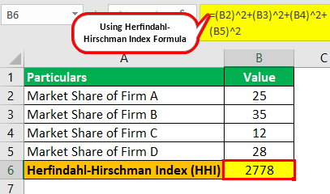

The Herfindahl-Hirschman Index (HHI) is widely recognized as a fundamental tool for evaluating market concentration and competition across diverse industries. By quantifying the concentration of market power, the HHI offers crucial insights into the competitive landscape, essential for understanding market dynamics. In algorithmic trading, where precision and rapid decision-making are paramount, comprehending these dynamics through the lens of market concentration is vital for developing effective trading strategies.

Algorithmic trading leverages computational algorithms to execute trades rapidly and efficiently, relying heavily on data-driven insights. In such a competitive field, understanding market concentration through the HHI can significantly influence strategic decisions, enabling traders to anticipate liquidity patterns, market volatility, and potential competitive pressures. By calculating the HHI, traders can ascertain the extent of concentration within a particular market or industry. This involves summing the squares of the market share percentages held by each firm within the sector, producing a value that ranges from near zero to 10,000. The closer the HHI is to 10,000, the more monopolistic the market is considered, indicating fewer competitive pressures and potential price manipulation.



The strategic significance of the HHI in algorithmic trading cannot be overstated. In highly concentrated markets, algorithmic traders may need to adapt their strategies to address heightened risks and volatility associated with monopolistic or oligopolistic conditions. Conversely, a lower HHI value suggests a more competitive environment, potentially offering more stable trading opportunities with less susceptibility to dramatic price shifts.

This article aims to illuminate the role and impact of the HHI within algorithmic trading by exploring its calculation methodology, application scenarios, and strategic importance. Through this examination, traders and analysts can better understand how to integrate the HHI into their decision-making processes to optimize trading outcomes.

## Table of Contents

## Understanding the Herfindahl-Hirschman Index (HHI)

The Herfindahl-Hirschman Index (HHI) is a widely recognized measure of market concentration, calculated by squaring the market share of each firm within a given industry and then summing these squared values. Mathematically, the HHI is represented as:

$$
\text{HHI} = \sum_{i=1}^{N} s_i^2
$$

where $s_i$ denotes the market share of firm $i$ expressed as a percentage, and $N$ is the total number of firms in the market. 

The index serves as an indicator of the level of competition versus monopoly within a market. An HHI value approaching zero suggests a highly competitive market, as it implies a large number of firms with relatively equal market shares. Conversely, an HHI reaching the upper limit of 10,000 implies a monopoly, where a single firm dominates the entire market. This occurs because a single firm with 100% market share (i.e., $s_1 = 100$) would yield an HHI of $100^2 = 10,000$.

The HHI's straightforward computation and intuitive interpretation make it a popular tool for economists and regulators, especially in scenarios involving mergers and acquisitions. Regulatory bodies, such as antitrust authorities, often employ the HHI to assess potential impacts of corporate mergers on market concentration. An increase in the HHI post-merger implies reduced competition, which could trigger regulatory scrutiny to ensure fair market practices and the prevention of monopolistic behaviors. 

The utility of the HHI lies not just in its simplicity, but also in its ability to provide a quick snapshot of market structure, aiding various stakeholders in making informed decisions regarding market dynamics.

## HHI Application in Algorithmic Trading

Algorithmic trading, which uses advanced computational strategies to execute a large [volume](/wiki/volume-trading-strategy) of trades efficiently and often autonomously, can greatly benefit from the insights provided by the Herfindahl-Hirschman Index (HHI). The HHI, a key metric for measuring market concentration, informs traders about the competitive landscape within specific markets. This information is crucial as it directly influences [liquidity](/wiki/liquidity-risk-premium), [volatility](/wiki/volatility-trading-strategies), and the overall formation of trading strategies.

In markets characterized by high concentration, as indicated by a high HHI value, liquidity may be limited and volatility increased. These conditions arise because a few dominant firms control significant market shares, thus having the power to influence prices. As a result, traders operating in such environments are compelled to modify their strategies to account for elevated risks. Risk management and hedging become essential components of strategy, ensuring that exposure to unforeseen price movements is minimized. For instance, in a highly concentrated market like the semiconductor industry, a single firm's operational hiccup can disrupt supply chains, starkly affecting stock prices and market stability.

Conversely, in markets with a low HHI, which signifies a competitive and balanced market structure, price manipulation risks are reduced. The evenly distributed market shares promote a stable trading environment where liquidity is generally more abundant, enabling traders to execute large trades with minimal market impact. In such scenarios, algorithmic traders may focus on strategies that capitalize on narrow spreads and engage in market-making activities to benefit from incremental profits.

The strategic application of the HHI in [algorithmic trading](/wiki/algorithmic-trading) can be further enhanced by integrating it with other analytical tools. For instance, traders might use [machine learning](/wiki/machine-learning) techniques to analyze historical price data alongside HHI metrics to predict future market movements more accurately. This complex integration enables traders to build robust, adaptive strategies that are responsive to both current market structures and potential future shifts.

The adaptability of algorithmic trading strategies, informed by market concentration data such as the HHI, underscores their importance in the contemporary trading landscape. By continually assessing the HHI and adjusting strategies accordingly, traders can better navigate the complexities of financial markets, safeguarding their investments and optimizing performance.

## Examples and Case Studies

An example of an industry characterized by a high Herfindahl-Hirschman Index (HHI) is the energy sector, particularly in regions dominated by a single utility company. Such dominance often results in elevated risks for market participants, primarily due to the potential for price control and reduced market efficiency. A high HHI in this context indicates limited competition, making it crucial for algorithmic traders to [factor](/wiki/factor-investing) in these dynamics when developing strategies. They must be cognizant of potential liquidity issues and the impact of regulatory changes aimed at curbing monopolistic practices.

Conversely, industries such as retail food services can exhibit a low HHI due to a more equitable distribution of market shares among numerous firms. This environment reflects a competitive and stable market, suggesting increased liquidity and reduced price manipulation risks. In such markets, algorithmic traders can leverage the diversified market activities to optimize trade execution and improve risk-adjusted returns. The balanced competition in these sectors often leads to innovation and cost efficiencies, benefiting both consumers and traders.

Case studies from the technology industry underscore the importance of HHI in strategic decision-making. The tech sector has seen significant shifts in concentration levels, influenced by mergers and acquisitions. For instance, the acquisition strategies of large technology firms, such as big tech companies acquiring smaller startups, can lead to increased market concentration and higher HHI values. Traders monitoring these changes can adjust their algorithms to hedge against risks associated with reduced competition, including potential antitrust interventions.

In traditional industries like telecommunications, HHI reveals insights into market entry strategies. A case study in this field might involve a scenario where regulatory actions lower market concentration, encouraging new entrants and fostering competitive pricing. Traders, in response, could adapt their models to capture opportunities arising from increased market activities and volatility.

These examples and case studies illuminate the strategic importance of the HHI in assessing market entry and competitive positioning. By understanding the nuances of market concentration, algorithmic traders can better navigate the complexities of different industry landscapes, ensuring more informed and adaptive trading strategies.

## Advantages and Limitations of HHI in Algorithmic Trading

The Herfindahl-Hirschman Index (HHI) offers several advantages as a tool for evaluating market concentration within algorithmic trading. Its straightforward computation involves squaring and summing the market share percentages of each firm in a market, presenting a clear picture of market concentration without extensive data requirements. For example, the formula can be expressed as:

$$
\text{HHI} = \sum_{i=1}^{N} s_i^2
$$

where $s_i$ is the market share of firm $i$, and $N$ is the total number of firms. This method provides a quick measure of market dynamics, valuable for algorithmic traders assessing competitive environments.

Despite these advantages, the HHI also presents limitations when applied in algorithmic trading. One significant shortcoming is its inability to capture geographic nuances, product differentiation, and other intricate market structures. For instance, two markets with identical HHI values can differ substantially in terms of regional dominance or product diversity, leading to distinct competitive pressures.

Furthermore, given the fluid nature of financial markets, algorithmic traders must supplement the HHI with additional analytical tools to ensure comprehensive risk management. Techniques such as machine learning algorithms, sentiment analysis, or factor models can provide deeper insights into market conditions, enabling traders to better anticipate and adapt to market changes. For example, leveraging Python libraries like Scikit-learn or TensorFlow can augment HHI analysis with predictive modeling.

Here is a simple Python snippet to calculate the HHI from a list of market shares:

```python
def calculate_hhi(market_shares):
    # Ensure that market shares sum to 1 (or 100 if percentages)
    if sum(market_shares) != 1:
        raise ValueError("Market shares must sum to 1")
    # Calculate HHI
    hhi = sum((share ** 2) for share in market_shares)
    return hhi * 10000  # Return as a point value

# Example usage
market_shares = [0.3, 0.3, 0.2, 0.2]  # Example market shares
hhi = calculate_hhi(market_shares)
print("HHI:", hhi)
```

Ultimately, while HHI provides a foundational metric for understanding market concentration, its integration with sophisticated analytical tools is essential for addressing its limitations and enhancing strategic decision-making in algorithmic trading.

## Conclusion

The Herfindahl-Hirschman Index (HHI) is a crucial tool for algorithmic traders, providing valuable insights into market concentration and competitive dynamics. As an indicator of market structure, HHI helps traders assess the degree of competition and identify potential risks associated with market concentration. By understanding these dynamics, traders can make informed decisions that enhance their strategic positioning and risk management.

To fully leverage HHI, traders often integrate it with other market metrics and data analytics tools. This integration ensures a more comprehensive evaluation of market conditions, allowing traders to adjust their strategies accordingly. For instance, aligning HHI with indicators of market liquidity or volatility can provide a more nuanced understanding of trading environments, thereby facilitating more robust strategic decision-making.

Advancements in data analytics have opened new opportunities for refining HHI analysis. Techniques such as machine learning and big data analytics allow traders to process and interpret vast quantities of market data with greater accuracy and efficiency. These tools enable the continual adaptation of HHI calculations, ensuring that traders remain responsive to the ever-evolving conditions of financial markets. As such, the integration of HHI with emerging data analytics methodologies represents a significant opportunity for traders to enhance their market insights and optimize their trading strategies.

## References & Further Reading

- U.S. Department of Justice: Herfindahl-Hirschman Index documentation. This governmental resource provides extensive insights into the legal and competitive assessment applications of the Herfindahl-Hirschman Index. Visit the DOJ website for detailed explanations of how HHI is used in regulatory processes, especially concerning antitrust considerations and merger guidelines.

- Lopez de Prado, M. (2018). *Advances in Financial Machine Learning*. This book is a comprehensive resource that emphasizes the integration of advanced machine learning techniques in financial contexts, including algorithmic trading. It covers the importance of understanding market concentration metrics like HHI to enhance trading strategies and decision-making processes.

- Chan, E. P. (2008). *Quantitative Trading: How to Build Your Own Algorithmic Trading Business*. This text provides practical guidance on setting up an algorithmic trading business, including the role of quantitative tools such as the HHI in evaluating market conditions and competitive dynamics. It offers readers insights into effectively applying HHI as part of a broader set of quantitative trading methods.

- Jansen, S. (2020). *Machine Learning for Algorithmic Trading*. This book offers a modern perspective on incorporating machine learning techniques into algorithmic trading. It discusses various market analysis tools, including the HHI, for assessing market environment and devising trading strategies that align with the market's competitive landscape.