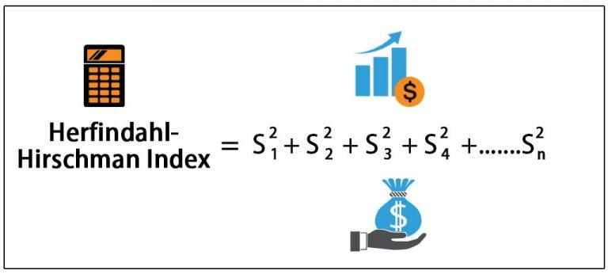

The Herfindahl-Hirschman Index (HHI) is a key indicator of market concentration and competition within industries. This economic measure was initially proposed by Albert O. Hirschman and later refined by Orris C. Herfindahl, becoming a standard tool for assessing market dynamics. The HHI is particularly valuable in the context of algorithmic trading, where understanding market concentration is crucial for making informed trading decisions. Algorithmic trading relies on computationally driven strategies to execute orders at speeds and frequencies impossible for human traders. As market dynamics, including competition levels, directly affect these trading strategies, tools like the HHI can be instrumental in navigating the complexities of automated trading environments.

The HHI provides a quantitative evaluation of market concentration by analyzing firms' market share contributions within an industry. This insight can help traders tailor their strategies by considering the competitive landscape's influence on price movements, liquidity, and volatility. The present article aims to explore the utilization of the HHI in algorithmic trading, providing a comprehensive understanding of how it affects strategy development and implementation. Additionally, we will discuss the benefits and potential drawbacks of applying the HHI in automated trading scenarios, highlighting where it excels and where it may fall short. Understanding these dimensions of market concentration will better equip traders to make strategic decisions in ever-changing market conditions.



## Table of Contents

## Understanding the Herfindahl-Hirschman Index (HHI)

The Herfindahl-Hirschman Index (HHI) is a widely-used measure for assessing market concentration and competition among firms in an industry. It quantifies the degree of market concentration by taking into account the market shares of all participating firms. The calculation involves squaring the market share of each firm and summing the resulting values. Mathematically, it can be expressed as:

$$
\text{HHI} = \sum_{i=1}^{N} s_i^2
$$

where $s_i$ is the market share of firm $i$, expressed as a percentage, and $N$ is the total number of firms in the market.

The resultant HHI value can range from close to zero to 10,000. A market with an HHI approaching zero implies a highly competitive environment with numerous firms, none having significant dominance. Conversely, an HHI close to 10,000 signals a monopoly, where one firm has a substantial control over the entire market. For example, if a single firm holds a 100% market share, the HHI would be 10,000 (since $100^2 = 10,000$).

The HHI serves as a critical tool for simplifying competitive landscape analyses, particularly in contexts such as mergers and acquisitions. Regulators and businesses use the index to assess the impact of potential mergers on market concentration. Typically, a market with an HHI below 1,500 is considered to be competitive, whereas an HHI between 1,500 and 2,500 implies moderate concentration. An HHI above 2,500 indicates high concentration, which may raise antitrust concerns in merger evaluations by authorities like the U.S. Department of Justice.

However, while the HHI provides a clear quantitative measure, its simplicity can also be its limitation. Real-world markets often exhibit complexities such as geographic concentration, product differentiation, or varying competitive pressures that the HHI does not capture. Consequently, relying solely on the HHI could overlook significant market dynamics, necessitating supplementary analyses for a comprehensive understanding.

## HHI Application in Algorithmic Trading

Algorithmic trading utilizes computational algorithms to efficiently execute orders based on predefined criteria, aiming to capitalize on rapid market movements and inefficiencies. The competitiveness of a market significantly influences [algorithmic trading](/wiki/algorithmic-trading) strategies and outcomes. The Herfindahl-Hirschman Index (HHI), as a metric of market concentration, serves as a valuable tool in gauging competitiveness within markets or specific segments, thereby impacting the development of trading strategies.

In markets characterized by [volatility](/wiki/volatility-trading-strategies), a high HHI indicates substantial market concentration with few dominant players. This lack of competition can heighten risks associated with [liquidity](/wiki/liquidity-risk-premium) and price stability, creating potential challenges for traders. For instance, in a market with limited competitive activity, price movements may be abrupt and challenging to predict, increasing the risk for traders relying on algorithmic strategies.

Traders can leverage HHI data to refine their algorithmic strategies in several ways. By assessing the level of market concentration, traders can make informed decisions on the timing of entry and [exit](/wiki/exit-strategy) points in their trades. A high HHI could signal the need for tighter risk management controls or adjustments in order size to mitigate potential volatility impacts. Additionally, HHI analysis can aid in developing hedging strategies, allowing traders to better safeguard against adverse price movements in concentrated markets.

Moreover, the insights from the HHI can support the identification of [arbitrage](/wiki/arbitrage) opportunities. In markets with high concentration, price discrepancies between similar assets may arise due to limited competitive forces, presenting potential arbitrage possibilities for traders utilizing sophisticated algorithms.

Incorporating HHI into algorithmic trading strategies enables traders to enhance their understanding of market structure and competitiveness, allowing for more precise and adaptive trading decisions. By integrating HHI with other analytical tools and metrics, traders can effectively manage risks and optimize their trading outcomes in dynamic and often unpredictable market environments.

## Examples and Case Studies

Consider an industry with several firms where one firm dominates with a market share of 70%. In such a scenario, the Herfindahl-Hirschman Index (HHI) can be calculated to evaluate market concentration. The formula for HHI is:

$$
\text{HHI} = \sum (s_i^2)
$$

where $s_i$ is the market share of each firm, expressed as a percentage. Here, if one firm holds a 70% market share and the remaining firms have smaller shares summing to 30%, the calculation might look like this:

$$
\text{HHI} = 70^2 + (10^2 + 10^2 + 10^2) = 4900 + 300 = 5200
$$

This high HHI suggests a concentrated market, representing elevated risks for traders due to potential volatility and pricing power held by the dominant firm. In concentrated markets, significant price movements and strategic shifts by the leading company can severely impact competitors and influence market dynamics.

In contrast, considering a market where firms have evenly distributed market shares, such as five firms each holding 20%, the HHI calculation would be:

$$
\text{HHI} = 5 \times (20^2) = 5 \times 400 = 2000
$$

A lower HHI reflects a more competitive market, where no single firm wields significant control. Such environments typically offer more stability, making them attractive for risk-averse trading strategies, as firms have less influence individually over market prices and conditions.

Case studies from industries such as technology or steel provide insights into strategic decisions influenced by HHI values. In the tech industry, for instance, the rapid pace of innovation and entry of new firms tends to distribute market shares more evenly, potentially lowering the HHI. This competitive landscape often leads companies to balance expansion goals with maintaining innovative edges. In contrast, traditional industries like steel might exhibit higher concentration due to significant barriers to entry, impacting merger and acquisition decisions and competitive strategies.

In these case studies, HHI serves as a crucial tool for understanding competitive forces, helping firms navigate complexities during market entry, strategic positioning, and consolidation phases. Analyzing HHI gives traders and industry analysts foundational knowledge to adapt strategies based on concentration levels and potential market shifts.

## Advantages and Limitations of HHI in Algorithmic Trading

The Herfindahl-Hirschman Index (HHI) simplifies the analysis of market concentration in algorithmic trading, providing a numerical measure to easily assess the competitive landscape. Calculating the HHI involves squaring the market share of each firm in a particular market and summing these squared figures. This calculation is straightforward and provides a readily accessible measure for quick market evaluations. For instance, in Python, one might calculate HHI as follows:

```python
market_shares = [0.2, 0.15, 0.1, 0.05]
hhi = sum([share**2 for share in market_shares]) * 10000
```

In this example, `market_shares` represents the market share of different firms, and the resulting `hhi` provides a quantifiable insight into market concentration.

Despite its simplicity, the HHI has limitations. It does not consider geographic concentration, which can significantly impact market dynamics by influencing factors like transportation costs and local competition barriers. Similarly, the index overlooks product differentiation, a critical element that can create competitive advantages irrespective of market share. Such factors can mask the true nature of competition by not capturing the niche markets or unique selling propositions that firms might leverage.

In the context of algorithmic trading, relying solely on the HHI might lead to oversights. Traders might draw inaccurate conclusions about market risk or opportunity if they ignore unique market features not encapsulated by concentration ratios. Therefore, while the HHI serves as a useful benchmark, traders should complement it with a broader set of analytical tools that [factor](/wiki/factor-investing) in additional market dynamics. This comprehensive approach helps avoid potential pitfalls of basing decisions solely on HHI, ultimately leading to more informed strategic decisions.

## Conclusion

The Herfindahl-Hirschman Index (HHI) proves to be a powerful tool in algorithmic trading, offering valuable insights into market concentration and competition. It offers a systematic approach to assessing the competitive dynamics of a market, directly influencing trading strategies. By quantifying market concentration, HHI enables traders to recognize the degree of competition and potential risks associated with monopoly or oligopoly conditions. 

Despite its benefits, the HHI is not without limitations. It provides a simplified view of market structure and may neglect nuances like geographic concentration, product differentiation, or temporal market shifts. Therefore, while HHI is a vital metric, relying solely on it could lead to incomplete or inaccurate market assessments. This calls for its integration with other analytical tools and metrics in algorithmic trading, such as liquidity measures or volatility indicators, to enhance decision-making and risk evaluation comprehensively.

As markets evolve, there is an increasing opportunity to expand the application of HHI in algorithmic trading. The ongoing advancement in data analytics and computational power can aid in refining HHI calculations, adapting them to account for complex market dynamics. The synergy between HHI and sophisticated analytical tools promises to bolster strategic insights and foster adaptable trading strategies suited for evolving market conditions.

## References & Further Reading

[1]: ["The Herfindahl-Hirschman Index."](https://www.investopedia.com/terms/h/hhi.asp) U.S. Department of Justice.

[2]: Lopez de Prado, M. (2018). ["Advances in Financial Machine Learning."](https://www.amazon.com/Advances-Financial-Machine-Learning-Marcos/dp/1119482089) John Wiley & Sons.

[3]: Chan, E. P. (2008). ["Quantitative Trading: How to Build Your Own Algorithmic Trading Business."](https://rickorford.com/quantitative-trading/) Wiley Trading.

[4]: Jansen, S. (2020). ["Machine Learning for Algorithmic Trading."](https://github.com/stefan-jansen/machine-learning-for-trading) Packt Publishing.