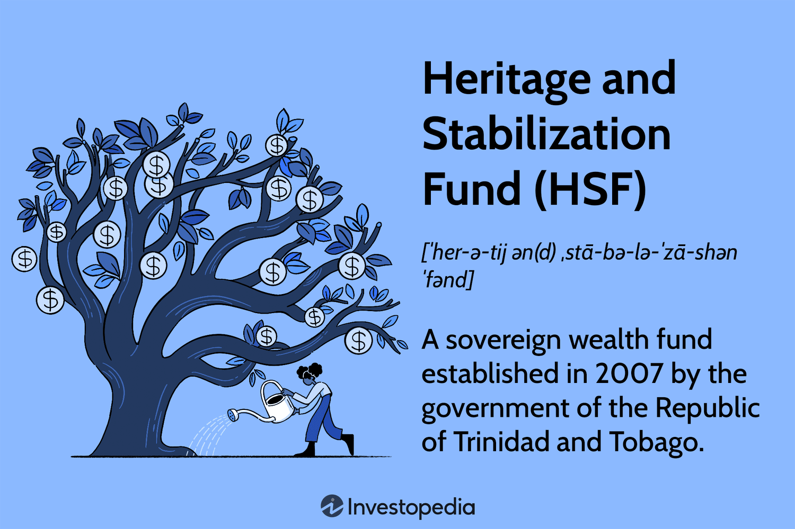

## Table of Contents

## What is the Heritage and Stabilization Fund?

The Heritage and Stabilization Fund is a special savings account set up by the government of Trinidad and Tobago. It was created to save some of the money earned from oil and gas, especially when prices are high. This helps the country have money saved for times when oil and gas prices drop, so they can still pay for important things without big problems.

The fund works by putting money into it when oil and gas prices are above a certain level. This money is then invested carefully to grow over time. When prices fall and the government needs extra money, they can take some out of the fund to help keep the country's budget stable. This way, the fund helps protect Trinidad and Tobago from the ups and downs of oil and gas prices.

## Why was the Heritage and Stabilization Fund created?

The Heritage and Stabilization Fund was created to help Trinidad and Tobago manage the money they earn from oil and gas. The main reason for setting up the fund was to save some of the money when oil and gas prices are high. This way, the country can have a safety net for times when prices go down. It's like saving money in a piggy bank for a rainy day.

The fund also helps keep the country's budget stable. When oil and gas prices drop, the government can take money out of the fund to help pay for important things like schools and hospitals. This means the country doesn't have to cut back on these services even when they are not [earning](/wiki/earning-announcement) as much from oil and gas. By saving and using the money wisely, the fund helps protect Trinidad and Tobago from the ups and downs of the oil and gas market.

## When was the Heritage and Stabilization Fund established?

The Heritage and Stabilization Fund was set up in 2007. It was made to help Trinidad and Tobago save money from oil and gas when prices are high. This way, the country can have money saved up for times when prices go down.

The fund helps keep the country's budget stable. When oil and gas prices drop, the government can take money out of the fund to help pay for important things like schools and hospitals. This means the country can keep running smoothly even when they are not earning as much from oil and gas.

## How does the Heritage and Stabilization Fund operate?

The Heritage and Stabilization Fund works by saving money from oil and gas when prices are high. The government puts money into the fund when the price of oil and gas goes above a certain level. This money is then invested carefully to grow over time. The goal is to have money saved up for when prices drop, so the country can still have enough money to pay for important things.

When oil and gas prices fall, the government can take money out of the fund to help keep the country's budget stable. This means they can still pay for things like schools and hospitals without having to cut back. The fund helps protect Trinidad and Tobago from the ups and downs of the oil and gas market by making sure there's always some money saved for tough times.

## What are the main objectives of the Heritage and Stabilization Fund?

The main goal of the Heritage and Stabilization Fund is to save money from oil and gas when prices are high. This way, Trinidad and Tobago can have a safety net for times when prices go down. By putting money into the fund when oil and gas prices are above a certain level, the country makes sure it has savings for the future. The money in the fund is then invested carefully to grow over time, so there's more to use when needed.

Another big objective of the fund is to help keep the country's budget stable. When oil and gas prices drop, the government can take money out of the fund to help pay for important things like schools and hospitals. This means the country can keep running smoothly even when they are not earning as much from oil and gas. The fund acts like a cushion, protecting Trinidad and Tobago from the ups and downs of the oil and gas market.

## Who manages the Heritage and Stabilization Fund?

The Heritage and Stabilization Fund is managed by the Board of Governors. The Board is made up of people from the government, like the Minister of Finance and other important officials. They make sure the fund is used the right way and that the money is saved and spent wisely.

The day-to-day operations of the fund are handled by the Central Bank of Trinidad and Tobago. The Central Bank takes care of the money, making sure it is invested carefully and grows over time. They follow the rules set by the Board of Governors to make sure the fund helps the country when oil and gas prices go up and down.

## How is the performance of the Heritage and Stabilization Fund measured?

The performance of the Heritage and Stabilization Fund is measured by looking at how well the money in the fund is growing over time. They check the returns on the investments made with the fund's money. If the investments are doing well, the fund's value goes up, which means it's doing a good job at saving and growing the money for Trinidad and Tobago.

Another way to measure the fund's performance is by seeing how it helps the country's budget when oil and gas prices go down. If the government can take money out of the fund and use it to keep paying for important things like schools and hospitals, then the fund is working well. It shows that the fund is helping to keep the country stable even when oil and gas prices are not high.

## What types of investments does the Heritage and Stabilization Fund make?

The Heritage and Stabilization Fund invests in different kinds of things to help the money grow. They put money into safe investments like government bonds and other securities. These are like loans to governments or big companies that pay back with interest. The fund also invests in stocks, which are pieces of big companies. By spreading the money across different types of investments, the fund tries to make sure it grows steadily without taking too many risks.

The fund also looks at investing in other countries to spread the risk even more. This means they might put money into foreign bonds or stocks. By doing this, the fund can take advantage of good opportunities around the world and not just depend on what's happening in Trinidad and Tobago. All these investments are carefully chosen to make sure the money saved from oil and gas keeps growing, so it can be there to help the country when prices drop.

## How has the Heritage and Stabilization Fund impacted the economy?

The Heritage and Stabilization Fund has helped keep Trinidad and Tobago's economy stable. When oil and gas prices go up, the government puts some of that money into the fund. This means they have savings to use when prices go down. By doing this, the fund helps the government pay for important things like schools and hospitals even when they are not earning as much from oil and gas. This stability is good for the economy because it means businesses and people can plan better for the future.

The fund also helps the economy by investing the money it saves. The money is put into safe investments like government bonds and stocks, both at home and in other countries. When these investments do well, the fund grows, which means there is more money to help the economy when it needs it. This careful investing helps make sure the money saved from oil and gas is used wisely and keeps growing, which is good for everyone in Trinidad and Tobago.

## What are the challenges faced by the Heritage and Stabilization Fund?

One of the big challenges for the Heritage and Stabilization Fund is deciding when to put money in and take money out. The government has to watch oil and gas prices carefully. If they put money in too late or take it out too early, the fund might not help as much as it could. This can be tricky because prices can change a lot, and it's hard to guess what will happen next.

Another challenge is making sure the money in the fund is invested wisely. The fund puts money into things like bonds and stocks, but if these investments don't do well, the fund won't grow as much. This means there might not be enough money to help the country when oil and gas prices drop. It's important to pick the right investments and keep an eye on them all the time.

## How does the Heritage and Stabilization Fund compare to similar funds globally?

The Heritage and Stabilization Fund of Trinidad and Tobago is similar to other sovereign wealth funds around the world, like Norway's Government Pension Fund Global and the UAE's Abu Dhabi Investment Authority. These funds all save money from natural resources, like oil and gas, to help their countries when prices go down. They put money into the funds when prices are high and take it out when prices drop. This helps keep their budgets stable and protects their economies from big changes in resource prices.

One big difference is how each fund invests its money. The Heritage and Stabilization Fund focuses on safe investments like government bonds and stocks, both at home and abroad. Norway's fund, on the other hand, invests in a wide range of things, including real estate and renewable energy. The UAE's fund also invests in many different areas, including private equity and infrastructure. Each fund has its own way of trying to grow the money it saves, but they all aim to help their countries in the long run.

## What future developments are anticipated for the Heritage and Stabilization Fund?

In the future, the Heritage and Stabilization Fund might focus more on making sure it can help Trinidad and Tobago even better when oil and gas prices change. They might work on better ways to decide when to put money in and take it out, so the fund is always ready to help. This could mean using new tools to predict prices better and making rules that let them move money around faster when they need to.

The fund might also look at different kinds of investments to help the money grow more. They could start putting money into things like green energy or new technology. This could help the fund grow faster and also help the country move away from depending so much on oil and gas. By doing this, the fund can be a bigger help to Trinidad and Tobago in the long run.

## References & Further Reading

[1]: Asness, C. S., Liew, J. M., & Stevens, R. L. (1999). ["Parallels Between the Cross-Sectional Predictability of Stock and Country Returns."](https://pages.stern.nyu.edu/~lpederse/papers/ValMomEverywhere.pdf) The Journal of International Money and Finance.

[2]: Terraza, V. (2015). ["Predicting Stock Market Returns using Deep Learning Neural Networks."](https://www.sciencedirect.com/science/article/pii/S0957417421009441) In: Minsker, E. (eds) Advances in Neural Networks.

[3]: Lopez de Prado, M. (2018). ["Advances in Financial Machine Learning."](https://www.amazon.com/Advances-Financial-Machine-Learning-Marcos/dp/1119482089) Wiley.

[4]: Chan, E. P. (2008). ["Quantitative Trading: How to Build Your Own Algorithmic Trading Business."](https://github.com/ftvision/quant_trading_echan_book) Wiley.

[5]: Jansen, S. (2020). ["Machine Learning for Algorithmic Trading."](https://github.com/stefan-jansen/machine-learning-for-trading) Packt Publishing.

[6]: Aronson, D. R. (2006). ["Evidence-Based Technical Analysis: Applying the Scientific Method and Statistical Inference to Trading Signals."](https://www.amazon.com/Evidence-Based-Technical-Analysis-Scientific-Statistical/dp/0470008741) Wiley.

[7]: Bollerslev, T., Engle, R. F., & Wooldridge, J. M. (1988). ["A Capital Asset Pricing Model with Time-Varying Covariances."](https://www.jstor.org/stable/1830713) Journal of Political Economy.

[8]: International Monetary Fund. (2007). ["Trinidad and Tobago: Selected Issues."](https://www.imf.org/external/pubs/ft/scr/2007/cr0708.pdf) IMF Country Report No. 07/8.