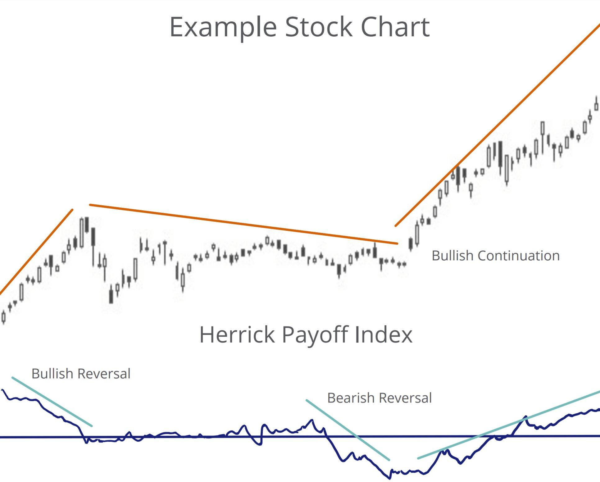

Trading indicators are essential tools in financial analysis, providing traders and analysts with quantitative data that inform market predictions and trading decisions. They serve as guides in deciphering price movements, volume fluctuations, and market sentiment. Among these indicators, the Herrick Payoff Index (HPI) stands out as a significant volume-based tool, primarily used in futures and options markets. It is designed to assess market trends by integrating price, volume, and open interest, thus offering insights into market momentum and potential reversals.

The Herrick Payoff Index was developed to address the limitations of traditional price indicators, offering a more comprehensive view by incorporating volume and open interest. This integration enables traders to understand whether price movements are supported by genuine market interest, providing a more nuanced approach to trend analysis. In particular, the HPI can help identify potential points of market entry or exit by signaling changes in underlying market dynamics.



Algorithmic trading, which has revolutionized modern financial markets, relies heavily on trading indicators like the HPI. By automating trading decisions through sophisticated algorithms, traders can capitalize on market opportunities with increased speed and precision. The HPI's role within this framework is pivotal, serving as a component within algorithmic systems to automate trend detection and market entry/exit strategies. This ability to be programmed into trading algorithms highlights its utility as an adaptive tool in dynamic market conditions.

The aim of this article is to provide a comprehensive analysis of the Herrick Payoff Index, offering insights and strategies for effectively utilizing this indicator in algorithmic trading. By understanding the HPI's mathematical foundation and practical applications, traders and analysts can leverage its capabilities to enhance their trading strategies.

The target audience for this exploration includes traders, financial analysts, and individuals interested in algorithmic trading, who seek to deepen their understanding of advanced trading indicators and their applications in financial markets. Through this exploration, readers will be equipped with the knowledge to integrate the HPI into their analytical toolkit, ultimately improving their market timing and decision-making processes.

## Table of Contents

## Understanding the Herrick Payoff Index

The Herrick Payoff Index (HPI) is a technical indicator primarily used in the analysis of futures and options markets. Developed by John Herrick, the HPI aims to provide insights into market trends by integrating price, volume, and open interest—three critical components that reflect the health of the market's participation and momentum. This makes the HPI a volume-based indicator, focusing on the flow of capital rather than price movements alone.

### Mathematical Basis and Parameters of HPI

The HPI is calculated using a formula that combines price data with [volume](/wiki/volume-trading-strategy) and open interest, thereby delivering a comprehensive view of market activity. The mathematical foundation of the HPI involves several key steps:

1. **Price Change**: $\Delta P = P_t - P_{t-1}$
   where $P_t$ is the price at time $t$ and $P_{t-1}$ is the price at time $t-1$.

2. **Volume and Open Interest Change**: These variables are used to measure the relative level of market activity.

3. **Rate of Flow (ROF)**: This represents the amount of money flowing into or out of a futures contract. It is computed using:
$$
   \text{ROF} = \Delta P \times (\text{Volume} - \text{Open Interest})

$$

4. **Herrick Payoff Index**: The accumulated values of the ROF provide the HPI, which can be plotted as an oscillator:
$$
   \text{HPI} = \sum (\text{ROF} - \text{Average ROF})

$$

The HPI is, therefore, an oscillator that fluctuates above and below a zero line, indicating whether money is flowing into or out of the market.

### Primary Uses in Trading

The Herrick Payoff Index is particularly valuable in futures and options markets due to its sensitivity in detecting shifts in market sentiment and participation. By combining price, volume, and open interest, the HPI serves as an early warning system for potential trend reversals or confirmations. Traders utilize it to:

- **Identify Buying or Selling Pressure**: Positive HPI values suggest bullish sentiment with increased buying pressure, while negative values imply bearish sentiment with heightened selling pressure.

- **Assess Market Strength**: By analyzing the magnitude of the HPI, traders can gauge the strength of market movements and adjust their strategies accordingly.

- **Spot Divergences**: Like other oscillators, divergences between price action and HPI can signal potential reversals or weakenings in the current trend.

### Benefits as a Volume-Based Indicator

As a volume-based indicator, the HPI offers several advantages:

- **Expanded Market Depth**: By incorporating open interest, the HPI provides a richer view of market depth compared to purely price-based indicators.

- **Enhanced Sensitivity**: The inclusion of volume and open interest makes the HPI sensitive to underlying market dynamics, capturing shifts in trader commitment more effectively.

### Popularity and Limitations

While the Herrick Payoff Index is beneficial for its comprehensive approach to analyzing market trends, it is less widely used than some other indicators like Moving Average Convergence Divergence (MACD) or the Relative Strength Index (RSI). This is partly due to its complexity and the need for specific data (volume and open interest), which might not always be readily available.

Moreover, like any technical indicator, HPI has limitations. It may provide misleading signals in thinly traded markets where volume and open interest data can be erratic. Additionally, its reliance on multiple data points can make it challenging to interpret without a deep understanding of market mechanics.

In summary, the Herrick Payoff Index is a nuanced tool that, despite its complexities, offers valuable insights for traders focusing on futures and options markets. Its utility in evaluating market sentiment and commitment makes it a powerful component of a well-rounded trading strategy, particularly when used in conjunction with other indicators.

## The Importance of Trading Indicators in Financial Analysis

Trading indicators are essential tools in financial analysis, serving as metrics derived from historical price, volume, and market data. They assist traders and analysts in identifying market trends, generating buy or sell signals, and making informed trading decisions. The primary role of trading indicators is to simplify price information, provide detailed insights into market dynamics, and help predict future price movements. 

### Types of Trading Indicators
Trading indicators can be categorized into several types, each serving distinct purposes in market analysis:

1. **Volume-Based Indicators**: These indicators focus on the trading volume to assess the strength or weakness of a price movement. They are crucial in understanding the intensity of price moves and potential trend reversals. Volume indicators such as the On-Balance Volume (OBV) and the Accumulation/Distribution Line are widely utilized.

2. **Trend-Following Indicators**: These indicators help identify the direction of the market's trend and are typically used to confirm whether a market is trending upwards or downwards. Moving Averages, Moving Average Convergence Divergence (MACD), and the Parabolic SAR are popular trend-following indicators.

3. **Momentum Indicators**: Momentum indicators evaluate the rate of change or speed of price movements. They provide insights into the strength of a market trend and potential overbought or oversold conditions. Examples include the Relative Strength Index (RSI) and the Stochastic Oscillator.

### The Herrick Payoff Index (HPI) and Its Unique Contributions
The Herrick Payoff Index (HPI) is a volume-based trading indicator specifically designed to analyze the futures and options markets. Unlike traditional volume indicators that focus solely on price and volume, the HPI incorporates open interest data, making it particularly useful in assessing the strength of a market trend. The formula for the HPI is as follows:

$$
\text{HPI} = \frac{(P_t - P_{t-1}) \times V_t}{OI_t}
$$

Where:
- $P_t$ and $P_{t-1}$ are the current and previous period prices.
- $V_t$ is the volume for the current period.
- $OI_t$ is the open interest for the current period.

The inclusion of open interest allows the HPI to provide insights into whether a price trend is supported by the flow of funds, offering a deeper understanding of market dynamics. This capability makes the HPI uniquely valuable in analyzing futures contracts, where open interest plays a significant role.

### Combining Indicators for Enhanced Trading Strategies
Utilizing a combination of trading indicators can significantly enhance the robustness of trading strategies. By integrating indicators from different categories, traders can cross-verify signals and reduce the likelihood of false positives. For example, a strategy might use a trend-following indicator like the MACD to confirm the direction of a trend, a [momentum](/wiki/momentum) indicator like the RSI to gauge the strength of the trend, and the HPI to validate the movement with volume and open interest data.

Incorporating multiple indicators allows traders to assess various aspects of market behavior simultaneously, leading to more informed trading decisions and improved risk management. Furthermore, combining indicators supports the development of sophisticated [algorithmic trading](/wiki/algorithmic-trading) systems capable of automating buy or sell signals based on predefined conditions, further enhancing trading efficiency and accuracy.

Overall, trading indicators, including the HPI, play a pivotal role in financial analysis by providing essential insights into market trends and behaviors, thus facilitating informed decision-making for traders and analysts alike.

## Algorithmic Trading and HPI

Algorithmic trading refers to the use of computer programs and software to execute trading orders at speeds and frequencies that are impossible for human traders. Utilizing mathematical models and algorithms, these systems can analyze vast quantities of data and make trading decisions based on predefined criteria. The adoption of algorithmic trading has significantly transformed modern financial markets by enhancing trading efficiency, reducing transaction costs, and improving market [liquidity](/wiki/liquidity-risk-premium).

The Herrick Payoff Index (HPI), as a volume-based trading indicator, fits seamlessly into the world of algorithmic trading. At its core, the HPI utilizes data on price changes, volume, and open interest to gauge the flow of money into and out of futures contracts. This makes it particularly suited for algorithmic trading systems that emphasize volume analysis alongside price action.

Integrating the HPI into an algorithmic trading system involves programming the HPI’s formula into the system's codebase, allowing the algorithm to calculate the index in real-time. The formula for calculating the HPI is generally expressed as:

$$

\text{HPI} = \frac{(\text{V} \times (\text{C} - \text{Y}) \pm (\frac{\text{V}}{\text{OI}})^\frac{1}{3} )}{\text{S}}
$$

Where:
- $\text{V}$ is the volume,
- $\text{C}$ is the current price,
- $\text{Y}$ is the yesterday’s closing price,
- $\text{OI}$ is the open interest,
- $\text{S}$ is a smoothing factor.

This formula allows traders to create rules within their algorithms to either enter or [exit](/wiki/exit-strategy) a trade based on the value of the HPI. A typical strategy might involve purchasing a contract when the HPI crosses above a certain threshold, indicating upward momentum, and selling when it crosses below a different threshold.

Algorithmic traders frequently employ [backtesting](/wiki/backtesting) strategies to evaluate the effectiveness of the HPI within their automated systems. By running historical data through the algorithm, traders can assess how the HPI would have influenced trading decisions and overall profitability. This is crucial for fine-tuning the algorithm to adapt to different market conditions.

An example of a successful algorithmic trading strategy incorporating the HPI might involve its use in conjunction with other indicators like the Moving Average Convergence Divergence (MACD) or the Relative Strength Index (RSI). By doing so, traders can filter out false signals and confirm trades, minimizing risk and increasing the likelihood of successful trades.

The implementation of the HPI in algorithmic trading showcases its utility in providing a nuanced understanding of market dynamics, particularly in futures and options markets. As financial markets become increasingly data-driven, tools like the HPI are integral to developing sophisticated trading strategies that can withstand the rapid pace of modern trading environments.

## Implementing Herrick Payoff Index in Trading Strategies

Integrating the Herrick Payoff Index (HPI) into trading strategies requires a systematic approach that aligns with traders' objectives and market conditions. Here are the steps to effectively implement the HPI in trading:

### Step-by-Step Methods to Integrate HPI

1. **Understand the Calculation**: The HPI assesses the strength of a price trend by considering volume and open interest. Familiarity with its formula and components is essential:
$$
   HPI = \frac{(P - P_{prev}) \times V}{O}

$$
   Where $P$ represents the current price, $P_{prev}$ is the previous period's price, $V$ is volume, and $O$ is open interest.

2. **Set Parameters**: Define the look-back period and adjust the sensitivity of the HPI to match the asset being traded. This step may involve optimizing parameters through historical data analysis.

3. **Signal Generation**: Identify buy and sell signals based on HPI values. Typical signals include entering a position when the HPI crosses above or below certain thresholds, suggesting potential price movement.

4. **Combine with Other Indicators**: Enhance trading decisions by using HPI alongside other indicators, such as moving averages or RSI, to confirm signals and reduce false positives.

5. **Risk Management and Position Sizing**: Establish stop-loss and take-profit levels to mitigate risks. Position sizing should be adapted based on volatility and the HPI's indication of market strength.

### Risk Management and Position Sizing

Effective risk management is crucial in any trading strategy utilizing HPI. Implement position sizing rules to cap potential losses and optimize profits. Techniques such as the Kelly Criterion help in determining optimal bet sizes relative to account size and chance of favorable outcomes.

**Example:**
$$
   f^* = \frac{bp - q}{b}

$$
   where $f^*$ is the fraction of capital to risk, $b$ is the odds received on the wager, $p$ is the probability of winning, and $q$ is the probability of losing.

### Backtesting and Optimization

1. **Historical Testing**: Utilize historical data to test HPI-based strategies. This involves checking the effectiveness of the HPI as a predictor over various market conditions and time frames.

2. **Optimization**: Fine-tune parameters continuously using a combination of automated algorithms and manual adjustments to enhance performance.

**Practical Tips**:
- Ensure datasets are clean and representative of the current market environment.
- Use walk-forward optimization to avoid overfitting strategies to past data.

### Technologies and Trading Platforms

Trading platforms like MetaTrader, NinjaTrader, and TradeStation support the integration of custom indicators such as HPI. These technologies provide the necessary infrastructure for backtesting, optimization, and live trading.

**Python Implementation**:
Using the `pandas` library, traders can develop scripts to calculate HPI and evaluate its performance in historical data analysis:
```python
import pandas as pd

def calculate_hpi(data):
    data['HPI'] = (data['Close'] - data['Close'].shift(1)) * data['Volume'] / data['Open_Interest']
    return data

# Example usage
data = pd.DataFrame({'Close': [...], 'Volume': [...], 'Open_Interest': [...]})
data = calculate_hpi(data)
```

By leveraging these tools and strategies, traders can effectively incorporate the Herrick Payoff Index into their trading methodologies, potentially enhancing their trading performance and decision-making processes.

## Benefits and Challenges of Using HPI

The Herrick Payoff Index (HPI) presents several advantages that make it a valuable tool for traders, particularly in improving market timing. As a volume-based indicator, HPI provides insights into the strength of a market move by considering both price changes and trading volume. This dual consideration allows traders to discern whether a price trend is supported by significant trading activity, which can be crucial for validating market signals and optimizing entry and exit points.

HPI offers specific advantages such as:

1. **Enhanced Market Timing**: By evaluating both the price change and the associated volume, HPI aids traders in identifying the robustness of trends, facilitating better timing for trades.
2. **Volume-Based Insights**: HPI's consideration of volume as a critical component lends itself to a more nuanced understanding of market dynamics, distinguishing it from purely price-based indicators.
3. **Application Across Markets**: HPI can be effectively applied in various markets, including futures and options, enhancing its utility for diverse trading strategies.

However, reliance on the Herrick Payoff Index alone poses certain challenges:

1. **Overreliance on Single Indicators**: Relying solely on HPI may result in misleading signals if used without complementary indicators. Volume-based information, while insightful, may not capture all market nuances.
2. **Market Conditions**: HPI effectiveness can diminish during low-volume periods or sideways markets where volume data might not provide clear signals.
3. **Complexity and Interpretation**: New users may find the interpretation of HPI complex due to its volume and price change dynamics, necessitating a learning curve.

To overcome these challenges, traders can adopt the following best practices:

1. **Integration with Other Indicators**: Combining HPI with other indicators like moving averages or trend-following tools can provide a more comprehensive view of market conditions, compensating for the limitations of single-indicator reliance.

   ```python
   # Example: Combining HPI with a Simple Moving Average (SMA) in Python
   import pandas as pd

   # Sample data
   data = {'price': [100, 102, 104, 103, 105], 
           'volume': [1100, 1150, 1130, 1105, 1120]}
   df = pd.DataFrame(data)

   # Calculate HPI using a custom function
   def calculate_hpi(df):
       # Placeholder for HPI calculation
       hpi = (df['price'].pct_change() * df['volume']).cumsum()
       return hpi

   df['HPI'] = calculate_hpi(df)

   # Calculate SMA
   df['SMA'] = df['price'].rolling(window=3).mean()

   # Display result
   print(df)
   ```
2. **Risk Management and Position Sizing**: Implementing rigorous risk management strategies and appropriate position sizing can mitigate potential losses arising from erroneous signals.
3. **Continuous Backtesting and Adjustment**: Regular backtesting of HPI-based strategies ensures adaptability to changing market conditions, allowing traders to refine and optimize their approaches.

By understanding its strengths and addressing its challenges through strategic integration and risk management, the Herrick Payoff Index can enhance the effectiveness of trading strategies in algorithmic trading contexts.

## Conclusion

The Herrick Payoff Index (HPI) is a significant tool in the landscape of trading indicators, offering traders a volume-based perspective to enhance their financial analysis and strategy formulation. Throughout the discussion, the HPI has been highlighted for its capacity to provide insights into market dynamics, particularly in futures and options markets. Unlike conventional price-based indicators, the HPI leverages volume data, enabling traders to capture underlying market movements that may not be readily apparent through price action alone.

The value of the HPI lies in its ability to complement other indicators and add depth to trading strategies. By integrating the HPI into their analytical frameworks, traders and analysts stand to gain a more comprehensive understanding of market behavior, enhancing decision-making processes and potentially improving market timing. Its application in algorithmic trading underscores this value, as the HPI can be seamlessly integrated into trading models to automate and refine trading strategies based on volume trends.

Traders and financial analysts are encouraged to consider the HPI as a vital component of their analytical toolkit. Given the increasingly data-driven nature of financial markets, indicators that provide unique perspectives, such as the HPI, are indispensable for maintaining a competitive advantage. The incorporation of the HPI with other trading indicators can create a multifaceted approach that addresses various market conditions.

Looking forward, the role of trading indicators like the HPI in algorithmic trading is poised to expand, driven by advancements in computing power and [machine learning](/wiki/machine-learning) techniques. These developments may lead to more sophisticated models that better harness the predictive power of indicators like the HPI. As the financial landscape continues to evolve, the adaptability and insights offered by the HPI will likely remain relevant, supporting traders in navigating complex market environments with greater precision.

## References & Further Reading

[1]: Bergstra, J., Bardenet, R., Bengio, Y., & Kégl, B. (2011). ["Algorithms for Hyper-Parameter Optimization."](https://papers.nips.cc/paper/4443-algorithms-for-hyper-parameter-optimization) Advances in Neural Information Processing Systems.

[2]: ["Advances in Financial Machine Learning"](https://www.amazon.com/Advances-Financial-Machine-Learning-Marcos/dp/1119482089) by Marcos Lopez de Prado.

[3]: Aronson, D. (2007). ["Evidence-Based Technical Analysis: Applying the Scientific Method and Statistical Inference to Trading Signals."](https://www.amazon.com/Evidence-Based-Technical-Analysis-Scientific-Statistical/dp/0470008741) Wiley Trading.

[4]: Jansen, S. (2020). ["Machine Learning for Algorithmic Trading."](https://github.com/stefan-jansen/machine-learning-for-trading) Packt Publishing.

[5]: Chan, E. P. (2008). ["Quantitative Trading: How to Build Your Own Algorithmic Trading Business."](https://github.com/ftvision/quant_trading_echan_book) Wiley Trading.