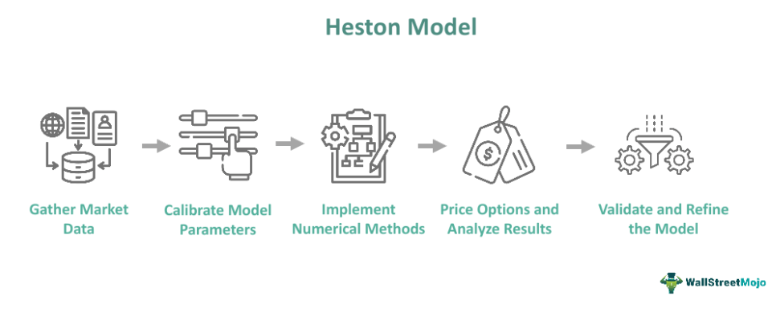

The financial derivatives market is a multifaceted domain that includes a variety of sophisticated instruments such as options, swaps, and futures. Understanding the behavior of these financial products is contingent upon accurate volatility modeling, which is critical for pricing and risk management. Volatility reflects the degree of variation in the price of a financial instrument over time, making its prediction and management pivotal for investors and traders.

One of the most renowned models in this domain is the Heston Model, introduced by Steven L. Heston in 1993. Unlike traditional models like Black-Scholes, which assume constant volatility over the life of an option, the Heston Model allows for stochastic volatility. This means that it accommodates the fluctuations in volatility observed in the real world, offering a more true-to-life depiction of market behavior. The model’s ability to capture the random nature of volatility is particularly crucial in environments where market conditions are continuously changing.



This article aims to detail the significance of the Heston Model in financial derivatives volatility modeling and its practical applications within algorithmic trading systems. We will examine the theoretical foundations of the Heston Model, providing a comprehensive comparison with the Black-Scholes model. This comparison will outline the advantages the Heston Model holds due to its stochastic nature, particularly in contexts that demand acknowledgment of volatility variance.

In exploring its applications, we will discuss how the Heston Model is implemented within algorithmic trading systems. These systems leverage the model's capability to better predict and respond to market changes, enhancing trading strategies and risk assessments. We will review key parameters of the model, the computational techniques applied, such as Monte Carlo simulations, and the integration of the model’s outputs into practical trading scenarios.

Furthermore, the discussion will cover the benefits and limitations of using the Heston Model. While it provides a robust framework for modeling and prediction due to its stochastic volatility features, it also demands substantial computational resources and sophisticated understanding for accurate parameter calibration. Finally, the article will conclude with insights into the future role of the Heston Model in modern financial markets, considering ongoing innovations and extensions such as stochastic interest rates and jump diffusion processes that enhance the model's applicability. This evolution underscores the model’s enduring importance in optimizing trading strategies and improving market analysis.

## Table of Contents

## Understanding the Heston Model

The Heston Model, introduced by Steven L. Heston in 1993, is a stochastic volatility model specifically designed for pricing European options. Unlike more traditional models like the Black-Scholes model, which assumes constant volatility, the Heston Model accommodates changing volatility over time. This key feature allows it to provide more accurate estimations in real-market environments, where volatility is known to fluctuate based on various economic factors.

At its core, the Heston Model utilizes stochastic differential equations (SDEs) to describe the dynamics of both the asset price and its variance. The asset price $S_t$ and its variance $v_t$ are modeled as follows:

$$

dS_t = \mu S_t dt + \sqrt{v_t} S_t dW_t 
$$

$$

dv_t = \kappa(\theta - v_t) dt + \sigma \sqrt{v_t} dZ_t 
$$

Where:

- $S_t$ is the price of the asset at time $t$.
- $v_t$ is the variance of the asset’s return at time $t$.
- $\mu$ represents the rate of return of the asset.
- $\kappa$ is the rate of mean reversion of the volatility.
- $\theta$ is the long-term mean of the variance.
- $\sigma$ is the volatility of the volatility, often referred to as "vol of vol."
- $dW_t$ and $dZ_t$ are two Wiener processes (standard Brownian motions) with a correlation $\rho$.

A significant strength of the Heston Model is its inclusion of mean reversion in [volatility](/wiki/volatility-trading-strategies), which is a concept rooted in empirical observations of financial markets. Mean reversion suggests that volatility tends to revert to a long-term average over time, which stabilizes options pricing by taking into account periods of high or low volatility.

Furthermore, the correlation between asset price movements and changes in volatility, captured by the parameter $\rho$, reflects what is known as the leverage effect. This effect describes how changes in asset prices can affect volatility and vice versa, indicative of market conditions where declining asset prices often coincide with increasing volatility.

By modeling these relationships, the Heston Model addresses some of the limitations of constant volatility models, making it particularly valuable for trading strategies that rely on accurate assessments of volatility dynamics. These features facilitate enhanced forecasting and risk management, supporting more sophisticated financial decision-making processes.

## Key Parameters of the Heston Model

The Heston Model is characterized by several key parameters, each playing a vital role in accurately modeling market volatility. These parameters include the initial asset price, mean reversion rate, long-term average volatility, volatility of volatility, and the correlation between asset price and volatility.

- **Initial Asset Price ($S_0$)**: This parameter represents the starting price of the underlying asset in an option pricing context. It serves as the baseline upon which the model's stochastic processes operate.

- **Mean Reversion Rate ($\kappa$)**: The mean reversion rate determines the speed at which volatility reverts to its long-term average. Mathematically, this is expressed as part of the stochastic differential equation (SDE) governing the volatility process:
$$
  dV_t = \kappa (\theta - V_t)dt + \xi \sqrt{V_t} dW_t^V

$$

  Here, $\theta$ is the long-term average volatility, $V_t$ is the instantaneous variance at time $t$, $\xi$ represents the volatility of volatility, and $W_t^V$ is a Wiener process. The capacity for mean reversion is crucial for stabilizing option pricing over time.

- **Long-term Average Volatility ($\theta$)**: This parameter represents the expected average level of volatility over time. It anchors the volatility process, ensuring it does not drift excessively far from empirical observations, and provides a benchmark for anticipated market conditions.

- **Volatility of Volatility ($\xi$)**: Known as the "vol of vol," this parameter captures the extent to which volatility itself can fluctuate. It influences the heaviness of the tails in the distribution of returns, affecting how option prices respond to extreme market events.

- **Correlation ($\rho$)**: The correlation between the asset price and volatility is a critical factor in modeling the leverage effect, where negative shocks to the asset price often coincide with increased volatility. This parameter helps produce the volatility smile observed in market data. The correlation is incorporated into the model through the correlation between the Wiener processes driving the asset price and volatility:
$$
  dS_t = \mu S_t dt + \sqrt{V_t} S_t \left(\rho dW_t^V + \sqrt{1-\rho^2} dW_t^S \right)

$$

  where $dW_t^S$ is another Wiener process.

Proper calibration of these parameters is essential for ensuring that the Heston Model aligns closely with real-world market data. Accurate parameter calibration allows traders and analysts to derive precise option prices and perform effective risk assessments. Calibration typically involves sophisticated statistical techniques and a robust dataset to optimize parameter values, ultimately leading to reliable and insightful modeling outcomes in real-market applications.

## Implementing the Heston Model in Algorithmic Trading

Algorithmic trading utilizes advanced models, such as the Heston Model, to achieve precise trade execution and robust risk management. This model is particularly advantageous due to its incorporation of stochastic volatility, providing a more accurate representation of market dynamics than constant volatility models.

Python is a preferred language for implementing the Heston Model, thanks to its robust libraries like NumPy, SciPy, and Pandas, which facilitate complex mathematical computations and data manipulation. Furthermore, Python's versatility allows for seamless integration with trading platforms, enabling real-time analysis and execution.

Monte Carlo simulations are often employed to solve the Heston Model's stochastic differential equations, which lack closed-form solutions. These simulations involve generating numerous random paths for the underlying asset price, under the influence of random volatility, to compute the expected payoff of options. The general formula for an option price via Monte Carlo is given by the expectation:

$$
C = e^{-rT} \cdot \mathbb{E}\left[\max(S_T - K, 0) \right]
$$

where $C$ is the call option price, $r$ is the risk-free rate, $T$ is time to maturity, $S_T$ is the simulated asset price at maturity, and $K$ is the option's strike price.

Implementing the model usually involves the following Python code outline:

```python
import numpy as np

# Parameters
kappa = 2.0  # Mean reversion rate
theta = 0.02  # Long-term average volatility
sigma = 0.1  # Volatility of volatility
rho = -0.7  # Correlation
v0 = 0.04  # Initial volatility
S0 = 100  # Initial asset price
r = 0.05  # Risk-free rate
K = 100  # Strike price
T = 1.0  # Time to maturity in years
n_simulations = 10000
n_steps = 252

# Monte Carlo simulation
dt = T / n_steps
prices = np.zeros(n_simulations)
for i in range(n_simulations):
    S_t = S0
    v_t = v0
    for _ in range(n_steps):
        z1 = np.random.normal()
        z2 = rho * z1 + np.sqrt(1 - rho**2) * np.random.normal()

        S_t = S_t * np.exp((r - 0.5 * v_t) * dt + np.sqrt(v_t * dt) * z1)
        v_t = np.abs(v_t + kappa * (theta - v_t) * dt + sigma * np.sqrt(v_t * dt) * z2)

    prices[i] = max(S_t - K, 0)

option_price = np.exp(-r * T) * np.mean(prices)
print(f"Option Price: {option_price}")
```

Integrating the Heston Model's outputs into trading strategies enhances not only risk assessment but also volatility forecasting. The model's ability to dynamically adjust trading strategies based on implied volatility surfaces, derived from real-time market data, aids in identifying [arbitrage](/wiki/arbitrage) opportunities.

Traders can map the implied volatility surface to current market valuations, allowing them to adjust positions or strategies dynamically. This mapping supports decision-making processes in exploiting market inefficiencies, thus optimizing trade outcomes. The Heston Model's flexibility and precision make it an invaluable tool in the toolkit of [algorithmic trading](/wiki/algorithmic-trading) systems, facilitating informed, data-driven decision-making.

## Comparing Heston and Black-Scholes Models

The Black-Scholes and Heston models represent two foundational approaches to pricing European options, each with distinct assumptions and computational methods. The Black-Scholes model, introduced in 1973 by Fischer Black, Myron Scholes, and Robert Merton, assumes constant volatility for the underlying asset, which simplifies the pricing of European options into a closed-form solution. This simplicity allows for quick and efficient computations, making Black-Scholes particularly appealing in stable market conditions.

Mathematically, the Black-Scholes formula for a European call option is given by:

$$
C = S_0 N(d_1) - X e^{-rT} N(d_2)
$$

where:

$$
d_1 = \frac{\ln(S_0/X) + (r + \sigma^2/2)T}{\sigma \sqrt{T}}
$$

$$
d_2 = d_1 - \sigma \sqrt{T}
$$

Here, $S_0$ is the current price of the asset, $X$ is the strike price, $r$ is the risk-free [interest rate](/wiki/interest-rate-trading-strategies), $T$ is the time to expiration, $\sigma$ is the volatility, and $N(\cdot)$ denotes the cumulative distribution function of the standard normal distribution.

In contrast, the Heston Model introduced by Steven Heston in 1993, incorporates stochastic volatility, allowing the volatility to fluctuate over time according to a stochastic process. This capability enables the Heston Model to more effectively capture phenomena such as the volatility smile, a pattern where implied volatility differs for options with different strike prices or maturities. Unlike Black-Scholes, the Heston Model posits a mean-reverting square root process for volatility:

$$
dv_t = \kappa(\theta - v_t)dt + \sigma_v \sqrt{v_t}dW_t^v
$$

where $v_t$ is the variance, $\kappa$ is the rate of mean reversion, $\theta$ is the long-term average variance, $\sigma_v$ is the volatility of volatility, and $W_t^v$ is a Wiener process that introduces randomness.

The added complexity of the Heston Model makes an analytical solution to the pricing problem more challenging, often requiring numerical methods like Monte Carlo simulations or finite difference methods. These methods are computationally intensive, demanding more sophisticated resources compared to the straightforward Black-Scholes model.

While Black-Scholes remains computationally efficient and ubiquitous for environments where the volatility assumption holds, it faces limitations in more volatile or uncertain markets. The Heston Model, with its adaptability to dynamic market conditions and ability to model the leverage effect, proves more versatile. However, it demands greater computational effort and parameter estimation, highlighting the trade-off between simplicity and the ability to capture complex market behaviors.

Each model offers unique advantages depending on market conditions: Black-Scholes for simple, stable environments and Heston for complex, fluctuating situations.

## Benefits and Limitations of the Heston Model

The Heston Model, introduced to address limitations in traditional volatility models, stands out for its ability to incorporate stochastic volatility, offering a more realistic depiction of market dynamics. This capability is particularly valuable as it captures the volatility smile, a phenomenon observed in market data where implied volatilities vary with different strike prices. By capturing this aspect, the Heston Model provides a robust framework for risk management and option pricing, ensuring that traders and analysts can better anticipate market movements and price derivatives accordingly.

A significant advantage of the Heston Model is its accommodation of mean-reverting volatility, aligning with empirical observations of how market volatility behaves over time. This mean-reverting nature allows the model to more precisely reflect the time-varying nature of volatility, making it particularly useful in pricing long-dated options where volatility dynamics significantly impact valuation.

However, the Heston Model is not without its challenges. Its complexity requires sophisticated mathematical and computational expertise. The model is typically expressed using stochastic differential equations, making numerical methods like Monte Carlo simulations essential for option pricing. This requirement can lead to increased computational costs and necessitate significant computational resources, posing potential limitations for practical implementation in some trading environments.

Parameter calibration is another consideration, as it is crucial to ensure the model aligns with real-world data accurately. Calibration involves determining parameters such as initial asset price, mean reversion rate, long-term average volatility, volatility of volatility, and the correlation between asset price and volatility. Each parameter must be finely tuned to reflect current market conditions accurately, demanding high-quality data and advanced calibration techniques. Inaccurate calibration can lead to pricing discrepancies, undermining the model's reliability in decision-making processes.

Despite these challenges, the Heston Model remains invaluable, especially for scenarios where volatility dynamics play an essential role, such as in long-dated options or volatile market conditions. Its ability to provide a more comprehensive analysis of volatility makes it an essential tool for traders seeking to optimize their strategies and better manage risk in complex financial markets.

## Extensions and Innovations in the Heston Model

Recent extensions to the Heston Model have significantly enhanced its ability to reflect real-world financial phenomena by incorporating stochastic interest rates and jump diffusion processes. These innovations are vital for capturing sudden market movements and addressing variability in interest rates, thus broadening the model's applicability to a diverse range of financial environments.

**Stochastic Interest Rates**

Integrating stochastic interest rates into the Heston Model allows for a more realistic pricing framework, as interest rates in actual markets fluctuate over time rather than remaining constant. This advancement demands additional parameter estimation, which can complicate the model but also enrich its representation of market conditions. The incorporation of stochastic differential equations (SDEs) to model interest rate dynamics provides a sophisticated approach that pairs with the stochastic volatility element of the original Heston Model.

For example, the dynamics of the stochastic interest rate $r(t)$ can be modeled using an Ornstein-Uhlenbeck process:

$$
dr(t) = \theta (\mu - r(t)) dt + \sigma_r dW_t^r
$$

where $\theta$ represents the speed of mean reversion, $\mu$ is the long-term mean interest rate, $\sigma_r$ is the volatility of the interest rate, and $dW_t^r$ is a Wiener process.

**Jump Diffusion Processes**

Adding jump diffusion processes to the Heston Model addresses limitations associated with gradual changes implied by continuous paths, better reflecting sudden and significant market shifts. This extension incorporates jump processes in the asset price dynamics, which enhance modeling capabilities by capturing large, unexpected market moves. The integration typically follows a modified SDE:

$$
dS_t = \mu S_t dt + \sqrt{v_t} S_t dW_t^s + J_t S_t dq_t
$$

where $J_t$ represents the jump size and $q_t$ is a Poisson process dictating the arrival of jumps. The jump component accounts for external shocks, further aligning the model with market realities.

**Hybrid Models**

The development of hybrid models, which combine elements from other stochastic models, further refines the Heston Model by expanding its predictive capabilities. These hybrid models aim to integrate different sources of market risk into a unified framework, offering comprehensive solutions for risk management and option pricing.

For example, a hybrid model might blend the Heston Model with the Bates model, which has both stochastic volatility and jump processes, allowing practitioners to capture a wider spectrum of market dynamics.

**Conclusion**

The continuous evolution of the Heston Model through these extensions illustrates its pivotal role in the advancement of financial modeling. As financial markets grow more complex and challenging, these innovations ensure that the Heston Model remains a robust tool for traders and analysts, supporting sophisticated risk assessment techniques necessary in the ever-evolving financial landscape.

## Conclusion

The Heston Model is a significant advancement in financial derivatives volatility modeling, offering a more nuanced approach compared to traditional models like Black-Scholes by incorporating stochastic volatility. This ability to account for variability in volatility, which more accurately mirrors real-world market behaviors, provides traders and analysts with a vital tool for effective risk management.

The mathematical framework of the Heston Model, characterized by its stochastic differential equations, allows it to capture complex market phenomena such as the volatility smile and mean reversion. This robustness is particularly beneficial in options pricing and risk management, where understanding the nuances of market volatility can lead to more informed decision-making. Despite its inherent complexity, the successful integration of the Heston Model into algorithmic trading systems enables traders to achieve greater precision in pricing and strategy development. This precision stems from the model’s capacity to provide real-time volatility forecasts and adapt trading strategies accordingly.

Moreover, the Heston Model has evolved to meet the demands of modern financial markets by incorporating extensions that include stochastic interest rates and jump diffusion processes. These innovations enhance the model’s capability to account for sudden market shifts and changing interest rates, thus maintaining its relevance in dynamic market conditions. As financial markets become increasingly sophisticated, the Heston Model’s continued evolution makes it an invaluable tool for accurately capturing market realities and optimizing trading strategies.

For practitioners seeking to implement the Heston Model, a basic Python script could use libraries such as NumPy and SciPy for performing Monte Carlo simulations of the model's stochastic differential equations. This approach provides practical approximations necessary for effective option pricing and market analysis.

Below is a basic structure for implementing the Heston Model using Python:

```python
import numpy as np

def heston_simulation(S0, V0, rho, kappa, theta, sigma, r, T, steps, paths):
    dt = T / steps
    S = np.zeros((steps, paths))
    V = np.zeros((steps, paths))
    S[0] = S0
    V[0] = V0

    for t in range(1, steps):
        dW1 = np.random.normal(0, np.sqrt(dt), paths)
        dW2 = rho * dW1 + np.sqrt(1 - rho**2) * np.random.normal(0, np.sqrt(dt), paths)

        V[t] = np.[clip](/wiki/clip)(V[t-1] + kappa * (theta - V[t-1]) * dt + sigma * np.sqrt(V[t-1]) * dW2, 0, np.inf)
        S[t] = S[t-1] * np.exp((r - 0.5 * V[t-1]) * dt + np.sqrt(V[t-1]) * dW1)

    return S

# Example usage
S0 = 100  # Initial asset price
V0 = 0.04  # Initial variance
rho = -0.7  # Correlation
kappa = 2.0  # Mean reversion rate
theta = 0.04  # Long-term average volatility
sigma = 0.2  # Volatility of volatility
r = 0.03  # Risk-free rate
T = 1.0  # Time to maturity
steps = 252  # Number of time steps
paths = 10000  # Number of paths

heston_paths = heston_simulation(S0, V0, rho, kappa, theta, sigma, r, T, steps, paths)
```

The Heston Model's capability to accurately capture market dynamics positions it as an essential component for traders and analysts who aim to refine and optimize their trading strategies in the face of ever-changing market conditions.

## References & Further Reading

[1]: Heston, S. L. (1993). ["A closed-form solution for options with stochastic volatility with applications to bond and currency options."](https://wwwf.imperial.ac.uk/~ajacquie/IC_Num_Methods/IC_Num_Methods_Docs/Literature/Heston.pdf) The Review of Financial Studies, 6(2), 327-343.

[2]: Gatheral, J. (2006). ["The Volatility Surface: A Practitioner's Guide."](https://onlinelibrary.wiley.com/doi/book/10.1002/9781119202073) Wiley.

[3]: Lewis, A. L. (2000). ["Option Valuation under Stochastic Volatility: with Mathematica Code."](https://www.researchgate.net/publication/23721444_Option_Valuation_Under_Stochastic_Volatility) Finance Press.

[4]: Hull, J. C. (2017). ["Options, Futures, and Other Derivatives,"](https://www.semanticscholar.org/paper/Options%2C-Futures%2C-and-Other-Derivatives-Hull/89bdee500c8623864fc9eb7a471546aa713acc44) 10th Edition. Pearson.

[5]: Jäckel, P. (2002). ["Monte Carlo Methods in Financial Engineering."](https://www.wiley.com/en-us/Monte+Carlo+Methods+in+Finance-p-9780471497417) Springer.