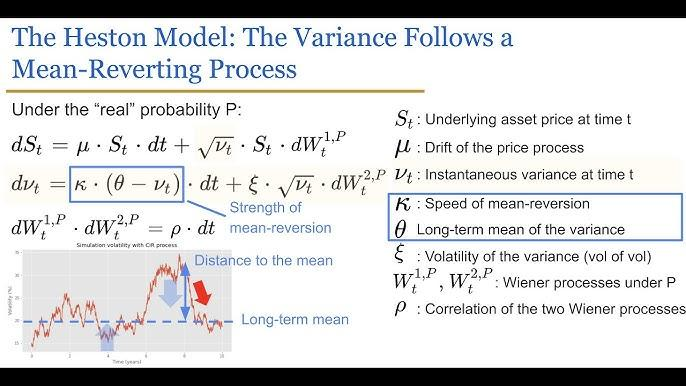

## Table of Contents

## What is the Heston Model?

The Heston Model is a way to understand how the prices of financial things, like stocks, can change over time. It was made by a person named Steven Heston. This model is special because it thinks that how much the price can move around (called volatility) can also change. In other models, they might say the price can move around a lot or a little, but they don't change that. The Heston Model says that this moving around can get bigger or smaller, which is more like what happens in real life.

In the Heston Model, there are a few important ideas. One is the price of the stock, which can go up or down. Another is the volatility, which can also go up or down. The model uses math to show how these two things work together. It's used by people who want to guess what might happen to the price of stocks or other financial things. This can help them make better choices about buying or selling. The Heston Model is more complicated than some other models, but it can give a better picture of what might happen in the future.

## Who developed the Heston Model and when was it introduced?

The Heston Model was developed by Steven Heston. He is a person who studies how money and financial things work. Steven Heston made this model to help people understand how the prices of things like stocks can change over time.

The Heston Model was introduced in 1993. This was when Steven Heston shared his ideas with others. The model is special because it thinks that how much the price can move around can also change, which is different from other models at the time.

## What are the key components of the Heston Model?

The Heston Model has two main parts that it focuses on: the price of the stock and the volatility, which is how much the price can move around. The model says that both the price and the volatility can change over time. This is different from other models that might say the volatility stays the same. In the Heston Model, the price of the stock can go up or down, and the volatility can also go up or down. This makes the model more like what happens in real life, where the amount that prices can move around can change.

The Heston Model uses math to show how the price and the volatility work together. There are some special numbers in the model that help it work. These numbers include things like the starting price of the stock, the starting volatility, how fast the volatility can change, and how much the price and volatility are connected. By using these numbers, the model can guess how the price of a stock might change in the future. This can help people make better choices about buying or selling stocks.

## How does the Heston Model differ from the Black-Scholes Model?

The Heston Model and the Black-Scholes Model are both used to guess how the prices of financial things, like stocks, might change. The big difference is in how they think about volatility, which is how much the price can move around. The Black-Scholes Model says that volatility stays the same all the time. This makes it simpler but not as close to what happens in real life. On the other hand, the Heston Model says that volatility can change over time. This makes the Heston Model more complicated but also more realistic because in real life, how much prices can move around can get bigger or smaller.

Another way the Heston Model and the Black-Scholes Model are different is in how they use math to show these ideas. The Black-Scholes Model uses a simpler set of math rules that work well when you assume that volatility stays the same. This makes it easier to use but less accurate in some situations. The Heston Model uses more complicated math that can handle the idea of changing volatility. This means it can give a better picture of how prices might change, but it also means it's harder to use and understand. People who need a more detailed and accurate guess about future prices often use the Heston Model, while those who want something simpler might use the Black-Scholes Model.

## What are the assumptions made in the Heston Model?

The Heston Model makes some guesses about how the world works to help it figure out how stock prices might change. One big guess is that the price of a stock and how much it can move around, called volatility, follow certain patterns. The model says that the price of the stock moves in a way that's a bit random but can be guessed at using math. It also says that the volatility can change over time, which is different from other models that say it stays the same. This means the Heston Model thinks the world is more complicated than some other models do.

Another guess the Heston Model makes is about how the price and the volatility are connected. It says that there's a link between them, but it's not too strong. This means that if the price goes up or down a lot, the volatility might change a bit, but not too much. The model also guesses that the changes in volatility happen in a way that can be guessed at using math, just like the changes in the price. These guesses help the Heston Model give a more detailed picture of how stock prices might change in the future, but they also make it more complicated to use.

## How is volatility modeled in the Heston Model?

In the Heston Model, volatility is not seen as a fixed number like in some other models. Instead, it is treated as something that can change over time. This means the model thinks that how much the price of a stock can move around can get bigger or smaller. The Heston Model uses a special kind of math called a stochastic process to show how volatility changes. This process says that volatility can go up or down in a way that can be guessed at using math rules.

The model uses some important numbers to help it understand how volatility works. One of these numbers is the starting level of volatility, which is how much the price can move around at the beginning. Another number is how fast the volatility can change, which tells the model how quickly the amount the price can move around might get bigger or smaller. There's also a number that shows how much the price of the stock and its volatility are connected. This connection means that if the price goes up or down a lot, the volatility might change a bit too. By using these numbers, the Heston Model can give a better picture of how stock prices might change in the future.

## What is the significance of the mean reversion parameter in the Heston Model?

The mean reversion parameter is a really important part of the Heston Model. It helps the model understand how volatility, which is how much the price of a stock can move around, changes over time. The mean reversion parameter says that volatility tends to go back to a normal level, even if it goes up or down a lot for a while. This is like how the weather might be really hot or cold for a few days, but it usually goes back to being normal after a while. The mean reversion parameter makes the Heston Model more like real life, where volatility doesn't just keep going up or down forever.

This parameter is used in the math of the Heston Model to show how quickly volatility goes back to its normal level. If the mean reversion parameter is a big number, it means that volatility goes back to normal really fast. If it's a small number, it means that it takes a long time for volatility to go back to normal. By changing this number, people who use the Heston Model can make it fit better with what they see happening in the real world. This helps them guess better about how stock prices might change in the future.

## Can you explain the mathematical formulation of the Heston Model?

The Heston Model uses math to show how the price of a stock and its volatility, or how much the price can move around, change over time. The model says that the price of the stock follows a random walk, which means it can go up or down in a way that's a bit unpredictable. But, this random walk is guided by some math rules. The main rule is called a stochastic differential equation, which is a fancy way of saying that the price changes in a way that can be guessed at using math. The model also says that the volatility can change over time, and it follows its own stochastic differential equation. This means that the amount the price can move around can get bigger or smaller in a way that can also be guessed at using math.

There are some important numbers in the Heston Model that help it work. One is the starting price of the stock, which is how much it costs at the beginning. Another is the starting volatility, which is how much the price can move around at the start. There's also a number called the mean reversion parameter, which shows how fast the volatility goes back to a normal level. Another important number is the volatility of volatility, which shows how quickly the volatility itself can change. And there's a number that shows how much the price of the stock and its volatility are connected. By using these numbers in the math rules, the Heston Model can give a good guess about how the price of a stock might change in the future.

## How is the Heston Model used in pricing options?

The Heston Model helps people figure out how much options should cost. An option is a kind of deal where you can buy or sell a stock at a certain price in the future. The Heston Model is good for this because it thinks that how much the price of the stock can move around, called volatility, can change over time. This is more like real life than other models that say volatility stays the same. By using the Heston Model, people can make a better guess about how the price of the stock might change, which helps them decide how much to pay for the option.

The Heston Model uses math to show how the price of the stock and its volatility work together. It has some important numbers that help it work, like the starting price of the stock, the starting volatility, and how fast the volatility goes back to a normal level. By putting these numbers into the math rules of the Heston Model, people can figure out the price of an option. This can help them make smarter choices about buying or selling options, because they have a better idea of what might happen to the price of the stock in the future.

## What are the advantages of using the Heston Model over simpler models?

The Heston Model has some big advantages over simpler models like the Black-Scholes Model. One big advantage is that it thinks the amount the price of a stock can move around, called volatility, can change over time. In real life, how much prices can move around does change, so the Heston Model gives a better picture of what might happen. This can help people make better guesses about the future prices of stocks and other financial things. Simpler models say that volatility stays the same, which is not as close to real life.

Another advantage of the Heston Model is that it can help people figure out how much options should cost more accurately. Options are deals where you can buy or sell a stock at a certain price in the future. Because the Heston Model thinks that volatility can change, it can give a better guess about how the price of the stock might change. This helps people decide how much to pay for an option. Simpler models might not give as good a guess because they don't think about changing volatility.

## What are the limitations and challenges of implementing the Heston Model?

The Heston Model is more complicated than simpler models like the Black-Scholes Model, and this can make it hard to use. One big challenge is that it needs a lot of math to work right. You have to know about things like stochastic differential equations, which can be hard to understand. Also, the model needs a lot of numbers to be set right, like the starting price of the stock and how fast the volatility can change. If these numbers are not set right, the model might not give good guesses about future prices. This means that people who use the Heston Model need to be really careful and know a lot about how it works.

Another limitation of the Heston Model is that it makes some guesses about the world that might not always be true. For example, it says that the price of a stock and its volatility follow certain patterns, but in real life, these patterns might not always happen. The model also thinks that the changes in volatility happen in a way that can be guessed at using math, but real life can be more random. Because of these guesses, the Heston Model might not always give the best guesses about future prices. People who use it need to remember that it's just a model and that real life can be different.

## How can the Heston Model be calibrated and what methods are commonly used?

Calibrating the Heston Model means figuring out the right numbers to use in the model so it can give good guesses about future prices. People usually do this by looking at past prices of stocks and options and trying to find the numbers that make the model's guesses match what really happened. This can be hard because there are a lot of numbers to set right, like the starting price of the stock, the starting volatility, and how fast the volatility can change. People often use computers to help them find these numbers because it would take too long to do it by hand.

One common way to calibrate the Heston Model is by using a method called least squares optimization. This method tries to find the numbers that make the difference between the model's guesses and what really happened as small as possible. Another way is to use a method called maximum likelihood estimation, which tries to find the numbers that make the model's guesses most likely to be right. Both of these methods need a lot of math and computer power, but they can help people get the Heston Model working well.

## What is the Heston Model and how does it work?

The Heston model is a widely recognized mathematical model in financial mathematics designed to price options by incorporating stochastic volatility. This model, developed by Steven Heston in 1993, extends beyond the Black-Scholes model by addressing its key limitation—the assumption of constant volatility. In contrast, the Heston model allows volatility to evolve as a stochastic process, capturing a core aspect of real financial markets where volatility fluctuations are non-constant and unpredictable.

The foundational element of the Heston model is its ability to model volatility as a mean-reverting stochastic process. This is achieved by employing a set of stochastic differential equations (SDEs) to describe the dynamics of both the underlying asset's price and its variance. The primary equations associated with the Heston model are:

1. The SDE for the underlying asset price $S(t)$:
$$
   dS(t) = \mu S(t) dt + \sqrt{v(t)} S(t) dW_1(t)

$$
   Here, $\mu$ is the drift rate of the asset, $v(t)$ is the stochastic variance, and $dW_1(t)$ denotes a Wiener process (or Brownian motion).

2. The SDE for the stochastic variance $v(t)$:
$$
   dv(t) = \kappa(\theta - v(t))dt + \sigma \sqrt{v(t)} dW_2(t)

$$
   In this equation, $\kappa$ represents the rate of mean reversion, $\theta$ is the long-term average level of variance, $\sigma$ is the [volatility](/wiki/volatility-trading-strategies) of the volatility (often called the vol-vol), and $dW_2(t)$ is another Wiener process.

A crucial feature of the Heston model is that the two Wiener processes, $dW_1(t)$ and $dW_2(t)$, can be correlated. This correlation is described by the parameter $\rho$, capturing the correlation between the asset price and its volatility. This correlation is particularly useful for modeling the volatility smile observed in market data, where options with the same expiry but different strike prices have implied volatilities that form a curved, "smiling" shape.

The Heston model's assumptions and framework allow for a more nuanced understanding of market conditions, capturing both observed price dynamics and the term structure of volatility. The model assumes that volatility reverts to a long-term average over time, which is more in line with historical observations in financial markets. This mean-reverting feature adds realistic dynamics to option pricing and is one of the aspects that differentiate the Heston approach from traditional constant volatility models like Black-Scholes.

While the Heston model provides a robust framework for option pricing, practical implementation requires solving the associated differential equations, which generally do not yield closed-form solutions for arbitrary boundary conditions. As a result, numerical methods, such as finite difference methods or Monte Carlo simulations, are often employed to approximate option prices under the Heston framework.

In summary, the Heston model integrates stochastic processes for both asset prices and volatility, enhancing the realism and accuracy of option pricing compared to models assuming constant volatility. By incorporating features like stochastic volatility and the possibility of correlation between asset returns and volatility changes, the Heston model aligns more closely with empirical market observations, including phenomena such as volatility clustering and the volatility smile.

## How can the Heston Model be implemented in Algorithmic Trading?

Algorithmic trading utilizes sophisticated financial models to make data-driven decisions and execute trades with precision. The Heston model, with its capacity to incorporate stochastic volatility, provides a valuable framework in this context. Its implementation in algorithmic trading systems often employs Python, a popular language due to its extensive libraries and ease of manipulation for mathematical computations.

To implement the Heston model in Python, one must first set up the model's stochastic differential equations. The volatility in the Heston model is described by the following equations:

1. **Stochastic volatility equation**:
$$
   dV_t = \kappa (\theta - V_t) dt + \xi \sqrt{V_t} dW_t^1

$$

2. **Stock price process**:
$$
   dS_t = \mu S_t dt + \sqrt{V_t} S_t dW_t^2

$$

where:
- $V_t$ represents the variance at time $t$,
- $\kappa$ is the rate of reversion to the mean,
- $\theta$ is the long-term variance,
- $\xi$ is the volatility of volatility,
- $W_t^1$ and $W_t^2$ are Wiener processes with a correlation $\rho$,
- $S_t$ is the asset price,
- $\mu$ is the drift rate.

A common approach to implementing the Heston model involves numerical methods due to the complexity of its stochastic differential equations. Monte Carlo simulations provide a practical method for numerical integration, allowing for the generation of asset paths under stochastic volatility.

### Python Implementation Example

The following Python code outlines a basic Monte Carlo simulation for pricing options using the Heston model:

```python
import numpy as np

def heston_mc(S0, K, T, r, kappa, theta, xi, rho, V0, num_simulations, num_steps):
    dt = T / num_steps
    prices = np.zeros(num_simulations)

    for i in range(num_simulations):
        S = S0
        V = V0
        for _ in range(num_steps):
            z1, z2 = np.random.normal(size=2)
            dw1 = np.sqrt(dt) * z1
            dw2 = rho * dw1 + np.sqrt(1 - rho ** 2) * np.sqrt(dt) * z2

            V = abs(V + kappa * (theta - V) * dt + xi * np.sqrt(V) * dw1)
            S = S + r * S * dt + np.sqrt(V) * S * dw2

        prices[i] = max(S - K, 0)

    option_price = np.exp(-r * T) * np.mean(prices)
    return option_price

# Example parameters for testing
S0 = 100  # Initial stock price
K = 100   # Strike price
T = 1     # Time to maturity in years
r = 0.05  # Risk-free rate
kappa = 2
theta = 0.02
xi = 0.1
rho = -0.7
V0 = 0.02
num_simulations = 10000
num_steps = 100

price = heston_mc(S0, K, T, r, kappa, theta, xi, rho, V0, num_simulations, num_steps)
print(f"Option Price: {price}")
```

### Integration into Trading Strategies

The results from the Heston model can be integrated into broader trading strategies by utilizing its outputs for risk assessment and volatility forecasting. Algorithmic traders can calibrate the model's parameters using historical data, adapting their strategies based on the implied volatility surfaces derived from the Heston framework.

By analyzing discrepancies between market prices and Heston model outputs, traders identify potential [arbitrage](/wiki/arbitrage) opportunities. Additionally, the model’s outputs aid in constructing hedging strategies that account for predictive volatility adjustments more accurately than simpler models like Black-Scholes.

In conclusion, the Heston model's application in algorithmic trading provides a nuanced perspective on price movements and volatility, enhancing decision-making processes and trading strategy optimization. Its practical implementation through Python demonstrates the model's accessibility and efficacy in real-world finance scenarios.

## How do the Heston and Black-Scholes models compare?

The Black-Scholes model, introduced in 1973 by Fischer Black and Myron Scholes, revolutionized the options pricing framework by establishing a closed-form solution for European-style options. Its core assumption is that volatility remains constant over the life of the option. This simplification affords computational efficiency and ease of use, which have contributed to its broad adoption in financial markets. However, it has been criticized for its inability to capture the volatility smile—a pattern where implied volatility varies with strike prices and expiration times, often observed in real-world options markets.

The Heston model, developed by Steven Heston in 1993, extends the Black-Scholes approach by incorporating stochastic volatility. Unlike the Black-Scholes model, the Heston model assumes that volatility evolves as a stochastic process, specifically a mean-reverting square root process. This results in a more flexible structure capable of modeling the empirical observations of financial markets, such as the volatility smile and clustering.

**Mathematical Formulations:**

In the Black-Scholes model, the evolution of the asset price $S_t$ is described by the geometric Brownian motion:

$$

dS_t = \mu S_t dt + \sigma S_t dW_t 
$$

where:
- $\mu$ is the drift rate,
- $\sigma$ is the constant volatility,
- $dW_t$ is a Wiener process.

The Heston model modifies this by assuming stochastic volatility $v_t$ which follows a separate process:

$$

dS_t = \mu S_t dt + \sqrt{v_t} S_t dW_{1,t} 
$$
$$

dv_t = \kappa(\theta - v_t) dt + \xi \sqrt{v_t} dW_{2,t} 
$$

where:
- $\kappa$ is the mean reversion rate of volatility,
- $\theta$ is the long-term average volatility,
- $\xi$ is the volatility of volatility,
- $dW_{1,t}$ and $dW_{2,t}$ are two correlated Wiener processes with correlation coefficient $\rho$.

**Applications and Usage:**

The primary application of the Black-Scholes model lies in its simplicity and analytical tractability, making it useful for quick computations and a baseline for pricing European options. On the other hand, the Heston model, with its ability to account for stochastic volatility, is better suited for more complex financial instruments and scenarios where the market exhibits considerable volatility.

**Benefits and Limitations:**

The Black-Scholes model is straightforward to implement due to its closed-form solution and relatively few parameters. However, its assumption of constant volatility can lead to inaccurate pricing under market conditions that deviate from this ideal.

Conversely, the Heston model offers greater accuracy by allowing volatility to change over time. This flexibility enables it to better fit market data, especially when dealing with options that exhibit a pronounced volatility smile. Nevertheless, the complexity of the Heston model brings practical challenges. It requires numerical methods for option pricing, such as Monte Carlo simulations or finite difference methods, which can be computationally intensive. Moreover, accurately estimating the model's parameters, such as the mean reversion rate and volatility of volatility, requires sophisticated techniques and high-quality market data.

In summary, while the Black-Scholes model provides a foundational and efficient tool for options pricing, the Heston model's incorporation of stochastic volatility makes it a more encompassing choice for capturing real-world market anomalies and dynamics. Each model's usefulness is context-dependent, with the Black-Scholes model serving as a practical tool for straightforward scenarios and the Heston model offering enhanced precision for complex market conditions.

## What are the benefits and limitations of the Heston Model?

The Heston model provides several distinct advantages and drawbacks in the field of options pricing and algorithmic trading, which are critical for traders and analysts to consider.

**Advantages**

One of the primary advantages of the Heston model is its ability to incorporate stochastic volatility, which reflects the actual market conditions more accurately than models assuming constant volatility. This feature enables it to capture the volatility smile—a pattern observed in the implied volatilities of options across different strike prices and maturities. The model defines the process of the stochastic volatility $v_t$ as:

$$

dv_t = \kappa(\theta - v_t)dt + \sigma\sqrt{v_t}dW_t^2 
$$

Where $\kappa$ is the mean-reversion rate, $\theta$ is the long-term average volatility, and $\sigma$ is the volatility of volatility. This formulation allows volatility to revert to a long-term mean, providing a more realistic depiction of the financial markets' dynamics.

Additionally, the Heston model is adept at managing the risk of option portfolios through its more flexible framework, which accounts for the correlation between the asset price and its volatility.

**Limitations**

Despite its advantages, the Heston model also poses significant challenges. Its complexity is one of the most notable drawbacks. Implementing and calibrating the model requires advanced mathematical and computational skills due to the nature of its stochastic differential equations.

Accurate parameter calibration is another limitation. The model's efficacy heavily relies on the precise estimation of its parameters: the mean reversion rate ($\kappa$), long-term volatility level ($\theta$), volatility of volatility ($\sigma$), and the correlation between asset price and volatility. If these parameters are not accurately calibrated, the model can lead to significant pricing errors, reducing its practicality in fast-paced trading environments.

Moreover, the computational intensity required for the model's simulation can be prohibitive, especially for high-frequency trading applications where speed is paramount.

**Scenarios of Effectiveness and Shortcomings**

The Heston model excels in markets where capturing a volatility smile is crucial for accurate pricing and risk management. It is particularly effective for long-dated options where the assumption of constant volatility is inadequate due to changing market conditions over the option's lifespan.

However, for simpler trading strategies or environments that prioritize execution speed over precision, the Heston model's complexity and resource demands may outweigh its benefits. In such cases, traders might opt for more straightforward models like Black-Scholes, despite its limitations in capturing stochastic volatility.

In conclusion, while the Heston model offers enhanced accuracy in options pricing, its implementation requires careful consideration of its complexities and limitations. Understanding these factors is essential for traders looking to leverage its capabilities effectively.

## What are the extensions and innovations in the Heston Model?

The Heston model has been a cornerstone in options pricing due to its ability to model stochastic volatility. Despite its success, further advancements have been introduced to address certain limitations and enhance the model's flexibility, making it more robust for modern trading environments. These extensions aim to account for more complex market phenomena and improve the accuracy of financial derivatives pricing.

One significant extension is the incorporation of stochastic interest rates into the Heston model. The standard Heston model assumes a constant risk-free [interest rate](/wiki/interest-rate-trading-strategies), which may not always reflect real market conditions where interest rates can fluctuate. By integrating stochastic interest rates, the model can capture the impact of interest rate risk better, thereby providing more precise option pricing. This modification is particularly useful for pricing long-term options where interest rate variability has a more pronounced effect.

Another notable innovation is the introduction of jump diffusion processes. The original Heston model assumes continuous paths for asset prices and volatility. In reality, markets can experience sudden jumps due to unexpected news or events. Incorporating jump diffusion into the Heston framework allows the model to account for these sudden price changes, thereby offering a more accurate reflection of market dynamics. The asset price process in this extended model can be described by the equation:

$$

dS_t = \mu S_t dt + \sqrt{V_t} S_t dW_t^S + J_t S_t dN_t 
$$

where $J_t$ represents the jump size and $N_t$ is a Poisson process representing the occurrence of jumps.

Furthermore, certain extensions aim to capture skewness and kurtosis in the asset return distribution, which the traditional Heston model might struggle with. Hybrid models that combine stochastic volatility and price jumps, or utilize more sophisticated stochastic processes for volatility itself, further refine the model's capability to mirror real-world financial phenomena.

These extensions do not come without challenges; they introduce additional parameters requiring careful estimation and calibration. Implementing these enhanced models in algorithmic trading systems necessitates computational efficiency and accuracy, often involving numerical techniques like Fourier transform methods or Monte Carlo simulations.

In summary, the extensions to the Heston model, such as stochastic interest rates and jump diffusion, significantly enhance its robustness and applicability. These innovations enable more precise modeling of intricate market behaviors, making them invaluable tools for traders seeking to optimize their strategies in increasingly complex financial markets.

## What is the conclusion?

The Heston model occupies a critical role in the arsenal of quantitative traders, offering enhanced precision in options pricing due to its ability to incorporate stochastic volatility. This feature notably addresses the limitations observed in traditional models, such as the Black-Scholes model, by allowing for a more realistic depiction of market volatility, which often does not remain constant.

With its foundation in advanced mathematical equations, including partial differential equations that govern the stochastic processes of asset prices and volatilities, the Heston model provides a more detailed risk landscape. These equations allow traders to account for the mean-reverting behavior of volatility and the volatility smile, phenomena frequently observed in markets that simpler models fail to capture effectively.

$$

dS_t = \mu S_t dt + \sqrt{v_t} S_t dW_{1,t} 
$$

$$

dv_t = \kappa(\theta - v_t)dt + \sigma \sqrt{v_t} dW_{2,t} 
$$

where $S_t$ is the asset price, $\mu$ is the drift term, $v_t$ is the variance, $\kappa$ is the rate of mean reversion, $\theta$ is the long-term variance, $\sigma$ is the volatility of volatility, and $W_{1,t}$ and $W_{2,t}$ are two Brownian motions with correlation $\rho$.

Despite its complexities, the Heston model provides quantitative traders and financial analysts with a more comprehensive framework for managing and assessing trading risks. Its ability to accurately capture market behaviors leads to more informed decision-making processes and the potential for enhanced financial outcomes. Moreover, the model's adaptability allows for integration with algorithmic trading platforms, particularly through programming languages such as Python, thereby facilitating automated, data-driven trading strategies that leverage its predictive capabilities.

Understanding and applying the Heston model's methodologies can significantly benefit traders, capturing the dynamic intricacies of financial markets and providing a competitive edge in developing robust trading strategies.

## References & Further Reading

[1]: Heston, S. L. (1993). ["A Closed-Form Solution for Options with Stochastic Volatility with Applications to Bond and Currency Options."](https://www.jstor.org/stable/2962057) The Review of Financial Studies, 6(2), 327-343.

[2]: Gatheral, J. (2006). ["The Volatility Surface: A Practitioner's Guide."](https://www.wiley.com/en-us/The+Volatility+Surface%3A+A+Practitioner%27s+Guide-p-9780471792512) Wiley.

[3]: Wilmott, P. (2006). ["Paul Wilmott Introduces Quantitative Finance."](https://www.wiley.com/en-us/Paul+Wilmott+Introduces+Quantitative+Finance,+2nd+Edition-p-9781118836798) Wiley.

[4]: Jäckel, P. (2002). ["Monte Carlo Methods in Finance."](https://www.wiley.com/en-us/Monte+Carlo+Methods+in+Finance-p-9780471497417) Wiley.

[5]: Hull, J. C. (2018). ["Options, Futures, and Other Derivatives."](https://www.semanticscholar.org/paper/Options%2C-Futures%2C-and-Other-Derivatives-Hull/89bdee500c8623864fc9eb7a471546aa713acc44) Pearson.