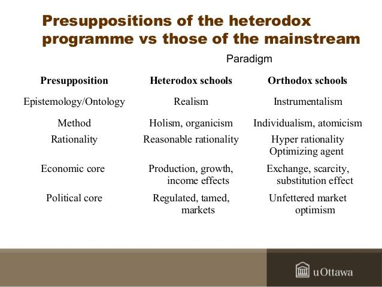

In the ever-evolving world of economics, diverse theories compete to explain the complexities of economic systems. The study of economics involves understanding how societies allocate limited resources and address issues such as production, distribution, and consumption of goods and services. Mainstream economic thought is often characterized by established theories and models that prioritize efficiency, predictability, and equilibrium. These orthodox theories, predominantly Keynesian and neoclassical, provide a framework for analyzing market behavior and guiding policy decisions.

Contrasting sharply with orthodox economics is heterodox economics, which encompasses a range of alternative theories and methodologies. This branch questions the foundational assumptions of mainstream economics, such as rational behavior and market efficiency, advocating for a broader view that incorporates interdisciplinary approaches and diverse perspectives.



The juxtaposition of orthodox and heterodox economics is particularly relevant in the context of modern economic applications, such as algorithmic trading. With the rise of advanced technologies and big data analytics, financial markets are becoming increasingly sophisticated. Algorithmic trading serves as a prime example of how economic theories—in both traditional and alternative forms—are employed to develop strategies that maximize financial returns. By incorporating insights from behavioral economics, a heterodox approach that analyzes the effects of psychological factors on economic decisions, algorithmic trading algorithms can account for market anomalies and cognitive biases.

This article explores the dichotomy between these two schools of thought, illuminating the valuable contributions each has made to economic discourse and practice. As economic systems grow more complex, embracing a variety of economic perspectives becomes crucial in addressing the multifaceted challenges facing contemporary markets.

## Table of Contents

## What Is Heterodox Economics?

Heterodox economics encompasses a range of economic theories and methodologies that deviate from the predominantly accepted Keynesian and neoclassical economics. Unlike the mainstream approach, which often emphasizes equilibrium, mathematical modeling, and supply-demand mechanics in market analysis, heterodox economics seeks to offer alternative interpretations and frameworks that account for aspects of reality that the traditional paradigms might overlook.

One primary attribute of heterodox economics is its pluralistic approach, incorporating insights from various schools of thought, each with distinct paradigms and methodologies. The following are some prominent heterodox schools:

1. **Marxian Economics**: Rooted in the works of Karl Marx, this school critiques capitalism by highlighting class relations, exploitation, and the dynamics of capital accumulation. Marxian economics argues that economic value is fundamentally linked to labor and examines how wealth and power dynamics shape societal structures.

2. **Post-Keynesian Economics**: Emerging as a critique of classical Keynesianism, Post-Keynesianism emphasizes uncertainty, the endogenous nature of money, and the impact of historical time on economic processes. It challenges the classical assumptions of rational expectations and universal market efficiency, focusing instead on the real-world implications of finance and production.

3. **Austrian Economics**: This school, drawing on the works of economists like Ludwig von Mises and Friedrich Hayek, focuses on the spontaneity of market order and the importance of individual choice and subjective value. Austrian economics critiques centralized planning and emphasizes the role of entrepreneurial discovery and time preference in economic expansion.

4. **Ecological Economics**: This approach challenges the traditional emphasis on unlimited economic growth by integrating ecological and environmental constraints into economic analysis. It seeks sustainability by considering the interdependence of ecological systems and economic structures, advocating for policies that balance these subsystems to ensure long-term viability.

Heterodox economics does not discount the utility of methodological rigor or data-driven analysis; rather, it often employs interdisciplinary approaches, drawing from sociology, political science, and ecological studies. These diverse perspectives aim to probe broader socio-economic issues such as social justice, economic stability, and environmental sustainability, often underrepresented in orthodox theory.

Through its multifaceted perspectives, heterodox economics contributes significantly to the understanding of complex economic phenomena, providing a broader analytic toolkit to explore alternative economic models beyond the limits of established frameworks.

## Understanding Orthodox Economics

Orthodox economics is characterized by its reliance on well-established frameworks, notably Keynesian and neoclassical economics, which emphasize mathematical modeling and equilibrium-based analysis. These frameworks fundamentally aim to enhance the understanding of economic systems through the lens of efficiency and predictability.

Keynesian economics, developed by John Maynard Keynes, focuses on aggregate demand as the primary driver of economic growth and stability. It argues that government intervention is essential to manage economic cycles and mitigate the effects of recessions. The concept of equilibrium in Keynesian economics is particularly concerned with achieving full employment through the adjustment of fiscal and monetary policies. Mathematical models are employed to simulate the effects of policy changes on various macroeconomic variables, such as GDP, unemployment, and inflation.

Neoclassical economics, on the other hand, builds upon the notion of individual rationality and market efficiency. It uses mathematical models to analyze how individuals make decisions based on utility maximization and how firms operate under profit maximization. The concept of general equilibrium is central to neoclassical economics, providing a framework to understand how supply and demand within an economy are balanced. The famous supply and demand model, represented by the equations:

$$
Q_d = a - bP
$$
$$
Q_s = c + dP
$$

where $Q_d$ and $Q_s$ represent quantity demanded and supplied, respectively, $P$ is the price level, and $a, b, c,$ and $d$ are constants, highlights the interaction between consumers and producers in reaching an equilibrium price.

These orthodox economic theories serve as the backbone for formulating policy decisions, primarily due to their focus on predictability and comprehensiveness. Government bodies and financial institutions worldwide utilize these models to forecast economic conditions and design policies intended to stabilize and stimulate economic activity. Given their quantitative nature, these theories provide a structured and rigorous means of evaluating economic scenarios, contributing to a more systematic approach to policy-making. 

Overall, the mathematical precision and theoretical robustness of orthodox economics make it a crucial tool for economists and policymakers seeking to navigate the complexities of modern economies.

## Key Differences Between Heterodox and Orthodox Economics

Heterodox and orthodox economics represent two contrasting approaches to understanding economic phenomena. Heterodox economists often critique orthodox economics for adopting a reductionist approach, which simplifies the complexities of social systems into mathematical models that focus primarily on equilibrium and rational behavior. Orthodox economics typically emphasizes individual decision-making based on the assumption of rational actors and market efficiency. This approach often uses quantitative techniques, leaning heavily on mathematical models to predict economic trends and policy outcomes.

In contrast, heterodox economics encompasses a broader spectrum of theories that question the foundational assumptions of orthodox economics. It seeks to incorporate interdisciplinary methods, drawing insights from sociology, psychology, and history, to better account for the multifaceted nature of economic interactions. Unlike the neoclassical focus on equilibrium states, heterodox economics often prioritizes the understanding of dynamic processes and change over time. For example, Marxian economics focuses on class struggle and historical change, while ecological economics addresses the interconnectedness of economic and ecological systems.

One of the key differences is the perspective on human behavior. Orthodox economics often relies on the assumption of Homo economicus, a rational and self-interested agent, as the foundation for economic models. This assumption is frequently challenged by heterodox economists who argue that real-world decisions are influenced by a variety of factors, including social norms, cultural influences, and psychological biases. Behavioral economics, a branch of heterodox economics, has highlighted how cognitive biases and emotional factors can lead to decisions that deviate from the predictions of rational choice models.

Furthermore, heterodox economics challenges the market-centric view prevalent in orthodox theories. While orthodox economics often asserts that markets are efficient systems for allocating resources, heterodox schools like institutional economics or feminist economics point to the impact of power dynamics, gender relations, and institutional structures in shaping economic outcomes. They argue that these factors can lead to market failures, inequalities, and societal injustices that are not addressed adequately by a purely market-based explanation.

This interdisciplinary approach allows heterodox economics to provide alternative explanations for economic issues, offering insights that may be ignored by traditional models. For instance, the 2008 financial crisis exposed some of the limitations of orthodox economic models in predicting market behavior, leading to increased interest in heterodox approaches that emphasize systemic risk and the unpredictability of markets. Overall, the key differences between heterodox and orthodox economics lie in their methodological approaches, assumptions about human behavior, and interpretations of market efficiency, all of which contribute to a richer understanding of economic systems.

## Influence of Heterodox Economics on Policy and Thought

Heterodox economics, despite its position outside the mainstream, has played a pivotal role in shaping modern economic thought and policy by questioning and broadening the traditional frameworks of economic analysis. This influence is particularly evident in the development of behavioral and complexity economics, fields that incorporate insights from psychology and complex systems theory into economic understanding.

Behavioral economics, one branch of heterodox economics, challenges the classical assumption of fully rational [agents](/wiki/agents). By introducing concepts such as cognitive biases, bounded rationality, and heuristics, it provides a more nuanced understanding of decision-making processes. Pioneers like Daniel Kahneman and Amos Tversky have demonstrated through empirical research that human behavior often deviates from the predictions of conventional models. This has profound implications for economic theory and policy, prompting reforms in areas such as consumer protection and financial regulation to better account for human behavior.

Complexity economics offers another critical perspective by moving beyond the linear and equilibrium-focused view of traditional economics. It explores how economic phenomena emerge from interactions among heterogeneous agents, modeled using nonlinear dynamics and network theory. This approach acknowledges that economies are dynamic and adaptive systems characterized by constant evolution and innovation. The Santa Fe Institute has been instrumental in developing this field, emphasizing models based on agent-based simulations to understand phenomena such as market crashes and economic growth.

Heterodox approaches have also permeated policy-making circles. The financial crisis of 2007-2008 highlighted the limitations of conventional economic models in predicting and mitigating systemic risks. As a result, there has been increased interest in integrating insights from heterodox perspectives to enhance the robustness of economic policies. Concepts from behavioral economics now influence regulatory frameworks, encouraging financial institutions to design products that align better with consumers' actual behaviors.

Moreover, heterodox economics contributes to the discourse on sustainable development by addressing limitations in traditional metrics such as Gross Domestic Product (GDP). Ecological and feminist economics, for instance, critique GDP's failure to account for environmental degradation and unpaid labor, respectively. These schools advocate for alternative indicators that provide a more comprehensive picture of societal well-being.

In summary, heterodox economics has significantly impacted economic thought by challenging traditional assumptions and offering alternative frameworks that incorporate psychological and systemic complexities. Its integration into policy-making enhances our capacity to address the multifaceted challenges of contemporary economic life.

## Application of Economic Theories in Algorithmic Trading

Algorithmic trading, a sophisticated method of executing orders using pre-programmed trading instructions, relies heavily on both orthodox and heterodox economic models to develop effective trading strategies. Traditionally rooted in orthodox economic principles such as efficient market hypothesis and rational expectations, [algorithmic trading](/wiki/algorithmic-trading) has expanded to incorporate insights from heterodox approaches, particularly behavioral economics, to address market complexities and psychological factors influencing trading behavior.

Behavioral economics, challenging the classical notion of fully rational agents, highlights cognitive biases and emotional influences affecting decision-making processes. This heterodox branch has become crucial in refining algorithms to predict and counteract irrational market movements. For instance, algorithms may integrate components that account for commonly observed biases like anchoring, overconfidence, and herd behavior, which can impact financial markets.

To model such behavior, consider an algorithm defined as:

```python
import numpy as np

def trading_signal(market_data):
    prices = market_data['prices']
    moving_average = np.mean(prices[-5:])
    volatility = np.std(prices[-5:])

    # Behavioral component: Adjust for overconfidence bias
    adjustment_factor = 0.95

    signal_strength = (prices[-1] - moving_average) * adjustment_factor / volatility

    if signal_strength > 1:
        return "buy"
    elif signal_strength < -1:
        return "sell"
    else:
        return "hold"

# Example usage
market_data = {'prices': [100, 102, 101, 103, 104, 105]}
strategy = trading_signal(market_data)
print(strategy)
```

In this Python snippet, the `trading_signal` function calculates a trading signal by evaluating recent price movements against a moving average, adjusting for overconfidence bias using an `adjustment_factor`. This behavioral adjustment reflects traders’ tendency to overweight recent successes.

Additionally, the complexity of algorithmic trading benefits from insights in complexity economics, another heterodox approach. Complexity economics considers the economy as a dynamic system subject to volatile nonlinear interactions, challenging linear equilibrium assumptions prevalent in orthodox theories. Models in algorithmic trading that recognize non-equilibrium conditions capture the intricacies of financial markets more effectively, especially during periods of high [volatility](/wiki/volatility-trading-strategies) and market shocks.

Stochastic differential equations and agent-based modeling are examples of quant methods used to encapsulate such complexities in algorithms, thereby enhancing the adaptability and resilience of trading strategies. By merging the accurate, data-driven methods of orthodox models with the nuanced, human-focused perspectives of heterodox economics, algorithmic trading develops into a robust platform capable of navigating both the predictability and unpredictability inherent in modern financial markets.

## Conclusion

Heterodox economics plays an indispensable role in enriching the foundational perspectives provided by orthodox approaches. By incorporating diverse methodologies and challenging ingrained assumptions, heterodox theories enable a more comprehensive understanding of economic phenomena. This multifaceted perspective is essential for analyzing the complexities of increasingly globalized and interconnected economic systems.

With the ongoing technological advancements, particularly in areas like algorithmic trading, the fusion of various economic theories has become increasingly crucial. While orthodox economics offers essential insights into market dynamics through principles of efficiency and predictability, heterodox economics brings to light the influences of human behavior and social factors that may deviate from traditional models. Such integration is pivotal in designing algorithms that are not only robust but also adaptive to the ever-changing market conditions characterized by uncertainty and volatility.

Algorithmic trading, relying heavily on rapid data processing and pattern recognition, benefits significantly from the inputs of heterodox economics, particularly from subfields like behavioral economics. By addressing cognitive biases and irrational behaviors, these algorithms enhance their predictive capabilities, leading to more effective trading strategies. The interplay between orthodox and heterodox economics, therefore, is not merely academic but has tangible impacts on modern economic practices.

As markets continue to evolve, the necessity for integrating diverse economic theories will only grow. These theories provide the tools needed to address the unpredictability inherent in economic systems and to develop solutions that align with the complex realities of present-day markets. Embracing this integration is not just beneficial but essential for navigating the economic challenges of the future.

## References & Further Reading

[1]: Colander, D., Holt, R. P. F., & Rosser, J. B. (2004). ["The Changing Face of Economics: Conversations with Cutting Edge Economists"](https://www.semanticscholar.org/paper/The-changing-face-of-mainstream-economics-Colander-Holt/8323ce62ec6ad6b0fae23325289954c63424c561). University of Michigan Press.

[2]: Kahneman, D. (2011). ["Thinking, Fast and Slow"](https://psycnet.apa.org/record/2011-26535-000). Farrar, Straus and Giroux.

[3]: Keen, S. (2013). ["Debunking Economics: The Naked Emperor Dethroned?"](https://www.amazon.com/Debunking-Economics-Revised-Expanded-Dethroned/dp/1848139926). Zed Books.

[4]: Minsky, H. P. (2008). ["Stabilizing an Unstable Economy"](https://archive.org/details/stabilizingunsta0000mins_d5y8). McGraw-Hill Education.

[5]: Shiller, R. J. (2015). ["Irrational Exuberance"](https://press.princeton.edu/books/paperback/9780691173122/irrational-exuberance). Princeton University Press.