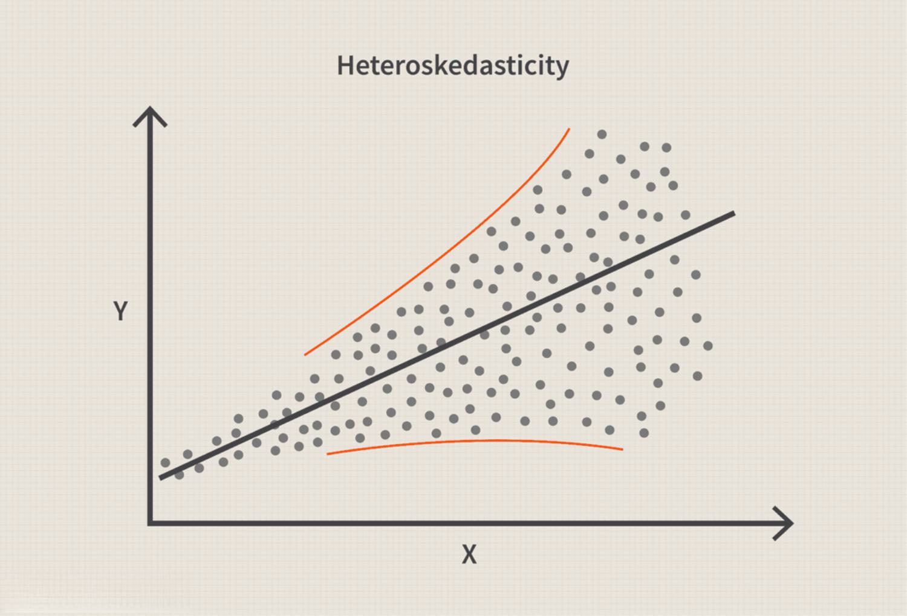

In the world of finance and data analysis, heteroscedasticity is a statistical concept that presents both challenges and opportunities, particularly in algorithmic trading. Heteroscedasticity occurs when the variability of a data set, specifically the error terms in regression models, is inconsistent across values. This violation of the homoscedasticity assumption can lead to inefficient estimates and invalid hypothesis tests if not properly addressed. In financial markets, this issue is particularly pronounced due to the complex nature of financial data, which often exhibits time-varying volatility and other irregular patterns.

Understanding and effectively managing heteroscedasticity is crucial for building accurate predictive models. In the context of algorithmic trading, these models are key to developing strategies that can forecast market movements and optimize trade execution. The presence of heteroscedastic errors can distort the accuracy of forecasts, thereby impacting decision-making and risk management processes. Thus, traders and data analysts must be equipped with the knowledge to identify and correct for heteroscedasticity in their models.



This article explores the fundamental aspects of heteroscedasticity, examining its various types, methods for detection, and its implications in algorithmic trading. By gaining insight into the impact of heteroscedasticity on model accuracy, this article aims to enhance your understanding and improve your decision-making capabilities in trading environments. Detecting and addressing heteroscedasticity can lead to more reliable regression analyses and better-informed trading decisions. By utilizing statistical techniques and adopting robust models, traders can mitigate the adverse effects of heteroscedasticity, enhancing the reliability of their trading strategies and potentially increasing profitability.

## Table of Contents

## Understanding Heteroscedasticity

Heteroscedasticity is defined as the circumstance where the variance of the error terms in a regression model is not constant across all levels of an independent variable. This variance instability is a frequent phenomenon observed in time series data and financial data analysis. In a typical regression analysis, one of the key assumptions is homoscedasticity, which requires that the variance of the errors be constant across observations. The breach of this assumption through the presence of heteroscedasticity can have adverse effects on the predictive accuracy and reliability of regression models.

The violation of homoscedasticity can lead to several statistical challenges. Primarily, it results in inefficient estimates of the coefficients obtained via Ordinary Least Squares (OLS) estimation, which relies on the assumption of constant variance to deliver the Best Linear Unbiased Estimates (BLUE). In the presence of heteroscedasticity, these estimates remain unbiased, but they are no longer efficient, meaning that the standard errors are incorrect and tend to mislead hypothesis testing. Consequently, tests such as t-tests and F-tests, which base their results on the accuracy of standard errors, become invalid, leading to unreliable inferences about the parameters.

From a mathematical perspective, if $\epsilon_i$ represents the error term for observation $i$, homoscedasticity implies that $\text{Var}(\epsilon_i) = \sigma^2$, constant for all $i$. Heteroscedasticity, however, means $\text{Var}(\epsilon_i) = \sigma_i^2$, where the variance is a function of the independent variables, which can be expressed as $\sigma_i^2 = f(x_i)$, indicating variability dependent on particular predictors $x_i$.

In Python, the detection and analysis of heteroscedasticity can be approached using various statistical libraries. As an example, one might use a residual plot to visually identify non-constant variance across predicted values or utilize statistical tests like the Breusch-Pagan test to quantitatively assess the presence of heteroscedasticity.

```python
# Example Python Code to Detect Heteroscedasticity using the Breusch-Pagan test
import statsmodels.api as sm
from statsmodels.compat import lzip
import statsmodels.stats.api as sms

# Assuming 'model' is a fitted OLS regression model
name = ['Lagrange multiplier statistic', 'p-value',
        'f-value', 'f p-value']
test = sms.het_breuschpagan(model.resid, model.model.exog)
lzip(name, test)
```

The code snippet above uses the `statsmodels` library to perform a Breusch-Pagan test, a common method for detecting heteroscedasticity in regression models. If heteroscedasticity is detected, further steps such as transforming variables or employing weighted regression techniques should be considered to improve model reliability and prediction accuracy.

## Types of Heteroscedasticity

Heteroscedasticity in statistical and financial models manifests in two primary forms: unconditional and conditional. Each type exhibits distinct characteristics and implications, which are crucial for accurate data analysis and model construction.

Unconditional heteroscedasticity is characterized by a predictable level of variability that does not depend on past data values or the history of the series. This type is often associated with cyclical data patterns, such as those arising from seasonal effects, where the variance changes at regular intervals. For instance, retail sales data might show increased variability around holidays or events. Unconditional heteroscedasticity can often be modeled or predicted by identifying these recurring patterns, allowing analysts to adjust their models accordingly.

On the other hand, conditional heteroscedasticity is the unpredictability found within datasets where variance is linked to information from past observations. This type is prevalent in financial data, where current [volatility](/wiki/volatility-trading-strategies) can be influenced by previous market behavior, leading to significant fluctuations in variance over time. The Autoregressive Conditional Heteroscedasticity (ARCH) model, introduced by Robert Engle, is a tool designed to capture this type of variability. The model comprises equations like residual errors squared as a function of past residuals:

$$
\sigma_t^2 = \alpha_0 + \alpha_1 \epsilon_{t-1}^2 + \alpha_2 \epsilon_{t-2}^2 + \cdots + \alpha_q \epsilon_{t-q}^2
$$

where $\sigma_t^2$ is the conditional variance at time $t$, $\alpha$ parameters represent the model coefficients, and $\epsilon$ indicates past residual errors.

Identifying whether heteroscedasticity in a dataset is unconditional or conditional is critical for selecting the appropriate model corrections. Misidentifying the type can lead to inefficient modeling and unreliable predictions. Methods such as statistical tests and visual inspection of variance patterns can assist in distinguishing between these two forms, guiding analysts in applying suitable adjustments, like transforming variables or employing advanced models like ARCH or its generalized form, GARCH. Addressing the correct type of heteroscedasticity ensures more robust regression analyses, particularly in financial modeling and [algorithmic trading](/wiki/algorithmic-trading) scenarios.

## Detecting Heteroscedasticity

Visual methods such as residual plots serve as initial indicators for detecting potential heteroscedasticity in regression models. A residual plot illustrates the errors between observed and predicted values. If the variance of residuals across values of the independent variable increases or decreases systematically, it suggests the presence of heteroscedasticity.

Quantitative assessment of heteroscedasticity involves statistical tests designed to evaluate the variability in error terms. The Breusch-Pagan test is frequently employed for this task. This test assesses whether the variance of error terms is dependent on one or more independent variables. The null hypothesis states that the variance is homoscedastic, and the test statistic is typically calculated using the formula:

$$
\chi^2 = n \cdot R^2
$$

where $n$ is the sample size and $R^2$ is the coefficient of determination of the regression of squared residuals on the independent variables.

Another important test is White's test. This test is an extension of the Breusch-Pagan test and does not rely on the assumption of normality. It examines whether the variance of errors is consistent across observations by accounting for nonlinear and interaction effects among the predictors. Like the Breusch-Pagan test, it uses the $\chi^2$ distribution for hypothesis testing.

The Goldfeld-Quandt test, used mainly for detecting heteroscedasticity in linear regression models, is applicable when the error variance increases or decreases with the order of observations. Typically, the dataset is split into two groups, and the error terms' variance is compared. A significant difference in variance between these groups signals heteroscedasticity.

These tests analyze variations and correlations in residual errors to confirm heteroscedasticity's presence conclusively. Employing these statistical tools alongside visual inspection enhances the accuracy of diagnostics, allowing more robust regression analyses in financial modeling and other applications.

## Addressing Heteroscedasticity

Addressing heteroscedasticity in regression models is crucial for ensuring accurate estimates and reliable hypothesis testing. One common approach to address this issue involves transforming the variables within the model. Log transformations, for example, are frequently employed to stabilize variance across observations. By applying a natural logarithm to the dependent or independent variables, large values become less influential, thereby mitigating heteroscedasticity.

Another effective method is the use of Weighted Least Squares (WLS). Traditional Ordinary Least Squares (OLS) assumes constant variance in the error terms, which is violated in the presence of heteroscedasticity. WLS, by contrast, assigns weights to each observation inversely related to their variance. This weighting compensates for the non-constant variance, leading to more efficient and unbiased parameter estimates. The weight for each observation $i$ in WLS is typically given by:

$$
w_i = \frac{1}{\hat{\sigma}_i^2}
$$

where $\hat{\sigma}_i^2$ is an estimate of the variance for observation $i$.

Moreover, robust standard errors provide a way to correct standard error estimates when heteroscedasticity is present, without altering the original model specification. These are also known as heteroscedasticity-consistent standard errors. Using robust standard errors allows for more reliable hypothesis testing and the construction of confidence intervals despite the presence of heteroscedasticity.

In practical terms, implementing these methods in Python might involve libraries like `statsmodels`, which offer functions such as `WLS` for weighted regression and options to calculate robust standard errors. An example code snippet for calculating robust standard errors in a simple linear regression could look like this:

```python
import statsmodels.api as sm

# Assuming `y` is the dependent variable and `X` is the matrix of independent variables
X = sm.add_constant(X) # Adds a constant term to the predictor matrix
model = sm.OLS(y, X).fit(cov_type='HC3') # HC3 is one of the types of robust standard errors

print(model.summary())
```

This code uses the `OLS` function to fit a linear regression model and specifies `cov_type='HC3'` to apply robust standard error adjustments.

## Heteroscedasticity in Algorithmic Trading

In algorithmic trading, managing heteroscedasticity in financial data is essential for generating precise predictive models. Variability in errors, when unaddressed, can undermine the effectiveness of trading algorithms that rely on accurate data interpretation. Two prominent methods for dealing with heteroscedasticity in finance are the Autoregressive Conditional Heteroskedasticity (ARCH) and Generalized Autoregressive Conditional Heteroskedasticity (GARCH) models.

ARCH and GARCH models provide a structured approach to model volatility, which is often heteroscedastic in financial time series data. These models assume that the variance of the current error term is a function of past error terms, effectively capturing the time-varying variance observed in financial markets. For instance, GARCH(1,1), a common specification, can be represented as:

$$
\sigma_t^2 = \alpha_0 + \alpha_1 \epsilon_{t-1}^2 + \beta_1 \sigma_{t-1}^2
$$

where $\sigma_t^2$ is the variance at time t, $\epsilon_{t-1}^2$ is the squared error term from the previous period, $\alpha_0$ is a constant, and $\alpha_1$ and $\beta_1$ are coefficients that weight the contributions of the previous error and variance, respectively. This formula captures the essence of volatility clustering, a common phenomenon in financial markets where high-volatility events tend to cluster together.

Understanding the impact of heteroscedasticity on volatility estimates is pivotal for effective risk management and formulating high-frequency trading strategies. High-frequency trading ([HFT](/wiki/high-frequency-trading-strategies)) relies on algorithms capable of processing and reacting to data at exceptionally high speeds, where accurate volatility forecasting can enhance decision-making. Mismeasurement of risk due to ignored heteroscedasticity can lead to suboptimal trading outcomes and unexpected financial losses.

Algorithmic traders employ these models to predict future volatility and adjust their strategies accordingly. Python libraries like `statsmodels` provide tools for implementing GARCH models, facilitating their integration into trading platforms:

```python
from arch import arch_model

# Simulated returns
returns = [0.01, -0.001, 0.02, -0.005, ...]

# Fit a GARCH(1,1) model
model = arch_model(returns, vol='Garch', p=1, q=1)
model_fit = model.fit()

# Forecast volatility
forecast = model_fit.forecast(horizon=5)
```

By incorporating models that effectively address heteroscedasticity, traders improve their capacity to anticipate and mitigate risks associated with volatile markets. This strategic advantage is crucial for maintaining competitiveness in the rapidly evolving financial landscape.

## Conclusion

Heteroscedasticity is a significant [factor](/wiki/factor-investing) in statistical and financial modeling, influencing the accuracy and reliability of predictive analyses. Its presence in data sets, particularly through non-constant variance in error terms, requires dedicated attention to ensure that model outputs are both valid and insightful. The impact of heteroscedasticity is particularly pronounced in financial markets where time series data often contains inherent variability, making precise modeling a challenging yet rewarding endeavor.

Detecting and addressing heteroscedasticity is essential for more reliable regression analyses. Methods such as visual inspections using residual plots or applying statistical tests like the Breusch-Pagan, White's, and Goldfeld-Quandt tests can effectively identify the presence of this variability. Once detected, addressing heteroscedasticity through techniques such as transforming variables, applying Weighted Least Squares (WLS), or incorporating robust standard errors can mitigate its negative effects. These corrections help in stabilizing variance, leading to more accurate parameter estimates and hypothesis testing.

In the context of algorithmic trading, the practical implications of heteroscedasticity cannot be overstated. Effective handling of this variability allows traders to develop models that better predict market movements and gauge risk accurately. Utilizing advanced models such as ARCH (Autoregressive Conditional Heteroscedasticity) and GARCH (Generalized Autoregressive Conditional Heteroscedasticity) specifically designed to handle time-varying variances can significantly enhance the precision of trading strategies. These models adjust for volatility clustering observed in financial data, a common manifestation of conditional heteroscedasticity.

By effectively utilizing these statistical techniques and models, traders can substantially reduce the adverse effects of heteroscedasticity, leading to more informed decision-making. Accurate modeling of financial data is not just a technical necessity but a strategic advantage, crucial for success in dynamic and competitive markets.

## References & Further Reading

[1]: Engle, R. F. (1982). ["Autoregressive Conditional Heteroscedasticity with Estimates of the Variance of United Kingdom Inflation."](https://www.semanticscholar.org/paper/Autoregressive-conditional-heteroscedasticity-with-Engle/2ee6cb87fc81ecd78d161c4a92c9dfce00c8961c) Econometrica, 50(4), 987-1007.

[2]: Brooks, C. (2019). ["Introductory Econometrics for Finance."](https://www.cambridge.org/highereducation/books/introductory-econometrics-for-finance/75E9C608EA95A3AD87FB3BC683B9EBBF) Cambridge University Press.

[3]: Tsay, R. S. (2010). ["Analysis of Financial Time Series."](https://onlinelibrary.wiley.com/doi/book/10.1002/9780470644560) Wiley.

[4]: Greene, W. H. (2018). ["Econometric Analysis."](https://www.scirp.org/reference/referencespapers?referenceid=2920183) Pearson.

[5]: Alexander, C. (2008). ["Market Models: A Guide to Financial Data Analysis."](https://www.casact.org/sites/default/files/old/marketmodels.pdf) Wiley.

[6]: Enders, W. (2014). ["Applied Econometric Time Series."](http://time-series.net/yahoo_site_admin/assets/docs/AETS4_RATSEViewsStudentVersion.324125711.pdf) Wiley.

[7]: Ruppert, D. (2004). ["Statistics and Finance: An Introduction."](https://link.springer.com/book/10.1007/978-1-4419-6876-0) Springer.