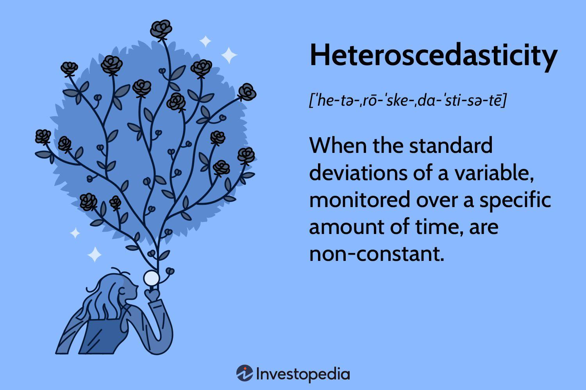

## Table of Contents

## What is heteroscedasticity?

Heteroscedasticity is a term used in statistics that describes a situation where the variability of a variable is unequal across the range of values of a second variable that predicts it. Imagine you are looking at the relationship between how much people earn and how much they spend on food. If the spread of food spending is different for low earners compared to high earners, you are seeing heteroscedasticity.

This concept is important in regression analysis, which is a way to understand and predict the relationship between variables. When heteroscedasticity is present, it means that the standard assumptions of regression models are violated, which can lead to unreliable predictions and incorrect conclusions. To deal with this, statisticians use special techniques to adjust their models and make them more accurate.

## How does heteroscedasticity affect statistical analysis?

Heteroscedasticity can make statistical analysis tricky. When you're trying to understand how one thing affects another, like how income might affect spending, you want the data to be consistent. But if the spread of the data changes as the values change, it means the data isn't behaving as expected. This can make your predictions less reliable because the model you're using assumes that the spread of the data stays the same.

Because of this, the usual ways of figuring out if your findings are significant might not work correctly. For example, if you're using a model to predict spending based on income, and the model thinks the spread of spending is the same for everyone, but it's not, then the model might say things are significant when they're not, or vice versa. To fix this, statisticians use special methods to adjust their models so they can still get good results even when the data is heteroscedastic.

## What are the common causes of heteroscedasticity in data?

Heteroscedasticity often happens because the thing you're trying to predict (like spending) can change a lot depending on the value of another thing (like income). For example, if you're looking at how income affects spending on luxury items, people with higher incomes might spend a lot more on these items, and their spending can vary a lot. On the other hand, people with lower incomes might spend less on luxury items, and their spending might not vary as much. This difference in how much spending changes at different income levels can cause heteroscedasticity.

Another common cause of heteroscedasticity is when you're missing important information. If you're trying to predict something but you don't include all the factors that affect it, the data can seem to change in unexpected ways. For instance, if you're looking at how the size of a house affects its price without considering the neighborhood, you might find that the spread of prices is different for small houses compared to big houses because the neighborhood plays a big role in the price. Including all the important factors can help make the data more consistent and reduce heteroscedasticity.

## How can you detect heteroscedasticity in a dataset?

You can spot heteroscedasticity by looking at a scatter plot of your data. If you see that the spread of the points gets bigger or smaller as you move along the line, that's a sign of heteroscedasticity. For example, if you're looking at how income affects spending, and you see that the spread of spending is small for low incomes but gets bigger as income increases, that's heteroscedasticity.

Another way to detect it is by using statistical tests. One common test is the Breusch-Pagan test. This test checks if the spread of the errors (the difference between what you predict and what actually happens) changes with the values of your predictor variable. If the test shows that the spread does change, then you have heteroscedasticity. These tests help you be sure that what you're seeing in your scatter plot isn't just by chance.

## What are the different types of heteroscedasticity?

Heteroscedasticity comes in a few different types, but the main ones are pure and impure heteroscedasticity. Pure heteroscedasticity happens when the spread of the data changes because of the thing you're trying to predict. For example, if you're looking at how income affects spending, and you see that the spread of spending gets bigger as income goes up, that's pure heteroscedasticity. It's all about the relationship between the two things you're looking at.

Impure heteroscedasticity is a bit different. It happens when the spread of the data changes because of something else that you haven't included in your model. For instance, if you're trying to predict house prices based on size but you don't consider the neighborhood, the spread of prices might look different for small houses compared to big houses because the neighborhood affects the price. Including all the important factors can help reduce this type of heteroscedasticity.

## Can you explain conditional and unconditional heteroscedasticity?

Conditional heteroscedasticity means that the spread of the data changes based on the values of the other variables you're looking at. Imagine you're trying to predict how much someone will spend on food based on their income. If the spread of spending is bigger for people with high incomes than for people with low incomes, that's conditional heteroscedasticity. It's "conditional" because the spread depends on the condition of the income level.

Unconditional heteroscedasticity is different. It means that the spread of the data changes, but it doesn't depend on the values of the other variables you're looking at. It's more like a general change in the spread of the data that happens no matter what the values of the other variables are. For example, if you're looking at the same spending data but you find that the spread of spending changes over time in a way that doesn't relate to income, that would be unconditional heteroscedasticity.

## What are some graphical methods to identify heteroscedasticity?

One easy way to spot heteroscedasticity is by looking at a scatter plot of your data. Imagine you're looking at how income affects spending. If you plot income on the x-axis and spending on the y-axis, you can see if the spread of the points changes as income goes up or down. If the spread gets bigger or smaller in different parts of the plot, that's a sign of heteroscedasticity. For example, if the points are tightly packed when income is low but spread out more when income is high, it means the variability of spending changes with income.

Another graphical method is to use a residual plot. This is where you plot the residuals (the difference between the actual values and the values predicted by your model) against the predicted values. If heteroscedasticity is present, you'll see a pattern in the spread of the residuals. For instance, if the residuals are small for low predicted values but get bigger for high predicted values, it shows that the variability of the errors changes with the predicted values, indicating heteroscedasticity. This kind of plot helps you see if your model's assumptions about equal spread are being violated.

## How do statistical tests like the Breusch-Pagan test work for detecting heteroscedasticity?

The Breusch-Pagan test is a way to check if the spread of the data changes in a way that it shouldn't. Imagine you're trying to predict how much people spend on food based on their income. You make a model to guess how much they'll spend, but sometimes your guesses are off. The difference between your guess and the actual spending is called the residual. The Breusch-Pagan test looks at these residuals to see if their spread changes with income. If it does, that's a sign of heteroscedasticity.

To do the test, you first find the residuals from your model. Then, you square these residuals to see how far off your guesses were. Next, you use these squared residuals to see if they relate to the income levels. If they do, it means the spread of the residuals changes with income, which is what heteroscedasticity looks like. The test gives you a number, called a test statistic, and if this number is big enough, it tells you that the spread of the residuals isn't the same for all income levels, confirming heteroscedasticity.

## What are the implications of ignoring heteroscedasticity in regression models?

If you ignore heteroscedasticity in your regression models, it can make your predictions less reliable. Imagine you're trying to guess how much people will spend on food based on their income. If the spread of spending changes a lot for different income levels, but your model assumes it stays the same, your guesses can be way off. This is because the model thinks the data behaves in a certain way, but it doesn't. So, the model might say some things are important when they're not, or it might miss important things.

Ignoring heteroscedasticity can also mess up how you figure out if your findings are important. In [statistics](/wiki/bayesian-statistics), you use something called p-values to see if your results are just by chance or if they mean something. If the spread of the data changes in ways your model doesn't expect, these p-values can be wrong. This means you might think something affects spending when it really doesn't, or you might miss something that actually does. To avoid these problems, it's important to check for heteroscedasticity and adjust your model if you find it.

## How can heteroscedasticity be corrected in regression analysis?

One way to fix heteroscedasticity in regression analysis is by using a method called weighted least squares (WLS). Imagine you're trying to guess how much people spend on food based on their income. If the spread of spending changes a lot for different income levels, you can give more weight to the data points that have less spread and less weight to the ones that have more spread. This makes your model pay more attention to the parts of the data that are more consistent, which can help make your guesses more accurate.

Another way to correct heteroscedasticity is by transforming your data. Sometimes, if you change how you look at the data, like using the log of the numbers instead of the numbers themselves, the spread can become more even. This can help your model work better because it's now looking at data that behaves more like it expects. By making these changes, you can make your predictions more reliable and make sure you're not missing important things or thinking unimportant things matter.

## What are the advanced techniques for modeling heteroscedasticity, such as ARCH and GARCH models?

ARCH (Autoregressive Conditional Heteroscedasticity) and GARCH (Generalized Autoregressive Conditional Heteroscedasticity) models are advanced ways to handle heteroscedasticity, especially when you're looking at data over time. Imagine you're trying to predict how much a stock price will move each day. With ARCH models, you can see that the spread of the stock price changes might depend on how much the price moved in the past. For example, if the stock price jumped a lot yesterday, it might jump a lot today too. By using past data to predict how much the price will move, ARCH models help you understand and predict these changes better.

GARCH models take this idea a step further. They not only look at how much the stock price moved in the past but also consider how much the spread of the price changes over time. This means GARCH models can capture more complex patterns in the data. For instance, if the stock market has been calm for a while but suddenly gets very volatile, a GARCH model can help you predict this shift in volatility. By using both past price movements and past changes in volatility, GARCH models can give you even more accurate predictions about how much a stock price might move in the future.

## How does heteroscedasticity impact the efficiency and consistency of estimators in econometric models?

When you're using econometric models to guess how things are related, like how income affects spending, you want your guesses to be as good as possible. Heteroscedasticity can make your guesses less efficient. This means your model might not be using all the information it could to make the best predictions. Imagine you're trying to guess how much people will spend on food. If the spread of spending changes a lot for different income levels, and your model doesn't account for this, it might not give the most accurate guesses. It's like trying to hit a target with a dart, but the target keeps moving around. Your guesses might still be okay, but they won't be as good as they could be if you knew the target was moving.

Even though heteroscedasticity can make your guesses less efficient, it usually doesn't make them inconsistent. This means that as you get more and more data, your guesses will still get closer to the true relationship between the things you're looking at. It's like if you keep throwing darts at a moving target, you'll still get better at hitting it over time, even if it's harder because the target is moving. But, because the guesses are less efficient, it might take more data to get to the same level of accuracy you would have if the target stayed still. So, while heteroscedasticity doesn't ruin your model completely, it does make it work harder to get good results.

## What are the types of heteroscedasticity?

Heteroscedasticity in statistical and financial models manifests in two primary forms: unconditional and conditional. Each type exhibits distinct characteristics and implications, which are crucial for accurate data analysis and model construction.

Unconditional heteroscedasticity is characterized by a predictable level of variability that does not depend on past data values or the history of the series. This type is often associated with cyclical data patterns, such as those arising from seasonal effects, where the variance changes at regular intervals. For instance, retail sales data might show increased variability around holidays or events. Unconditional heteroscedasticity can often be modeled or predicted by identifying these recurring patterns, allowing analysts to adjust their models accordingly.

On the other hand, conditional heteroscedasticity is the unpredictability found within datasets where variance is linked to information from past observations. This type is prevalent in financial data, where current [volatility](/wiki/volatility-trading-strategies) can be influenced by previous market behavior, leading to significant fluctuations in variance over time. The Autoregressive Conditional Heteroscedasticity (ARCH) model, introduced by Robert Engle, is a tool designed to capture this type of variability. The model comprises equations like residual errors squared as a function of past residuals:

$$
\sigma_t^2 = \alpha_0 + \alpha_1 \epsilon_{t-1}^2 + \alpha_2 \epsilon_{t-2}^2 + \cdots + \alpha_q \epsilon_{t-q}^2
$$

where $\sigma_t^2$ is the conditional variance at time $t$, $\alpha$ parameters represent the model coefficients, and $\epsilon$ indicates past residual errors.

Identifying whether heteroscedasticity in a dataset is unconditional or conditional is critical for selecting the appropriate model corrections. Misidentifying the type can lead to inefficient modeling and unreliable predictions. Methods such as statistical tests and visual inspection of variance patterns can assist in distinguishing between these two forms, guiding analysts in applying suitable adjustments, like transforming variables or employing advanced models like ARCH or its generalized form, GARCH. Addressing the correct type of heteroscedasticity ensures more robust regression analyses, particularly in financial modeling and [algorithmic trading](/wiki/algorithmic-trading) scenarios.

## How can heteroscedasticity be detected?

Visual methods such as residual plots serve as initial indicators for detecting potential heteroscedasticity in regression models. A residual plot illustrates the errors between observed and predicted values. If the variance of residuals across values of the independent variable increases or decreases systematically, it suggests the presence of heteroscedasticity.

Quantitative assessment of heteroscedasticity involves statistical tests designed to evaluate the variability in error terms. The Breusch-Pagan test is frequently employed for this task. This test assesses whether the variance of error terms is dependent on one or more independent variables. The null hypothesis states that the variance is homoscedastic, and the test statistic is typically calculated using the formula:

$$
\chi^2 = n \cdot R^2
$$

where $n$ is the sample size and $R^2$ is the coefficient of determination of the regression of squared residuals on the independent variables.

Another important test is White's test. This test is an extension of the Breusch-Pagan test and does not rely on the assumption of normality. It examines whether the variance of errors is consistent across observations by accounting for nonlinear and interaction effects among the predictors. Like the Breusch-Pagan test, it uses the $\chi^2$ distribution for hypothesis testing.

The Goldfeld-Quandt test, used mainly for detecting heteroscedasticity in linear regression models, is applicable when the error variance increases or decreases with the order of observations. Typically, the dataset is split into two groups, and the error terms' variance is compared. A significant difference in variance between these groups signals heteroscedasticity.

These tests analyze variations and correlations in residual errors to confirm heteroscedasticity's presence conclusively. Employing these statistical tools alongside visual inspection enhances the accuracy of diagnostics, allowing more robust regression analyses in financial modeling and other applications.

## How can we address heteroscedasticity?

Addressing heteroscedasticity in regression models is crucial for ensuring accurate estimates and reliable hypothesis testing. One common approach to address this issue involves transforming the variables within the model. Log transformations, for example, are frequently employed to stabilize variance across observations. By applying a natural logarithm to the dependent or independent variables, large values become less influential, thereby mitigating heteroscedasticity.

Another effective method is the use of Weighted Least Squares (WLS). Traditional Ordinary Least Squares (OLS) assumes constant variance in the error terms, which is violated in the presence of heteroscedasticity. WLS, by contrast, assigns weights to each observation inversely related to their variance. This weighting compensates for the non-constant variance, leading to more efficient and unbiased parameter estimates. The weight for each observation $i$ in WLS is typically given by:

$$
w_i = \frac{1}{\hat{\sigma}_i^2}
$$

where $\hat{\sigma}_i^2$ is an estimate of the variance for observation $i$.

Moreover, robust standard errors provide a way to correct standard error estimates when heteroscedasticity is present, without altering the original model specification. These are also known as heteroscedasticity-consistent standard errors. Using robust standard errors allows for more reliable hypothesis testing and the construction of confidence intervals despite the presence of heteroscedasticity.

In practical terms, implementing these methods in Python might involve libraries like `statsmodels`, which offer functions such as `WLS` for weighted regression and options to calculate robust standard errors. An example code snippet for calculating robust standard errors in a simple linear regression could look like this:

```python
import statsmodels.api as sm

# Assuming `y` is the dependent variable and `X` is the matrix of independent variables
X = sm.add_constant(X) # Adds a constant term to the predictor matrix
model = sm.OLS(y, X).fit(cov_type='HC3') # HC3 is one of the types of robust standard errors

print(model.summary())
```

This code uses the `OLS` function to fit a linear regression model and specifies `cov_type='HC3'` to apply robust standard error adjustments.

## What is Heteroscedasticity in Algorithmic Trading?

In algorithmic trading, managing heteroscedasticity in financial data is essential for generating precise predictive models. Variability in errors, when unaddressed, can undermine the effectiveness of trading algorithms that rely on accurate data interpretation. Two prominent methods for dealing with heteroscedasticity in finance are the Autoregressive Conditional Heteroskedasticity (ARCH) and Generalized Autoregressive Conditional Heteroskedasticity (GARCH) models.

ARCH and GARCH models provide a structured approach to model volatility, which is often heteroscedastic in financial time series data. These models assume that the variance of the current error term is a function of past error terms, effectively capturing the time-varying variance observed in financial markets. For instance, GARCH(1,1), a common specification, can be represented as:

$$
\sigma_t^2 = \alpha_0 + \alpha_1 \epsilon_{t-1}^2 + \beta_1 \sigma_{t-1}^2
$$

where $\sigma_t^2$ is the variance at time t, $\epsilon_{t-1}^2$ is the squared error term from the previous period, $\alpha_0$ is a constant, and $\alpha_1$ and $\beta_1$ are coefficients that weight the contributions of the previous error and variance, respectively. This formula captures the essence of volatility clustering, a common phenomenon in financial markets where high-volatility events tend to cluster together.

Understanding the impact of heteroscedasticity on volatility estimates is pivotal for effective risk management and formulating high-frequency trading strategies. High-frequency trading ([HFT](/wiki/high-frequency-trading-strategies)) relies on algorithms capable of processing and reacting to data at exceptionally high speeds, where accurate volatility forecasting can enhance decision-making. Mismeasurement of risk due to ignored heteroscedasticity can lead to suboptimal trading outcomes and unexpected financial losses.

Algorithmic traders employ these models to predict future volatility and adjust their strategies accordingly. Python libraries like `statsmodels` provide tools for implementing GARCH models, facilitating their integration into trading platforms:

```python
from arch import arch_model

# Simulated returns
returns = [0.01, -0.001, 0.02, -0.005, ...]

# Fit a GARCH(1,1) model
model = arch_model(returns, vol='Garch', p=1, q=1)
model_fit = model.fit()

# Forecast volatility
forecast = model_fit.forecast(horizon=5)
```

By incorporating models that effectively address heteroscedasticity, traders improve their capacity to anticipate and mitigate risks associated with volatile markets. This strategic advantage is crucial for maintaining competitiveness in the rapidly evolving financial landscape.

## References & Further Reading

[1]: Engle, R. F. (1982). ["Autoregressive Conditional Heteroscedasticity with Estimates of the Variance of United Kingdom Inflation."](https://www.semanticscholar.org/paper/Autoregressive-conditional-heteroscedasticity-with-Engle/2ee6cb87fc81ecd78d161c4a92c9dfce00c8961c) Econometrica, 50(4), 987-1007.

[2]: Brooks, C. (2019). ["Introductory Econometrics for Finance."](https://www.cambridge.org/highereducation/books/introductory-econometrics-for-finance/75E9C608EA95A3AD87FB3BC683B9EBBF) Cambridge University Press.

[3]: Tsay, R. S. (2010). ["Analysis of Financial Time Series."](https://onlinelibrary.wiley.com/doi/book/10.1002/9780470644560) Wiley.

[4]: Greene, W. H. (2018). ["Econometric Analysis."](https://www.scirp.org/reference/referencespapers?referenceid=2920183) Pearson.

[5]: Alexander, C. (2008). ["Market Models: A Guide to Financial Data Analysis."](https://www.casact.org/sites/default/files/old/marketmodels.pdf) Wiley.

[6]: Enders, W. (2014). ["Applied Econometric Time Series."](http://time-series.net/yahoo_site_admin/assets/docs/AETS4_RATSEViewsStudentVersion.324125711.pdf) Wiley.

[7]: Ruppert, D. (2004). ["Statistics and Finance: An Introduction."](https://link.springer.com/book/10.1007/978-1-4419-6876-0) Springer.