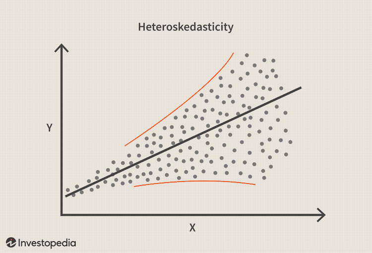

## Table of Contents

## What is heteroskedasticity in statistical analysis?

Heteroskedasticity is a term used in statistics to describe a situation where the variability of a variable is unequal across the range of values of a second variable that predicts it. Imagine you are studying how much people earn based on their years of experience. If the spread of earnings is different for people with different levels of experience, you are seeing heteroskedasticity. For example, the earnings of people with little experience might be tightly clustered, while the earnings of people with a lot of experience might be more spread out.

This concept is important because it can affect the accuracy of statistical models. When the variability of the data is not constant, standard statistical methods that assume equal variability (homoskedasticity) might lead to incorrect conclusions. For instance, in a regression analysis, heteroskedasticity can make it hard to trust the standard errors of the estimates, which can affect how confident we are in the results. To deal with heteroskedasticity, statisticians use special techniques, such as transforming the data or using robust standard errors, to make sure their analyses are as accurate as possible.

## How can you identify heteroskedasticity in a dataset?

To spot heteroskedasticity in a dataset, you can start by looking at a scatter plot of your data. Imagine you're plotting how much people earn against their years of experience. If the points on the plot spread out more as you move along the x-axis (years of experience), that's a sign of heteroskedasticity. The spread of the points shouldn't be the same everywhere; it should get wider or narrower in different parts of the plot.

Another way to identify heteroskedasticity is by using statistical tests. One common test is the Breusch-Pagan test. This test checks if the variability of your data changes in a way that depends on the values of your predictor variables. If the test shows that this is happening, then you have evidence of heteroskedasticity. These tests can be a bit more technical, but they give you a clear way to check for unequal variability in your data.

## What are the common causes of heteroskedasticity?

One common cause of heteroskedasticity is when the data includes different groups or categories that have different levels of variability. Imagine you're studying how much people spend on groceries. If your data includes both single people and large families, the spending of large families might be more spread out because they have more varied needs. This difference in variability between groups can lead to heteroskedasticity.

Another cause is when the scale of the data changes across different ranges of a predictor variable. For example, if you're looking at the relationship between a company's sales and its advertising budget, the impact of advertising might be small for low budgets but much larger for high budgets. As the advertising budget grows, the variability in sales might increase too, causing heteroskedasticity.

Lastly, errors in data collection or measurement can also lead to heteroskedasticity. If some parts of your data are measured more accurately than others, this can create unequal variability. For instance, if you're measuring the weight of different objects and your scale is less precise for heavier objects, the weights of heavier objects might be more spread out, leading to heteroskedasticity in your data.

## What are the consequences of ignoring heteroskedasticity in regression analysis?

If you ignore heteroskedasticity in regression analysis, you might end up with wrong results. When the spread of your data changes across different values of your predictor variable, it can make the standard errors of your regression coefficients less reliable. Standard errors tell you how much you can trust your estimates. If they're not accurate because of heteroskedasticity, you might think your results are more precise than they really are. This can lead you to make incorrect conclusions about whether certain variables are important or not.

Ignoring heteroskedasticity can also affect how you interpret the significance of your results. If the standard errors are off, the p-values you get from your regression might be misleading. P-values help you decide if the relationships you see in your data are real or just due to chance. If heteroskedasticity is present and you don't account for it, you might think a relationship is statistically significant when it's not, or vice versa. This can have big impacts on the decisions you make based on your analysis.

## How does heteroskedasticity affect the ordinary least squares (OLS) estimates?

Heteroskedasticity doesn't change the ordinary least squares (OLS) estimates themselves. When you run an OLS regression, you're trying to find the best line that fits your data. Heteroskedasticity, which means the spread of your data changes at different points, doesn't affect where this best line ends up. So, the slope and intercept of your regression line stay the same, no matter if your data has heteroskedasticity or not.

However, heteroskedasticity does mess with the standard errors of your OLS estimates. Standard errors tell you how much you can trust your estimates. When the spread of your data changes, these standard errors can be wrong. This means you might think your estimates are more precise than they really are. Because of this, the tests you do to check if your variables are important might give you the wrong answers. So, even though your OLS estimates stay the same, you can't trust them as much if you ignore heteroskedasticity.

## What are some graphical methods to detect heteroskedasticity?

One way to spot heteroskedasticity is by looking at a scatter plot of your data. Imagine you're studying how much people earn based on their years of experience. If you plot earnings on the y-axis and years of experience on the x-axis, you're looking for a pattern in how spread out the points are. If the points are tightly packed together at the start but get more spread out as you move along the x-axis, that's a sign of heteroskedasticity. It means the variability of earnings changes as experience increases.

Another useful graph is a plot of the residuals against the fitted values from your regression model. Residuals are the differences between the actual data points and the predictions made by your model. If you see a pattern where the spread of the residuals changes as the fitted values change, that's another sign of heteroskedasticity. For example, if the residuals are tightly clustered around zero for small fitted values but get more spread out for larger fitted values, it suggests that the variability in your data isn't constant, which is what heteroskedasticity looks like.

## What statistical tests can be used to formally test for heteroskedasticity?

One common statistical test for heteroskedasticity is the Breusch-Pagan test. This test checks if the variability in your data changes in a way that depends on the values of your predictor variables. To do this test, you first run a regression to get the residuals. Then, you run another regression where the squared residuals are the thing you're trying to predict, and your original predictor variables are used to predict them. If the results of this second regression show that the predictor variables are important, it means the variability in your data isn't constant, which is what heteroskedasticity looks like.

Another test you can use is the White test. This test is similar to the Breusch-Pagan test but doesn't assume that the relationship between the squared residuals and the predictor variables is linear. Instead, it includes all possible combinations of the predictor variables, squared and interacted, to see if any of them help predict the squared residuals. If they do, it's a sign of heteroskedasticity. Both of these tests give you a way to formally check if the spread of your data changes in a way that matters for your analysis.

## How can heteroskedasticity be corrected in regression models?

One way to fix heteroskedasticity in regression models is by using weighted least squares (WLS) instead of ordinary least squares (OLS). In WLS, you give more weight to the parts of your data that have less variability and less weight to the parts with more variability. This helps make sure all parts of your data are treated fairly, even if some parts are more spread out than others. To do this, you first need to figure out how the variability changes across your data. Then, you can use this information to adjust your regression so that the results are more reliable.

Another way to deal with heteroskedasticity is by transforming your data. This means changing the numbers in your dataset in a way that makes the variability more even. A common transformation is taking the logarithm of your variables. For example, if you're studying how much people earn, you might take the log of their earnings. This can help make the spread of the data more consistent across different values of your predictor variables. By doing this, you can use regular OLS regression and still get good results, because the transformation helps fix the problem of unequal variability.

## What is the difference between homoskedasticity and heteroskedasticity?

Homoskedasticity and heteroskedasticity are terms that describe how the spread of data changes across different values of a predictor variable. Homoskedasticity means that the spread of the data stays the same no matter what value the predictor variable has. Imagine you're studying how much people earn based on their years of experience. If the spread of earnings is the same for people with little experience and people with a lot of experience, that's homoskedasticity.

Heteroskedasticity, on the other hand, means that the spread of the data changes as the predictor variable changes. Using the same example, if the earnings of people with little experience are tightly clustered but the earnings of people with a lot of experience are more spread out, that's heteroskedasticity. This difference is important because it can affect how we analyze data and make decisions based on it.

## Can you explain the concept of robust standard errors in the context of heteroskedasticity?

When you're dealing with heteroskedasticity in your data, it means the spread of your data changes at different points. This can make the standard errors of your regression estimates less reliable. Standard errors tell you how much you can trust your estimates. If they're not accurate because of heteroskedasticity, you might think your results are more precise than they really are. To fix this, you can use something called robust standard errors. These are special kinds of standard errors that work well even when the spread of your data is not the same everywhere.

Robust standard errors help you get more reliable results from your regression analysis when you have heteroskedasticity. They do this by not assuming that the spread of your data is the same at every point. Instead, they adjust the standard errors to account for the changing variability. This means you can still use regular regression methods like ordinary least squares (OLS), but with these adjusted standard errors, your results will be more trustworthy. So, even if your data has heteroskedasticity, using robust standard errors can help you make better decisions based on your analysis.

## How does heteroskedasticity impact hypothesis testing and confidence intervals?

When you have heteroskedasticity in your data, it can mess up your hypothesis testing. Hypothesis testing is when you check if a relationship you see in your data is real or just by chance. If the spread of your data changes across different values, the standard errors you use in these tests can be wrong. Standard errors tell you how much you can trust your results. If they're not right because of heteroskedasticity, you might think a relationship is important when it's not, or you might miss a real relationship because you think it's not important enough. This can lead to wrong decisions based on your analysis.

Heteroskedasticity also affects confidence intervals. A confidence interval is a range of values that you think includes the true value of something you're studying. If the spread of your data isn't the same everywhere, the confidence intervals you calculate might be too narrow or too wide. If they're too narrow, you might be overconfident in your results. If they're too wide, you might not trust your results enough. Either way, it can make it hard to understand how reliable your findings are. Using methods like robust standard errors can help fix these problems and give you better confidence intervals and more accurate hypothesis tests.

## What advanced techniques can be used to model heteroskedasticity in time series data?

When you're looking at time series data, heteroskedasticity can be a big problem because the spread of the data might change over time. One way to deal with this is by using something called ARCH (Autoregressive Conditional Heteroskedasticity) models. These models are special because they let the variability of the data depend on how variable it was in the past. Imagine you're studying stock prices. If the prices were jumping around a lot yesterday, an ARCH model would expect them to jump around a lot today too. This helps you understand and predict how the spread of your data might change over time.

Another advanced technique is the GARCH (Generalized Autoregressive Conditional Heteroskedasticity) model. GARCH models are like ARCH models but even better because they also let the variability depend on how variable it was in the past and how big the errors were in the past. This means they can capture more complicated patterns in the spread of your data. For example, if you're looking at the [volatility](/wiki/volatility-trading-strategies) of a stock market, a GARCH model can help you see how past ups and downs affect future ups and downs. Both ARCH and GARCH models are powerful tools for dealing with heteroskedasticity in time series data and can help you make more accurate predictions.

## What is Heteroskedasticity and how can it be understood?

Heteroskedasticity is a fundamental concept in econometrics, particularly within the context of regression models. It refers to a situation where the variance of the error terms, or residuals, in a regression equation is not constant across all levels of the independent variables. More formally, consider a regression model:

$$
y_i = \beta_0 + \beta_1 x_{i1} + \beta_2 x_{i2} + \cdots + \beta_k x_{ik} + \epsilon_i
$$

where $\epsilon_i$ represents the error term for observation $i$. If the variance of $\epsilon_i$, denoted as $\text{Var}(\epsilon_i)$, changes across observations, the model exhibits heteroskedasticity. Conversely, when the variance of error terms is constant across observations, the data is said to exhibit homoskedasticity.

The distinction between heteroskedasticity and homoskedasticity is crucial for econometric analysis. Homoskedasticity, a key assumption in ordinary least squares (OLS) regression, ensures that the OLS estimator is the Best Linear Unbiased Estimator (BLUE). When this assumption is violated, as in the presence of heteroskedasticity, OLS estimates remain unbiased but lose efficiency, meaning they no longer minimize the variance among all unbiased estimators. This variance in error terms can ultimately lead to suboptimal inferences and predictions.

The implications of heteroskedasticity in econometric models are significant. Primarily, it affects the validity of hypothesis tests. Standard errors, which are used to conduct these tests and calculate confidence intervals, are biased in the presence of heteroskedasticity. This bias can result in incorrect conclusions about the statistical significance of coefficients. For example, heteroskedasticity can lead to underestimating the standard errors, making variables appear statistically significant when they are not.

Moreover, heteroskedasticity influences model predictions by potentially rendering them unreliable across different levels of independent variables. Since the variation in error terms is not constant, the model's ability to predict accurately at different points of the independent variables is compromised. This can lead to inefficient allocation of resources when these predictions inform decision-making, particularly in financial and economic contexts.

Recognizing heteroskedasticity allows modelers to apply corrective measures, ensuring that econometric models provide reliable inferences and accurate predictions. These adjustments are vital for models where precise error estimation is crucial, such as those used in policy analysis, risk management, and [algorithmic trading](/wiki/algorithmic-trading).

In summary, heteroskedasticity presents a challenge to the efficiency and accuracy of econometric models but also an opportunity to enhance model robustness and reliability through proper detection and adjustment methods.

## What are the consequences of ignoring heteroskedasticity?

Ignoring heteroskedasticity in econometric models, particularly those used in financial contexts, can result in several adverse consequences. A key issue arises with the Ordinary Least Squares (OLS) estimates, which assume constant variance of errors. Heteroskedasticity, defined as the condition where the variance of errors varies across observations, violates this assumption, leading to inefficiency in OLS estimates.

### Inefficiency of OLS Estimates

The presence of heteroskedasticity violates one of the Gauss-Markov assumptions necessary for OLS estimators to be BLUE (Best Linear Unbiased Estimator). When heteroskedasticity is present, OLS estimators remain unbiased, but they are no longer efficient. This means that there exists another estimator with a smaller variance. As a result, the OLS estimations may not be the most reliable or precise, which is critical when forecasting or making predictions in finance.

### Impact on Hypothesis Testing and Standard Errors

Under heteroskedasticity, the standard errors of the OLS estimates can be biased. This bias affects the precision of the estimated coefficients, leading to inaccurate confidence intervals and hypothesis tests. For example, t-[statistics](/wiki/bayesian-statistics), which are used to test the significance of individual coefficients, and F-statistics, which test the overall significance of the model, can be invalid if the standard errors are incorrect.

The incorrect estimation of standard errors can be illustrated by:

$$
\text{Adjusted standard error} = \frac{\text{Actual standard error}}{\sqrt{\text{Heteroskedasticity robust factor}}}
$$

Without adjustment, tests may produce misleading results, indicating statistical significance where there is none, or failing to detect significance that is present.

### Biases in Decision-Making

Ignoring heteroskedasticity can lead to faulty decision-making, especially in financial modeling and predictive analytics. If model outputs are not accurate due to inefficient estimation, stakeholders may make suboptimal decisions based on unreliable predictions. For instance, in algorithmic trading, models may misestimate risk, leading to improper hedging strategies or portfolio allocations.

Incorrect decision-making can result from overconfidence in the model’s results, as evidenced by underestimated variances and inaccurate p-values. This overconfidence can lead to disregarding the probability of extreme market events, resulting in financial losses.

### Practical Illustration

Consider a regression model assessing the impact of various market indicators on stock returns, where heteroskedasticity is present:

```python
import numpy as np
import statsmodels.api as sm

# Generate heteroskedastic data
np.random.seed(0)
X = np.random.normal(0, 1, 100)
errors = np.random.normal(0, np.sqrt(np.abs(X)), 100)  # Heteroskedastic errors
Y = 2.0 + 3.0 * X + errors

# Fit OLS model
X = sm.add_constant(X)
ols_model = sm.OLS(Y, X).fit()
print(ols_model.summary())
```

This code snippet generates heteroskedastic errors, illustrating how standard OLS modeling fails to account for variability in error terms. Running such a model without addressing heteroskedasticity could misguide analysts relying solely on the OLS output.

In summary, the consequences of overlooking heteroskedasticity are significant, impacting the reliability of econometric models. In fields like finance, where precision and accuracy are critical, ensuring that statistical assumptions hold is vital to avoid inefficiency and bias in decision-making processes.

## What are the applications in algorithmic trading?

In algorithmic trading, accurately modeling financial time series is crucial for developing effective trading strategies. Heteroskedasticity, a phenomenon where the variability of a variable is unequal across levels of an independent variable, is particularly relevant in this context due to the innate volatility in financial markets. This characteristic challenges traditional econometric models, which assume constant variance, and necessitates the use of specialized modeling approaches to capture the time-varying nature of volatility.

One of the primary tools used in addressing heteroskedasticity in financial data is the Autoregressive Conditional Heteroskedasticity (ARCH) model, introduced by Robert Engle in 1982. ARCH models are designed to model time series data where the error variance is believed to change over time, typically clustering during periods of high volatility. The Generalized ARCH (GARCH) model, an extension by Tim Bollerslev, further refines this approach by incorporating past variances, thereby providing a more flexible and comprehensive framework for volatility modeling. This is mathematically expressed for a GARCH(1,1) model as follows:

$$
\sigma_t^2 = \alpha_0 + \alpha_1 \epsilon_{t-1}^2 + \beta_1 \sigma_{t-1}^2
$$

where $\sigma_t^2$ is the conditional variance at time $t$, $\alpha_0$ is a constant, $\epsilon_{t-1}^2$ is the lagged squared residual from the mean equation, and $\sigma_{t-1}^2$ is the lagged conditional variance. 

For algorithmic trading, such models enable traders and quantitative analysts to forecast volatility more accurately, which is crucial for risk management and strategy formulation. For instance, in developing a volatility-based trading strategy, a trader might use a GARCH model to predict future volatility levels, utilizing these forecasts to adjust position sizes to maintain a desired risk profile. This adaptability is particularly valuable in high-frequency trading environments where quick reactions to changing market conditions are essential.

Moreover, portfolio optimization methods benefit greatly from the insights provided by volatility models like ARCH and GARCH. By understanding forecasted volatility, asset managers can better allocate assets in a way that minimizes risk for a given level of expected return, following the Efficient Frontier theory. In Python, libraries such as `arch` can be used to implement these models, providing practical tools for financial analysts:

```python
from arch import arch_model

# Example of fitting a GARCH(1,1) model
returns = [...]  # hypothetical list of daily returns
model = arch_model(returns, vol='Garch', p=1, q=1)
garch_fit = model.fit()

# Output summary of the model
print(garch_fit.summary())
```

In summary, the role of heteroskedasticity modeling in algorithmic trading is paramount to understanding and exploiting the dynamic nature of financial markets. By incorporating ARCH and GARCH models, traders gain a robust toolkit for predicting volatility, enhancing both trading strategies and risk management practices.

## References & Further Reading

[1]: Engle, R. F. (1982). ["Autoregressive Conditional Heteroskedasticity with Estimates of the Variance of United Kingdom Inflation."](https://www.semanticscholar.org/paper/Autoregressive-conditional-heteroscedasticity-with-Engle/2ee6cb87fc81ecd78d161c4a92c9dfce00c8961c) Econometrica, 50(4), 987-1007.

[2]: Bollerslev, T. (1986). ["Generalized Autoregressive Conditional Heteroskedasticity."](https://www.sciencedirect.com/science/article/pii/0304407686900631) Journal of Econometrics, 31(3), 307-327.

[3]: White, H. (1980). ["A Heteroskedasticity-Consistent Covariance Matrix Estimator and a Direct Test for Heteroskedasticity."](https://www.jstor.org/stable/1912934) Econometrica, 48(4), 817-838.

[4]: Lopez de Prado, M. (2018). ["Advances in Financial Machine Learning."](https://www.amazon.com/Advances-Financial-Machine-Learning-Marcos/dp/1119482089) Wiley.

[5]: Chan, E. (2009). ["Quantitative Trading: How to Build Your Own Algorithmic Trading Business."](https://github.com/ftvision/quant_trading_echan_book) Wiley.

[6]: Greene, W. H. (2011). ["Econometric Analysis."](https://www.researchgate.net/file.PostFileLoader.html?id=568181165cd9e37af18b458f&assetKey=AS%3A311705391828994%401451327765378) 7th ed. Prentice Hall.

[7]: Enders, W. (2004). ["Applied Econometric Time Series."](https://time-series.net/assets/docs/AETS4_RATSEViewsStudentVersion.324125711.pdf) Wiley.