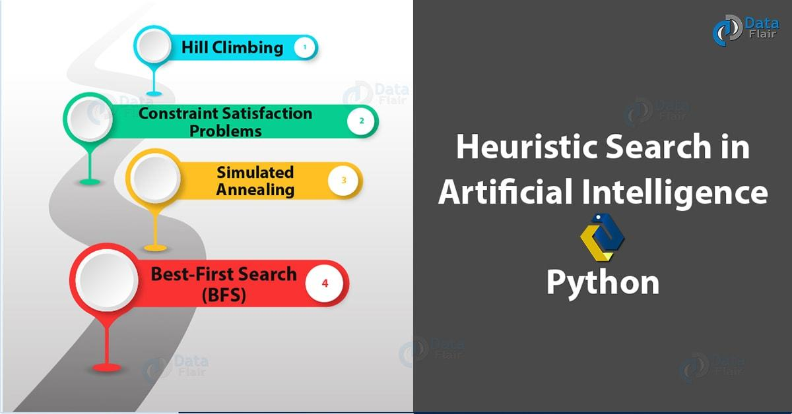

## Table of Contents

## What is a heuristic search algorithm and how does it differ from other search algorithms?

A heuristic search algorithm is a type of problem-solving technique that uses a heuristic, which is a rule of thumb or a shortcut, to guide the search process towards the solution more efficiently. Unlike other search algorithms that might explore all possible paths systematically, a heuristic search uses an estimate of the cost or distance to the goal to decide which path to explore next. This makes heuristic searches faster and more practical for complex problems where exploring every possible solution would take too long.

The main difference between heuristic search algorithms and other search algorithms lies in their approach to finding a solution. For example, a breadth-first search or a depth-first search will explore paths in a systematic way, without any knowledge about which path might lead to the goal faster. In contrast, a heuristic search, like the A* algorithm, uses a function to evaluate the best path to take. The A* algorithm, for instance, uses the formula $$f(n) = g(n) + h(n)$$ where $$g(n)$$ is the cost to reach the node, and $$h(n)$$ is an estimate of the cost to get from the node to the goal. This allows the algorithm to focus on the most promising paths, making it more efficient for many real-world problems.

## Can you explain the basic concept of Genetic Algorithms (GA) in heuristic search?

Genetic Algorithms (GA) are a type of heuristic search inspired by the process of natural selection. They work by simulating the survival of the fittest among a population of potential solutions to a problem. Each solution is represented as an individual, often called a chromosome, which is made up of genes. These genes encode the characteristics of the solution. The algorithm starts with an initial population of random solutions and then evolves them over generations. In each generation, individuals are selected based on their fitness, which is a measure of how well they solve the problem. The selected individuals then undergo genetic operations like crossover and mutation to create new offspring, which form the next generation.

The key operations in GA are selection, crossover, and mutation. Selection involves choosing the best individuals from the current population to be parents for the next generation. This is typically done using a fitness function that evaluates how good each solution is. Crossover, also known as recombination, combines the genetic information of two parent individuals to produce offspring that inherit traits from both parents. This is done by swapping parts of the chromosomes. Mutation introduces small random changes to the genes of an individual, which helps maintain diversity in the population and prevents the algorithm from getting stuck in a local optimum. Over many generations, the population evolves towards better solutions, ideally converging on an optimal or near-optimal solution to the problem.

## How does Monte-Carlo Tree Search (MCTS) work and in which scenarios is it most effective?

Monte-Carlo Tree Search (MCTS) is a heuristic search algorithm that combines the precision of tree search with the randomness of Monte-Carlo methods. It works by building a search tree where each node represents a state in the problem. The algorithm explores the tree by selecting the most promising nodes, expanding them, and then simulating random playouts from these nodes to estimate their value. The selection of nodes is guided by a formula called the Upper Confidence Bound for Trees (UCT), which balances the exploration of new nodes with the exploitation of known good nodes. The UCT formula is $$UCT = \frac{w_i}{n_i} + C \sqrt{\frac{\ln N}{n_i}}$$, where $$w_i$$ is the total reward of node $$i$$, $$n_i$$ is the number of times node $$i$$ has been visited, $$N$$ is the total number of visits to the parent node, and $$C$$ is a constant that controls the trade-off between exploration and exploitation.

MCTS is most effective in scenarios where the search space is large and the evaluation of states is difficult or time-consuming. It is particularly well-suited for games and decision-making problems where the outcomes are uncertain and depend on multiple factors. For example, MCTS has been successfully used in games like Go, Chess, and Poker, where traditional search methods struggle due to the vast number of possible moves. The algorithm's ability to focus on promising areas of the search space while still exploring new possibilities makes it a powerful tool for finding good solutions in complex environments.

## What are the key principles behind the Firefly algorithm and its applications?

The Firefly algorithm is inspired by the behavior of fireflies, which use their light to attract mates or prey. In this algorithm, each firefly represents a possible solution to a problem. Fireflies are attracted to brighter ones, which means solutions that are better according to a fitness function. The algorithm starts with a group of fireflies, and each firefly moves towards a brighter one, getting closer to a good solution. The movement is guided by the distance between fireflies and the brightness of the fireflies. The brightness can change based on the distance, and randomness is also added to the movement to explore different areas of the solution space. This balance between attraction and randomness helps the algorithm find good solutions efficiently.

The Firefly algorithm is useful in many areas, especially optimization problems. It can be used in engineering to design better structures or in business to find the best way to manage resources. For example, it can help optimize the placement of wind turbines in a wind farm to get the most energy. The algorithm is also good at solving problems where the solution space is complex and has many local optima, because the random movement helps it escape these traps. Overall, the Firefly algorithm is a powerful tool for finding solutions in challenging optimization scenarios.

## How does 4D A* extend the traditional A* algorithm and what are its advantages?

4D A* extends the traditional A* algorithm by adding a fourth dimension to the search space, which is typically time. In traditional A*, you search for the shortest path from a start point to a goal point in a 2D or 3D space. With 4D A*, you also consider when you move from one point to another, which means you can plan paths that change over time. This is useful in scenarios where the environment changes or where you need to reach the goal at a specific time. The algorithm uses the same basic formula as A*, which is $$f(n) = g(n) + h(n)$$, where $$g(n)$$ is the cost to reach the node, and $$h(n)$$ is an estimate of the cost to get from the node to the goal, but now both $$g(n)$$ and $$h(n)$$ can depend on time as well as space.

The main advantage of 4D A* is that it can handle dynamic environments where obstacles or the goal itself might move. For example, if you're planning a route for a drone that needs to avoid moving cars, 4D A* can find a path that takes into account when and where the cars will be. This makes it very useful for real-world applications like traffic management, robotics, and autonomous vehicles. Another advantage is that 4D A* can optimize for time as well as distance, so you can find paths that get you to your destination at the right time, not just the shortest way. This flexibility makes 4D A* a powerful tool for solving complex path-planning problems.

## What is the Improved Gravitational Search Algorithm (IGSA) and how does it improve upon the original GSA?

The Improved Gravitational Search Algorithm (IGSA) is a version of the original Gravitational Search Algorithm (GSA) that tries to make it work better. The original GSA is inspired by gravity and how masses move in space. In GSA, each possible solution to a problem is like a mass, and these masses move around based on how much they attract each other. The attraction depends on how good the solutions are, which is measured by a fitness function. The IGSA makes some changes to this process to make it find better solutions faster and more reliably.

The main way IGSA improves on GSA is by changing how the masses move and interact. In GSA, the force between masses can change a lot, which can make the search jump around too much and miss good solutions. IGSA fixes this by using a new way to calculate the forces, which makes the movement smoother and more focused on the best solutions. It also adds a way to keep the search from getting stuck in one place, by adding some randomness to the movement. This helps IGSA find better solutions more often than the original GSA, making it a more reliable tool for solving tough problems.

## Can you describe the process of Pixel Tracking in heuristic search and its use cases?

Pixel tracking in heuristic search is a method used to guide the search process by keeping track of which parts of the search space have been explored. Imagine you are trying to solve a puzzle, and you want to remember which pieces you have already tried. In pixel tracking, each part of the puzzle, or "pixel," is marked as explored once it has been checked. This helps the algorithm avoid looking at the same places over and over again, making the search more efficient. The algorithm uses a map to keep track of these pixels, updating it as it moves through the search space.

This method is especially useful in image processing and computer vision tasks. For example, when trying to find a specific object in a large image, pixel tracking can help the algorithm focus on areas that have not been searched yet, speeding up the process. It is also used in pathfinding problems, where the goal is to find the shortest path between two points in a grid or a map. By tracking which pixels (or grid cells) have been visited, the algorithm can more quickly find a path that avoids obstacles and reaches the goal. Overall, pixel tracking helps make heuristic searches faster and more effective by keeping a clear record of the search progress.

## What is Flow Normalization and how does it enhance heuristic search algorithms?

Flow normalization is a technique used to make heuristic search algorithms work better. It helps by making sure that the values used to guide the search are on the same scale. Imagine you're trying to find the best path in a maze, and you use different clues to decide which way to go. If one clue is much bigger than the others, it might make you go the wrong way. Flow normalization fixes this by adjusting all the clues so they're easier to compare. This way, the search algorithm can make better choices and find the best path more quickly.

In heuristic search, flow normalization can be applied to the heuristic function, which estimates how close a path is to the goal. For example, in the A* algorithm, the heuristic function $$h(n)$$ is used to guess the cost to reach the goal from a node. If $$h(n)$$ is not normalized, it might lead the search astray. By normalizing $$h(n)$$, the algorithm can balance the estimated cost with the actual cost $$g(n)$$ more effectively. This leads to a more efficient search, as the algorithm can better judge which paths are truly the most promising.

## How does the TbUM (Tree-based Uneven Margins) algorithm function in heuristic search?

The TbUM (Tree-based Uneven Margins) algorithm is a special way to make heuristic searches better. It works by changing how the search looks at different paths in a problem. Imagine you're trying to find the best way to climb a mountain. Instead of looking at all paths the same way, TbUM pays more attention to paths that look more promising. It does this by using a special formula to decide which paths to explore more. This formula, called the uneven margin, helps the search focus on the best paths and ignore the less good ones. This makes the search faster and more likely to find the best solution.

In TbUM, the uneven margin is calculated using the formula $$UM(n) = h(n) + \alpha \cdot d(n)$$, where $$h(n)$$ is the heuristic estimate of the cost to reach the goal from node $$n$$, $$d(n)$$ is the depth of the node in the search tree, and $$\alpha$$ is a parameter that controls how much the depth affects the margin. By using this formula, TbUM can adjust the search to be more or less aggressive in exploring deeper parts of the tree. This helps the algorithm find good solutions more quickly, especially in problems where the best paths are often deeper in the search space.

## What are the main features of the HFPSO (Hybrid Firefly and Particle Swarm Optimization) algorithm?

The HFPSO (Hybrid Firefly and Particle Swarm Optimization) algorithm combines the strengths of two different optimization methods: the Firefly algorithm and Particle Swarm Optimization (PSO). In the Firefly algorithm, solutions are like fireflies that move towards brighter ones, which means better solutions. In PSO, solutions are like particles that move around based on their own best position and the best position found by the whole group. By mixing these two methods, HFPSO can find good solutions faster and more reliably. The fireflies help the algorithm explore new areas, while the particles help it focus on the best solutions it has found so far.

In HFPSO, each solution is both a firefly and a particle. The firefly part of the algorithm makes the solutions move towards brighter ones, using a formula like $$d_{ij} = \sqrt{\sum_{k=1}^{D} (x_{i,k} - x_{j,k})^2}$$ to calculate the distance between fireflies, and then adjusting their positions based on this distance. The particle part uses formulas like $$v_i = w \cdot v_i + c_1 \cdot r_1 \cdot (pbest_i - x_i) + c_2 \cdot r_2 \cdot (gbest - x_i)$$ to update the velocity and position of each particle. By combining these two approaches, HFPSO can balance exploration and exploitation better than using either method alone, making it a powerful tool for solving complex optimization problems.

## How can heuristic search algorithms like those mentioned be applied in real-world machine learning problems?

Heuristic search algorithms, like A*, Genetic Algorithms, Monte-Carlo Tree Search, and others, can be applied in real-world [machine learning](/wiki/machine-learning) problems to help find solutions more efficiently. For example, in machine learning, you often need to find the best settings for your model to make it work well. This is called hyperparameter tuning. Heuristic search algorithms can help with this by trying out different settings and focusing on the ones that seem to work best. They do this by using rules of thumb, or heuristics, to guide the search. This is much faster than trying every possible setting, especially when there are a lot of them.

In another example, heuristic search can be used in [reinforcement learning](/wiki/reinforcement-learning), where an agent learns to make decisions by trying different actions and seeing what happens. Algorithms like Monte-Carlo Tree Search can help the agent choose which actions to try next. They do this by simulating many possible futures and [picking](/wiki/asset-class-picking) the action that leads to the best results most often. This makes the learning process faster and helps the agent find good strategies more quickly. By using heuristic search, machine learning can solve complex problems more effectively.

## What are the current challenges and future directions in the development of heuristic search algorithms?

One of the main challenges in the development of heuristic search algorithms is finding the right balance between exploration and exploitation. Exploration means trying out new solutions to see if they are better, while exploitation means focusing on the best solutions found so far. If an algorithm explores too much, it might waste time on bad solutions. If it exploits too much, it might miss out on even better solutions. Another challenge is that heuristic searches can get stuck in local optima, which are solutions that seem good but are not the best overall. This is a big problem in complex spaces where the best solution is hard to find. Researchers are working on new ways to escape these local optima, like adding more randomness or using different search strategies.

In the future, heuristic search algorithms will likely become even more important as problems get bigger and more complex. One direction is to combine different types of heuristic searches to make them even better. For example, using both a Genetic Algorithm and a Particle Swarm Optimization together, like in the HFPSO algorithm, can help solve problems faster and more reliably. Another future direction is to use machine learning to improve heuristic searches. Machine learning can help by learning which heuristics work best for different problems, making the search more efficient. As computers get faster and more powerful, heuristic search algorithms will keep getting better at solving tough problems in fields like robotics, game playing, and optimization.

## References & Further Reading

[1]: Hart, P. E., Nilsson, N. J., & Raphael, B. (1968). ["A Formal Basis for the Heuristic Determination of Minimum Cost Paths."](https://ieeexplore.ieee.org/document/4082128) IEEE Transactions on Systems Science and Cybernetics, 4(2), 100-107.

[2]: Goldberg, D. E. (1989). ["Genetic Algorithms in Search, Optimization, and Machine Learning."](https://archive.org/details/geneticalgorithm0000gold) Addison-Wesley Longman Publishing Co., Inc.

[3]: Browne, C., Powley, E., Whitehouse, D., Lucas, S. M., Cowling, P. I., Rohlfshagen, P., Tavener, S., Perez, D., Samothrakis, S., & Colton, S. (2012). ["A Survey of Monte Carlo Tree Search Methods."](https://ieeexplore.ieee.org/abstract/document/6145622) IEEE Transactions on Computational Intelligence and AI in Games, 4(1).

[4]: Yang, X.-S. (2010). ["Nature-Inspired Metaheuristic Algorithms,"](https://www.researchgate.net/publication/235979455_Nature-Inspired_Metaheuristic_Algorithms) Luniver Press.

[5]: Koenig, S., & Likhachev, M. (2002). ["D* Lite."](https://dl.acm.org/doi/10.5555/777092.777167) In Proceedings of the 18th National Conference on Artificial Intelligence (AAAI).

[6]: Rashedi, E., Nezamabadi-Pour, H., & Saryazdi, S. (2009). ["GSA: A Gravitational Search Algorithm."](https://www.sciencedirect.com/science/article/pii/S0020025509001200) Information Sciences, 179(13), 2232-2248.