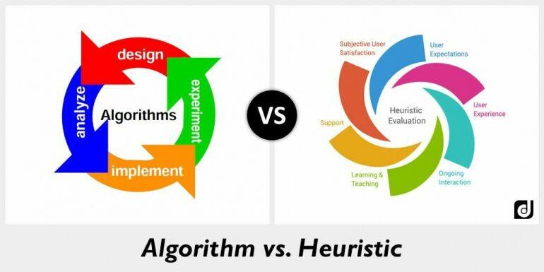

## Table of Contents

## What is a heuristic in the context of machine learning?

In machine learning, a heuristic is a kind of shortcut or rule of thumb that helps in making decisions or solving problems more quickly and efficiently. It's not always perfect, but it's useful when you need a fast solution and don't have time to find the best answer. For example, when searching for the shortest path between two points on a map, a heuristic might suggest always moving towards the destination, even if it's not the absolute shortest route.

Heuristics are particularly important in machine learning algorithms like search algorithms and optimization techniques. They help guide the search process by providing an estimate of how close a solution is to the goal. For instance, in a chess game, a heuristic might evaluate the board position based on the value of pieces and their positions, helping the algorithm decide the next move without having to explore every possible future scenario. This makes the process much faster, although the solution might not be the very best one possible.

## How do heuristics differ from algorithms in machine learning?

In machine learning, an algorithm is a step-by-step set of instructions that always gives you the same result if you start with the same input. It's like a recipe for cooking a specific dish. For example, a sorting algorithm will always sort a list of numbers in the same way every time you run it. Algorithms are precise and aim to find the best or optimal solution to a problem.

On the other hand, a heuristic is more like a rule of thumb or a shortcut that helps you find a solution faster but doesn't guarantee the best answer. Heuristics are useful when you need a quick solution and don't have the time or resources to explore every possible option. For example, in a search problem, a heuristic might guide you to move in the general direction of the goal, even if it's not the shortest path. This makes heuristics valuable in machine learning for speeding up processes, even though they might not always find the perfect solution.

## Can you provide examples of heuristics used in machine learning?

In [machine learning](/wiki/machine-learning), one common heuristic is used in the A* search algorithm. This algorithm tries to find the shortest path between two points. The heuristic helps by estimating how far it is from a current point to the goal. For example, if you're trying to find the quickest way to walk from your house to a store, the heuristic might suggest always moving towards the store, even if it's not the absolute shortest route. This makes the search faster because it doesn't have to check every possible path.

Another example is in decision tree algorithms, where a heuristic called the Gini impurity is used to decide how to split the data. The Gini impurity measures how mixed the labels are in a set of data. If a split makes the data less mixed, it's considered a good split. For instance, if you're trying to predict whether it will rain based on humidity and temperature, the Gini impurity helps decide whether to split the data by humidity first or temperature first. This heuristic helps the algorithm build a decision tree quickly without checking every possible way to split the data.

## What are the advantages of using heuristics in machine learning?

Using heuristics in machine learning can make things a lot faster. Instead of checking every possible solution, which can take a long time, heuristics give you a quick way to find a good answer. For example, when you're trying to find the best path on a map, a heuristic might tell you to always move towards your goal. This shortcut helps the computer find a path much quicker than if it had to look at every possible route.

Another advantage of heuristics is that they help when you have limited resources. If you don't have a lot of time or computing power, heuristics can still give you a useful solution. They are especially handy in big problems where finding the perfect answer would take too long. For instance, in a chess game, a heuristic might help decide the next move based on the value of pieces and their positions, without having to look at every possible future move. This makes the game playable on regular computers.

## What are the potential drawbacks or limitations of heuristics in machine learning?

One big problem with using heuristics in machine learning is that they don't always give you the best answer. Since heuristics are shortcuts, they can lead to solutions that are just okay, but not perfect. For example, if you're using a heuristic to find the shortest path on a map, it might suggest a path that's pretty good but not the absolute shortest. This can be a problem if you really need the best possible solution, like in critical systems where mistakes can be costly.

Another issue is that heuristics can sometimes be biased or not work well for all situations. They are based on rules of thumb, which might work well in some cases but not in others. For instance, if a heuristic in a chess game always values a queen higher than other pieces, it might miss out on better strategies that involve sacrificing the queen for a winning position. This means you need to be careful when choosing and using heuristics, making sure they fit the problem you're trying to solve and don't introduce unwanted biases.

## How are heuristics implemented in machine learning models?

Heuristics are implemented in machine learning models by adding rules or shortcuts that help the model make faster decisions. For example, in a search algorithm like A*, a heuristic function is used to estimate the distance from the current position to the goal. This function helps the algorithm choose the next step by calculating a score that combines the cost of getting to the current position and the estimated cost to reach the goal. The heuristic function might look something like $$f(n) = g(n) + h(n)$$, where $$g(n)$$ is the cost to reach the current node and $$h(n)$$ is the estimated cost to get to the goal from that node.

In decision tree algorithms, heuristics like the Gini impurity or information gain are used to decide how to split the data. The algorithm calculates the impurity of the data before and after a split, and chooses the split that reduces impurity the most. For instance, if you're trying to predict whether it will rain based on humidity and temperature, the heuristic helps decide whether to split the data by humidity first or temperature first. This makes the process of building the decision tree much quicker and more efficient, even if the final tree isn't perfect.

Heuristics can also be implemented in optimization problems, where they help guide the search towards better solutions without exploring every possible option. For example, in genetic algorithms, a heuristic might be used to decide which solutions to keep and which to discard based on their fitness scores. This helps the algorithm evolve towards better solutions faster, even though it might not find the absolute best solution. By using these shortcuts, machine learning models can solve complex problems more efficiently, but users need to be aware that the solutions might not always be optimal.

## What role do heuristics play in decision-making processes within machine learning?

Heuristics play a big role in helping machine learning models make decisions quickly. They act like shortcuts or rules of thumb that guide the model to find a good answer without checking every possible option. For example, in a search problem like finding the shortest path on a map, a heuristic might tell the model to always move towards the goal. This makes the search faster because the model doesn't have to look at every possible route. The heuristic function in an algorithm like A* might look like $$f(n) = g(n) + h(n)$$, where $$g(n)$$ is the cost to reach the current point and $$h(n)$$ is the estimated cost to get to the goal.

In decision tree algorithms, heuristics help decide how to split the data to build the tree. A common heuristic is the Gini impurity, which measures how mixed the labels are in a set of data. If a split makes the data less mixed, it's considered a good split. For instance, if you're trying to predict whether it will rain based on humidity and temperature, the Gini impurity helps decide whether to split the data by humidity first or temperature first. This makes the process of building the decision tree quicker and more efficient, even if the final tree isn't perfect. By using these shortcuts, machine learning models can solve complex problems faster, but users need to be aware that the solutions might not always be the best possible ones.

## How can heuristics be evaluated for effectiveness in machine learning?

To evaluate how well heuristics work in machine learning, you can compare the solutions they find with the best possible solutions. For example, if you're using a heuristic to find the shortest path on a map, you can see how close the path it suggests is to the actual shortest path. You might run the heuristic many times and look at the average difference between the paths it finds and the best path. This helps you understand if the heuristic is usually good enough or if it often misses the best solution by a lot.

Another way to check the effectiveness of heuristics is by measuring how much time and computing power they save. Heuristics are meant to make things faster, so you can compare how long it takes to solve a problem with and without the heuristic. For instance, if a heuristic helps a chess-playing program decide its next move quickly, you can see how much faster the game becomes compared to a program that looks at every possible move. By doing these kinds of tests, you can figure out if the heuristic is really helping to speed up the process without losing too much accuracy.

## What are some advanced techniques for optimizing heuristics in machine learning?

One advanced technique for optimizing heuristics in machine learning is called "learning to search." This method involves training a model to learn better heuristics over time. For example, if you're using a heuristic to guide a search algorithm, you can use data from past searches to train the model to make better estimates of how close a solution is to the goal. This can be done by feeding the model examples of good and bad paths and letting it adjust its heuristic function to improve its predictions. Over time, the heuristic becomes more accurate and helps the algorithm find better solutions faster.

Another technique is to use metaheuristics, which are higher-level strategies for finding, generating, or selecting heuristics. Metaheuristics can be used to fine-tune the parameters of a heuristic or to combine multiple heuristics to get better results. For example, in genetic algorithms, a metaheuristic might help decide which solutions to keep and which to discard based on their fitness scores. By using metaheuristics, you can create more effective heuristics that adapt to different problems and find better solutions without exploring every possible option.

## How do heuristics contribute to the development of artificial intelligence?

Heuristics play a big role in making [artificial intelligence](/wiki/ai-artificial-intelligence) smarter and faster. They are like shortcuts that help AI find good answers without looking at every possible option. For example, in a game like chess, a heuristic might help the AI decide its next move by looking at the value of pieces and their positions on the board. This makes the game playable on regular computers because the AI doesn't have to think about every possible future move, which would take too long. By using heuristics, AI can solve complex problems more quickly and efficiently, even if the solutions aren't always perfect.

Another way heuristics help in AI development is by guiding the learning process. For instance, in machine learning, a heuristic can help an algorithm decide how to split data in a decision tree. A common heuristic used is the Gini impurity, which measures how mixed the labels are in a set of data. If a split makes the data less mixed, it's considered a good split. This helps the AI build a decision tree quickly without checking every possible way to split the data. By using these shortcuts, AI can learn from data faster and make better decisions, which is crucial for developing more advanced and intelligent systems.

## What is the relationship between heuristics and bias in machine learning?

Heuristics in machine learning are like shortcuts that help find answers quickly, but they can sometimes lead to bias. Bias happens when the AI makes decisions that are not fair or accurate because it's following a rule that doesn't work well for everyone. For example, if a heuristic in a chess game always values a queen higher than other pieces, it might miss out on better strategies that involve sacrificing the queen for a winning position. This kind of bias can make the AI less effective and less fair, especially if the heuristic doesn't consider all the important factors in the problem.

To reduce bias caused by heuristics, it's important to check and adjust them regularly. You can do this by looking at the results the AI gives and seeing if they seem fair and accurate. If you find that the heuristic is leading to biased decisions, you can change it or use different heuristics that work better. For instance, in a search algorithm like A*, the heuristic function $$f(n) = g(n) + h(n)$$ can be tweaked to make more accurate estimates of the distance to the goal, which can help reduce bias and improve the AI's performance. By carefully managing heuristics, you can help make sure the AI makes decisions that are both fast and fair.

## Can you discuss any recent research or developments in the use of heuristics in machine learning?

Recent research in machine learning has been focusing on improving heuristics to make AI systems smarter and more efficient. One interesting development is the use of "learning to search" techniques, where AI models learn better heuristics over time. For example, researchers have been working on training models to improve their search algorithms by using data from past searches. This helps the model make better estimates of how close a solution is to the goal. Over time, the heuristic becomes more accurate and helps the algorithm find better solutions faster. This kind of research is important because it can make AI systems more effective at solving complex problems.

Another area of recent development is the use of metaheuristics to optimize heuristics in machine learning. Metaheuristics are like higher-level strategies that help find or generate better heuristics. For instance, in genetic algorithms, a metaheuristic might help decide which solutions to keep and which to discard based on their fitness scores. By using metaheuristics, researchers can create more effective heuristics that adapt to different problems and find better solutions without exploring every possible option. This approach is promising because it can lead to more efficient and adaptable AI systems, which is crucial for tackling real-world challenges.