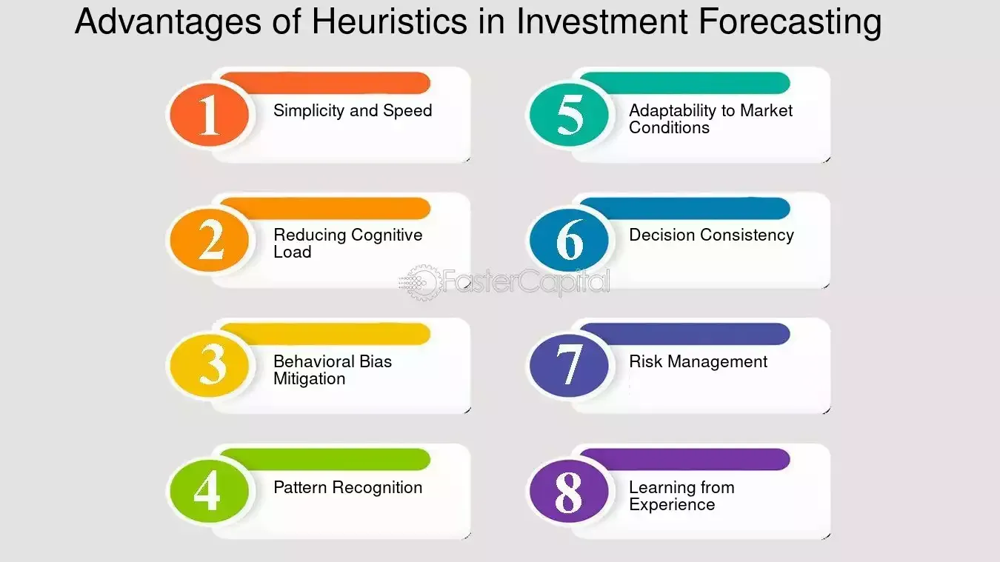

## Table of Contents

## What are heuristics?

Heuristics are simple, practical rules or strategies that people use to make decisions and solve problems quickly and efficiently. They are like mental shortcuts that help us navigate through the complexities of everyday life without having to analyze every detail. For example, when shopping for groceries, you might use a heuristic like "buy the cheapest item" to save time and money.

While heuristics can be very useful, they can also lead to errors and biases. Because they rely on simplified assumptions rather than thorough analysis, they can sometimes cause us to overlook important information or make incorrect judgments. For instance, if you always choose the cheapest item at the store, you might end up with lower quality products that don't meet your needs. Understanding the limitations of heuristics can help us use them more effectively and make better decisions.

## Can you provide examples of common heuristics?

One common heuristic is the "availability heuristic." This is when people judge the likelihood of events based on how easily they can think of examples. For example, if you hear a lot about car accidents on the news, you might think they happen more often than they really do. This heuristic can make us overestimate the chances of rare events if they are memorable or recent.

Another common heuristic is the "representativeness heuristic." This is when people judge the probability of something by how much it resembles a typical case. For instance, if you meet someone who loves [books](/wiki/algo-trading-books) and is quiet, you might think they are more likely to be a librarian than a salesperson, even if there are more salespeople in the world. This can lead to stereotypes and misjudgments because we focus on similarities rather than actual [statistics](/wiki/bayesian-statistics).

A third example is the "anchoring heuristic." This happens when people rely too heavily on the first piece of information they get when making decisions. If you see a shirt priced at $100 and then see it on sale for $50, you might think it's a great deal, even if the shirt is only worth $30. The initial price anchors your perception of the value, affecting your judgment.

## How do heuristics differ from algorithms?

Heuristics and algorithms are both ways to solve problems, but they work differently. An algorithm is like a step-by-step recipe that always gives you the right answer if you follow it correctly. It's thorough and leaves no room for guessing. For example, when you use a math formula to solve a problem, you're using an algorithm. It might take longer, but it will get you to the exact solution.

On the other hand, a heuristic is more like a rule of thumb or a shortcut. It helps you make a quick decision, but it might not always be perfect. Heuristics are useful when you need to make a fast choice without all the details. For instance, if you're trying to guess how long it will take to drive somewhere, you might use a heuristic like "it usually takes about an hour." This can be helpful, but it might not be accurate every time.

So, the main difference is that algorithms are detailed and precise, while heuristics are faster but less accurate. Both have their place depending on the situation. Algorithms are great for tasks where you need a guaranteed correct answer, while heuristics are handy for everyday decisions where speed matters more than perfection.

## What are the main types of heuristics?

Heuristics come in different types, and each helps us make quick decisions in different ways. One type is the availability heuristic. This is when we think something is more likely to happen because we can easily remember examples of it. For instance, if you hear a lot about shark attacks on the news, you might think they happen more often than they really do. Another type is the representativeness heuristic. This is when we judge how likely something is by how much it looks like a typical case. If you meet someone who loves books and is quiet, you might think they are more likely to be a librarian than a salesperson, even if there are more salespeople in the world.

Another important heuristic is the anchoring heuristic. This happens when we rely too much on the first piece of information we get. If you see a shirt priced at $100 and then see it on sale for $50, you might think it's a great deal, even if the shirt is only worth $30. The first price you saw, or the anchor, affects how you see the value of the shirt. These heuristics help us make decisions faster, but they can also lead to mistakes if we're not careful.

## What are the advantages of using heuristics in decision-making?

Heuristics are helpful because they make decision-making quick and easy. Instead of spending a lot of time thinking about every detail, you can use a simple rule to decide what to do. For example, if you always choose the cheapest item at the store, you save time and can get through your shopping faster. This is useful when you don't have a lot of time or when the decision isn't very important.

Another advantage of heuristics is that they help us handle complex situations. Life is full of choices that can be hard to figure out, but heuristics give us a way to simplify things. If you're trying to guess how long a trip will take, you might use a rule like "it usually takes an hour." This helps you plan without getting bogged down in all the little details. While heuristics might not always be perfect, they help us make decisions more easily and with less stress.

## In what situations are heuristics most effective?

Heuristics work best when you need to make quick choices. If you're in a hurry at the grocery store, using a simple rule like "pick the cheapest item" helps you decide fast. This is great for everyday decisions where you don't want to spend a lot of time thinking. Heuristics also help when you're dealing with a lot of information. Instead of trying to understand everything, you can use a shortcut to make a good guess. For example, if you need to estimate how long a trip will take, you might just think "it usually takes an hour" and that's good enough.

Another situation where heuristics are effective is when the decision isn't very important. If you're choosing what to eat for lunch, it's okay to use a simple rule like "pick something you've enjoyed before." This saves time and effort for decisions that don't have big consequences. Heuristics can also be helpful when you're facing a problem you've seen before. If you know that a certain approach worked last time, you can use it again without starting from scratch. This makes decision-making smoother and more efficient.

## What are the potential disadvantages of relying on heuristics?

One big problem with using heuristics is that they can lead to mistakes. Because they are shortcuts, they don't always give you the right answer. For example, if you always choose the cheapest item at the store, you might end up with something that isn't good quality. Heuristics can also make you miss important information. If you use the availability heuristic and think something happens more often because you hear about it a lot, you might be wrong. This can lead to bad decisions because you're not looking at all the facts.

Another disadvantage is that heuristics can cause biases. When you use the representativeness heuristic, you might judge someone based on stereotypes instead of who they really are. This can lead to unfair treatment and wrong assumptions. Also, the anchoring heuristic can trick you into thinking something is a good deal just because it's cheaper than the first price you saw. This can make you spend money on things that aren't worth it. While heuristics are helpful for quick decisions, it's important to be aware of these downsides so you can use them wisely.

## How can heuristics lead to cognitive biases?

Heuristics can lead to cognitive biases because they are shortcuts that don't always consider all the information. For example, the availability heuristic makes us think something happens more often if we can easily remember examples of it. If you hear a lot about plane crashes on the news, you might think flying is more dangerous than it really is. This can make you avoid flying even though it's actually very safe. The problem is that we focus on what's easy to remember instead of looking at the real chances of something happening.

Another way heuristics can cause biases is through the representativeness heuristic. This is when we judge how likely something is by how much it looks like a typical case. If you meet someone who loves books and is quiet, you might think they are more likely to be a librarian than a salesperson, even if there are more salespeople in the world. This can lead to stereotypes and unfair judgments because we're not considering all the facts. We're just going by what seems to fit our idea of what someone should be like.

The anchoring heuristic can also lead to biases. This happens when we rely too much on the first piece of information we get. If you see a shirt priced at $100 and then see it on sale for $50, you might think it's a great deal, even if the shirt is only worth $30. The first price you saw, or the anchor, affects how you see the value of the shirt. This can make you spend money on things that aren't worth it because you're not looking at the real value, just the difference from the first price you saw.

## Can you discuss specific cases where heuristics have been successfully applied?

In medicine, doctors often use heuristics to make quick decisions. For example, when a patient comes in with a high fever and a sore throat, a doctor might use a heuristic like "if it looks like strep throat, treat it as strep throat." This helps them start treatment fast without waiting for test results. While this isn't always perfect, it can be very helpful in urgent situations where quick action is needed. It saves time and can make a big difference in the patient's recovery.

In business, managers use heuristics to make decisions about hiring. They might use a rule like "hire the person with the most experience." This helps them choose quickly from a lot of applicants. While this might not always find the best person for the job, it makes the hiring process faster and easier. It's especially useful when there are many candidates and the manager needs to make a decision quickly.

## What are the ethical considerations when using heuristics in professional settings?

When using heuristics in professional settings, it's important to think about fairness. Heuristics can lead to biases, like when a manager always hires the person with the most experience. This might leave out younger or less experienced people who could do the job well. It's not fair if some people are always picked over others just because of a simple rule. Professionals need to be careful and make sure their quick decisions don't hurt anyone or treat them unfairly.

Another thing to consider is the impact on decision quality. If a doctor uses a heuristic to treat a patient quickly, they might miss important details that could lead to a better treatment plan. It's a balance between making fast decisions and making the right ones. Professionals have a duty to do their best for their clients or patients, and using heuristics too much can mean they're not doing that. It's important to use these shortcuts wisely and check that they're leading to good outcomes.

## How can one mitigate the risks associated with heuristics?

One way to reduce the risks of using heuristics is to be aware of them. If you know you're using a shortcut, you can check if it's leading you to the right decision. For example, if you're always choosing the cheapest item at the store, take a moment to think if it's really the best choice. Sometimes, looking at other options or asking for more information can help you make a better decision. It's like double-checking your work to make sure you didn't miss anything important.

Another way to lessen the risks is to use other methods alongside heuristics. If you're a doctor and you think a patient might have strep throat, you can use a quick test to confirm it. This way, you're not relying only on a shortcut. Combining different ways of making decisions can help you avoid mistakes. It's like using a map and a GPS together to make sure you're going the right way. By being careful and using more than one approach, you can make better choices and avoid the problems that come with using heuristics too much.

## What advanced research is being conducted on the optimization of heuristic methods?

Researchers are working on making heuristics better by studying how people use them and how they can be improved. They are looking at ways to make these shortcuts more accurate and less likely to lead to mistakes. One area of focus is [machine learning](/wiki/machine-learning), where computers can learn from data to make better guesses. By using machine learning, researchers hope to create heuristics that can adapt to new situations and give more reliable answers. This could help in fields like medicine, where quick and accurate decisions are important.

Another part of the research is about understanding how different heuristics work together. Scientists are trying to find out if using more than one heuristic at the same time can lead to better results. They are also looking at how to teach people to use heuristics in a smarter way, so they can avoid common mistakes. By combining different methods and learning from past decisions, researchers aim to make heuristics a more powerful tool for decision-making in all kinds of situations.

## References & Further Reading

[1]: Bergstra, J., Bardenet, R., Bengio, Y., & Kégl, B. (2011). ["Algorithms for Hyper-Parameter Optimization."](https://papers.nips.cc/paper/4443-algorithms-for-hyper-parameter-optimization) Advances in Neural Information Processing Systems 24.

[2]: ["Advances in Financial Machine Learning"](https://www.amazon.com/Advances-Financial-Machine-Learning-Marcos/dp/1119482089) by Marcos Lopez de Prado

[3]: ["Evidence-Based Technical Analysis: Applying the Scientific Method and Statistical Inference to Trading Signals"](https://www.amazon.com/Evidence-Based-Technical-Analysis-Scientific-Statistical/dp/0470008741) by David Aronson

[4]: ["Machine Learning for Algorithmic Trading"](https://github.com/stefan-jansen/machine-learning-for-trading) by Stefan Jansen

[5]: ["Quantitative Trading: How to Build Your Own Algorithmic Trading Business"](https://www.amazon.com/Quantitative-Trading-Build-Algorithmic-Business/dp/1119800064) by Ernest P. Chan