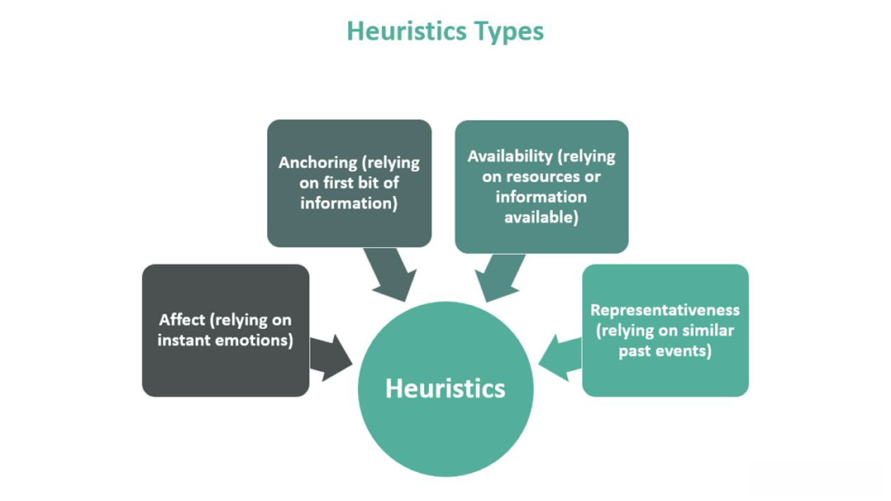

Cognitive psychology and technology intersect in intriguing ways, particularly in the domain of decision-making and financial markets. Heuristics, or mental shortcuts, play a fundamental role in simplifying complex decision-making processes. These shortcuts allow individuals to make quick judgments and decisions without extensive deliberation, utilizing patterns and learned experiences. Heuristics are especially relevant in environments where rapid decisions are crucial, such as financial trading.

Algorithmic trading represents a significant advancement in financial markets, utilizing computer algorithms to execute trades at speeds and frequencies beyond human capability. Over recent decades, algorithmic trading has evolved to dominate market transactions, leveraging mathematical models and data analysis to identify profitable opportunities. As of 2020, algorithmic trading comprised approximately 60-70% of the total trading volume in major markets like the U.S. and Europe.\[1\]

Integrating cognitive shortcuts into trading algorithms can potentially optimize decision-making processes, a crucial factor in the volatile landscape of financial markets. These cognitive shortcuts, akin to heuristics, can serve as a framework for designing algorithms that mimic intuitive human decision-making processes. While traditional algorithmic strategies focus on quantitative data and analysis, the incorporation of heuristics introduces a qualitative aspect, potentially enhancing the adaptability and efficiency of trading algorithms.

The confluence of cognitive psychology and technological innovation in financial markets invites consideration of how heuristics can refine algorithmic trading strategies. By understanding and leveraging cognitive shortcuts, traders and technologists can optimize algorithms for improved performance and decision-making efficiency. This exploration opens avenues for developing sophisticated trading mechanisms that balance cognitive insights with data-driven precision, leading to more responsive and effective financial market participation.

\[1\]: https://www.statista.com/statistics/616225/share-of-algorithmic-trading-in-equities-securities-markets/

## Table of Contents

## Understanding Heuristics in Decision Making

Heuristics are cognitive shortcuts that enable individuals to make decisions quickly and efficiently by reducing the cognitive load required for complex problem-solving. These mental rules of thumb emerge as practical strategies that bypass extensive deliberation, leveraging available information to generate satisfiable, though not always optimal, conclusions.

Several common types of heuristics play pivotal roles in decision-making processes. The availability heuristic operates on the principle that individuals assess the likelihood of events based on the ease with which examples or memories can be retrieved from memory. For instance, a person may overestimate the frequency of airplane accidents after hearing about a recent crash because such vivid instances are readily available in their memory.

Another heuristic, representativeness, involves making judgments about the likelihood of an event by comparing it to an existing prototype or stereotype within one's mind. For example, when meeting someone new who is witty and enjoys reading, one might incorrectly assume they are more likely to be a professor than a comedian, based on preconceived notions about what a professor is like.

Anchoring is yet another heuristic where individuals rely heavily on an initial piece of information, known as the anchor, to make subsequent judgments. For example, if a person first sees a T-shirt priced at $100 and then finds a similar T-shirt priced at $50, they may perceive the second T-shirt as a bargain, regardless of its actual value.

While heuristics offer substantial advantages by allowing individuals to process information rapidly, they are not without their drawbacks. One significant disadvantage is their potential to introduce biases, leading to systematic errors in judgment. For instance, reliance on the availability heuristic might result in overestimating the risk of dramatic but rare events, while the representativeness heuristic can cause people to ignore relevant statistical information in favor of what seems typical.

Despite these shortcomings, decision makers often utilize heuristics effectively, particularly in situations requiring fast resolution of complex problems. In such scenarios, heuristics serve as valuable tools that enable individuals to swiftly parse through vast amounts of information and arrive at actionable decisions. By promoting efficiency and expediency, these mental shortcuts facilitate navigation through uncertain environments, underpinning their indispensable role in both mundane and critical decision-making processes.

## Cognitive Shortcuts and Financial Markets

Cognitive shortcuts, or heuristics, significantly influence the behavior of traders and investors within financial markets. These mental shortcuts simplify the complex and often overwhelming task of processing vast amounts of market information, yet they simultaneously introduce biases and deviations from rational decision-making.

Heuristics play a pivotal role in shaping market behavior and trader psychology. Common heuristics, such as availability, representativeness, and anchoring, often determine how traders react to market events. Availability heuristics occur when individuals assess the likelihood of future events based on how easily examples come to mind. For instance, a recent market crash may lead traders to overestimate the probability of another imminent downturn, regardless of the actual probability.

Investor sentiment and behavioral biases are key concepts influenced by heuristics. Investor sentiment refers to the overall attitude of investors toward a particular security or financial market. Biases such as overconfidence and loss aversion critically shape these sentiments. Overconfidence, often driven by the representativeness heuristic, can lead traders to overestimate their ability to predict market movements, resulting in excessive trading and increased risk-taking.

Heuristics can result in systematic deviations from rational decision-making, as illustrated by the concept of herd behavior. This occurs when investors follow the majority action, often a result of social proof heuristics, leading to phenomena such as market bubbles or crashes. During these events, individual decision-making becomes skewed by the actions of others rather than objective analysis, amplifying market trends disproportionately.

Examples of heuristic-driven decisions affecting stock market trends include the disposition effect, where investors are prone to sell winning stocks too early and hold onto losing stocks for too long. This bias is largely influenced by loss aversion, where the pain of realizing a loss exceeds the pleasure of acknowledging a gain, thus impacting stock prices and market dynamics.

Overall, cognitive shortcuts contribute to both individual errors and collective market phenomena that deviate from rational market assumptions. Understanding these heuristics and their impact on financial decision-making is crucial for developing strategies to mitigate their unintended effects. This understanding can enhance the design of more robust trading algorithms, ultimately contributing to more stable financial markets.

## Algorithmic Trading: A Brief Overview

Algorithmic trading refers to the use of computer algorithms to automate the process of executing trades in financial markets. These algorithms make trading decisions based on a predefined set of rules that can include timing, price, and [volume](/wiki/volume-trading-strategy), among other factors. This approach to trading has become significant in modern finance due to its ability to leverage speed, efficiency, and data-driven decision-making, which are crucial in today's fast-paced markets.

The evolution of [algorithmic trading](/wiki/algorithmic-trading) can be traced back to the development of electronic trading platforms in the late 20th century. Initially, these platforms facilitated the electronic execution of orders, replacing traditional floor trading. Over time, advancements in technology, including the rise of high-speed internet, improved computational power, and the availability of large data sets, have significantly enhanced the capabilities and precision of trading algorithms.

Popular algorithmic trading strategies include [trend following](/wiki/trend-following) and statistical [arbitrage](/wiki/arbitrage). Trend following algorithms are designed to capitalize on market trends by identifying and trading in the direction of a market's prevailing price movements. These strategies rely on the assumption that asset prices will continue to move in their current direction. Statistical arbitrage, on the other hand, involves the identification of price inefficiencies between related financial instruments. It seeks to exploit statistical mispricing by simultaneously buying and selling equivalent amounts of different securities to profit from their expected convergence in value.

Automation plays a crucial role in executing trades made by algorithms. Automated trading systems can execute orders at speeds and frequencies that are impossible for human traders, allowing for the optimization of trade execution and reduction of transaction costs. Data analysis is also integral to the functioning of these algorithms, as they rely on vast amounts of historical and real-time market data to identify trading signals and make informed decisions. Machine learning techniques are increasingly being employed to enhance the predictive capabilities of trading algorithms by learning patterns from historical data.

Incorporating algorithms in trading offers several benefits, including improved accuracy, speed, and the ability to process vast volumes of data. Algorithms can operate 24/7, continuously scanning markets for trading opportunities and executing trades instantaneously. They also remove emotional biases from trading decisions, which can lead to more consistent outcomes.

However, algorithmic trading also presents challenges. The complexity of developing and maintaining trading algorithms requires considerable expertise and resources. There is a risk that flaws in the algorithm's design or execution can lead to unintended trading outcomes. Additionally, the high-speed nature of algorithmic trading can contribute to market [volatility](/wiki/volatility-trading-strategies) and has raised concerns about market stability. Regulatory scrutiny is increasing, with authorities seeking to ensure transparency and prevent market manipulation through algorithmic practices.

In summary, algorithmic trading represents a transformative approach to trading in financial markets, driven by technological advancements. While it offers significant efficiencies and profitability potential, it also demands careful management of its associated risks and responsibilities.

## Integrating Heuristics into Algorithmic Strategies

Heuristics, as cognitive shortcuts, play a significant role in informing the design and execution of trading algorithms by simplifying complex decision-making processes. In algorithmic trading, these mental shortcuts can be embedded into algorithms to mimic human decision-making processes, enhancing their adaptability in unpredictable market conditions. Such algorithms can assess market conditions quickly, potentially outperforming conventional data-driven models in volatile environments.

One approach to integrating heuristics into algorithmic trading strategies is to develop algorithms that emulate strategies humans naturally use. For instance, heuristics such as the recognition heuristic, which suggests that when people are faced with a choice, they tend to prefer options that are familiar or easily recognized, can be encoded into trading algorithms. These algorithms can prioritize assets or trades based on historical patterns or familiarity, akin to experienced traders recognizing patterns in high-frequency data.

Heuristic-based algorithms have several advantages in volatile markets. They can quickly adapt to market shifts by leveraging simplified decision rules, reducing the latency associated with traditional algorithmic adjustments. For example, during unforeseen market events or when data is incomplete, heuristic strategies can provide traders with an edge by focusing on significant and recognizable market signals.

Case studies in which heuristics have improved algorithmic trading outcomes further illustrate their potential. Some trading firms have successfully implemented algorithms that use trend-following heuristics, allowing the algorithms to continue profiting even during unexpected market upheavals. These strategies often benefit from trends persisting longer than initially predicted, a phenomenon readily capture by heuristic simplifications.

However, integrating heuristics into trading algorithms also entails certain risks. Heuristic-based strategies may inadvertently introduce systematic biases, leading to suboptimal decisions if the heuristic does not align well with actual market behavior. For example, over-reliance on familiar patterns might cause an algorithm to ignore novel but significant market developments.

Balancing heuristics with data-driven strategies is critical to achieving optimal results. A hybrid approach that combines the strengths of both methodologies can be particularly effective. By incorporating heuristics into a broader data analytical framework, algorithms can retain the flexibility and adaptability of human decision-making while maintaining a firm grounding in quantitative analysis.

Incorporating heuristics into trading algorithms requires continuous adjustment and validation to ensure that they remain effective across different market conditions. As the financial markets evolve, the dynamics of implementing heuristics in algorithmic strategies also necessitate ongoing refinement to prevent the propagation of biases and to enhance decision-making accuracy.

## Challenges and Ethical Considerations

The integration of heuristics into algorithmic trading brings about several ethical challenges that must be carefully considered to ensure fairness and accountability. Heuristic-driven algorithms, by their nature, rely on simplified decision-making rules that can inadvertently embed biases into their processes. These biases, often rooted in human cognitive shortcuts, can result in systematic disadvantages for certain market participants or lead to unintended market distortions.

One major concern is the potential for algorithms to perpetuate existing biases in financial markets. Heuristic-based decision-making can reflect and amplify inherent biases present in historical data, leading to reinforcement of skewed perspectives. For example, if historical trading data is influenced by seasonal trends or investor prejudices, heuristic-driven models may inadvertently emphasize these elements, perpetuating a cycle of biased trading decisions. This effect not only raises ethical concerns about fairness but also threatens market stability by introducing inefficiencies.

Transparency and accountability in algorithmic decisions pose another challenge. As algorithms become increasingly complex, understanding the decision-making process of heuristic-driven systems becomes difficult, even for their developers. This opacity raises questions about accountability, especially in cases where trading algorithms produce undesirable outcomes, such as market crashes or flash trading events. Establishing robust frameworks for transparency is crucial to hold developers and financial institutions accountable for the decisions made by their algorithms.

Regulatory challenges further complicate the landscape of heuristic-influenced trading strategies. Current financial regulations may not adequately address the nuances of algorithmic trading fueled by cognitive shortcuts, creating regulatory gaps. For instance, the rapid execution speed and volume of trades enabled by heuristic algorithms may not be covered comprehensively by existing rules designed for human traders. This situation demands proactive regulatory measures that anticipate and address the complexities introduced by these advanced systems.

Finally, balancing innovation and responsibility is a crucial consideration in the ethical deployment of heuristics in algo trading. While heuristics can enhance decision-making efficiency and adapt strategies to volatile market conditions, the emphasis on rapid decision-making must be tempered by a commitment to ethical standards and market integrity. The financial technology sector must strive for responsible innovation that prioritizes ethical considerations without stifling technological progress.

In conclusion, addressing the ethical implications of utilizing heuristics in algorithmic trading requires a multi-faceted approach that involves recognizing and mitigating biases, enhancing transparency and accountability, reforming regulatory frameworks, and balancing innovation with responsibility. These measures are essential to ensure that the integration of cognitive shortcuts into financial technology not only drives progress but also maintains ethical integrity and market fairness.

## Conclusion

In the exploration of heuristics and their integration into algorithmic trading, several key insights emerge. Heuristics serve as mental shortcuts that facilitate rapid decision-making by simplifying complex information. When applied to algorithmic trading, these cognitive shortcuts offer potential advantages by mimicking human decision-making processes, thus optimizing strategies in volatile markets. However, incorporating heuristics into trading algorithms also presents challenges. The reliance on these shortcuts can introduce biases, potentially leading to decisions that deviate from rational market behavior. It is essential, therefore, to balance heuristic-based strategies with robust data-driven approaches to mitigate risks.

The possibility of leveraging heuristics within trading algorithms underscores the need for ongoing research and development at the intersection of cognitive psychology and financial technology. Continuous examination and refinement of these strategies are crucial to understanding their impact on financial markets, enabling more sophisticated and adaptive trading solutions.

It is imperative to adopt a thoughtful approach in applying heuristics to maximize their effectiveness. This means recognizing both the power and limitations of cognitive shortcuts in decision-making. By doing so, traders and developers can harness heuristics for enhanced trading performance while remaining cautious of potential biases.

Looking to the future, the fusion of cognitive science and technology promises significant shifts in finance. As algorithmic trading strategies evolve, incorporating insights from cognitive psychology could lead to more intuitive and responsive systems that better reflect human judgment. This interdisciplinary collaboration will likely shape financial landscapes, offering innovative solutions while demanding ethical and responsible implementation. The ongoing interplay between cognitive shortcuts and technological advancement holds the key to pioneering the next generation of trading algorithms.

## References & Further Reading

[1]: Bergstra, J., Bardenet, R., Bengio, Y., & Kégl, B. (2011). ["Algorithms for Hyper-Parameter Optimization."](https://papers.nips.cc/paper/4443-algorithms-for-hyper-parameter-optimization) Advances in Neural Information Processing Systems 24.

[2]: ["Advances in Financial Machine Learning"](https://www.amazon.com/Advances-Financial-Machine-Learning-Marcos/dp/1119482089) by Marcos Lopez de Prado

[3]: ["Evidence-Based Technical Analysis: Applying the Scientific Method and Statistical Inference to Trading Signals"](https://www.amazon.com/Evidence-Based-Technical-Analysis-Scientific-Statistical/dp/0470008741) by David Aronson

[4]: ["Machine Learning for Algorithmic Trading"](https://github.com/stefan-jansen/machine-learning-for-trading) by Stefan Jansen

[5]: ["Quantitative Trading: How to Build Your Own Algorithmic Trading Business"](https://www.amazon.com/Quantitative-Trading-Build-Algorithmic-Business/dp/1119800064) by Ernest P. Chan