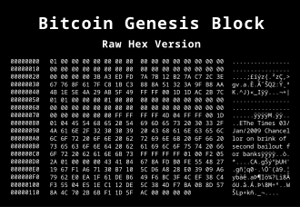

The rise of cryptocurrencies has significantly transformed the financial landscape, introducing a decentralized form of currency that operates outside traditional banking systems. HEX, launched in December 2019, has emerged as one of the more notable cryptocurrencies, primarily due to its unique model and the controversies that have surrounded it. Developed by Richard Heart, HEX was initially marketed as the first blockchain certificate of deposit, promising high returns through staking—a mechanism where users lock up their funds for a specified period to earn rewards.

Understanding the history and controversy surrounding HEX is essential for grasping its impact on the broader cryptocurrency ecosystem. While HEX has attracted a dedicated following, it has not been without its critics. Detractors have labeled it as a Ponzi scheme, primarily due to its reward structure that seemingly benefits early adopters disproportionately. These controversies underscore broader concerns about the legitimacy and sustainability of various digital currencies, marking HEX as a case study in the importance of thorough due diligence in crypto investment.



Alongside the rise of cryptocurrency projects like HEX, algorithmic trading has become an influential component in the evolution of crypto markets. Algorithmic trading employs computer algorithms to execute trades at optimal times and conditions, reducing human error and potentially enhancing profits. In the volatile and rapidly shifting landscape of cryptocurrencies, such trading strategies are invaluable for managing risk and capitalizing on market fluctuations.

In this article, we explore the development of HEX, the controversies that envelop it, and the pivotal role of algorithmic trading in shaping the cryptocurrency market. This discussion will provide insights into the intersection of innovative investment models and advanced trading technologies that are defining future market trends.

## Table of Contents

## The History of HEX Cryptocurrency

HEX was created by Richard Heart and launched in December 2019. It entered the cryptocurrency market with the objective of functioning as a blockchain certificate of deposit. The concept was to allow users to stake their holdings for a specified period, during which the currency would generate rewards. This mechanism was positioned similarly to traditional financial products, claiming to offer substantial returns upon maturity, akin to certificates of deposit in the banking sector.

The initial marketing of HEX was notably aggressive, with ambitious claims about the potential returns, which attracted significant attention. The promotional strategies included bold assertions about the anticipated performance and growth, emphasizing the innovative nature of HEX within the blockchain space. This marketing approach played a crucial role in its early adoption and visibility among crypto investors.

Understanding the foundational years of HEX involves recognizing the high expectations set during its launch and the mechanisms it introduced. HEX's staking incentives were designed to financially motivate users to hold the [cryptocurrency](/wiki/cryptocurrency) over extended periods. This model aimed to drive up demand and, as intended, increase the asset's value by reducing the [liquidity](/wiki/liquidity-risk-premium) in circulation.

In its nascent stage, HEX generated both interest and skepticism. The project drew various opinions from the crypto community, eliciting both enthusiastic support and critical scrutiny. Recognizing these foundational elements is essential for comprehending HEX's trajectory in the broader crypto market and its enduring impact as an unconventional yet notable player.

## Understanding Cryptocurrency Controversies Surrounding HEX

HEX has faced substantial criticism within the cryptocurrency community, with one of the central points of contention being its reward structure, which some critics argue resembles a Ponzi scheme. The basis of this accusation lies in the fact that HEX rewards are distributed from future investors to pay returns to earlier adopters, rather than generating income through a tangible product or service. This model is often compared to traditional Ponzi schemes, where returns for older investors are paid using the capital from newer investors, without any underlying profit-generating mechanism.

The debate surrounding the legitimacy and sustainability of HEX has been fueled by its promise of exorbitant returns, which some claim are unsustainable in the long term. Detractors argue that the intrinsic value of a cryptocurrency should derive from its utility and widespread adoption, both of which they claim HEX lacks. Moreover, the initial distribution phase of HEX was controversial due to the "Adoption Amplifier" phase, which some viewed as a way to artificially inflate its value through concentrated initial purchases.

Regulatory bodies and industry experts have also shown interest in HEX, scrutinizing it amidst a broader concern about cryptocurrencies that could potentially mislead investors. The U.S. Securities and Exchange Commission (SEC), for example, has taken action against various crypto projects that exhibit characteristics akin to securities without proper registration or compliance with regulatory norms. Although HEX has not been specifically targeted by the SEC, the agency's increasing vigilance highlights the precarious position of similar ventures in the evolving regulatory landscape.

Despite these controversies, HEX has continued to maintain a robust following among certain groups of investors. This dedicated community often cites the transparency of HEX's smart contract and the unique features of its staking mechanism as reasons for their continued support. Furthermore, these proponents argue that the significant returns from staking are a legitimate consequence of HEX’s design rather than an indication of a scheme.

The ongoing debate about HEX illustrates the broader challenges faced by the cryptocurrency market, where innovation often outpaces regulation and traditional financial scrutiny. Understanding these controversies is crucial for investors and regulators as they navigate the evolving landscape of digital currencies.

## The Role of Algorithmic Trading in Cryptocurrency Markets

Algorithmic trading has emerged as a pivotal component in the cryptocurrency markets, providing traders with advanced tools to improve trading performance and manage risks effectively. This trading method involves using pre-programmed instructions to execute trades at optimal conditions, reducing the influence of human emotions and errors in decision-making processes. The inherently volatile nature of the cryptocurrency market makes it an ideal candidate for [algorithmic trading](/wiki/algorithmic-trading), as price fluctuations can occur rapidly and unpredictably.

In the context of cryptocurrencies such as HEX, algorithmic trading strategies can be specifically designed to capitalize on market movements. These strategies often utilize pattern recognition, statistical analysis, and historical data to forecast price changes and execute trades swiftly. As a result, algorithmic trading offers the potential for better pricing and risk management, especially during periods of extreme market [volatility](/wiki/volatility-trading-strategies).

For example, a simple Python algorithm for executing trades based on moving averages could be implemented as follows:

```python
import numpy as np

def moving_average_strategy(prices, short_window, long_window):
    # Calculate short and long moving averages
    short_ma = np.convolve(prices, np.ones(short_window)/short_window, mode='valid')
    long_ma = np.convolve(prices, np.ones(long_window)/long_window, mode='valid')

    # Generate trading signals
    signals = np.zeros(len(prices))
    signals[(short_window-1):] = np.where(short_ma > long_ma, 1, 0)

    # Buy (1), Hold (0), or Sell (-1)
    action = np.diff(signals)
    return action
```

This algorithm generates buy and sell signals based on the crossover of short-term and long-term moving averages, a common approach in trading.

As technology advances, the role of algorithmic trading in crypto markets not only grows but also adds layers of complexity and opportunity. High-frequency trading ([HFT](/wiki/high-frequency-trading-strategies)) is one such area where traders execute a large number of orders at extremely fast speeds. This approach relies heavily on sophisticated algorithms, ultra-low latency, and often significant computational power.

The integration of [machine learning](/wiki/machine-learning) into algorithmic trading further enhances its capabilities. Machine learning models can learn from vast datasets and adapt to new information, allowing for dynamic trading strategies that evolve with market conditions. By employing such technologies, traders can develop algorithms that not only react to current market conditions but also predict future trends with higher accuracy.

Overall, algorithmic trading is becoming increasingly influential in the cryptocurrency landscape, providing both challenges and opportunities. As market participants continue to develop more advanced trading algorithms, they contribute to a more complex and competitive trading environment, reshaping the way cryptocurrencies like HEX are traded. Understanding and harnessing the power of these technologies is crucial for navigating the evolving crypto markets effectively.

## Conclusion

HEX represents a unique case in the cryptocurrency landscape due to its unconventional approach and associated controversies. HEX, by offering rewards and staking incentives, has captured investor attention but has drawn scrutiny for its operational model. Such scrutiny underscores the importance of careful evaluation and due diligence in the crypto investment space. The debates and regulatory attention surrounding HEX highlight the broader regulatory challenges faced by cryptocurrencies that adopt non-traditional frameworks.

Algorithmic trading stands out as a potent tool for navigating the intricacies of the cryptocurrency markets. By employing predefined instructions to execute trades under optimal conditions, algorithmic trading can help minimize human error and foster more strategic trading approaches. This is particularly beneficial in the volatile environment of cryptocurrencies, where rapid price changes demand swift and efficient trading strategies.

Understanding the interaction between crypto innovations like HEX and trading technologies such as algorithmic trading is crucial for grasping future market developments. As technology advances, the effect of algorithmic trading on crypto markets grows, introducing both complexity and opportunity. This evolving landscape requires investors and market participants to stay informed and adapt to new trading paradigms while remaining vigilant regarding the risks and potential pitfalls highlighted by cases such as HEX.

## References & Further Reading

[1]: Preston Byrne. (2020, July 20). ["HEX is a brilliant scam"](https://www.coindesk.com/markets/2020/05/09/scams-schemes-and-crypto-privacy-feat-preston-byrne/). Retrieved from Preston Byrne's Blog.

[2]: Securities and Exchange Commission. (2019). ["Framework for 'Investment Contract' Analysis of Digital Assets."](https://www.sec.gov/about/divisions-offices/division-corporation-finance/framework-investment-contract-analysis-digital-assets)

[3]: Lopez de Prado, M. (2018). ["Advances in Financial Machine Learning"](https://www.amazon.com/Advances-Financial-Machine-Learning-Marcos/dp/1119482089). Wiley.

[4]: Jansen, S. (2020). ["Machine Learning for Algorithmic Trading"](https://github.com/stefan-jansen/machine-learning-for-trading). Packt Publishing.

[5]: Chan, E. P. (2008). ["Quantitative Trading: How to Build Your Own Algorithmic Trading Business"](https://github.com/ftvision/quant_trading_echan_book). Wiley.

[6]: U.S. Securities and Exchange Commission (SEC). ["What We Do"](https://www.sec.gov/). Retrieved from SEC official website.

[7]: Aronson, D. R. (2006). ["Evidence-Based Technical Analysis: Applying the Scientific Method and Statistical Inference to Trading Signals"](https://www.amazon.com/Evidence-Based-Technical-Analysis-Scientific-Statistical/dp/0470008741). Wiley.

[8]: Cong, L. W., & He, Z. (2019). ["Blockchain disruption and smart contracts."](https://www.nber.org/papers/w24399) Review of Financial Studies, 32(5), 1754–1797.

[9]: Hurd, T. R. (2019). ["Quantitative Risk Management with R: Solving Real-Life Problems with Risk and Data Analytic Tools"](https://dl.acm.org/doi/10.5555/2811305). CRC Press.