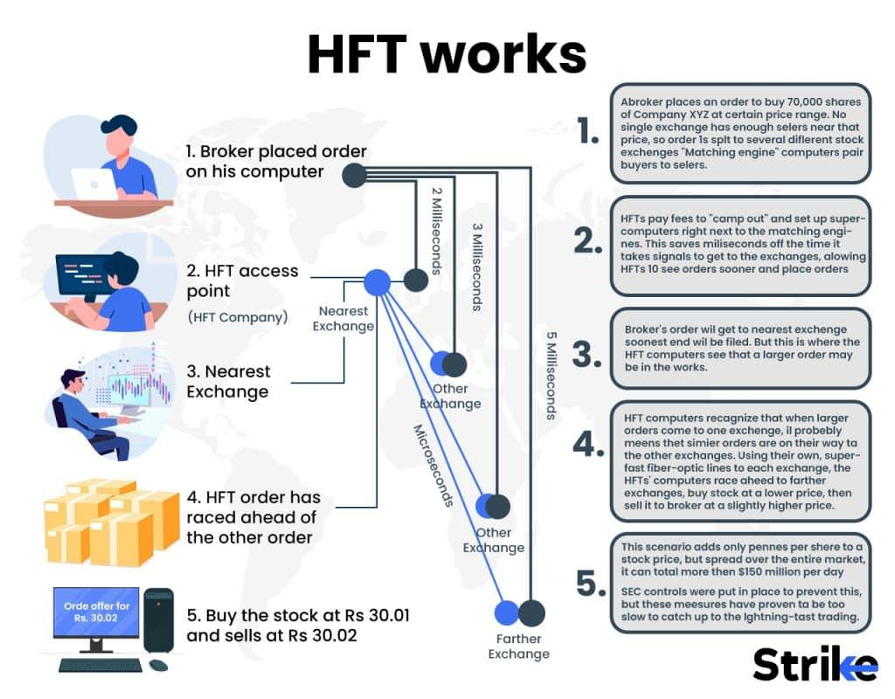

## Table of Contents

## What is High-Frequency Trading (HFT)?

High-Frequency Trading (HFT) is a type of trading that uses powerful computers to buy and sell stocks very quickly. People who do HFT use special computer programs to make many trades in just a few seconds. These programs look at lots of information and try to find small chances to make money. HFT is different from regular trading because it happens so fast and uses a lot of technology.

HFT can be good because it can make the stock market work better. When lots of trades happen quickly, it can help keep the prices of stocks fair and make it easier for people to buy and sell. But HFT can also be risky. Sometimes, the fast trading can cause big changes in stock prices, which can be bad for the market. Also, not everyone thinks HFT is fair because only people with the best technology can do it.

## How do HFT companies operate?

HFT companies use special computers and computer programs to trade stocks very quickly. They set up their computers close to the stock market's computers to make their trades happen even faster. These companies use math and computer science to make programs that can look at lots of information and decide when to buy or sell stocks. They try to find small chances to make money by trading many times in a short time.

These companies often use strategies like [arbitrage](/wiki/arbitrage), where they buy a stock in one place and sell it in another place for a little more money. They also use [market making](/wiki/market-making), where they put up prices to buy and sell stocks and make money from the difference. [HFT](/wiki/high-frequency-trading-strategies) companies need to be very fast and accurate because they make many trades every second. They also need to keep their computer programs secret so other companies can't copy them.

## What are the key technologies used by HFT companies?

HFT companies use very fast computers to make quick trades. These computers need to be close to the stock market's computers, so they use special places called data centers. They also use very fast internet connections, like fiber-optic cables, to send and receive information quickly. These technologies help HFT companies make trades in just a few milliseconds.

Another important technology is the computer programs, or algorithms, that HFT companies use. These programs use math to look at lots of information and decide when to buy or sell stocks. The programs need to be very fast and accurate, and HFT companies keep them secret so other companies can't copy them. These algorithms help HFT companies find small chances to make money by trading many times in a short time.

## What are the main advantages of HFT for companies?

HFT helps companies make money by trading very quickly. They use special computers and programs to buy and sell stocks many times in a short time. This lets them find small chances to make money that other traders might miss. Because HFT companies trade so fast, they can make a lot of trades and earn small profits from each one. Over time, these small profits can add up to a lot of money.

HFT also helps companies by giving them an edge over other traders. They can use their fast computers and special programs to trade before others can. This means they can take advantage of changes in the market before anyone else. Plus, HFT companies can use their technology to do things like arbitrage, where they buy a stock in one place and sell it in another for a little more money. This can help them make more money and stay ahead in the market.

## What are the risks and challenges faced by HFT companies?

HFT companies face many risks and challenges. One big risk is that the market can change very quickly. If their computer programs make a mistake, they could lose a lot of money in just a few seconds. Also, other HFT companies are always trying to do better and faster trades. This means they have to keep improving their technology to stay ahead, which can be expensive and hard to do.

Another challenge is that the rules about HFT can change. Governments and stock markets might make new rules that make it harder for HFT companies to trade. This can affect how much money they can make and how they have to do their trades. Also, some people think HFT is not fair because only companies with the best technology can do it. This can make it harder for HFT companies to do business and can lead to bad feelings from other traders and the public.

## How do HFT companies generate revenue?

HFT companies make money by trading stocks very quickly. They use special computers and programs to buy and sell stocks many times in a short time. This lets them find small chances to make money that other traders might miss. They often use strategies like arbitrage, where they buy a stock in one place and sell it in another for a little more money. They also use market making, where they put up prices to buy and sell stocks and make money from the difference between those prices. By doing many trades and [earning](/wiki/earning-announcement) small profits from each one, HFT companies can make a lot of money over time.

Another way HFT companies make money is by being faster than other traders. They use very fast internet connections and keep their computers close to the stock market's computers. This lets them trade before others can, so they can take advantage of changes in the market before anyone else. By using their technology to be the first to trade, HFT companies can make more money and stay ahead in the market.

## What is the impact of HFT on financial markets?

High-Frequency Trading (HFT) can make financial markets work better. It helps keep the prices of stocks fair because HFT companies trade so quickly and often. When lots of trades happen fast, it's easier for people to buy and sell stocks. This can make the market more efficient and liquid, which means it's easier for everyone to trade. HFT also helps narrow the difference between the price people want to buy a stock and the price people want to sell it, which can save money for everyone in the market.

But HFT can also cause problems. Sometimes, the fast trading can make stock prices change a lot very quickly, which can be bad for the market. This can lead to something called a "flash crash," where prices drop suddenly and then come back up. Also, not everyone thinks HFT is fair because only companies with the best technology can do it. This can make some people feel like HFT gives an unfair advantage to a few companies, which can lead to bad feelings and less trust in the market.

## How do regulatory environments affect HFT companies?

The rules that governments and stock markets make can really affect how HFT companies do their business. Sometimes, new rules can make it harder for HFT companies to trade as quickly or as often as they want. For example, some rules might limit how much they can trade or make them wait a little longer before they can trade again. This can make it harder for HFT companies to make money because their fast trading is what helps them find small chances to profit.

Also, the rules can change how much risk HFT companies have to take. If the rules are strict, HFT companies might have to be more careful with their trades, which can slow them down and make it harder to stay ahead of other traders. On the other hand, if the rules are too loose, it might let HFT companies take too many risks, which can be bad for the market and lead to big problems like flash crashes. So, HFT companies always have to keep an eye on the rules and be ready to change how they do things to stay in line with them.

## What are some notable HFT companies and their strategies?

Some well-known HFT companies include Citadel Securities, Virtu Financial, and Jump Trading. Citadel Securities is one of the biggest HFT companies and uses very fast computers to trade stocks, options, and other financial products. They use a strategy called market making, where they offer to buy and sell stocks at certain prices and make money from the difference between those prices. Virtu Financial also uses market making and focuses on trading many different types of financial products very quickly. They use special computer programs to find small chances to make money by trading many times in a short time.

Jump Trading is another big HFT company that uses very fast computers and special programs to trade stocks and other financial products. They use strategies like arbitrage, where they buy a stock in one place and sell it in another place for a little more money. They also use market making to make money from the difference between the prices they offer to buy and sell stocks. All these companies need to keep their computer programs secret and always work to make them faster and better to stay ahead of other traders.

## How does HFT influence market liquidity and volatility?

High-Frequency Trading (HFT) can make the market more liquid. Liquidity means it's easy to buy and sell stocks. HFT companies trade a lot and very quickly, which helps keep the market moving. When there are many trades happening all the time, it's easier for everyone to buy and sell stocks. This can make the prices of stocks more fair because there are always people ready to trade. HFT can also make the difference between the price people want to buy a stock and the price people want to sell it smaller, which can save money for everyone in the market.

But HFT can also make the market more volatile. Volatility means the prices of stocks can change a lot and very quickly. Sometimes, the fast trading of HFT companies can cause big changes in stock prices. This can lead to something called a "flash crash," where prices drop suddenly and then come back up. These quick changes can be scary for other traders and can make the market feel less safe. So, while HFT can help with [liquidity](/wiki/liquidity-risk-premium), it can also make the market more unpredictable and risky.

## What are the ethical considerations surrounding HFT?

High-Frequency Trading (HFT) raises some ethical questions. One big issue is fairness. HFT companies use very fast computers and special programs to trade stocks quickly. This means they can make trades before other people can, which some people think is not fair. Only companies with a lot of money and the best technology can do HFT, so it can seem like they have an unfair advantage over other traders. This can make people feel like the market is not equal for everyone.

Another ethical concern is the risk HFT can bring to the market. The fast trading of HFT companies can cause big changes in stock prices very quickly. This can lead to something called a "flash crash," where prices drop suddenly and then come back up. These quick changes can be bad for the market and can make other traders lose money. Some people worry that HFT companies are taking too many risks and that this could hurt the market and the people who trade in it.

## What future trends might impact the operations of HFT companies?

In the future, technology will keep getting better and faster, which will change how HFT companies work. They will need even faster computers and better programs to stay ahead. This means they will have to spend a lot of money on new technology to keep up with other traders. Also, new ways of sending information, like faster internet connections, could make HFT trading even quicker. This could help HFT companies find more chances to make money, but it also means they will have to keep improving their technology all the time.

Rules about HFT might also change in the future. Governments and stock markets might make new rules to make sure HFT is fair and safe for everyone. These new rules could make it harder for HFT companies to trade as quickly or as often as they want. HFT companies will have to be ready to change how they do things to follow these new rules. Also, more people might start using HFT, which could make the market more competitive. This means HFT companies will have to work harder to stay ahead of other traders and keep making money.

## References & Further Reading

[1]: [SOES Bandits: Who They Were, What They did](https://www.investopedia.com/terms/s/soesbandits.asp)

[2]: [US Commodity Futures Trading Commission and the US Securities & Exchange Commission. “Findings Regarding The Market Events Of May 6, 2010”.](https://www.sec.gov/news/studies/2010/marketevents-report.pdf)

[3]: Narang, R. (2013). [Inside the Black Box: A Simple Guide to Quantitative and High-Frequency Trading](https://www.amazon.com/Inside-Black-Box-Quantitative-Frequency/dp/1118362411). John Wiley & Sons.

[4]: Aldridge, I. (2013). [High-frequency trading: a practical guide to algorithmic strategies and trading systems](https://www.amazon.com/High-Frequency-Trading-Practical-Algorithmic-Strategies/dp/1118343506). John Wiley & Sons.

[5]: [“Direct Market Access (DMA).” *Investopedia*](https://www.investopedia.com/terms/d/directmarketaccess.asp)