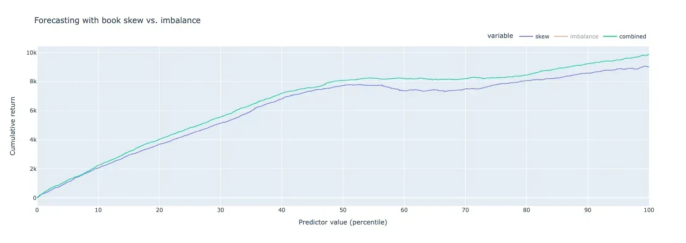

## Table of Contents

## What is High-Frequency Trading (HFT)?

High-Frequency Trading (HFT) is a type of trading where computers use special programs to buy and sell stocks very quickly. These trades happen in just a few seconds or even less. People who do HFT use powerful computers and fast internet connections to make money from tiny changes in stock prices. They often trade a lot of stocks every day, making many small profits that add up over time.

HFT can be good because it helps make the stock market more active and can make buying and selling stocks faster and easier. But it can also be risky. Sometimes, HFT can cause big swings in stock prices, which can be scary for other people who are trading. Also, because HFT uses complex technology, it can be hard for regular people to understand what is happening in the market.

## How can Python and Sklearn be used in HFT?

Python and Sklearn can be used in High-Frequency Trading (HFT) to help make quick decisions about buying and selling stocks. Python is a popular programming language that is easy to use and has lots of tools for working with numbers and data. Sklearn, which is short for scikit-learn, is a library in Python that helps with machine learning. Machine learning is a way for computers to learn from data and make predictions. In HFT, traders can use Sklearn to build models that predict how stock prices will change in the next few seconds. These models can look at past data to find patterns and then use those patterns to decide when to buy or sell.

Using Python and Sklearn together makes it easier for traders to create and test these prediction models quickly. Traders can use Sklearn's tools to train their models on large amounts of stock data. Once the models are trained, they can be used in real-time to make trading decisions. For example, if the model predicts that a stock price will go up, the trader's computer can automatically buy that stock. If the model predicts the price will go down, the computer can sell the stock. This process needs to be very fast, which is why Python's speed and Sklearn's efficient algorithms are important for HFT.

## What are the basic prerequisites for starting with HFT using Python?

To start with High-Frequency Trading (HFT) using Python, you first need a good understanding of Python programming. Python is great for HFT because it's easy to learn and has lots of tools for working with data and numbers. You'll also need to know about libraries like Pandas, which helps with handling data, and NumPy, which is good for doing math quickly. Another important library is Sklearn, which you can use to build models that predict stock prices. Learning how to use these tools will help you write the programs you need for HFT.

Next, you need to know about the stock market and how trading works. This includes understanding things like stock prices, trading volumes, and how to get real-time data about stocks. You'll need to connect your Python programs to data feeds that give you up-to-date information about the market. It's also important to have a fast internet connection and powerful computers, because HFT needs to happen very quickly. Finally, you should be ready to test your trading strategies a lot, using past data to see how well your programs work before you start trading with real money.

## How do you set up a Python environment for HFT?

To set up a Python environment for High-Frequency Trading (HFT), start by installing Python on your computer. You can download it from the official Python website. Once Python is installed, you'll need to set up a virtual environment to keep your HFT project organized and separate from other projects. You can create a virtual environment using the `venv` module that comes with Python. Open a command prompt or terminal, navigate to your project directory, and run the command `python -m venv hft_env` to create a new virtual environment called `hft_env`. Then, activate the environment by running `source hft_env/bin/activate` on Unix-based systems or `hft_env\Scripts\activate` on Windows.

After activating the virtual environment, you need to install the necessary libraries for HFT. Use the package manager `pip` to install key libraries like Pandas for data manipulation, NumPy for numerical operations, and Sklearn for machine learning. You can install these libraries by running `pip install pandas numpy scikit-learn`. Additionally, you might need other libraries like `ccxt` for connecting to various cryptocurrency exchanges or `alpaca-trade-api` for stock market data, depending on your specific trading needs. Make sure your internet connection is fast and reliable, as HFT requires real-time data. Once everything is set up, you can start writing and testing your HFT scripts within this environment.

## What Sklearn tools are most useful for HFT data analysis?

In High-Frequency Trading, Sklearn's tools like the Random Forest and Gradient Boosting algorithms are very helpful for analyzing data. These tools can look at lots of past stock data to find patterns and then use those patterns to predict what might happen next with stock prices. Random Forest works by making many small decision trees and then combining their predictions to make a final guess. This is good for HFT because it can handle a lot of data quickly and still make accurate predictions. Gradient Boosting is similar, but it builds the trees one at a time, trying to fix the mistakes of the previous trees. This can be even more accurate but might take a bit longer to run.

Another useful Sklearn tool for HFT is the preprocessing module. This module helps clean up and prepare the data before you use it to train your models. For example, you might use the StandardScaler to make sure all your data is on the same scale, which can help your models work better. The LabelEncoder can turn words or categories into numbers, which is important because computers work better with numbers. These preprocessing steps are important in HFT because they make sure the data going into your models is as good as it can be, which can lead to better predictions and faster trading decisions.

## How can you preprocess financial data for HFT using Sklearn?

To preprocess financial data for High-Frequency Trading using Sklearn, you first need to clean and organize your data. This means getting rid of any missing or wrong information, which can mess up your predictions. Sklearn's SimpleImputer can help fill in missing values, and you can use the LabelEncoder to turn words or categories into numbers that computers can work with better. It's also important to make sure all your data is on the same scale, so you use the StandardScaler to do this. This step makes sure that big numbers don't have more impact than small numbers just because they're bigger.

Once your data is clean and organized, you can split it into training and testing sets. Sklearn's train_test_split function helps you do this easily. You use the training set to teach your model how to predict stock prices, and the testing set to check if your model is good at making predictions. This way, you can see if your model will work well in real trading situations. By preprocessing your data carefully, you make sure your HFT models have the best chance of making accurate and fast predictions.

## What machine learning models in Sklearn are suitable for HFT?

For High-Frequency Trading, Sklearn's Random Forest and Gradient Boosting models are very useful. Random Forest works by making many small decision trees and then combining their predictions. This method is good for HFT because it can handle a lot of data quickly and still make accurate predictions. It's also good at finding patterns in stock prices that might be hard to see otherwise. Gradient Boosting is similar, but it builds the trees one at a time, trying to fix the mistakes of the previous trees. This can be even more accurate but might take a bit longer to run, so it's important to balance speed and accuracy in HFT.

Another model that can be used is the Support Vector Machine (SVM). SVMs are good at finding the best way to separate different groups of data, which can be useful for predicting when to buy or sell stocks. They work well with small amounts of data, which can be helpful in HFT where you might not have a lot of time to gather information. However, SVMs can be slower than Random Forest or Gradient Boosting, so you need to make sure your computer is fast enough to use them in real-time trading situations.

## How do you train and validate HFT models using Sklearn?

To train and validate HFT models using Sklearn, you first need to split your data into a training set and a testing set. You can use Sklearn's `train_test_split` function to do this easily. The training set is used to teach your model how to predict stock prices, and the testing set is used to check if your model is good at making predictions. Once you have your data split, you can start training your model. For example, if you're using a Random Forest model, you'll use the `fit` method to train it on your training data. This teaches the model to find patterns in the stock prices that can help it make predictions.

After training your model, you need to validate it to see how well it works. You do this by using your testing set to make predictions and then comparing those predictions to the actual stock prices. Sklearn has tools like `mean_squared_error` and `r2_score` to help you measure how accurate your model's predictions are. If your model does well on the testing set, it means it's good at making predictions and might work well in real HFT situations. If it doesn't do well, you might need to go back and adjust your model or use more data to train it better. This process of training and validating helps you make sure your HFT model is ready for real-time trading.

## What are some common strategies implemented in HFT using Python and Sklearn?

One common strategy in High-Frequency Trading using Python and Sklearn is called "Statistical Arbitrage." This strategy uses machine learning models like Random Forest or Gradient Boosting to look at the prices of different stocks and find pairs that usually move together. When the prices of these pairs start to move apart, the model predicts that they will come back together soon. So, the trader's computer quickly buys the stock that's cheaper and sells the one that's more expensive. If the prices do come back together, the trader makes a small profit from the difference. This strategy needs to be very fast, which is why Python and Sklearn are good tools for it.

Another strategy is "Market Making." This involves using Sklearn models to predict how the prices of stocks will change in the next few seconds. The trader's computer then puts in buy and sell orders at slightly different prices, hoping to make a small profit from the difference. For example, if the model predicts a stock price will go up, the computer might put in a buy order just below the current price and a sell order just above it. If the price moves as predicted, the trader makes money from the spread between the buy and sell orders. This strategy also needs to happen very quickly, so having fast computers and a good internet connection is important.

## How can you optimize HFT models for speed and efficiency with Sklearn?

To optimize HFT models for speed and efficiency using Sklearn, you can start by choosing the right algorithms. Random Forest and Gradient Boosting are good choices because they can handle a lot of data quickly. But you can make them even faster by adjusting the number of trees and the depth of each tree. Fewer trees and shallower trees can make the model run faster, but you need to find a balance so the model still makes good predictions. Another way to speed things up is by using Sklearn's preprocessing tools to clean and organize your data before you train the model. This makes sure the data going into your model is ready to use, which can save time.

Another important way to optimize your HFT models is by using cross-validation to make sure your model works well without taking too long to train. Sklearn's `cross_val_score` function can help you do this by testing your model on different parts of your data. This way, you can see how well your model predicts without using all your data at once, which can be slower. Also, you can use Sklearn's `joblib` library to save and load your trained models quickly. This means you don't have to train your model from scratch every time you want to use it, which can save a lot of time in HFT where every second counts.

## What are the challenges and limitations of using Sklearn for HFT?

One big challenge of using Sklearn for High-Frequency Trading is that it might not be fast enough for the very quick decisions needed in HFT. Sklearn's machine learning models, like Random Forest and Gradient Boosting, can take a bit of time to run, especially if you use a lot of data or make the models very detailed. In HFT, every second counts, so even a small delay can make a big difference. Another challenge is that Sklearn might not have all the special tools that HFT traders need. For example, Sklearn is good at making predictions, but it might not have the best ways to connect to stock markets or handle real-time data, which are very important in HFT.

Another limitation is that Sklearn's models can be hard to change to fit the fast-changing world of HFT. Stock markets can change quickly, and the best trading strategies might need to change too. Sklearn's models can be a bit slow to update and retrain, which can be a problem in HFT where you need to keep your models up to date all the time. Also, Sklearn might not be the best at handling the huge amounts of data that HFT traders often work with. Big data can be hard to manage and process quickly, and while Sklearn has some tools to help with this, it might not be enough for the very fast and big data needs of HFT.

## How do you integrate Sklearn HFT models into a live trading environment?

To integrate Sklearn HFT models into a live trading environment, you first need to make sure your models are ready to work with real-time data. You can do this by training your Sklearn models on past data and then testing them to see how well they predict stock prices. Once you're happy with how your models work, you can save them using Sklearn's `joblib` library. This lets you quickly load your models into your trading program without having to train them again every time. Then, you need to connect your trading program to a data feed that gives you up-to-date information about stock prices. This data feed should be fast and reliable because HFT needs to happen very quickly.

After setting up your data feed, you can write a Python script that uses your saved Sklearn models to make predictions based on the real-time data. When the model predicts that a stock price will go up, your script can send a buy order to the stock market. If it predicts the price will go down, it can send a sell order. To do this, you'll need to use a trading API, like the ones provided by stock exchanges or trading platforms, to send your orders. It's important to keep testing and updating your models to make sure they keep working well in the fast-changing world of HFT. By doing all these steps, you can use Sklearn models to help make quick and smart trading decisions in a live trading environment.

## How do you construct features and target variables?

In developing high-frequency trading (HFT) algorithms, constructing features and target variables is a critical step. Utilizing Databento's market data allows for the extraction of various features that are pivotal in forming robust predictive models.

Features like **top-of-book skew** and **order imbalance** offer insights into market dynamics. Top-of-book skew can be calculated by assessing the difference between the bid and ask volumes at the top of the [order book](/wiki/order-book-trading-strategies). For a given time $t$, this can be expressed as:

$$
\text{Top-of-Book Skew}_t = \frac{\text{Bid Volume}_t - \text{Ask Volume}_t}{\text{Bid Volume}_t + \text{Ask Volume}_t}
$$

A positive skew indicates more buying pressure, while a negative skew suggests selling pressure.

**Order imbalance** is another vital feature representing the difference between buy and sell orders in a given time frame. It often serves as an indicator of liquidity and market sentiment. The imbalance can be calculated as:

$$
\text{Order Imbalance} = \frac{\text{Total Buy Orders} - \text{Total Sell Orders}}{\text{Total Buy Orders} + \text{Total Sell Orders}}
$$

Both features help in identifying potential price movements, which is fundamental in HFT strategies that rely on exploiting minute market inefficiencies.

Regarding the **target variable**, future price returns are often used, calculated as the percentage change in the price from the current time $t$ to a future time $t + \Delta t$:

$$
\text{Future Price Return} = \frac{\text{Price}_{t + \Delta t} - \text{Price}_t}{\text{Price}_t}
$$

Feature engineering involves transforming raw market data from Databento into meaningful inputs for machine learning models. By crafting features such as moving averages, volatility measures, and trading volume trends, a more comprehensive dataset is constructed.

In Python, this can be achieved with packages like Pandas and sklearn. Below is a simple example of how to implement such calculations:

```python
import pandas as pd

# Example of calculating top-of-book skew
def calculate_skew(data):
    data['top_of_book_skew'] = (data['bid_volume'] - data['ask_volume']) / (data['bid_volume'] + data['ask_volume'])
    return data

# Example of calculating future price return
def calculate_future_returns(data, delta_t=1):
    data['future_return'] = (data['price'].shift(-delta_t) - data['price']) / data['price']
    return data

# Sample data
market_data = pd.DataFrame({
    'bid_volume': [100, 150, 200],
    'ask_volume': [120, 130, 180],
    'price': [105.0, 106.5, 107.0]
})

# Applying calculations
market_data = calculate_skew(market_data)
market_data = calculate_future_returns(market_data)

print(market_data)
```

Through careful feature construction and target variable definition, the potential of HFT strategies is significantly enhanced, paving the way for more sophisticated machine learning models that can adeptly forecast market trends.

## How can one develop a machine learning model?

The development of a machine learning model for high-frequency trading (HFT) begins with choosing suitable algorithms to predict future market movements. In this context, `sklearn`, a robust Python library for machine learning, offers a variety of options. Common choices include linear regression, decision trees, and more advanced techniques such as random forests or support vector machines.

### Linear Regression Model

A linear regression model attempts to predict the target variable by establishing a linear relationship with one or more features. The basic linear regression is defined by the equation:

$$

y = \beta_0 + \beta_1x_1 + \beta_2x_2 + \ldots + \beta_nx_n + \epsilon 
$$

where $y$ is the target variable, $x_i$ are the features, $\beta_i$ are the coefficients, and $\epsilon$ is the error term.

To build a linear regression model using `sklearn`, the following steps are typically followed:

```python
from sklearn.model_selection import train_test_split
from sklearn.linear_model import LinearRegression

# Assuming X contains feature data and y is the target variable
X_train, X_test, y_train, y_test = train_test_split(X, y, test_size=0.2, random_state=42)

model = LinearRegression()
model.fit(X_train, y_train)

# Predictions
y_pred = model.predict(X_test)
```

### Advanced Models

For HFT, where the relationships between inputs and outputs can be highly nonlinear, more sophisticated models may be employed. Random forests and support vector machines are often used in trading strategies that require capturing complex interactions:

```python
from sklearn.ensemble import RandomForestRegressor

# Example using Random Forest
rf_model = RandomForestRegressor(n_estimators=100)
rf_model.fit(X_train, y_train)
y_pred_rf = rf_model.predict(X_test)
```

### Assessing Feature Importance

Understanding which features most influence the model's predictions is crucial. Techniques like permutation importance or feature importance attributes from tree-based models provide insights:

```python
# For tree-based models
importances = rf_model.feature_importances_
```

### Validating Model Performance

An essential step in model development is validating its performance. The dataset must be split into separate training and testing sets to evaluate the model's generalizability:

```python
from sklearn.metrics import mean_squared_error, r2_score

mse = mean_squared_error(y_test, y_pred)
r2 = r2_score(y_test, y_pred)
```

Metrics like Mean Squared Error (MSE) and R-squared ($R^2$) help gauge the model's accuracy and the variance it explains.

### Evaluating Correlations

Moreover, evaluating the correlation between features and the target variable aids in refining trading signals. This can be accomplished through statistical techniques or visualization:

```python
import numpy as np
import pandas as pd

# Calculating correlation matrix
correlation_matrix = pd.DataFrame(X).corr()
```

A higher correlation coefficient indicates stronger predictive power of that feature on the target variable.

Through careful model selection, feature importance assessment, and rigorous validation, sklearn provides the necessary tools to develop effective machine learning models that enhance HFT strategies.

## How can we implement and test the trading strategy?

Integrating the developed machine learning model into a trading strategy involves applying the predictive capabilities of the model to make informed trading decisions. To begin, historical market data is utilized to simulate trades, allowing traders to back-test the model’s performance under realistic conditions. This process requires aligning the model outputs—such as predicted price movements or probability scores—with executable trading signals. A typical approach is to set thresholds on the output scores to dictate buy/sell actions. For instance, a prediction above a certain threshold could trigger a buy signal, while a prediction below another threshold might initiate a sell.

Once the strategy is defined, its efficacy is assessed through several performance metrics. Trading signals generated by the strategy form the basis of this evaluation. Key metrics include cumulative returns, Sharpe ratio, maximum drawdown, and win/loss ratio. Cumulative return measures the overall performance of the trading strategy compared to a benchmark over the testing period, defined as:

$$
\text{Cumulative Return} = \left(\frac{\text{Ending Portfolio Value} - \text{Initial Portfolio Value}}{\text{Initial Portfolio Value}}\right) \times 100
$$

The Sharpe ratio evaluates risk-adjusted returns, calculated by:

$$
\text{Sharpe Ratio} = \frac{\text{Average Portfolio Return} - \text{Risk-Free Rate}}{\text{Standard Deviation of Portfolio Returns}}
$$

Maximum drawdown measures the largest peak-to-trough decline during the strategy's run, assessing the risk of potential losses.

Utilizing visualization tools such as Plotly enhances the analysis by providing graphical representations of the strategy’s results. Professionals can generate plots showing price movements alongside buy/sell signals, effectively illustrating how the strategy would perform in live market conditions. Additionally, plots of cumulative returns and drawdowns over time provide visual insights into the strategy's risk and return profiles.

To further refine trading strategies, practitioners often iterate through multiple rounds of testing and analysis, adjusting their models and parameters based on observed performance. This iterative process is crucial for improving model robustness and ensuring its effectiveness in varying market conditions. Such practices highlight the continuous nature of strategy development in high-frequency trading.

## References & Further Reading

[1]: Bergstra, J., Bardenet, R., Bengio, Y., & Kégl, B. (2011). ["Algorithms for Hyper-Parameter Optimization."](https://proceedings.neurips.cc/paper/2011/file/86e8f7ab32cfd12577bc2619bc635690-Paper.pdf) Advances in Neural Information Processing Systems 24.

[2]: ["Advances in Financial Machine Learning"](https://www.amazon.com/Advances-Financial-Machine-Learning-Marcos/dp/1119482089) by Marcos Lopez de Prado

[3]: ["Evidence-Based Technical Analysis: Applying the Scientific Method and Statistical Inference to Trading Signals"](https://www.amazon.com/Evidence-Based-Technical-Analysis-Scientific-Statistical/dp/0470008741) by David Aronson

[4]: ["Machine Learning for Algorithmic Trading"](https://github.com/PacktPublishing/Machine-Learning-for-Algorithmic-Trading-Second-Edition) by Stefan Jansen

[5]: ["Quantitative Trading: How to Build Your Own Algorithmic Trading Business"](https://books.google.com/books/about/Quantitative_Trading.html?id=j70yEAAAQBAJ) by Ernest P. Chan